# CANVAS | Diagrama general de casos de uso de TécnicoYa Huancayo

**Fecha:** 5 de octubre de 2026. **Notación:** UML en sintaxis PlantUML. **Estado:** documentación del MVP propuesto; no implica funciones ya implementadas.

**Fuentes:** [CANVAS de análisis](CANVAS-Analisis-MVP-TecnicoYa.md), casos CU-01–CU-20, reglas e historias; [Diseño Técnico](CANVAS-Diseno-Tecnico-MVP-TecnicoYa.md), RBAC y casos de uso por módulo; [Diccionario de datos](CANVAS-Diccionario-Datos-MySQL-TecnicoYa.md). Los alias `UC_...` del código identifican elementos del dibujo y no reemplazan ni renumeran el catálogo original de casos.

Se representan los **cinco actores solicitados**, 50 casos generales y comportamientos desglosados, **30 relaciones include y 12 extend**. Los paquetes organizan responsabilidades dentro de una sola aplicación; no representan nuevos sistemas ni páginas.

- [Código PlantUML independiente](Casos-Uso-General-TecnicoYa.puml): desde `@startuml` hasta `@enduml`, listo para editar o copiar.
- [Diagrama vectorial SVG](Casos_Uso_General_TecnicoYa.svg): abrir por separado y ampliar para leer el conjunto.

## Actores y límite del sistema

| Actor | Participación |
|---|---|
| Cliente | Registro/acceso, búsqueda, solicitud automática o desde perfil, elección del técnico, seguimiento, calificación, notificaciones, comunicados y soporte. |
| Especialista técnico | Registro/acceso, perfil y oferta profesional, respuesta a ofertas, atención y reporte, reseñas propias, apelación, notificaciones y soporte. |
| Administrador | Verificación, supervisión, reasignación motivada, resolución de apelaciones, administración de catálogo/reglas/comunicados, reportes, soporte y auditoría; cada acción exige su permiso. |
| Servicio de notificaciones | Actor de apoyo para entregar avisos a destinatarios autorizados. No calcula matching, asigna técnicos ni decide vencimientos. |
| Programador de tareas (sistema) | Inicia controles temporales y reintentos autorizados. No suplanta al cliente ni responde ofertas como técnico. |

El límite dibujado es la **aplicación de negocio**. Por la perspectiva solicitada, el servicio de notificaciones y el programador aparecen como actores técnicos externos a ese límite funcional; pueden pertenecer al mismo despliegue Laravel. No implica proveedores externos ni otros roles humanos.

No hay herencia entre Administrador, Cliente y Especialista técnico. El administrador responsable se representa mediante `admins.manage`, no como un sexto actor o cuarto rol. No existe registro público de administradores.

## Diagrama en sintaxis PlantUML

```plantuml

@startuml Casos_Uso_General_TecnicoYa
left to right direction
skinparam shadowing false
skinparam packageStyle rectangle
skinparam backgroundColor #FFFFFF
skinparam defaultFontName Arial
skinparam defaultFontSize 12
skinparam ArrowColor #475569
skinparam actorBorderColor #334155
skinparam usecase {
  BackgroundColor #F0F9FF
  BorderColor #0369A1
  FontColor #0F172A
}
skinparam package {
  BackgroundColor #F8FAFC
  BorderColor #94A3B8
  FontColor #0F172A
}
skinparam note {
  BackgroundColor #FFF7ED
  BorderColor #C2410C
}

title TécnicoYa Huancayo · Diagrama general de casos de uso

actor "Cliente" as Cliente
actor "Especialista técnico" as Tecnico
actor "Administrador" as Admin
actor "Servicio de\nnotificaciones" as Notificador <<servicio>>
actor "Programador de tareas\n(sistema)" as Scheduler <<sistema>>

rectangle "TécnicoYa Huancayo · Aplicación de negocio" {

  package "Identidad y oferta profesional" {
    usecase "Registrarse como\ncliente o técnico" as UC_REGISTRO
    usecase "Autenticarse y gestionar\nla sesión" as UC_AUTH
    usecase "Gestionar perfil profesional,\nservicios, tarifas y disponibilidad" as UC_PERFIL
    usecase "Verificar y habilitar\ntécnicos" as UC_VERIFICAR
    usecase "Administrar cuentas\ny permisos administrativos" as UC_PERMISOS
  }

  package "Solicitud, búsqueda y asignación" {
    usecase "Buscar y consultar\nperfiles de técnicos" as UC_BUSCAR
    usecase "Solicitar servicio con\nbúsqueda automática" as UC_SOL_AUTO
    usecase "Solicitar a un técnico\ndesde su perfil" as UC_SOL_DIRECTA
    usecase "Buscar alternativas\ncon autorización del cliente" as UC_ALTERNATIVAS
    usecase "Registrar solicitud\nen cinco pasos" as UC_SOLICITUD
    usecase "Validar datos, catálogo\ny cobertura de la solicitud" as UC_VALIDAR_SOL
    usecase "Ejecutar matching:\nfiltrar elegibles y ordenar candidatos" as UC_MATCH
    usecase "Abrir ronda automática\ny notificar hasta tres técnicos" as UC_RONDA
    usecase "Registrar vencimiento\ndel SLA de diez minutos" as UC_ABRIR_SLA
    usecase "Responder oferta:\naceptar o rechazar" as UC_RESPONDER
    usecase "Validar destinatario,\nvigencia de oferta y SLA" as UC_VALIDAR_RESP
    usecase "Evaluar respuestas\ny vencimiento de la ronda" as UC_EVALUAR
    usecase "Elegir y confirmar\nal técnico" as UC_CONFIRMAR
    usecase "Revalidar disponibilidad\ny formalizar asignación y agenda" as UC_ASIGNAR
    usecase "Reasignar automáticamente\na una nueva ronda" as UC_REASIG_AUTO
    usecase "Registrar Pendiente\nde disponibilidad" as UC_PENDIENTE
  }

  package "Atención, calificación y apelación" {
    usecase "Consultar seguimiento\ne historial propio del servicio" as UC_SEGUIMIENTO
    usecase "Iniciar y finalizar atención\ncon reporte" as UC_ATENDER
    usecase "Abrir ventana individual\nde calificación de 48 horas" as UC_ABRIR_NOTA
    usecase "Calificar atención\ncon puntaje 1–5 y comentario" as UC_CALIFICAR
    usecase "Validar plazo, guardar versión\ny cerrar atención calificada" as UC_CIERRE_NOTA
    usecase "Consultar calificaciones\ny sus versiones permitidas" as UC_CONSULTAR_NOTAS
    usecase "Presentar apelación\ncon motivo y evidencias" as UC_APELAR
    usecase "Resolver apelación:\nmantener, ajustar o anular" as UC_RESOLVER_APEL
  }

  package "Notificaciones y control temporal" {
    usecase "Emitir notificaciones\na destinatarios autorizados" as UC_NOTIFICAR
    usecase "Consultar notificaciones\ny gestionar preferencias propias" as UC_NOTIFICACIONES
    usecase "Controlar ventanas\ny vencimientos vigentes" as UC_CONTROL_PLAZOS
    usecase "Reintentar búsqueda\nde solicitudes pendientes" as UC_REINTENTAR
    usecase "Expirar solicitud pendiente\nal vencer 24 horas" as UC_EXPIRAR
    usecase "Cerrar atención Sin calificar\nal vencer 48 horas sin nota" as UC_SIN_NOTA
  }

  package "Administración y gobierno" {
    usecase "Supervisar solicitudes,\nSLA, cobertura e incidencias" as UC_SUPERVISAR
    usecase "Proponer reasignación manual\ncon técnico destino y motivo" as UC_REASIG_MANUAL
    usecase "Validar intervención y técnico;\nenviar oferta de sustitución" as UC_OFERTA_MANUAL
    usecase "Mantener catálogo\ny distritos de cobertura" as UC_CATALOGO
    usecase "Modificar reglas de negocio\ny pesos del matching" as UC_REGLAS
    usecase "Validar y versionar\nconfiguración" as UC_VERSIONAR
    usecase "Publicar o actualizar\ncomunicados" as UC_COMUNICADOS
    usecase "Validar audiencia\ny vigencia" as UC_AUDIENCIA
    usecase "Consultar comunicados\nvigentes para el propio rol" as UC_LEER_COM
    usecase "Consultar reportes\ny métricas autorizadas" as UC_REPORTES
    usecase "Exportar reporte\na PDF o Excel" as UC_EXPORTAR
    usecase "Consultar registro\nde auditoría" as UC_CONSULTAR_AUDIT
    usecase "Registrar auditoría\nde acción sensible" as UC_AUDITAR
  }

  package "Soporte" {
    usecase "Crear ticket de soporte\no reportar incidencia" as UC_SOPORTE
    usecase "Revisar y resolver\ntickets de soporte" as UC_RESOLVER_SOPORTE
  }
}

' Asociaciones de actores. No expresan orden de ejecución ni herencia de permisos.
Cliente -- UC_REGISTRO
Cliente -- UC_AUTH
Cliente -- UC_BUSCAR
Cliente -- UC_SOL_AUTO
Cliente -- UC_SOL_DIRECTA
Cliente -- UC_ALTERNATIVAS
Cliente -- UC_CONFIRMAR
Cliente -- UC_SEGUIMIENTO
Cliente -- UC_CALIFICAR
Cliente -- UC_CONSULTAR_NOTAS
Cliente -- UC_NOTIFICACIONES
Cliente -- UC_LEER_COM
Cliente -- UC_SOPORTE

Tecnico -- UC_REGISTRO
Tecnico -- UC_AUTH
Tecnico -- UC_PERFIL
Tecnico -- UC_RESPONDER
Tecnico -- UC_SEGUIMIENTO
Tecnico -- UC_ATENDER
Tecnico -- UC_CONSULTAR_NOTAS
Tecnico -- UC_APELAR
Tecnico -- UC_NOTIFICACIONES
Tecnico -- UC_LEER_COM
Tecnico -- UC_SOPORTE

Admin -- UC_AUTH
Admin -- UC_NOTIFICACIONES
Admin -- UC_VERIFICAR
Admin -- UC_PERMISOS
Admin -- UC_SUPERVISAR
Admin -- UC_REASIG_MANUAL
Admin -- UC_RESOLVER_APEL
Admin -- UC_CATALOGO
Admin -- UC_REGLAS
Admin -- UC_COMUNICADOS
Admin -- UC_REPORTES
Admin -- UC_EXPORTAR
Admin -- UC_CONSULTAR_AUDIT
Admin -- UC_RESOLVER_SOPORTE

UC_NOTIFICAR -- Notificador
UC_CONTROL_PLAZOS -- Scheduler
UC_REINTENTAR -- Scheduler

' include: el caso base siempre incorpora el comportamiento indicado.
UC_SOL_AUTO ..> UC_SOLICITUD : <<include>>
UC_SOL_AUTO ..> UC_MATCH : <<include>>
UC_SOL_DIRECTA ..> UC_SOLICITUD : <<include>>
UC_SOL_DIRECTA ..> UC_NOTIFICAR : <<include>>
UC_SOL_DIRECTA ..> UC_ABRIR_SLA : <<include>>
UC_ALTERNATIVAS ..> UC_MATCH : <<include>>
UC_SOLICITUD ..> UC_VALIDAR_SOL : <<include>>
UC_RONDA ..> UC_ABRIR_SLA : <<include>>
UC_RONDA ..> UC_NOTIFICAR : <<include>>
UC_RESPONDER ..> UC_VALIDAR_RESP : <<include>>
UC_RESPONDER ..> UC_EVALUAR : <<include>>
UC_CONFIRMAR ..> UC_ASIGNAR : <<include>>
UC_REASIG_AUTO ..> UC_MATCH : <<include>>
UC_REINTENTAR ..> UC_MATCH : <<include>>
UC_ATENDER ..> UC_ABRIR_NOTA : <<include>>
UC_CALIFICAR ..> UC_CIERRE_NOTA : <<include>>
UC_RESOLVER_APEL ..> UC_AUDITAR : <<include>>
UC_RESOLVER_APEL ..> UC_NOTIFICAR : <<include>>
UC_REASIG_MANUAL ..> UC_OFERTA_MANUAL : <<include>>
UC_REASIG_MANUAL ..> UC_AUDITAR : <<include>>
UC_OFERTA_MANUAL ..> UC_NOTIFICAR : <<include>>
UC_OFERTA_MANUAL ..> UC_ABRIR_SLA : <<include>>
UC_VERIFICAR ..> UC_AUDITAR : <<include>>
UC_PERMISOS ..> UC_AUDITAR : <<include>>
UC_CATALOGO ..> UC_AUDITAR : <<include>>
UC_REGLAS ..> UC_VERSIONAR : <<include>>
UC_REGLAS ..> UC_AUDITAR : <<include>>
UC_COMUNICADOS ..> UC_AUDIENCIA : <<include>>
UC_COMUNICADOS ..> UC_AUDITAR : <<include>>
UC_EXPORTAR ..> UC_AUDITAR : <<include>>

' extend: la flecha va de la extensión al caso base, bajo la condición escrita.
UC_SOL_DIRECTA ..> UC_BUSCAR : <<extend>>\n[cliente solicita desde el perfil]
UC_ALTERNATIVAS ..> UC_SOL_DIRECTA : <<extend>>\n[rechazo o silencio; cliente autoriza alternativas]
UC_RONDA ..> UC_MATCH : <<extend>>\n[búsqueda autorizada con candidatos elegibles]
UC_PENDIENTE ..> UC_MATCH : <<extend>>\n[búsqueda sin candidatos elegibles]
UC_REASIG_AUTO ..> UC_EVALUAR : <<extend>>\n[ruta automática; sin aceptaciones ni\nrespuestas pendientes; siguientes candidatos]
UC_PENDIENTE ..> UC_EVALUAR : <<extend>>\n[ruta automática; sin aceptaciones,\nsin respuestas pendientes y sin candidatos]
UC_EVALUAR ..> UC_CONTROL_PLAZOS : <<extend>>\n[ronda vigente con SLA vencido]
UC_EXPIRAR ..> UC_CONTROL_PLAZOS : <<extend>>\n[sigue pendiente y venció el límite de 24 h]
UC_SIN_NOTA ..> UC_CONTROL_PLAZOS : <<extend>>\n[atención finalizada hace 48 h y sin nota]
UC_REASIG_MANUAL ..> UC_SUPERVISAR : <<extend>>\n[intervención justificada y permitida]
UC_APELAR ..> UC_CONSULTAR_NOTAS : <<extend>>\n[técnico evaluado; apelación admisible según P07]
UC_EXPORTAR ..> UC_REPORTES : <<extend>>\n[administrador solicita exportación permitida]

' Notas ampliadas de permisos, plazos y alcance en el CANVAS asociado.
legend bottom
  |= Relación |= Significado |
  | Actor -- caso | Participación o colaboración; no secuencia temporal |
  | Base ..> incluido : <<include>> | Comportamiento obligatorio del caso base |
  | Extensión ..> base : <<extend>> | Comportamiento condicionado; condición entre corchetes |
  Las asociaciones no conceden permisos globales. Consultar el detalle RBAC del Diseño Técnico.
endlegend
@enduml
```

## Semántica de las relaciones

**include:** la flecha sale del caso base hacia el comportamiento incluido, que es obligatorio dentro de su ejecución satisfactoria. No significa simplemente que una pantalla aparece después de otra.

**extend:** la flecha sale de la extensión hacia el caso base. Cada enlace tiene una condición explícita; si corresponde, el comportamiento se incorpora en ese punto del caso base. No se utiliza herencia (`<|--`) para representar extensiones.

La autenticación es una precondición de las operaciones protegidas, no un include que fuerce a repetir el login. Las asociaciones actor–caso indican participación, no permisos ilimitados ni secuencia temporal. La [documentación oficial de PlantUML](https://plantuml.com/use-case-diagram) describe la sintaxis de actores, casos, paquetes y enlaces utilizada.

### Comportamientos obligatorios

| Caso base | Comportamiento incluido |
|---|---|
| Solicitar servicio con búsqueda automática | Registrar solicitud en cinco pasos |
| Solicitar servicio con búsqueda automática | Ejecutar matching: filtrar elegibles y ordenar candidatos |
| Solicitar a un técnico desde su perfil | Registrar solicitud en cinco pasos |
| Solicitar a un técnico desde su perfil | Emitir notificaciones a destinatarios autorizados |
| Solicitar a un técnico desde su perfil | Registrar vencimiento del SLA de diez minutos |
| Buscar alternativas con autorización del cliente | Ejecutar matching: filtrar elegibles y ordenar candidatos |
| Registrar solicitud en cinco pasos | Validar datos, catálogo y cobertura de la solicitud |
| Abrir ronda automática y notificar hasta tres técnicos | Registrar vencimiento del SLA de diez minutos |
| Abrir ronda automática y notificar hasta tres técnicos | Emitir notificaciones a destinatarios autorizados |
| Responder oferta: aceptar o rechazar | Validar destinatario, vigencia de oferta y SLA |
| Responder oferta: aceptar o rechazar | Evaluar respuestas y vencimiento de la ronda |
| Elegir y confirmar al técnico | Revalidar disponibilidad y formalizar asignación y agenda |
| Reasignar automáticamente a una nueva ronda | Ejecutar matching: filtrar elegibles y ordenar candidatos |
| Reintentar búsqueda de solicitudes pendientes | Ejecutar matching: filtrar elegibles y ordenar candidatos |
| Iniciar y finalizar atención con reporte | Abrir ventana individual de calificación de 48 horas |
| Calificar atención con puntaje 1–5 y comentario | Validar plazo, guardar versión y cerrar atención calificada |
| Resolver apelación: mantener, ajustar o anular | Registrar auditoría de acción sensible |
| Resolver apelación: mantener, ajustar o anular | Emitir notificaciones a destinatarios autorizados |
| Proponer reasignación manual con técnico destino y motivo | Validar intervención y técnico; enviar oferta de sustitución |
| Proponer reasignación manual con técnico destino y motivo | Registrar auditoría de acción sensible |
| Validar intervención y técnico; enviar oferta de sustitución | Emitir notificaciones a destinatarios autorizados |
| Validar intervención y técnico; enviar oferta de sustitución | Registrar vencimiento del SLA de diez minutos |
| Verificar y habilitar técnicos | Registrar auditoría de acción sensible |
| Administrar cuentas y permisos administrativos | Registrar auditoría de acción sensible |
| Mantener catálogo y distritos de cobertura | Registrar auditoría de acción sensible |
| Modificar reglas de negocio y pesos del matching | Validar y versionar configuración |
| Modificar reglas de negocio y pesos del matching | Registrar auditoría de acción sensible |
| Publicar o actualizar comunicados | Validar audiencia y vigencia |
| Publicar o actualizar comunicados | Registrar auditoría de acción sensible |
| Exportar reporte a PDF o Excel | Registrar auditoría de acción sensible |

### Extensiones y puntos de aplicación

| Extensión | Caso base | Condición / punto de extensión |
|---|---|---|
| Solicitar a un técnico desde su perfil | Buscar y consultar perfiles de técnicos | cliente solicita desde el perfil |
| Buscar alternativas con autorización del cliente | Solicitar a un técnico desde su perfil | rechazo o silencio; cliente autoriza alternativas |
| Abrir ronda automática y notificar hasta tres técnicos | Ejecutar matching: filtrar elegibles y ordenar candidatos | búsqueda autorizada con candidatos elegibles |
| Registrar Pendiente de disponibilidad | Ejecutar matching: filtrar elegibles y ordenar candidatos | búsqueda sin candidatos elegibles |
| Reasignar automáticamente a una nueva ronda | Evaluar respuestas y vencimiento de la ronda | ruta automática; sin aceptaciones ni respuestas pendientes; siguientes candidatos |
| Registrar Pendiente de disponibilidad | Evaluar respuestas y vencimiento de la ronda | ruta automática; sin aceptaciones, sin respuestas pendientes y sin candidatos |
| Evaluar respuestas y vencimiento de la ronda | Controlar ventanas y vencimientos vigentes | ronda vigente con SLA vencido |
| Expirar solicitud pendiente al vencer 24 horas | Controlar ventanas y vencimientos vigentes | sigue pendiente y venció el límite de 24 h |
| Cerrar atención Sin calificar al vencer 48 horas sin nota | Controlar ventanas y vencimientos vigentes | atención finalizada hace 48 h y sin nota |
| Proponer reasignación manual con técnico destino y motivo | Supervisar solicitudes, SLA, cobertura e incidencias | intervención justificada y permitida |
| Presentar apelación con motivo y evidencias | Consultar calificaciones y sus versiones permitidas | técnico evaluado; apelación admisible según P07 |
| Exportar reporte a PDF o Excel | Consultar reportes y métricas autorizadas | administrador solicita exportación permitida |

## Reglas que condicionan la interpretación

1. **Formulario de cinco pasos:** especialidad; subcategoría; descripción y fotos; ubicación, modalidad y horario; resumen y envío. Validar datos/cobertura forma parte de registrar la solicitud.
2. **Búsqueda y matching:** consultar perfiles es distinto de ejecutar el ranking automático. La búsqueda automática incluye matching; su resultado puede extenderse con apertura de ronda si hay candidatos o con Pendiente de disponibilidad si no los hay.
3. **Ruta directa:** solicita inicialmente a un solo técnico desde su perfil, con el SLA correspondiente. Si rechaza o no responde, buscar alternativas requiere autorización del cliente; no se aplica a esa ruta la reasignación inicial automática.
4. **SLA y rondas:** máximo tres notificados simultáneamente en ruta automática, con diez minutos de respuesta. Un rechazo individual no agota una ronda si quedan ofertas pendientes en plazo. La reasignación automática requiere ausencia de aceptaciones válidas y de respuestas pendientes, y candidatos siguientes elegibles.
5. **Aceptación y confirmación:** responder aceptando no asigna por sí solo. El cliente elige y confirma; se vuelve a verificar disponibilidad antes de formalizar asignación y agenda. P11 conserva la política de elección y su plazo pendientes.
6. **Reasignación administrativa:** exige `requests.reassign`, técnico elegible, estado compatible y motivo auditado. La propuesta conserva aceptación del técnico y elección del cliente; no fuerza consentimiento. Condiciones definitivas P11/P14.
7. **Pendiente y expiración:** hasta 24 h para Pendiente de disponibilidad; el programador comprueba que el recurso siga en el estado correcto. P12 conserva anclaje, continuidad entre rondas y reintentos pendientes. El caso Reintentar tiene como precondición una solicitud aún pendiente y dentro de su ventana; no reinicia plazos por omisión.
8. **Atención y calificación:** la ejecución satisfactoria de atender termina con reporte y abre 48 h desde la finalización individual. Calificar exige titular, puntaje 1–5, comentario y plazo válido. No hace falta una segunda confirmación del cliente para empezar esa ventana. Cerrada y Sin calificar son resultados distintos; no se crea una nota cero al vencer.
9. **Apelación:** se modela como extensión de consultar las calificaciones propias del técnico, no como parte obligatoria del envío original de una nota. Resolverla es un objetivo separado del administrador y exige versión vigente, motivo, historial y auditoría. No reabre la atención. El plazo de cinco días hábiles sigue siendo provisional P07 y no se impone en el diagrama.
10. **Auditoría:** las acciones sensibles incluidas registran actor, motivo y cambios mínimos. Consultar auditoría requiere `audit.read`; los actores humanos no modifican directamente el registro de auditoría. Las inclusiones de auditoría se refieren a ejecuciones autorizadas y efectivas; los intentos denegados siguen su política de seguridad.
11. **Comunicados y reglas:** publicar/actualizar exige audiencia y vigencia; modificar parámetros o pesos exige validación y versión histórica. El efecto de cambios sobre solicitudes abiertas sigue en P19.
12. **Alcance de la vista general:** se priorizan los ámbitos pedidos. Reprogramación, cancelación, técnico adicional, edición de reseñas y pagos simulados mantienen sus detalles en los canvas y no se despliegan como flujos completos en esta lámina. Los cierres se muestran por participación; la agregación con dos técnicos conserva P13.

## Trazabilidad con el catálogo de análisis

| Grupo del dibujo | Casos del catálogo de origen |
|---|---|
| Registro, autenticación y gestión profesional | CU-01, CU-02, CU-04; acceso administrativo CU-16 |
| Solicitud, perfiles, matching, respuesta y asignación | CU-03, CU-05, CU-06 |
| Seguimiento, atención y ventanas individuales | CU-07, CU-10; controles temporales derivados de sus reglas |
| Calificación, versiones, apelación e historial | CU-11, CU-12, CU-13 |
| Supervisión y reasignación administrativa | CU-14 y reglas RN-15/RN-16 |
| Catálogo, reglas y comunicados | CU-15 |
| Reportes y auditoría | CU-14/CU-16 y HU-22/HU-28 |
| Soporte e incidencias | CU-18 |

La emisión y consulta de notificaciones son comportamientos transversales de CU-05/CU-13 y HU-20. Los actores técnicos solicitados hacen explícitas sus colaboraciones; no convierten esos componentes en actores humanos nuevos.

## Verificación realizada

Validado con **PlantUML 1.2026.8** mediante `-checkonly` y generado localmente en SVG con Graphviz. Se comprobaron los cinco actores, los 50 alias únicos, los extremos de las relaciones y las condiciones de las 12 extensiones. La vista SVG se revisó para confirmar que el contenido y la leyenda fueran visibles; por su alcance requiere ampliación.

Esta es una validación de sintaxis y coherencia documental, no una prueba de implementación del aplicativo. No se modificó código de negocio ni la base de datos.

