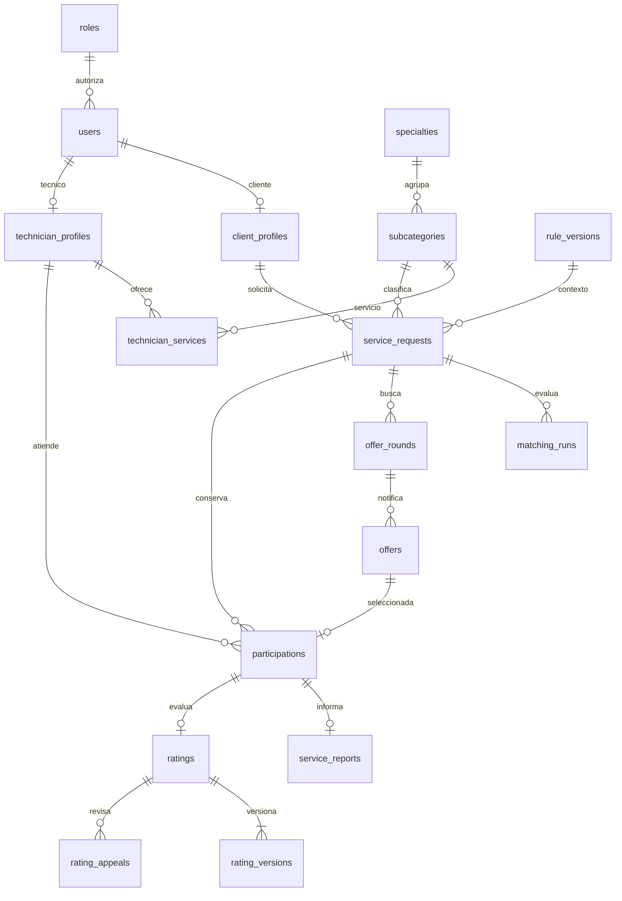

# CANVAS | Diccionario de datos de TécnicoYa Huancayo

**Versión:** 1.0 · **Fecha:** 4 de octubre de 2026 · **Motor objetivo:** MySQL 8.4 / InnoDB, propuesta de referencia compatible con la arquitectura solicitada.

**Estado:** diseño físico propuesto; no refleja automáticamente las tablas actuales ni acredita una migración ejecutada. Los tipos y longitudes son decisiones de diseño revisables. Se entrega un DDL de referencia para revisión, no un script autorizado para ejecutar sobre la base del proyecto.

## 1. Fuentes, precedencia y alcance

Base vigente: Fuente 0; CANVAS de análisis; CANVAS de Diseño Técnico; Resumen Ejecutivo del MVP y última petición que incorpora expresamente registros de pago simulados. Se contrastaron los antecedentes de la colección de 17 documentos v2, sus fuentes editables, el diccionario físico anterior y los apartados de datos/arquitectura del informe final. Las propuestas anteriores de chat, LLM, pagos reales, PostgreSQL/FastAPI y Bearer propios no sustituyen el alcance y stack confirmados posteriormente.

El modelo incluye tablas de negocio y soporte de ejecución. No exige construirlas todas en una primera iteración: se implementan con las historias correspondientes. Las tablas técnicas del framework se revisan con la versión fijada antes de generar migraciones. No se agregan multitenencia empresarial, pasarelas, suscripciones ni reembolsos reales.

**Cambios explícitos frente a antecedentes:** catálogo normalizado en lugar de listas JSON; tarifa por técnico/subcategoría; oferta distinta de asignación; hasta dos puestos con historial de sustituciones; calificación por atención con versiones; notificaciones persistidas; sesión de SPA; pagos únicamente simulados. El diccionario amplía el detalle de Diseño Técnico sin modificar su archivo ni resolver silenciosamente P01–P23.

## 2. Convenciones y clasificación

| Elemento | Regla |
|---|---|
| Independiente | Catálogo/registro autónomo; puede tener referencias auxiliares opcionales sin depender del ciclo de otro registro. |
| Dependiente | Pertenece al ciclo de vida de otra entidad; tiene FK o dependencia lógica expresamente indicada. |
| Pivot | Asociación M:N; puede contener atributos y PK sustituta cuando necesita historial/referencias. |
| Polimórfica | Un par tipo/ID apunta a varias entidades. MySQL no puede imponer una única FK para ese par; se valida un mapa cerrado de tipos en aplicación. |
| Motor y texto | InnoDB, utf8mb4, collation propuesta utf8mb4_0900_as_cs. Correos/códigos se normalizan; las comparaciones técnicas no dependen de mayúsculas accidentales. |
| IDs | BIGINT UNSIGNED AUTO_INCREMENT salvo pivots compuestas/tablas framework. En JSON se exponen como cadena. |
| Fechas de dominio | DATETIME(6), UTC; interfaz America/Lima. created_at/updated_at detallados en cada tabla; actualización de updated_at a cargo de aplicación. |
| Fechas del driver | Epoch en segundos solo en jobs, cache, cache_locks y last_activity de sessions; no mezclar con milisegundos. |
| Importes | DECIMAL(12,2), no FLOAT. PEN es propuesta pendiente P01; no conversión de moneda. |
| Nulabilidad/default | Sí permite NULL; — significa sin default y el servidor debe suministrar valor. Generadas no admiten escritura directa. |
| Claves e índices | PK, UNIQUE (UQ), FK y BTREE no único (IX). Índices de FK se materializan si no existe prefijo adecuado. No duplicar automáticamente un índice ya cubierto. |
| Acciones referenciales | Toda FK física usa ON DELETE RESTRICT y ON UPDATE RESTRICT. Preservar IDs y anonimizar donde se autorice; limpieza de hijos en orden explícito. No borrar historia por cascada. |
| Retención | Datos personales y registros sujetos a P08; no se adopta automáticamente el plazo propuesto de 12 meses. Jobs/caché/sesiones tienen limpieza operativa separada. |
| Seguridad | Claves, índices e IDs no sustituyen Policies. Datos privados requieren rol, pertenencia, estado y momento del servicio. |

MySQL permite CHECK de fila y relaciones FK con condiciones de tipos/índices; no usar CHECK para consultar otra tabla, evaluar permisos o comparar continuamente con el reloj. Referencias: [CHECK](https://dev.mysql.com/doc/refman/8.4/en/create-table-check-constraints.html), [FK](https://dev.mysql.com/doc/refman/8.4/en/create-table-foreign-keys.html). Las columnas generadas y su unicidad condicionada se apoyan en [índices de columnas generadas](https://dev.mysql.com/doc/refman/8.4/en/create-table-secondary-indexes.html). Su expresión depende del estado persistido, nunca de NOW().

> **Guía:** una FK comprueba que el registro referido existe. No comprueba que ese técnico pertenezca a la solicitud correcta ni que el usuario tenga permiso: esas reglas se validan en una transacción.

## 3. Inventario y navegación

**Modelo:** 79 tablas físicas, 732 atributos y 155 FK físicas. Incluye 7 tablas del framework y una vista de historial descrita en §7. No son 79 funcionalidades: las asociaciones, versiones y registros técnicos se separan para preservar integridad e historia.

| Tabla | Clase | Módulo | Propósito |
|---|---|---|---|
| [roles](#t01) | Independiente | F | Roles base del producto. |
| [permissions](#t02) | Independiente | F | Acciones autorizables. |
| [users](#t03) | Dependiente | F | Identidad y acceso; no contiene datos específicos de atención. |
| [role_permissions](#t04) | Pivot | F | Relación muchos a muchos entre rol y permiso. |
| [user_permissions](#t05) | Pivot | F | Permisos excepcionales de administración por usuario. |
| [client_profiles](#t06) | Dependiente | F | Datos del cliente MYPE u hogar. |
| [client_blocks](#t07) | Dependiente | F | Historial explícito de bloqueos y levantamientos. |
| [technician_profiles](#t08) | Dependiente | F/A | Prestador independiente o empresa de una cuenta. |
| [technician_reviews](#t09) | Dependiente | F | Decisiones de revisión del prestador, inmutables. |
| [technician_status_events](#t10) | Dependiente | F | Cambios operativos y motivos de suspensión. |
| [media_files](#t11) | Dependiente | F | Metadatos de archivo; los bytes se guardan fuera de MySQL. |
| [technician_documents](#t12) | Dependiente | F | Documento privado presentado para verificación. |
| [review_documents](#t13) | Pivot | F | Documentos efectivamente examinados en una revisión. |
| [portfolio_items](#t14) | Dependiente | F | Trabajo publicado en el portafolio del técnico. |
| [portfolio_images](#t15) | Pivot | F | Galería ordenada de imágenes de un trabajo. |
| [specialties](#t16) | Independiente | F | Tres especialidades base del marketplace. |
| [subcategories](#t17) | Dependiente | F/A | Catálogo de aproximadamente 30 servicios con foto del carrusel. |
| [districts](#t18) | Independiente | F/A | Cobertura por distritos, sin geolocalización personal. |
| [district_distances](#t19) | Pivot | B | Referencia dirigida de distancia aproximada entre centros de distrito. |
| [technician_specialties](#t20) | Pivot | A/F | Especialidades declaradas y revisadas del técnico. |
| [technician_services](#t21) | Pivot | A/B | Relación técnico-subcategoría con condiciones y tarifa vigente. |
| [service_rate_versions](#t22) | Dependiente | A/F | Historial inmutable de tarifas declaradas. |
| [technician_districts](#t23) | Pivot | A/B | Distritos atendidos por técnico. |
| [availability_slots](#t24) | Dependiente | A/D | Horario declarado recurrente o franja puntual. |
| [technician_pauses](#t25) | Dependiente | A/B | Pausas temporales de recepción de trabajo. |
| [rule_parameters](#t26) | Independiente | F | Definiciones de parámetros editables del negocio. |
| [rule_versions](#t27) | Dependiente | F | Versiones de configuración; publicación no sobrescribe anteriores. |
| [rule_values](#t28) | Pivot | F | Valor de cada parámetro dentro de una versión. |
| [matching_weights](#t29) | Dependiente | F/B | Los cuatro pesos de una versión; suma comprobable en una fila. |
| [service_requests](#t30) | Dependiente | A/D | Solicitud del cliente; datos privados y fotografía de tarifa/reglas. |
| [request_attachments](#t31) | Pivot | A | Galería de evidencias de la falla. |
| [request_events](#t32) | Dependiente | D | Historial cronológico del servicio, append-only. |
| [matching_runs](#t33) | Dependiente | B | Ejecución reproducible del ranking. |
| [matching_candidates](#t34) | Pivot | B | Factores y posición de un técnico en una ejecución. |
| [offer_rounds](#t35) | Dependiente | C | Ronda de invitaciones con versión de búsqueda y vencimiento. |
| [offers](#t36) | Dependiente | C | Invitación individual; aceptación no equivale a asignación. |
| [additional_technician_proposals](#t37) | Dependiente | D | Propuesta de un único técnico adicional. |
| [participations](#t38) | Dependiente | D | Asignación/atención por técnico; permite principal y adicional, además de historial de sustituciones. |
| [appointments](#t39) | Dependiente | D | Reserva concreta de agenda vinculada a participación. |
| [reschedule_requests](#t40) | Dependiente | D | Propuesta de nueva franja con copia de la anterior. |
| [reschedule_responses](#t41) | Pivot | D | Respuestas de las contrapartes requeridas para una reprogramación. |
| [service_reports](#t42) | Dependiente | D | Reporte de cierre de la atención de cada técnico. |
| [service_report_evidence](#t43) | Pivot | D | Galería privada de evidencias de la atención. |
| [incidents](#t44) | Dependiente | D/F | Inasistencia, cancelación técnica u otro problema de servicio. |
| [incident_evidence](#t45) | Pivot | D/F | Archivos de respaldo de incidencia. |
| [reassignment_records](#t46) | Dependiente | C/F | Trazabilidad de reasignación automática o administrativa. |
| [ratings](#t47) | Dependiente | E | Reseña y puntaje canónicos actuales de una participación. |
| [rating_versions](#t48) | Dependiente | E | Contenido histórico inmutable de cada versión de reseña. |
| [rating_replies](#t49) | Dependiente | E | Respuesta identificada del técnico a una reseña. |
| [rating_appeals](#t50) | Dependiente | E | Solicitud de revisión de una calificación. |
| [appeal_evidence](#t51) | Pivot | E | Archivos privados para sustentar una apelación. |
| [rating_resolutions](#t52) | Dependiente | E/F | Resolución administrativa de apelación. |
| [notifications](#t53) | Polimórfica | F/C | Bandeja persistida por usuario, con referencia a distintos recursos del dominio. |
| [notification_attempts](#t54) | Dependiente | F/C | Intentos de entrega por canal, independientes de lectura. |
| [notification_preferences](#t55) | Pivot | F | Preferencias por usuario, canal y tipo de evento. |
| [announcements](#t56) | Dependiente | F | Comunicados con imagen y vigencia. |
| [announcement_audiences](#t57) | Pivot | F | Roles destinatarios de un comunicado. |
| [payment_methods](#t58) | Independiente | F | Catálogo de métodos declarables; no credenciales financieras. |
| [user_payment_methods](#t59) | Pivot | F | Métodos favoritos del cliente, no instrumentos bancarios. |
| [request_payment_methods](#t60) | Dependiente | F | Método seleccionado para una solicitud. |
| [simulated_payments](#t61) | Dependiente | F | Registro de pago ficticio solicitado expresamente para la demostración. |
| [simulated_payment_events](#t62) | Dependiente | F | Historia inmutable de cambios de un pago simulado. |
| [simulated_receipts](#t63) | Dependiente | F | Constancia de demostración sin validez tributaria ni prueba de cobro. |
| [support_tickets](#t64) | Dependiente | F | Bandeja de ayuda e incidencias de usuario; sin chat integrado. |
| [support_ticket_updates](#t65) | Dependiente | F | Seguimiento y resolución del ticket. |
| [support_attachments](#t66) | Pivot | F | Evidencias adjuntas al ticket. |
| [audit_entries](#t67) | Polimórfica | F | Registro append-only de acciones sensibles sobre recursos heterogéneos. |
| [operations](#t68) | Dependiente | F | Trabajos largos consultables, como exportaciones. |
| [export_files](#t69) | Dependiente | F | Resultado privado de un reporte. |
| [outbox_events](#t70) | Polimórfica | F/transversal | Eventos duraderos confirmados con el negocio, pendientes de publicación. |
| [outbox_deliveries](#t71) | Pivot | F | Control por evento y destinatario para publicación privada. |
| [idempotency_records](#t72) | Dependiente | F/transversal | Evita duplicación de comandos por reintento. |
| [sessions](#t73) | Dependiente | Infraestructura | Sesiones de Laravel para la SPA. |
| [password_reset_tokens](#t74) | Dependiente | Infraestructura | Tokens temporales de recuperación; identidad lógica por correo. |
| [jobs](#t75) | Independiente | Infraestructura | Cola de trabajos Laravel persistida en MySQL. |
| [failed_jobs](#t76) | Independiente | Infraestructura | Errores de trabajos conservados para diagnóstico. |
| [cache](#t77) | Independiente | Infraestructura | Caché de base de datos Laravel; datos reconstruibles. |
| [cache_locks](#t78) | Independiente | Infraestructura | Bloqueos temporales del driver de caché. |
| [migrations](#t79) | Independiente | Infraestructura | Registro del esquema aplicado por Laravel. |

## 4. Definiciones completas

### T01. `roles`
**Clase:** Independiente · **Módulo:** F
Roles base del producto.
**Visibilidad:** Catálogo interno; no admite alta pública de roles.

| Atributo | Tipo MySQL | NULL | Default / generación | Clave | Descripción |
|---|---|---|---|---|---|
| `id` | `BIGINT UNSIGNED` | No | AUTO_INCREMENT | PK | Identificador interno inmutable. |
| `code` | `VARCHAR(40)` | No | — | UQ (ver grupo) | Código estable client, technician o admin. |
| `name` | `VARCHAR(80)` | No | — | — | Nombre legible. |
| `active` | `TINYINT UNSIGNED` | No | 1 | — | Disponible para cuentas nuevas. |
| `created_at` | `DATETIME(6)` | No | CURRENT_TIMESTAMP(6) | — | Fecha de creación UTC. |
| `updated_at` | `DATETIME(6)` | No | CURRENT_TIMESTAMP(6) | — | Último cambio UTC; lo actualiza la aplicación. |

**Claves, relaciones e índices:**
- PK: `(id)`.
- UNIQUE `uq_roles_code`: `(code)`.
- FK físicas: ninguna; revisar dependencias lógicas indicadas.

**Restricciones de base de datos:**
- `ck_roles_1`: ``active` IN (0,1)`.

**Reglas de aplicación / transacción:**
- Un rol vigente por cuenta, propuesta conservadora mientras P20 permanece abierto. El administrador responsable es un permiso adicional, no un cuarto actor.

### T02. `permissions`
**Clase:** Independiente · **Módulo:** F
Acciones autorizables.
**Visibilidad:** Catálogo de seguridad.

| Atributo | Tipo MySQL | NULL | Default / generación | Clave | Descripción |
|---|---|---|---|---|---|
| `id` | `BIGINT UNSIGNED` | No | AUTO_INCREMENT | PK | Identificador interno inmutable. |
| `code` | `VARCHAR(100)` | No | — | UQ (ver grupo) | Ej.: requests.reassign, audit.read, admins.manage. |
| `description` | `VARCHAR(255)` | No | — | — | Significado del permiso. |
| `created_at` | `DATETIME(6)` | No | CURRENT_TIMESTAMP(6) | — | Fecha de creación UTC. |
| `updated_at` | `DATETIME(6)` | No | CURRENT_TIMESTAMP(6) | — | Último cambio UTC; lo actualiza la aplicación. |

**Claves, relaciones e índices:**
- PK: `(id)`.
- UNIQUE `uq_permissions_code`: `(code)`.
- FK físicas: ninguna; revisar dependencias lógicas indicadas.

**Restricciones de base de datos:**
- PK/FK, nulabilidad, tipos y unicidad definidos arriba; no hay CHECK adicional.

**Reglas de aplicación / transacción:**
- Validar rol, propietario, contenido y consistencia con el recurso asociado; no exponer escrituras genéricas de estado.

### T03. `users`
**Clase:** Dependiente · **Módulo:** F
Identidad y acceso; no contiene datos específicos de atención.
**Visibilidad:** Nombre/contacto/datos de acceso privados; contraseña solo para verificación de hash.

| Atributo | Tipo MySQL | NULL | Default / generación | Clave | Descripción |
|---|---|---|---|---|---|
| `id` | `BIGINT UNSIGNED` | No | AUTO_INCREMENT | PK | Identificador interno inmutable. |
| `role_id` | `BIGINT UNSIGNED` | No | — | FK → roles.id | Referencia a roles |
| `name` | `VARCHAR(255)` | No | — | — | Nombre visible. |
| `email` | `VARCHAR(254)` | No | — | UQ (ver grupo) | Correo normalizado en minúsculas y sin espacios. |
| `password` | `VARCHAR(255)` | No | — | — | Hash bcrypt; nunca contraseña original. |
| `phone` | `VARCHAR(20)` | Sí | — | — | Teléfono normalizado; no público. |
| `email_verified_at` | `DATETIME(6)` | Sí | — | — | Verificación de correo, si se habilita. |
| `is_active` | `TINYINT UNSIGNED` | No | 1 | — | Cuenta autorizada para acceso. |
| `auth_version` | `INT UNSIGNED` | No | 1 | — | Versión de autorización para invalidar acceso/canales. |
| `anonymized_at` | `DATETIME(6)` | Sí | — | — | Anonimización ejecutada conforme a política validada. |
| `remember_token` | `VARCHAR(100)` | Sí | — | — | Token de recordar sesión; opcional, no activar por defecto. |
| `version` | `INT UNSIGNED` | No | 1 | — | Control de concurrencia optimista; incrementa en cada cambio. |
| `created_at` | `DATETIME(6)` | No | CURRENT_TIMESTAMP(6) | — | Fecha de creación UTC. |
| `updated_at` | `DATETIME(6)` | No | CURRENT_TIMESTAMP(6) | — | Último cambio UTC; lo actualiza la aplicación. |

**Claves, relaciones e índices:**
- PK: `(id)`.
- UNIQUE `uq_users_email`: `(email)`.
- IX `ix_users_role_id_is_active`: `(role_id, is_active)`.
- FK `role_id` → `roles.id`; N:1, opcional=no; DELETE/UPDATE RESTRICT. La UQ correspondiente convierte en 1:1 cuando aplique.

**Restricciones de base de datos:**
- `ck_users_1`: ``is_active` IN (0,1)`.

**Reglas de aplicación / transacción:**
- Registro público admite solo client o technician. Rol, is_active y auth_version no son asignables desde perfil.
- La cuenta se conserva como identidad seudónima si existen referencias históricas; cierre/retención requieren P08.
- Bloqueo de cliente efectivo depende también de client_blocks; revocar sesiones y aumentar auth_version en transacción.

### T04. `role_permissions`
**Clase:** Pivot · **Módulo:** F
Relación muchos a muchos entre rol y permiso.
**Visibilidad:** Solo administración de seguridad.

| Atributo | Tipo MySQL | NULL | Default / generación | Clave | Descripción |
|---|---|---|---|---|---|
| `role_id` | `BIGINT UNSIGNED` | No | — | PK; FK → roles.id | Referencia a roles |
| `permission_id` | `BIGINT UNSIGNED` | No | — | PK; FK → permissions.id | Referencia a permissions |
| `created_at` | `DATETIME(6)` | No | CURRENT_TIMESTAMP(6) | — | Fecha de creación UTC. |

**Claves, relaciones e índices:**
- PK: `(role_id, permission_id)`.
- IX `ix_role_permissions_permission_id`: `(permission_id)`.
- FK `role_id` → `roles.id`; N:1, opcional=no; DELETE/UPDATE RESTRICT. La UQ correspondiente convierte en 1:1 cuando aplique.
- FK `permission_id` → `permissions.id`; N:1, opcional=no; DELETE/UPDATE RESTRICT. La UQ correspondiente convierte en 1:1 cuando aplique.

**Restricciones de base de datos:**
- PK/FK, nulabilidad, tipos y unicidad definidos arriba; no hay CHECK adicional.

**Reglas de aplicación / transacción:**
- admins.manage no se asigna al rol admin general.

### T05. `user_permissions`
**Clase:** Pivot · **Módulo:** F
Permisos excepcionales de administración por usuario.
**Visibilidad:** Solo responsable de cuentas administrativas.

| Atributo | Tipo MySQL | NULL | Default / generación | Clave | Descripción |
|---|---|---|---|---|---|
| `user_id` | `BIGINT UNSIGNED` | No | — | PK; FK → users.id | Referencia a users |
| `permission_id` | `BIGINT UNSIGNED` | No | — | PK; FK → permissions.id | Referencia a permissions |
| `granted_by` | `BIGINT UNSIGNED` | No | — | FK → users.id | Administrador responsable que concedió el permiso. |
| `granted_at` | `DATETIME(6)` | No | — | — | Fecha UTC de concesión. |

**Claves, relaciones e índices:**
- PK: `(user_id, permission_id)`.
- IX `ix_user_permissions_permission_id`: `(permission_id)`.
- IX `ix_user_permissions_granted_by`: `(granted_by)`.
- FK `user_id` → `users.id`; N:1, opcional=no; DELETE/UPDATE RESTRICT. La UQ correspondiente convierte en 1:1 cuando aplique.
- FK `permission_id` → `permissions.id`; N:1, opcional=no; DELETE/UPDATE RESTRICT. La UQ correspondiente convierte en 1:1 cuando aplique.
- FK `granted_by` → `users.id`; N:1, opcional=no; DELETE/UPDATE RESTRICT. La UQ correspondiente convierte en 1:1 cuando aplique.

**Restricciones de base de datos:**
- PK/FK, nulabilidad, tipos y unicidad definidos arriba; no hay CHECK adicional.

**Reglas de aplicación / transacción:**
- Solo usuarios de rol admin reciben permisos excepcionales; comprobar mediante Policy, no CHECK entre tablas. Revocación auditada; mantener al menos un responsable habilitado.

### T06. `client_profiles`
**Clase:** Dependiente · **Módulo:** F
Datos del cliente MYPE u hogar.
**Visibilidad:** Restringido por rol y pertenencia.

| Atributo | Tipo MySQL | NULL | Default / generación | Clave | Descripción |
|---|---|---|---|---|---|
| `id` | `BIGINT UNSIGNED` | No | AUTO_INCREMENT | PK | Identificador interno inmutable. |
| `user_id` | `BIGINT UNSIGNED` | No | — | UQ (ver grupo); FK → users.id | Referencia a users |
| `client_type` | `VARCHAR(32)` | No | — | — | Tipo de cliente. Valores: household, mype. |
| `business_name` | `VARCHAR(180)` | Sí | — | — | Nombre del negocio si corresponde. |
| `default_district_id` | `BIGINT UNSIGNED` | Sí | — | FK → districts.id | Referencia a districts |
| `default_address` | `TEXT` | Sí | — | — | Dirección habitual privada, editable en cada solicitud. |
| `version` | `INT UNSIGNED` | No | 1 | — | Control de concurrencia optimista; incrementa en cada cambio. |
| `created_at` | `DATETIME(6)` | No | CURRENT_TIMESTAMP(6) | — | Fecha de creación UTC. |
| `updated_at` | `DATETIME(6)` | No | CURRENT_TIMESTAMP(6) | — | Último cambio UTC; lo actualiza la aplicación. |

**Claves, relaciones e índices:**
- PK: `(id)`.
- UNIQUE `uq_client_profiles_user_id`: `(user_id)`.
- IX `ix_client_profiles_default_district_id`: `(default_district_id)`.
- FK `user_id` → `users.id`; N:1, opcional=no; DELETE/UPDATE RESTRICT. La UQ correspondiente convierte en 1:1 cuando aplique.
- FK `default_district_id` → `districts.id`; N:1, opcional=sí; DELETE/UPDATE RESTRICT. La UQ correspondiente convierte en 1:1 cuando aplique.

**Restricciones de base de datos:**
- `ck_client_profiles_1`: ``client_type` IN ('household','mype')`.

**Reglas de aplicación / transacción:**
- user_id debe corresponder al rol client; la dirección de una solicitud se copia, no cambia al editar este perfil.

### T07. `client_blocks`
**Clase:** Dependiente · **Módulo:** F
Historial explícito de bloqueos y levantamientos.
**Visibilidad:** Restringido por rol y pertenencia.

| Atributo | Tipo MySQL | NULL | Default / generación | Clave | Descripción |
|---|---|---|---|---|---|
| `id` | `BIGINT UNSIGNED` | No | AUTO_INCREMENT | PK | Identificador interno inmutable. |
| `client_id` | `BIGINT UNSIGNED` | No | — | FK → client_profiles.id | Referencia a client_profiles |
| `blocked_by` | `BIGINT UNSIGNED` | No | — | FK → users.id | Referencia a users |
| `reason` | `TEXT` | No | — | — | Motivo obligatorio. |
| `blocked_at` | `DATETIME(6)` | No | — | — | Inicio del bloqueo. |
| `expires_at` | `DATETIME(6)` | Sí | — | — | Fin automático si se aprueba bloqueo temporal; de otro modo NULL. |
| `lifted_by` | `BIGINT UNSIGNED` | Sí | — | FK → users.id | Referencia a users |
| `lifted_at` | `DATETIME(6)` | Sí | — | — | Levantamiento efectivo. |
| `lift_reason` | `TEXT` | Sí | — | — | Motivo del levantamiento. |
| `status` | `VARCHAR(32)` | No | 'active' | — | Estado del bloqueo. Valores: active, lifted, expired. |
| `active_client_id` | `BIGINT UNSIGNED` | Sí | GENERATED: CASE WHEN status = 'active' THEN client_id ELSE NULL END | UQ (ver grupo) | Un único bloqueo activo por cliente. |
| `version` | `INT UNSIGNED` | No | 1 | — | Control de concurrencia optimista; incrementa en cada cambio. |
| `created_at` | `DATETIME(6)` | No | CURRENT_TIMESTAMP(6) | — | Fecha de creación UTC. |
| `updated_at` | `DATETIME(6)` | No | CURRENT_TIMESTAMP(6) | — | Último cambio UTC; lo actualiza la aplicación. |

**Claves, relaciones e índices:**
- PK: `(id)`.
- UNIQUE `uq_client_blocks_active_client_id`: `(active_client_id)`.
- IX `ix_client_blocks_client_id_blocked_at`: `(client_id, blocked_at)`.
- IX `ix_client_blocks_status_expires_at`: `(status, expires_at)`.
- IX `ix_client_blocks_blocked_by`: `(blocked_by)`.
- IX `ix_client_blocks_lifted_by`: `(lifted_by)`.
- FK `client_id` → `client_profiles.id`; N:1, opcional=no; DELETE/UPDATE RESTRICT. La UQ correspondiente convierte en 1:1 cuando aplique.
- FK `blocked_by` → `users.id`; N:1, opcional=no; DELETE/UPDATE RESTRICT. La UQ correspondiente convierte en 1:1 cuando aplique.
- FK `lifted_by` → `users.id`; N:1, opcional=sí; DELETE/UPDATE RESTRICT. La UQ correspondiente convierte en 1:1 cuando aplique.

**Restricciones de base de datos:**
- `ck_client_blocks_1`: ``status` IN ('active','lifted','expired')`.
- `ck_client_blocks_2`: `expires_at IS NULL OR expires_at > blocked_at`.

**Reglas de aplicación / transacción:**
- Levantar o vencer actualiza status explícitamente; una columna generada no compara NOW(). Política temporal y efecto sobre servicios en curso pendientes P18.
- Consulta protegida; acceso de cliente solo a explicación permitida.

### T08. `technician_profiles`
**Clase:** Dependiente · **Módulo:** F/A
Prestador independiente o empresa de una cuenta.
**Visibilidad:** Bio/nombre profesional públicos; WhatsApp restringido y revisión privada.

| Atributo | Tipo MySQL | NULL | Default / generación | Clave | Descripción |
|---|---|---|---|---|---|
| `id` | `BIGINT UNSIGNED` | No | AUTO_INCREMENT | PK | Identificador interno inmutable. |
| `user_id` | `BIGINT UNSIGNED` | No | — | UQ (ver grupo); FK → users.id | Referencia a users |
| `provider_type` | `VARCHAR(32)` | No | 'independent' | — | Tipo de prestador. Valores: independent, company. |
| `display_name` | `VARCHAR(180)` | No | — | — | Nombre profesional. |
| `bio` | `TEXT` | Sí | — | — | Presentación pública. |
| `status` | `VARCHAR(32)` | No | 'pending_verification' | — | Estado operativo. Valores: pending_verification, active, inactive, suspended. |
| `verification_status` | `VARCHAR(32)` | No | 'pending' | — | Resultado de revisión separado del estado operativo. Valores: pending, approved, rejected. |
| `experience_years` | `INT UNSIGNED` | No | 0 | — | Experiencia declarada. |
| `primary_district_id` | `BIGINT UNSIGNED` | Sí | — | FK → districts.id | Referencia a districts |
| `available_now` | `TINYINT UNSIGNED` | No | 0 | — | Disposición a recibir atención inmediata; no sustituye agenda. |
| `whatsapp` | `VARCHAR(20)` | Sí | — | — | Contacto habilitado solo tras asignación. |
| `verified_at` | `DATETIME(6)` | Sí | — | — | Última habilitación. |
| `verified_by` | `BIGINT UNSIGNED` | Sí | — | FK → users.id | Referencia a users |
| `version` | `INT UNSIGNED` | No | 1 | — | Control de concurrencia optimista; incrementa en cada cambio. |
| `created_at` | `DATETIME(6)` | No | CURRENT_TIMESTAMP(6) | — | Fecha de creación UTC. |
| `updated_at` | `DATETIME(6)` | No | CURRENT_TIMESTAMP(6) | — | Último cambio UTC; lo actualiza la aplicación. |

**Claves, relaciones e índices:**
- PK: `(id)`.
- UNIQUE `uq_technician_profiles_user_id`: `(user_id)`.
- IX `ix_technician_profiles_status_verification_status_86ea8e11a5`: `(status, verification_status, available_now)`.
- IX `ix_technician_profiles_primary_district_id`: `(primary_district_id)`.
- IX `ix_technician_profiles_verified_by`: `(verified_by)`.
- FK `user_id` → `users.id`; N:1, opcional=no; DELETE/UPDATE RESTRICT. La UQ correspondiente convierte en 1:1 cuando aplique.
- FK `primary_district_id` → `districts.id`; N:1, opcional=sí; DELETE/UPDATE RESTRICT. La UQ correspondiente convierte en 1:1 cuando aplique.
- FK `verified_by` → `users.id`; N:1, opcional=sí; DELETE/UPDATE RESTRICT. La UQ correspondiente convierte en 1:1 cuando aplique.

**Restricciones de base de datos:**
- `ck_technician_profiles_1`: ``provider_type` IN ('independent','company')`.
- `ck_technician_profiles_2`: ``status` IN ('pending_verification','active','inactive','suspended')`.
- `ck_technician_profiles_3`: ``verification_status` IN ('pending','approved','rejected')`.
- `ck_technician_profiles_4`: ``available_now` IN (0,1)`.

**Reglas de aplicación / transacción:**
- user_id corresponde a rol technician. Verificación rechazada se conserva en verification_status/reviews sin inventar un estado operativo fuera de F0 (P22).
- Status active exige verification_status approved y cuenta habilitada. Disponibilidad exige además cobertura, subcategoría, franja y ausencia de pausa.

### T09. `technician_reviews`
**Clase:** Dependiente · **Módulo:** F
Decisiones de revisión del prestador, inmutables.
**Visibilidad:** Restringido por rol y pertenencia.

| Atributo | Tipo MySQL | NULL | Default / generación | Clave | Descripción |
|---|---|---|---|---|---|
| `id` | `BIGINT UNSIGNED` | No | AUTO_INCREMENT | PK | Identificador interno inmutable. |
| `technician_id` | `BIGINT UNSIGNED` | No | — | FK → technician_profiles.id | Referencia a technician_profiles |
| `reviewer_id` | `BIGINT UNSIGNED` | No | — | FK → users.id | Referencia a users |
| `decision` | `VARCHAR(32)` | No | — | — | Resultado de revisión. Valores: approve, reject, request_changes. |
| `reason` | `TEXT` | No | — | — | Motivo y alcance de la revisión. |
| `checklist` | `JSON` | No | — | — | Resultados de identidad/contacto, servicios, zona, tarifa, experiencia y evidencia; sin copiar documentos. |
| `reviewed_at` | `DATETIME(6)` | No | — | — | Momento de revisión. |
| `created_at` | `DATETIME(6)` | No | CURRENT_TIMESTAMP(6) | — | Fecha de creación UTC. |

**Claves, relaciones e índices:**
- PK: `(id)`.
- IX `ix_technician_reviews_technician_id_reviewed_at`: `(technician_id, reviewed_at)`.
- IX `ix_technician_reviews_reviewer_id`: `(reviewer_id)`.
- FK `technician_id` → `technician_profiles.id`; N:1, opcional=no; DELETE/UPDATE RESTRICT. La UQ correspondiente convierte en 1:1 cuando aplique.
- FK `reviewer_id` → `users.id`; N:1, opcional=no; DELETE/UPDATE RESTRICT. La UQ correspondiente convierte en 1:1 cuando aplique.

**Restricciones de base de datos:**
- `ck_technician_reviews_1`: ``decision` IN ('approve','reject','request_changes')`.

**Reglas de aplicación / transacción:**
- Administrador autorizado; actualizar resumen de technician_profiles y auditoría en misma transacción. No acredita certificación profesional integral.

### T10. `technician_status_events`
**Clase:** Dependiente · **Módulo:** F
Cambios operativos y motivos de suspensión.
**Visibilidad:** Restringido por rol y pertenencia.

| Atributo | Tipo MySQL | NULL | Default / generación | Clave | Descripción |
|---|---|---|---|---|---|
| `id` | `BIGINT UNSIGNED` | No | AUTO_INCREMENT | PK | Identificador interno inmutable. |
| `technician_id` | `BIGINT UNSIGNED` | No | — | FK → technician_profiles.id | Referencia a technician_profiles |
| `actor_id` | `BIGINT UNSIGNED` | No | — | FK → users.id | Referencia a users |
| `from_status` | `VARCHAR(32)` | No | — | — | Estado anterior. |
| `to_status` | `VARCHAR(32)` | No | — | — | Estado nuevo. |
| `reason` | `TEXT` | No | — | — | Motivo del cambio. |
| `occurred_at` | `DATETIME(6)` | No | — | — | Instante UTC. |
| `created_at` | `DATETIME(6)` | No | CURRENT_TIMESTAMP(6) | — | Fecha de creación UTC. |

**Claves, relaciones e índices:**
- PK: `(id)`.
- IX `ix_technician_status_events_technician_id_occurred_at`: `(technician_id, occurred_at)`.
- IX `ix_technician_status_events_actor_id`: `(actor_id)`.
- FK `technician_id` → `technician_profiles.id`; N:1, opcional=no; DELETE/UPDATE RESTRICT. La UQ correspondiente convierte en 1:1 cuando aplique.
- FK `actor_id` → `users.id`; N:1, opcional=no; DELETE/UPDATE RESTRICT. La UQ correspondiente convierte en 1:1 cuando aplique.

**Restricciones de base de datos:**
- PK/FK, nulabilidad, tipos y unicidad definidos arriba; no hay CHECK adicional.

**Reglas de aplicación / transacción:**
- Transición validada por dominio y políticas P18; append-only.

### T11. `media_files`
**Clase:** Dependiente · **Módulo:** F
Metadatos de archivo; los bytes se guardan fuera de MySQL.
**Visibilidad:** Storage_key nunca concede acceso; servir con Policy por vínculo.

| Atributo | Tipo MySQL | NULL | Default / generación | Clave | Descripción |
|---|---|---|---|---|---|
| `id` | `BIGINT UNSIGNED` | No | AUTO_INCREMENT | PK | Identificador interno inmutable. |
| `owner_id` | `BIGINT UNSIGNED` | No | — | FK → users.id | Referencia a users |
| `disk` | `VARCHAR(40)` | No | — | UQ (ver grupo) | Almacenamiento autorizado. |
| `storage_key` | `VARCHAR(255)` | No | — | UQ (ver grupo) | Ruta interna generada, nunca aceptada del navegador. |
| `original_name` | `VARCHAR(255)` | No | — | — | Nombre original saneado. |
| `mime_type` | `VARCHAR(120)` | No | — | — | Tipo verificado por contenido. |
| `byte_size` | `BIGINT UNSIGNED` | No | — | — | Tamaño del archivo en bytes. |
| `sha256` | `CHAR(64)` | No | — | — | Hash de integridad; no prueba seguridad. |
| `visibility` | `VARCHAR(32)` | No | 'private' | — | Exposición permitida. Valores: private, public. |
| `scan_status` | `VARCHAR(32)` | No | 'pending' | — | Validación de archivo. Valores: pending, clean, rejected. |
| `retired_at` | `DATETIME(6)` | Sí | — | — | Retiro lógico. |
| `created_at` | `DATETIME(6)` | No | CURRENT_TIMESTAMP(6) | — | Fecha de creación UTC. |
| `updated_at` | `DATETIME(6)` | No | CURRENT_TIMESTAMP(6) | — | Último cambio UTC; lo actualiza la aplicación. |

**Claves, relaciones e índices:**
- PK: `(id)`.
- UNIQUE `uq_media_files_disk_storage_key`: `(disk, storage_key)`.
- IX `ix_media_files_owner_id_created_at`: `(owner_id, created_at)`.
- IX `ix_media_files_scan_status_created_at`: `(scan_status, created_at)`.
- FK `owner_id` → `users.id`; N:1, opcional=no; DELETE/UPDATE RESTRICT. La UQ correspondiente convierte en 1:1 cuando aplique.

**Restricciones de base de datos:**
- `ck_media_files_1`: ``visibility` IN ('private','public')`.
- `ck_media_files_2`: ``scan_status` IN ('pending','clean','rejected')`.

**Reglas de aplicación / transacción:**
- Un archivo private no se hace público reutilizándolo en carrusel o portafolio. Crear copia pública validada si corresponde.
- Tipos, cantidad y tamaño definitivos P17; no servir archivo rechazado o aún sin validar.

### T12. `technician_documents`
**Clase:** Dependiente · **Módulo:** F
Documento privado presentado para verificación.
**Visibilidad:** Restringido por rol y pertenencia.

| Atributo | Tipo MySQL | NULL | Default / generación | Clave | Descripción |
|---|---|---|---|---|---|
| `id` | `BIGINT UNSIGNED` | No | AUTO_INCREMENT | PK | Identificador interno inmutable. |
| `technician_id` | `BIGINT UNSIGNED` | No | — | FK → technician_profiles.id | Referencia a technician_profiles |
| `media_id` | `BIGINT UNSIGNED` | No | — | UQ (ver grupo); FK → media_files.id | Referencia a media_files |
| `document_type` | `VARCHAR(60)` | No | — | — | Tipo permitido de evidencia documental. |
| `review_status` | `VARCHAR(32)` | No | 'pending' | — | Estado de revisión del documento. Valores: pending, approved, rejected. |
| `reviewed_by` | `BIGINT UNSIGNED` | Sí | — | FK → users.id | Referencia a users |
| `reviewed_at` | `DATETIME(6)` | Sí | — | — | Fecha de evaluación. |
| `review_note` | `TEXT` | Sí | — | — | Motivo administrativo. |
| `valid_until` | `DATETIME(6)` | Sí | — | — | Vencimiento documental si aplica. |
| `version` | `INT UNSIGNED` | No | 1 | — | Control de concurrencia optimista; incrementa en cada cambio. |
| `created_at` | `DATETIME(6)` | No | CURRENT_TIMESTAMP(6) | — | Fecha de creación UTC. |
| `updated_at` | `DATETIME(6)` | No | CURRENT_TIMESTAMP(6) | — | Último cambio UTC; lo actualiza la aplicación. |

**Claves, relaciones e índices:**
- PK: `(id)`.
- UNIQUE `uq_technician_documents_media_id`: `(media_id)`.
- IX `ix_technician_documents_technician_id_review_status`: `(technician_id, review_status)`.
- IX `ix_technician_documents_reviewed_by`: `(reviewed_by)`.
- FK `technician_id` → `technician_profiles.id`; N:1, opcional=no; DELETE/UPDATE RESTRICT. La UQ correspondiente convierte en 1:1 cuando aplique.
- FK `media_id` → `media_files.id`; N:1, opcional=no; DELETE/UPDATE RESTRICT. La UQ correspondiente convierte en 1:1 cuando aplique.
- FK `reviewed_by` → `users.id`; N:1, opcional=sí; DELETE/UPDATE RESTRICT. La UQ correspondiente convierte en 1:1 cuando aplique.

**Restricciones de base de datos:**
- `ck_technician_documents_1`: ``review_status` IN ('pending','approved','rejected')`.

**Reglas de aplicación / transacción:**
- Propietario del archivo debe ser prestador; visibility=private. Solo técnico titular y administrador de revisión.

### T13. `review_documents`
**Clase:** Pivot · **Módulo:** F
Documentos efectivamente examinados en una revisión.
**Visibilidad:** Restringido por rol y pertenencia.

| Atributo | Tipo MySQL | NULL | Default / generación | Clave | Descripción |
|---|---|---|---|---|---|
| `review_id` | `BIGINT UNSIGNED` | No | — | PK; FK → technician_reviews.id | Referencia a technician_reviews |
| `document_id` | `BIGINT UNSIGNED` | No | — | PK; FK → technician_documents.id | Referencia a technician_documents |
| `created_at` | `DATETIME(6)` | No | CURRENT_TIMESTAMP(6) | — | Fecha de creación UTC. |

**Claves, relaciones e índices:**
- PK: `(review_id, document_id)`.
- IX `ix_review_documents_document_id`: `(document_id)`.
- FK `review_id` → `technician_reviews.id`; N:1, opcional=no; DELETE/UPDATE RESTRICT. La UQ correspondiente convierte en 1:1 cuando aplique.
- FK `document_id` → `technician_documents.id`; N:1, opcional=no; DELETE/UPDATE RESTRICT. La UQ correspondiente convierte en 1:1 cuando aplique.

**Restricciones de base de datos:**
- PK/FK, nulabilidad, tipos y unicidad definidos arriba; no hay CHECK adicional.

**Reglas de aplicación / transacción:**
- Ambas referencias pertenecen al mismo técnico; conservar aunque posteriormente se presente otro documento.

### T14. `portfolio_items`
**Clase:** Dependiente · **Módulo:** F
Trabajo publicado en el portafolio del técnico.
**Visibilidad:** Restringido por rol y pertenencia.

| Atributo | Tipo MySQL | NULL | Default / generación | Clave | Descripción |
|---|---|---|---|---|---|
| `id` | `BIGINT UNSIGNED` | No | AUTO_INCREMENT | PK | Identificador interno inmutable. |
| `technician_id` | `BIGINT UNSIGNED` | No | — | FK → technician_profiles.id | Referencia a technician_profiles |
| `subcategory_id` | `BIGINT UNSIGNED` | Sí | — | FK → subcategories.id | Referencia a subcategories |
| `title` | `VARCHAR(160)` | No | — | — | Título del trabajo. |
| `description` | `TEXT` | Sí | — | — | Descripción pública sin datos de terceros. |
| `performed_on` | `DATE` | Sí | — | — | Fecha declarada del trabajo. |
| `status` | `VARCHAR(32)` | No | 'draft' | — | Visibilidad del trabajo. Valores: draft, published, retired. |
| `version` | `INT UNSIGNED` | No | 1 | — | Control de concurrencia optimista; incrementa en cada cambio. |
| `created_at` | `DATETIME(6)` | No | CURRENT_TIMESTAMP(6) | — | Fecha de creación UTC. |
| `updated_at` | `DATETIME(6)` | No | CURRENT_TIMESTAMP(6) | — | Último cambio UTC; lo actualiza la aplicación. |

**Claves, relaciones e índices:**
- PK: `(id)`.
- IX `ix_portfolio_items_technician_id_status_created_at`: `(technician_id, status, created_at)`.
- IX `ix_portfolio_items_subcategory_id`: `(subcategory_id)`.
- FK `technician_id` → `technician_profiles.id`; N:1, opcional=no; DELETE/UPDATE RESTRICT. La UQ correspondiente convierte en 1:1 cuando aplique.
- FK `subcategory_id` → `subcategories.id`; N:1, opcional=sí; DELETE/UPDATE RESTRICT. La UQ correspondiente convierte en 1:1 cuando aplique.

**Restricciones de base de datos:**
- `ck_portfolio_items_1`: ``status` IN ('draft','published','retired')`.

**Reglas de aplicación / transacción:**
- Moderación y máximos de contenido P17. No reutilizar fotos privadas de clientes sin base autorizada.

### T15. `portfolio_images`
**Clase:** Pivot · **Módulo:** F
Galería ordenada de imágenes de un trabajo.
**Visibilidad:** Restringido por rol y pertenencia.

| Atributo | Tipo MySQL | NULL | Default / generación | Clave | Descripción |
|---|---|---|---|---|---|
| `portfolio_id` | `BIGINT UNSIGNED` | No | — | PK; UQ (ver grupo); FK → portfolio_items.id | Referencia a portfolio_items |
| `media_id` | `BIGINT UNSIGNED` | No | — | PK; FK → media_files.id | Referencia a media_files |
| `position` | `INT UNSIGNED` | No | 0 | UQ (ver grupo) | Orden visual. |
| `caption` | `VARCHAR(180)` | Sí | — | — | Pie de foto. |
| `created_at` | `DATETIME(6)` | No | CURRENT_TIMESTAMP(6) | — | Fecha de creación UTC. |

**Claves, relaciones e índices:**
- PK: `(portfolio_id, media_id)`.
- UNIQUE `uq_portfolio_images_portfolio_id_position`: `(portfolio_id, position)`.
- IX `ix_portfolio_images_media_id`: `(media_id)`.
- FK `portfolio_id` → `portfolio_items.id`; N:1, opcional=no; DELETE/UPDATE RESTRICT. La UQ correspondiente convierte en 1:1 cuando aplique.
- FK `media_id` → `media_files.id`; N:1, opcional=no; DELETE/UPDATE RESTRICT. La UQ correspondiente convierte en 1:1 cuando aplique.

**Restricciones de base de datos:**
- PK/FK, nulabilidad, tipos y unicidad definidos arriba; no hay CHECK adicional.

**Reglas de aplicación / transacción:**
- Archivo público validado del mismo técnico; el trabajo debe estar publicado para mostrarlo.

### T16. `specialties`
**Clase:** Independiente · **Módulo:** F
Tres especialidades base del marketplace.
**Visibilidad:** Catálogo público activo.

| Atributo | Tipo MySQL | NULL | Default / generación | Clave | Descripción |
|---|---|---|---|---|---|
| `id` | `BIGINT UNSIGNED` | No | AUTO_INCREMENT | PK | Identificador interno inmutable. |
| `code` | `VARCHAR(40)` | No | — | UQ (ver grupo) | Código estable. |
| `name` | `VARCHAR(120)` | No | — | — | Nombre visible. |
| `description` | `TEXT` | Sí | — | — | Descripción del rubro. |
| `hero_media_id` | `BIGINT UNSIGNED` | Sí | — | FK → media_files.id | Referencia a media_files |
| `active` | `TINYINT UNSIGNED` | No | 1 | — | Habilitada para nuevas solicitudes. |
| `display_order` | `INT UNSIGNED` | No | 0 | — | Orden de presentación. |
| `version` | `INT UNSIGNED` | No | 1 | — | Control de concurrencia optimista; incrementa en cada cambio. |
| `created_at` | `DATETIME(6)` | No | CURRENT_TIMESTAMP(6) | — | Fecha de creación UTC. |
| `updated_at` | `DATETIME(6)` | No | CURRENT_TIMESTAMP(6) | — | Último cambio UTC; lo actualiza la aplicación. |

**Claves, relaciones e índices:**
- PK: `(id)`.
- UNIQUE `uq_specialties_code`: `(code)`.
- IX `ix_specialties_active_display_order`: `(active, display_order)`.
- IX `ix_specialties_hero_media_id`: `(hero_media_id)`.
- FK `hero_media_id` → `media_files.id`; N:1, opcional=sí; DELETE/UPDATE RESTRICT. La UQ correspondiente convierte en 1:1 cuando aplique.

**Restricciones de base de datos:**
- `ck_specialties_1`: ``active` IN (0,1)`.

**Reglas de aplicación / transacción:**
- Clasificación independiente por autonomía de catálogo; hero_media_id es dependencia opcional de imagen. No ampliar rubros sin cambio aprobado.

### T17. `subcategories`
**Clase:** Dependiente · **Módulo:** F/A
Catálogo de aproximadamente 30 servicios con foto del carrusel.
**Visibilidad:** Datos públicos; auditoría al modificar.

| Atributo | Tipo MySQL | NULL | Default / generación | Clave | Descripción |
|---|---|---|---|---|---|
| `id` | `BIGINT UNSIGNED` | No | AUTO_INCREMENT | PK | Identificador interno inmutable. |
| `specialty_id` | `BIGINT UNSIGNED` | No | — | UQ (ver grupo); FK → specialties.id | Referencia a specialties |
| `code` | `VARCHAR(80)` | No | — | UQ (ver grupo) | Código estable único; ej. computo-hardware. |
| `name` | `VARCHAR(180)` | No | — | UQ (ver grupo) | Nombre del servicio. |
| `description` | `TEXT` | Sí | — | — | Alcance del servicio. |
| `carousel_media_id` | `BIGINT UNSIGNED` | Sí | — | FK → media_files.id | Referencia a media_files |
| `reference_fee` | `DECIMAL(12,2)` | Sí | — | — | Tarifa orientativa del catálogo, no cobro. |
| `currency` | `CHAR(3)` | No | 'PEN' | — | Código de moneda; propuesta PEN sujeta a P01. |
| `estimated_minutes` | `INT UNSIGNED` | Sí | — | — | Estimación general; pendiente calibración P15. |
| `active` | `TINYINT UNSIGNED` | No | 1 | — | Disponible para nuevas solicitudes. |
| `display_order` | `INT UNSIGNED` | No | 0 | — | Posición en carrusel. |
| `version` | `INT UNSIGNED` | No | 1 | — | Control de concurrencia optimista; incrementa en cada cambio. |
| `created_at` | `DATETIME(6)` | No | CURRENT_TIMESTAMP(6) | — | Fecha de creación UTC. |
| `updated_at` | `DATETIME(6)` | No | CURRENT_TIMESTAMP(6) | — | Último cambio UTC; lo actualiza la aplicación. |

**Claves, relaciones e índices:**
- PK: `(id)`.
- UNIQUE `uq_subcategories_code`: `(code)`.
- UNIQUE `uq_subcategories_specialty_id_name`: `(specialty_id, name)`.
- IX `ix_subcategories_specialty_id_active_display_order`: `(specialty_id, active, display_order)`.
- IX `ix_subcategories_carousel_media_id`: `(carousel_media_id)`.
- FK `specialty_id` → `specialties.id`; N:1, opcional=no; DELETE/UPDATE RESTRICT. La UQ correspondiente convierte en 1:1 cuando aplique.
- FK `carousel_media_id` → `media_files.id`; N:1, opcional=sí; DELETE/UPDATE RESTRICT. La UQ correspondiente convierte en 1:1 cuando aplique.

**Restricciones de base de datos:**
- `ck_subcategories_1`: ``reference_fee` >= 0`.
- `ck_subcategories_2`: ``active` IN (0,1)`.

**Reglas de aplicación / transacción:**
- Al publicar se exige imagen pública válida (durante borrador puede ser NULL). Desactivar no elimina solicitudes previas.
- Tarifa global es referencial; tarifas de cada técnico se registran en technician_services y versiones.

### T18. `districts`
**Clase:** Independiente · **Módulo:** F/A
Cobertura por distritos, sin geolocalización personal.
**Visibilidad:** Catálogo público; Huancayo/El Tambo/Chilca propuestos, P03.

| Atributo | Tipo MySQL | NULL | Default / generación | Clave | Descripción |
|---|---|---|---|---|---|
| `id` | `BIGINT UNSIGNED` | No | AUTO_INCREMENT | PK | Identificador interno inmutable. |
| `code` | `VARCHAR(12)` | No | — | UQ (ver grupo) | Código interno o ubigeo validado. |
| `name` | `VARCHAR(120)` | No | — | UQ (ver grupo) | Nombre del distrito. |
| `active` | `TINYINT UNSIGNED` | No | 1 | — | Cobertura operativa. |
| `version` | `INT UNSIGNED` | No | 1 | — | Control de concurrencia optimista; incrementa en cada cambio. |
| `created_at` | `DATETIME(6)` | No | CURRENT_TIMESTAMP(6) | — | Fecha de creación UTC. |
| `updated_at` | `DATETIME(6)` | No | CURRENT_TIMESTAMP(6) | — | Último cambio UTC; lo actualiza la aplicación. |

**Claves, relaciones e índices:**
- PK: `(id)`.
- UNIQUE `uq_districts_code`: `(code)`.
- UNIQUE `uq_districts_name`: `(name)`.
- FK físicas: ninguna; revisar dependencias lógicas indicadas.

**Restricciones de base de datos:**
- `ck_districts_1`: ``active` IN (0,1)`.

**Reglas de aplicación / transacción:**
- Validar rol, propietario, contenido y consistencia con el recurso asociado; no exponer escrituras genéricas de estado.

### T19. `district_distances`
**Clase:** Pivot · **Módulo:** B
Referencia dirigida de distancia aproximada entre centros de distrito.
**Visibilidad:** Referencia pública no personal.

| Atributo | Tipo MySQL | NULL | Default / generación | Clave | Descripción |
|---|---|---|---|---|---|
| `from_district_id` | `BIGINT UNSIGNED` | No | — | PK; FK → districts.id | Referencia a districts |
| `to_district_id` | `BIGINT UNSIGNED` | No | — | PK; FK → districts.id | Referencia a districts |
| `distance_km` | `DECIMAL(8,3)` | No | — | — | Distancia aproximada. |
| `source` | `VARCHAR(255)` | No | — | — | Procedencia/metodología de la referencia. |
| `measured_at` | `DATETIME(6)` | No | — | — | Fecha de referencia. |
| `created_at` | `DATETIME(6)` | No | CURRENT_TIMESTAMP(6) | — | Fecha de creación UTC. |
| `updated_at` | `DATETIME(6)` | No | CURRENT_TIMESTAMP(6) | — | Último cambio UTC; lo actualiza la aplicación. |

**Claves, relaciones e índices:**
- PK: `(from_district_id, to_district_id)`.
- IX `ix_district_distances_to_district_id`: `(to_district_id)`.
- FK `from_district_id` → `districts.id`; N:1, opcional=no; DELETE/UPDATE RESTRICT. La UQ correspondiente convierte en 1:1 cuando aplique.
- FK `to_district_id` → `districts.id`; N:1, opcional=no; DELETE/UPDATE RESTRICT. La UQ correspondiente convierte en 1:1 cuando aplique.

**Restricciones de base de datos:**
- `ck_district_distances_1`: `distance_km >= 0`.

**Reglas de aplicación / transacción:**
- Datos de referencia P15; no representa ruta ni posición del usuario. Simetría solo si metodología la justifica.

### T20. `technician_specialties`
**Clase:** Pivot · **Módulo:** A/F
Especialidades declaradas y revisadas del técnico.
**Visibilidad:** Restringido por rol y pertenencia.

| Atributo | Tipo MySQL | NULL | Default / generación | Clave | Descripción |
|---|---|---|---|---|---|
| `technician_id` | `BIGINT UNSIGNED` | No | — | PK; FK → technician_profiles.id | Referencia a technician_profiles |
| `specialty_id` | `BIGINT UNSIGNED` | No | — | PK; FK → specialties.id | Referencia a specialties |
| `verification_status` | `VARCHAR(32)` | No | 'pending' | — | Habilitación por especialidad. Valores: pending, approved, rejected. |
| `reviewed_by` | `BIGINT UNSIGNED` | Sí | — | FK → users.id | Referencia a users |
| `reviewed_at` | `DATETIME(6)` | Sí | — | — | Fecha de revisión. |
| `created_at` | `DATETIME(6)` | No | CURRENT_TIMESTAMP(6) | — | Fecha de creación UTC. |
| `updated_at` | `DATETIME(6)` | No | CURRENT_TIMESTAMP(6) | — | Último cambio UTC; lo actualiza la aplicación. |

**Claves, relaciones e índices:**
- PK: `(technician_id, specialty_id)`.
- IX `ix_technician_specialties_specialty_id`: `(specialty_id)`.
- IX `ix_technician_specialties_reviewed_by`: `(reviewed_by)`.
- FK `technician_id` → `technician_profiles.id`; N:1, opcional=no; DELETE/UPDATE RESTRICT. La UQ correspondiente convierte en 1:1 cuando aplique.
- FK `specialty_id` → `specialties.id`; N:1, opcional=no; DELETE/UPDATE RESTRICT. La UQ correspondiente convierte en 1:1 cuando aplique.
- FK `reviewed_by` → `users.id`; N:1, opcional=sí; DELETE/UPDATE RESTRICT. La UQ correspondiente convierte en 1:1 cuando aplique.

**Restricciones de base de datos:**
- `ck_technician_specialties_1`: ``verification_status` IN ('pending','approved','rejected')`.

**Reglas de aplicación / transacción:**
- Subcategorías ofrecidas deben pertenecer a una especialidad habilitada cuando se active el servicio.

### T21. `technician_services`
**Clase:** Pivot · **Módulo:** A/B
Relación técnico-subcategoría con condiciones y tarifa vigente.
**Visibilidad:** Restringido por rol y pertenencia.

| Atributo | Tipo MySQL | NULL | Default / generación | Clave | Descripción |
|---|---|---|---|---|---|
| `id` | `BIGINT UNSIGNED` | No | AUTO_INCREMENT | PK | Identificador interno inmutable. |
| `technician_id` | `BIGINT UNSIGNED` | No | — | UQ (ver grupo); FK → technician_profiles.id | Referencia a technician_profiles |
| `subcategory_id` | `BIGINT UNSIGNED` | No | — | UQ (ver grupo); FK → subcategories.id | Referencia a subcategories |
| `reference_fee` | `DECIMAL(12,2)` | No | — | — | Tarifa de visita/oferta referencial vigente. |
| `currency` | `CHAR(3)` | No | 'PEN' | — | Moneda propuesta. |
| `experience_years` | `INT UNSIGNED` | No | 0 | — | Experiencia declarada en servicio. |
| `active` | `TINYINT UNSIGNED` | No | 1 | — | Servicio disponible para matching. |
| `current_rate_version` | `INT UNSIGNED` | No | 1 | — | Versión vigente de tarifa. |
| `version` | `INT UNSIGNED` | No | 1 | — | Control de concurrencia optimista; incrementa en cada cambio. |
| `created_at` | `DATETIME(6)` | No | CURRENT_TIMESTAMP(6) | — | Fecha de creación UTC. |
| `updated_at` | `DATETIME(6)` | No | CURRENT_TIMESTAMP(6) | — | Último cambio UTC; lo actualiza la aplicación. |

**Claves, relaciones e índices:**
- PK: `(id)`.
- UNIQUE `uq_technician_services_technician_id_subcategory_id`: `(technician_id, subcategory_id)`.
- IX `ix_technician_services_subcategory_id_active_technician_id`: `(subcategory_id, active, technician_id)`.
- FK `technician_id` → `technician_profiles.id`; N:1, opcional=no; DELETE/UPDATE RESTRICT. La UQ correspondiente convierte en 1:1 cuando aplique.
- FK `subcategory_id` → `subcategories.id`; N:1, opcional=no; DELETE/UPDATE RESTRICT. La UQ correspondiente convierte en 1:1 cuando aplique.

**Restricciones de base de datos:**
- `ck_technician_services_1`: ``reference_fee` >= 0`.
- `ck_technician_services_2`: ``active` IN (0,1)`.

**Reglas de aplicación / transacción:**
- Pivot enriquecida con PK sustituta por referencias a versiones de tarifa. Especialidad del servicio y habilitación técnica deben coincidir.

### T22. `service_rate_versions`
**Clase:** Dependiente · **Módulo:** A/F
Historial inmutable de tarifas declaradas.
**Visibilidad:** Restringido por rol y pertenencia.

| Atributo | Tipo MySQL | NULL | Default / generación | Clave | Descripción |
|---|---|---|---|---|---|
| `id` | `BIGINT UNSIGNED` | No | AUTO_INCREMENT | PK | Identificador interno inmutable. |
| `technician_service_id` | `BIGINT UNSIGNED` | No | — | UQ (ver grupo); FK → technician_services.id | Referencia a technician_services |
| `version_no` | `INT UNSIGNED` | No | — | UQ (ver grupo) | Secuencia de tarifa. |
| `reference_fee` | `DECIMAL(12,2)` | No | — | — | Importe histórico. |
| `currency` | `CHAR(3)` | No | — | — | Moneda de esa versión. |
| `changed_by` | `BIGINT UNSIGNED` | No | — | FK → users.id | Referencia a users |
| `reason` | `TEXT` | Sí | — | — | Motivo del cambio. |
| `effective_from` | `DATETIME(6)` | No | — | — | Inicio de vigencia. |
| `created_at` | `DATETIME(6)` | No | CURRENT_TIMESTAMP(6) | — | Fecha de creación UTC. |

**Claves, relaciones e índices:**
- PK: `(id)`.
- UNIQUE `uq_service_rate_versions_technician_service_id_version_no`: `(technician_service_id, version_no)`.
- IX `ix_service_rate_versions_technician_service_id_ef_705262497c`: `(technician_service_id, effective_from)`.
- IX `ix_service_rate_versions_changed_by`: `(changed_by)`.
- FK `technician_service_id` → `technician_services.id`; N:1, opcional=no; DELETE/UPDATE RESTRICT. La UQ correspondiente convierte en 1:1 cuando aplique.
- FK `changed_by` → `users.id`; N:1, opcional=no; DELETE/UPDATE RESTRICT. La UQ correspondiente convierte en 1:1 cuando aplique.

**Restricciones de base de datos:**
- `ck_service_rate_versions_1`: ``reference_fee` >= 0`.

**Reglas de aplicación / transacción:**
- Actualizar tarifa actual y agregar versión en transacción; versiones inmutables. Ventanas de vigencia se derivan del siguiente registro.

### T23. `technician_districts`
**Clase:** Pivot · **Módulo:** A/B
Distritos atendidos por técnico.
**Visibilidad:** Restringido por rol y pertenencia.

| Atributo | Tipo MySQL | NULL | Default / generación | Clave | Descripción |
|---|---|---|---|---|---|
| `technician_id` | `BIGINT UNSIGNED` | No | — | PK; FK → technician_profiles.id | Referencia a technician_profiles |
| `district_id` | `BIGINT UNSIGNED` | No | — | PK; FK → districts.id | Referencia a districts |
| `active` | `TINYINT UNSIGNED` | No | 1 | — | Cobertura ofrecida. |
| `created_at` | `DATETIME(6)` | No | CURRENT_TIMESTAMP(6) | — | Fecha de creación UTC. |
| `updated_at` | `DATETIME(6)` | No | CURRENT_TIMESTAMP(6) | — | Último cambio UTC; lo actualiza la aplicación. |

**Claves, relaciones e índices:**
- PK: `(technician_id, district_id)`.
- IX `ix_technician_districts_district_id`: `(district_id)`.
- FK `technician_id` → `technician_profiles.id`; N:1, opcional=no; DELETE/UPDATE RESTRICT. La UQ correspondiente convierte en 1:1 cuando aplique.
- FK `district_id` → `districts.id`; N:1, opcional=no; DELETE/UPDATE RESTRICT. La UQ correspondiente convierte en 1:1 cuando aplique.

**Restricciones de base de datos:**
- `ck_technician_districts_1`: ``active` IN (0,1)`.

**Reglas de aplicación / transacción:**
- Distrito principal debe estar cubierto al habilitar; no habilita distritos fuera del catálogo activo.

### T24. `availability_slots`
**Clase:** Dependiente · **Módulo:** A/D
Horario declarado recurrente o franja puntual.
**Visibilidad:** Restringido por rol y pertenencia.

| Atributo | Tipo MySQL | NULL | Default / generación | Clave | Descripción |
|---|---|---|---|---|---|
| `id` | `BIGINT UNSIGNED` | No | AUTO_INCREMENT | PK | Identificador interno inmutable. |
| `technician_id` | `BIGINT UNSIGNED` | No | — | FK → technician_profiles.id | Referencia a technician_profiles |
| `kind` | `VARCHAR(32)` | No | — | — | Patrón de disponibilidad. Valores: weekly, one_off. |
| `weekday` | `TINYINT UNSIGNED` | Sí | — | — | 1=lunes a 7=domingo; solo weekly. |
| `local_start` | `TIME` | Sí | — | — | Hora local para weekly. |
| `local_end` | `TIME` | Sí | — | — | Hora local final para weekly. |
| `valid_from` | `DATE` | Sí | — | — | Desde cuándo aplica weekly. |
| `valid_until` | `DATE` | Sí | — | — | Último día weekly; NULL sin límite. |
| `starts_at` | `DATETIME(6)` | Sí | — | — | Inicio UTC de one_off. |
| `ends_at` | `DATETIME(6)` | Sí | — | — | Fin UTC de one_off. |
| `timezone` | `VARCHAR(60)` | No | — | — | Zona de interpretación; America/Lima. |
| `active` | `TINYINT UNSIGNED` | No | 1 | — | Franja habilitada. |
| `version` | `INT UNSIGNED` | No | 1 | — | Control de concurrencia optimista; incrementa en cada cambio. |
| `created_at` | `DATETIME(6)` | No | CURRENT_TIMESTAMP(6) | — | Fecha de creación UTC. |
| `updated_at` | `DATETIME(6)` | No | CURRENT_TIMESTAMP(6) | — | Último cambio UTC; lo actualiza la aplicación. |

**Claves, relaciones e índices:**
- PK: `(id)`.
- IX `ix_availability_slots_technician_id_active_weekday`: `(technician_id, active, weekday)`.
- IX `ix_availability_slots_technician_id_starts_at`: `(technician_id, starts_at)`.
- FK `technician_id` → `technician_profiles.id`; N:1, opcional=no; DELETE/UPDATE RESTRICT. La UQ correspondiente convierte en 1:1 cuando aplique.

**Restricciones de base de datos:**
- `ck_availability_slots_1`: ``kind` IN ('weekly','one_off')`.
- `ck_availability_slots_2`: `weekday BETWEEN 1 AND 7`.
- `ck_availability_slots_3`: ``active` IN (0,1)`.
- `ck_availability_slots_4`: `(kind='weekly' AND weekday IS NOT NULL AND local_start IS NOT NULL AND local_end IS NOT NULL AND local_end>local_start AND valid_from IS NOT NULL AND starts_at IS NULL AND ends_at IS NULL) OR (kind='one_off' AND weekday IS NULL AND local_start IS NULL AND local_end IS NULL AND valid_from IS NULL AND valid_until IS NULL AND starts_at IS NOT NULL AND ends_at IS NOT NULL AND ends_at>starts_at)`.
- `ck_availability_slots_5`: `valid_until IS NULL OR valid_until >= valid_from`.

**Reglas de aplicación / transacción:**
- Diseño propuesto de horarios; dividir franjas que cruzan medianoche. La cita confirmada es appointments, no esta declaración. Solapamientos y duración P16.

### T25. `technician_pauses`
**Clase:** Dependiente · **Módulo:** A/B
Pausas temporales de recepción de trabajo.
**Visibilidad:** Restringido por rol y pertenencia.

| Atributo | Tipo MySQL | NULL | Default / generación | Clave | Descripción |
|---|---|---|---|---|---|
| `id` | `BIGINT UNSIGNED` | No | AUTO_INCREMENT | PK | Identificador interno inmutable. |
| `technician_id` | `BIGINT UNSIGNED` | No | — | FK → technician_profiles.id | Referencia a technician_profiles |
| `starts_at` | `DATETIME(6)` | No | — | — | Inicio de pausa. |
| `ends_at` | `DATETIME(6)` | Sí | — | — | Fin previsto; NULL hasta reanudación. |
| `cancelled_at` | `DATETIME(6)` | Sí | — | — | Fin anticipado/retirada. |
| `reason` | `VARCHAR(255)` | Sí | — | — | Motivo privado de pausa. |
| `version` | `INT UNSIGNED` | No | 1 | — | Control de concurrencia optimista; incrementa en cada cambio. |
| `created_at` | `DATETIME(6)` | No | CURRENT_TIMESTAMP(6) | — | Fecha de creación UTC. |
| `updated_at` | `DATETIME(6)` | No | CURRENT_TIMESTAMP(6) | — | Último cambio UTC; lo actualiza la aplicación. |

**Claves, relaciones e índices:**
- PK: `(id)`.
- IX `ix_technician_pauses_technician_id_starts_at_ends_at`: `(technician_id, starts_at, ends_at)`.
- FK `technician_id` → `technician_profiles.id`; N:1, opcional=no; DELETE/UPDATE RESTRICT. La UQ correspondiente convierte en 1:1 cuando aplique.

**Restricciones de base de datos:**
- `ck_technician_pauses_1`: `ends_at IS NULL OR ends_at > starts_at`.

**Reglas de aplicación / transacción:**
- Elegibilidad evalúa intervalo y cancelación; el checkbox disponible no ignora una pausa vigente.

### T26. `rule_parameters`
**Clase:** Independiente · **Módulo:** F
Definiciones de parámetros editables del negocio.
**Visibilidad:** Lectura filtrada; escritura administrativa.

| Atributo | Tipo MySQL | NULL | Default / generación | Clave | Descripción |
|---|---|---|---|---|---|
| `id` | `BIGINT UNSIGNED` | No | AUTO_INCREMENT | PK | Identificador interno inmutable. |
| `code` | `VARCHAR(80)` | No | — | UQ (ver grupo) | Ej.: offer_sla_minutes, pending_hours, rating_hours. |
| `value_type` | `VARCHAR(32)` | No | — | — | Tipo lógico del valor. Valores: integer, decimal, boolean, string. |
| `unit` | `VARCHAR(30)` | No | — | — | Unidad: minutos, horas, cantidad, etc. |
| `description` | `TEXT` | No | — | — | Significado y ámbito. |
| `min_value` | `DECIMAL(14,4)` | Sí | — | — | Límite inferior si numérico. |
| `max_value` | `DECIMAL(14,4)` | Sí | — | — | Límite superior si numérico. |
| `required` | `TINYINT UNSIGNED` | No | 1 | — | Obligatorio al publicar una versión. |
| `editable` | `TINYINT UNSIGNED` | No | 1 | — | Puede cambiarse con permiso. |
| `created_at` | `DATETIME(6)` | No | CURRENT_TIMESTAMP(6) | — | Fecha de creación UTC. |
| `updated_at` | `DATETIME(6)` | No | CURRENT_TIMESTAMP(6) | — | Último cambio UTC; lo actualiza la aplicación. |

**Claves, relaciones e índices:**
- PK: `(id)`.
- UNIQUE `uq_rule_parameters_code`: `(code)`.
- FK físicas: ninguna; revisar dependencias lógicas indicadas.

**Restricciones de base de datos:**
- `ck_rule_parameters_1`: ``value_type` IN ('integer','decimal','boolean','string')`.
- `ck_rule_parameters_2`: ``required` IN (0,1)`.
- `ck_rule_parameters_3`: ``editable` IN (0,1)`.
- `ck_rule_parameters_4`: `min_value IS NULL OR max_value IS NULL OR min_value <= max_value`.

**Reglas de aplicación / transacción:**
- Validar rol, propietario, contenido y consistencia con el recurso asociado; no exponer escrituras genéricas de estado.

### T27. `rule_versions`
**Clase:** Dependiente · **Módulo:** F
Versiones de configuración; publicación no sobrescribe anteriores.
**Visibilidad:** Restringido por rol y pertenencia.

| Atributo | Tipo MySQL | NULL | Default / generación | Clave | Descripción |
|---|---|---|---|---|---|
| `id` | `BIGINT UNSIGNED` | No | AUTO_INCREMENT | PK | Identificador interno inmutable. |
| `version_no` | `INT UNSIGNED` | No | — | UQ (ver grupo) | Número global de versión. |
| `status` | `VARCHAR(32)` | No | 'draft' | — | Estado documental. Valores: draft, published, retired. |
| `created_by` | `BIGINT UNSIGNED` | No | — | FK → users.id | Referencia a users |
| `published_by` | `BIGINT UNSIGNED` | Sí | — | FK → users.id | Referencia a users |
| `change_reason` | `TEXT` | No | — | — | Justificación del cambio. |
| `effective_at` | `DATETIME(6)` | Sí | — | — | Inicio acordado de vigencia. |
| `published_at` | `DATETIME(6)` | Sí | — | — | Momento de publicación. |
| `content_hash` | `CHAR(64)` | Sí | — | — | Hash del contenido canónico al publicar. |
| `created_at` | `DATETIME(6)` | No | CURRENT_TIMESTAMP(6) | — | Fecha de creación UTC. |
| `updated_at` | `DATETIME(6)` | No | CURRENT_TIMESTAMP(6) | — | Último cambio UTC; lo actualiza la aplicación. |

**Claves, relaciones e índices:**
- PK: `(id)`.
- UNIQUE `uq_rule_versions_version_no`: `(version_no)`.
- IX `ix_rule_versions_status_effective_at`: `(status, effective_at)`.
- IX `ix_rule_versions_created_by`: `(created_by)`.
- IX `ix_rule_versions_published_by`: `(published_by)`.
- FK `created_by` → `users.id`; N:1, opcional=no; DELETE/UPDATE RESTRICT. La UQ correspondiente convierte en 1:1 cuando aplique.
- FK `published_by` → `users.id`; N:1, opcional=sí; DELETE/UPDATE RESTRICT. La UQ correspondiente convierte en 1:1 cuando aplique.

**Restricciones de base de datos:**
- `ck_rule_versions_1`: ``status` IN ('draft','published','retired')`.

**Reglas de aplicación / transacción:**
- Publicar comprueba parámetros obligatorios, tipo/rango, fila de pesos y actor; versiones publicadas son inmutables. Se elige última vigencia <= ahora, con secuencia determinista. P19 define aplicación a servicios abiertos.

### T28. `rule_values`
**Clase:** Pivot · **Módulo:** F
Valor de cada parámetro dentro de una versión.
**Visibilidad:** Restringido por rol y pertenencia.

| Atributo | Tipo MySQL | NULL | Default / generación | Clave | Descripción |
|---|---|---|---|---|---|
| `rule_version_id` | `BIGINT UNSIGNED` | No | — | PK; FK → rule_versions.id | Referencia a rule_versions |
| `parameter_id` | `BIGINT UNSIGNED` | No | — | PK; FK → rule_parameters.id | Referencia a rule_parameters |
| `value_json` | `JSON` | No | — | — | Valor escalar, no objeto arbitrario; debe cumplir tipo de rule_parameters. |
| `created_at` | `DATETIME(6)` | No | CURRENT_TIMESTAMP(6) | — | Fecha de creación UTC. |

**Claves, relaciones e índices:**
- PK: `(rule_version_id, parameter_id)`.
- IX `ix_rule_values_parameter_id`: `(parameter_id)`.
- FK `rule_version_id` → `rule_versions.id`; N:1, opcional=no; DELETE/UPDATE RESTRICT. La UQ correspondiente convierte en 1:1 cuando aplique.
- FK `parameter_id` → `rule_parameters.id`; N:1, opcional=no; DELETE/UPDATE RESTRICT. La UQ correspondiente convierte en 1:1 cuando aplique.

**Restricciones de base de datos:**
- PK/FK, nulabilidad, tipos y unicidad definidos arriba; no hay CHECK adicional.

**Reglas de aplicación / transacción:**
- Validar tipo, unidad y rango al publicar; CHECK no consulta otra tabla. Los pesos están en matching_weights, no duplicados aquí.

### T29. `matching_weights`
**Clase:** Dependiente · **Módulo:** F/B
Los cuatro pesos de una versión; suma comprobable en una fila.
**Visibilidad:** Restringido por rol y pertenencia.

| Atributo | Tipo MySQL | NULL | Default / generación | Clave | Descripción |
|---|---|---|---|---|---|
| `rule_version_id` | `BIGINT UNSIGNED` | No | — | PK; FK → rule_versions.id | Referencia a rule_versions |
| `proximity_pct` | `DECIMAL(5,2)` | No | — | — | Peso cercanía. |
| `price_pct` | `DECIMAL(5,2)` | No | — | — | Peso tarifa. |
| `rating_pct` | `DECIMAL(5,2)` | No | — | — | Peso historial. |
| `experience_pct` | `DECIMAL(5,2)` | No | — | — | Peso experiencia. |
| `created_at` | `DATETIME(6)` | No | CURRENT_TIMESTAMP(6) | — | Fecha de creación UTC. |

**Claves, relaciones e índices:**
- PK: `(rule_version_id)`.
- FK `rule_version_id` → `rule_versions.id`; N:1, opcional=no; DELETE/UPDATE RESTRICT. La UQ correspondiente convierte en 1:1 cuando aplique.

**Restricciones de base de datos:**
- `ck_matching_weights_1`: `proximity_pct BETWEEN 0 AND 100`.
- `ck_matching_weights_2`: `price_pct BETWEEN 0 AND 100`.
- `ck_matching_weights_3`: `rating_pct BETWEEN 0 AND 100`.
- `ck_matching_weights_4`: `experience_pct BETWEEN 0 AND 100`.
- `ck_matching_weights_5`: `proximity_pct + price_pct + rating_pct + experience_pct = 100.00`.

**Reglas de aplicación / transacción:**
- Semilla inicial 35/20/30/15. Cuatro columnas justificadas por factores fijos del MVP; no mezclar números decimales aproximados FLOAT.

### T30. `service_requests`
**Clase:** Dependiente · **Módulo:** A/D
Solicitud del cliente; datos privados y fotografía de tarifa/reglas.
**Visibilidad:** Solo zona/descripcion/fotos permitidas a notificados; dirección y contacto únicamente asignados y gestión autorizada.

| Atributo | Tipo MySQL | NULL | Default / generación | Clave | Descripción |
|---|---|---|---|---|---|
| `id` | `BIGINT UNSIGNED` | No | AUTO_INCREMENT | PK | Identificador interno inmutable. |
| `client_id` | `BIGINT UNSIGNED` | No | — | FK → client_profiles.id | Referencia a client_profiles |
| `subcategory_id` | `BIGINT UNSIGNED` | No | — | FK → subcategories.id | Referencia a subcategories |
| `district_id` | `BIGINT UNSIGNED` | No | — | FK → districts.id | Referencia a districts |
| `description` | `TEXT` | No | — | — | Falla descrita por cliente. |
| `address` | `TEXT` | No | — | — | Dirección exacta privada. |
| `mode` | `VARCHAR(32)` | No | 'asap' | — | Modalidad. Valores: asap, scheduled. |
| `preferred_start_at` | `DATETIME(6)` | Sí | — | — | Inicio deseado si programada. |
| `preferred_end_at` | `DATETIME(6)` | Sí | — | — | Fin deseado si programada. |
| `source` | `VARCHAR(32)` | No | 'automatic' | — | Ruta inicial. Valores: automatic, profile. |
| `target_technician_id` | `BIGINT UNSIGNED` | Sí | — | FK → technician_profiles.id | Referencia a technician_profiles |
| `status` | `VARCHAR(32)` | No | 'registered' | — | Estado global. Valores: registered, sent, pending_availability, assigned, in_progress, completed, closed, unrated, cancelled, expired. |
| `reference_fee_snapshot` | `DECIMAL(12,2)` | Sí | — | — | Tarifa referencial del catálogo al enviar. |
| `currency` | `CHAR(3)` | No | 'PEN' | — | Moneda propuesta. |
| `rule_version_id` | `BIGINT UNSIGNED` | Sí | — | FK → rule_versions.id | Referencia a rule_versions |
| `submitted_at` | `DATETIME(6)` | Sí | — | — | Confirmación de envío. |
| `pending_since` | `DATETIME(6)` | Sí | — | — | Inicio del episodio de falta de disponibilidad. |
| `pending_expires_at` | `DATETIME(6)` | Sí | — | — | Límite persistido de 24 h según versión. |
| `search_generation` | `INT UNSIGNED` | No | 0 | — | Generación que invalida jobs antiguos. |
| `cancelled_at` | `DATETIME(6)` | Sí | — | — | Momento de cancelación. |
| `cancellation_reason` | `TEXT` | Sí | — | — | Motivo si se cancela. |
| `closed_at` | `DATETIME(6)` | Sí | — | — | Cierre global una vez resuelta regla de dos técnicos. |
| `version` | `INT UNSIGNED` | No | 1 | — | Control de concurrencia optimista; incrementa en cada cambio. |
| `created_at` | `DATETIME(6)` | No | CURRENT_TIMESTAMP(6) | — | Fecha de creación UTC. |
| `updated_at` | `DATETIME(6)` | No | CURRENT_TIMESTAMP(6) | — | Último cambio UTC; lo actualiza la aplicación. |

**Claves, relaciones e índices:**
- PK: `(id)`.
- IX `ix_service_requests_client_id_created_at`: `(client_id, created_at)`.
- IX `ix_service_requests_status_pending_expires_at`: `(status, pending_expires_at)`.
- IX `ix_service_requests_subcategory_id_district_id_status`: `(subcategory_id, district_id, status)`.
- IX `ix_service_requests_district_id`: `(district_id)`.
- IX `ix_service_requests_target_technician_id`: `(target_technician_id)`.
- IX `ix_service_requests_rule_version_id`: `(rule_version_id)`.
- FK `client_id` → `client_profiles.id`; N:1, opcional=no; DELETE/UPDATE RESTRICT. La UQ correspondiente convierte en 1:1 cuando aplique.
- FK `subcategory_id` → `subcategories.id`; N:1, opcional=no; DELETE/UPDATE RESTRICT. La UQ correspondiente convierte en 1:1 cuando aplique.
- FK `district_id` → `districts.id`; N:1, opcional=no; DELETE/UPDATE RESTRICT. La UQ correspondiente convierte en 1:1 cuando aplique.
- FK `target_technician_id` → `technician_profiles.id`; N:1, opcional=sí; DELETE/UPDATE RESTRICT. La UQ correspondiente convierte en 1:1 cuando aplique.
- FK `rule_version_id` → `rule_versions.id`; N:1, opcional=sí; DELETE/UPDATE RESTRICT. La UQ correspondiente convierte en 1:1 cuando aplique.

**Restricciones de base de datos:**
- `ck_service_requests_1`: ``mode` IN ('asap','scheduled')`.
- `ck_service_requests_2`: ``source` IN ('automatic','profile')`.
- `ck_service_requests_3`: ``status` IN ('registered','sent','pending_availability','assigned','in_progress','completed','closed','unrated','cancelled','expired')`.
- `ck_service_requests_4`: ``reference_fee_snapshot` >= 0`.
- `ck_service_requests_5`: `(mode='asap' AND preferred_start_at IS NULL AND preferred_end_at IS NULL) OR (mode='scheduled' AND preferred_start_at IS NOT NULL AND preferred_end_at IS NOT NULL AND preferred_end_at>preferred_start_at)`.
- `ck_service_requests_6`: `(source='automatic' AND target_technician_id IS NULL) OR (source='profile' AND target_technician_id IS NOT NULL)`.
- `ck_service_requests_7`: `(pending_since IS NULL AND pending_expires_at IS NULL) OR (pending_since IS NOT NULL AND pending_expires_at IS NOT NULL AND pending_expires_at > pending_since)`.

**Reglas de aplicación / transacción:**
- Cliente, dirección y subcategoría validados antes de submission. Para states distintos de registered se exigen submitted_at y versión publicada en transacción.
- Tarifa del catálogo es informativa; condición propuesta por técnico se copia en offers/participations. No guardar una única calificación en esta tabla.
- P10/P11/P12/P13/P14/P19/P22 conservan límites, tiempos, cierre global y elección pendientes.

### T31. `request_attachments`
**Clase:** Pivot · **Módulo:** A
Galería de evidencias de la falla.
**Visibilidad:** Restringido por rol y pertenencia.

| Atributo | Tipo MySQL | NULL | Default / generación | Clave | Descripción |
|---|---|---|---|---|---|
| `request_id` | `BIGINT UNSIGNED` | No | — | PK; UQ (ver grupo); FK → service_requests.id | Referencia a service_requests |
| `media_id` | `BIGINT UNSIGNED` | No | — | PK; FK → media_files.id | Referencia a media_files |
| `uploaded_by` | `BIGINT UNSIGNED` | No | — | FK → users.id | Referencia a users |
| `position` | `INT UNSIGNED` | No | 0 | UQ (ver grupo) | Orden visual. |
| `caption` | `VARCHAR(180)` | Sí | — | — | Descripción breve. |
| `created_at` | `DATETIME(6)` | No | CURRENT_TIMESTAMP(6) | — | Fecha de creación UTC. |

**Claves, relaciones e índices:**
- PK: `(request_id, media_id)`.
- UNIQUE `uq_request_attachments_request_id_position`: `(request_id, position)`.
- IX `ix_request_attachments_media_id`: `(media_id)`.
- IX `ix_request_attachments_uploaded_by`: `(uploaded_by)`.
- FK `request_id` → `service_requests.id`; N:1, opcional=no; DELETE/UPDATE RESTRICT. La UQ correspondiente convierte en 1:1 cuando aplique.
- FK `media_id` → `media_files.id`; N:1, opcional=no; DELETE/UPDATE RESTRICT. La UQ correspondiente convierte en 1:1 cuando aplique.
- FK `uploaded_by` → `users.id`; N:1, opcional=no; DELETE/UPDATE RESTRICT. La UQ correspondiente convierte en 1:1 cuando aplique.

**Restricciones de base de datos:**
- PK/FK, nulabilidad, tipos y unicidad definidos arriba; no hay CHECK adicional.

**Reglas de aplicación / transacción:**
- Archivo privado validado y del cliente titular; comprobar pertenencia en lectura, carga y eliminación.

### T32. `request_events`
**Clase:** Dependiente · **Módulo:** D
Historial cronológico del servicio, append-only.
**Visibilidad:** Restringido por rol y pertenencia.

| Atributo | Tipo MySQL | NULL | Default / generación | Clave | Descripción |
|---|---|---|---|---|---|
| `id` | `BIGINT UNSIGNED` | No | AUTO_INCREMENT | PK | Identificador interno inmutable. |
| `request_id` | `BIGINT UNSIGNED` | No | — | FK → service_requests.id | Referencia a service_requests |
| `actor_id` | `BIGINT UNSIGNED` | Sí | — | FK → users.id | Referencia a users |
| `event_type` | `VARCHAR(80)` | No | — | — | Tipo de evento de dominio. |
| `from_status` | `VARCHAR(32)` | Sí | — | — | Estado anterior si hubo transición. |
| `to_status` | `VARCHAR(32)` | Sí | — | — | Estado nuevo si hubo transición. |
| `summary` | `TEXT` | No | — | — | Resumen sin información privada excesiva. |
| `metadata` | `JSON` | Sí | — | — | IDs y datos mínimos estructurados; no archivos ni contraseñas. |
| `occurred_at` | `DATETIME(6)` | No | — | — | Instante del evento. |
| `correlation_id` | `VARCHAR(64)` | No | — | — | Correlación con petición o job. |
| `request_version` | `INT UNSIGNED` | No | — | — | Versión de solicitud resultante. |

**Claves, relaciones e índices:**
- PK: `(id)`.
- IX `ix_request_events_request_id_occurred_at_id`: `(request_id, occurred_at, id)`.
- IX `ix_request_events_actor_id`: `(actor_id)`.
- FK `request_id` → `service_requests.id`; N:1, opcional=no; DELETE/UPDATE RESTRICT. La UQ correspondiente convierte en 1:1 cuando aplique.
- FK `actor_id` → `users.id`; N:1, opcional=sí; DELETE/UPDATE RESTRICT. La UQ correspondiente convierte en 1:1 cuando aplique.

**Restricciones de base de datos:**
- PK/FK, nulabilidad, tipos y unicidad definidos arriba; no hay CHECK adicional.

**Reglas de aplicación / transacción:**
- Evento ordinario de negocio no sustituye auditoría de decisiones sensibles. actor NULL significa sistema; metadata indica job sin secretos.

### T33. `matching_runs`
**Clase:** Dependiente · **Módulo:** B
Ejecución reproducible del ranking.
**Visibilidad:** Restringido por rol y pertenencia.

| Atributo | Tipo MySQL | NULL | Default / generación | Clave | Descripción |
|---|---|---|---|---|---|
| `id` | `BIGINT UNSIGNED` | No | AUTO_INCREMENT | PK | Identificador interno inmutable. |
| `request_id` | `BIGINT UNSIGNED` | No | — | UQ (ver grupo); FK → service_requests.id | Referencia a service_requests |
| `rule_version_id` | `BIGINT UNSIGNED` | No | — | FK → rule_versions.id | Referencia a rule_versions |
| `generation` | `INT UNSIGNED` | No | — | UQ (ver grupo) | Generación de búsqueda. |
| `started_at` | `DATETIME(6)` | No | — | — | Inicio del cálculo. |
| `finished_at` | `DATETIME(6)` | Sí | — | — | Fin del cálculo. |
| `status` | `VARCHAR(32)` | No | 'running' | — | Resultado técnico. Valores: running, completed, failed. |
| `rules_snapshot` | `JSON` | No | — | — | Fotografía de parámetros y pesos utilizados. |
| `algorithm_version` | `VARCHAR(60)` | No | — | — | Versión identificable del algoritmo. |
| `duration_ms` | `INT UNSIGNED` | Sí | — | — | Duración medida. |
| `failure_code` | `VARCHAR(80)` | Sí | — | — | Código saneado, sin stack trace. |
| `created_at` | `DATETIME(6)` | No | CURRENT_TIMESTAMP(6) | — | Fecha de creación UTC. |

**Claves, relaciones e índices:**
- PK: `(id)`.
- UNIQUE `uq_matching_runs_request_id_generation`: `(request_id, generation)`.
- IX `ix_matching_runs_status_started_at`: `(status, started_at)`.
- IX `ix_matching_runs_rule_version_id`: `(rule_version_id)`.
- FK `request_id` → `service_requests.id`; N:1, opcional=no; DELETE/UPDATE RESTRICT. La UQ correspondiente convierte en 1:1 cuando aplique.
- FK `rule_version_id` → `rule_versions.id`; N:1, opcional=no; DELETE/UPDATE RESTRICT. La UQ correspondiente convierte en 1:1 cuando aplique.

**Restricciones de base de datos:**
- `ck_matching_runs_1`: ``status` IN ('running','completed','failed')`.

**Reglas de aplicación / transacción:**
- Nunca afirmar resultado calculado solo por existir fila; completed exige candidatos/finalización coherentes.

### T34. `matching_candidates`
**Clase:** Pivot · **Módulo:** B
Factores y posición de un técnico en una ejecución.
**Visibilidad:** Restringido por rol y pertenencia.

| Atributo | Tipo MySQL | NULL | Default / generación | Clave | Descripción |
|---|---|---|---|---|---|
| `id` | `BIGINT UNSIGNED` | No | AUTO_INCREMENT | PK | Identificador interno inmutable. |
| `matching_run_id` | `BIGINT UNSIGNED` | No | — | UQ (ver grupo); FK → matching_runs.id | Referencia a matching_runs |
| `technician_id` | `BIGINT UNSIGNED` | No | — | UQ (ver grupo); FK → technician_profiles.id | Referencia a technician_profiles |
| `technician_service_id` | `BIGINT UNSIGNED` | No | — | FK → technician_services.id | Referencia a technician_services |
| `eligible` | `TINYINT UNSIGNED` | No | 0 | — | Cumple filtros de la fotografía. |
| `exclusion_code` | `VARCHAR(80)` | Sí | — | — | Motivo de exclusión si aplica. |
| `proximity_factor` | `DECIMAL(9,6)` | Sí | — | — | Factor normalizado. |
| `price_factor` | `DECIMAL(9,6)` | Sí | — | — | Factor normalizado. |
| `rating_factor` | `DECIMAL(9,6)` | Sí | — | — | Factor real/neutro. |
| `experience_factor` | `DECIMAL(9,6)` | Sí | — | — | Factor normalizado. |
| `score` | `DECIMAL(9,6)` | Sí | — | — | Puntaje ponderado de 0 a 100. |
| `rank_position` | `INT UNSIGNED` | Sí | — | UQ (ver grupo) | Posición positiva si elegible. |
| `input_snapshot` | `JSON` | No | — | — | Datos numéricos originales, distancia/estimación y procedencia; sin dirección privada. |
| `created_at` | `DATETIME(6)` | No | CURRENT_TIMESTAMP(6) | — | Fecha de creación UTC. |

**Claves, relaciones e índices:**
- PK: `(id)`.
- UNIQUE `uq_matching_candidates_matching_run_id_technician_id`: `(matching_run_id, technician_id)`.
- UNIQUE `uq_matching_candidates_matching_run_id_rank_position`: `(matching_run_id, rank_position)`.
- IX `ix_matching_candidates_matching_run_id_eligible_score`: `(matching_run_id, eligible, score)`.
- IX `ix_matching_candidates_technician_id`: `(technician_id)`.
- IX `ix_matching_candidates_technician_service_id`: `(technician_service_id)`.
- FK `matching_run_id` → `matching_runs.id`; N:1, opcional=no; DELETE/UPDATE RESTRICT. La UQ correspondiente convierte en 1:1 cuando aplique.
- FK `technician_id` → `technician_profiles.id`; N:1, opcional=no; DELETE/UPDATE RESTRICT. La UQ correspondiente convierte en 1:1 cuando aplique.
- FK `technician_service_id` → `technician_services.id`; N:1, opcional=no; DELETE/UPDATE RESTRICT. La UQ correspondiente convierte en 1:1 cuando aplique.

**Restricciones de base de datos:**
- `ck_matching_candidates_1`: ``eligible` IN (0,1)`.
- `ck_matching_candidates_2`: `proximity_factor BETWEEN 0 AND 1`.
- `ck_matching_candidates_3`: `price_factor BETWEEN 0 AND 1`.
- `ck_matching_candidates_4`: `rating_factor BETWEEN 0 AND 1`.
- `ck_matching_candidates_5`: `experience_factor BETWEEN 0 AND 1`.
- `ck_matching_candidates_6`: `score BETWEEN 0 AND 100`.

**Reglas de aplicación / transacción:**
- Pivot enriquecida con identidad para ofertas. Servicio debe pertenecer a técnico y subcategoría de solicitud. Elegible exige factores/score/posición completos; excluido sin posición.
- P15 define normalización y empate persistente; versión de algoritmo conserva criterio exacto aplicado.

### T35. `offer_rounds`
**Clase:** Dependiente · **Módulo:** C
Ronda de invitaciones con versión de búsqueda y vencimiento.
**Visibilidad:** Restringido por rol y pertenencia.

| Atributo | Tipo MySQL | NULL | Default / generación | Clave | Descripción |
|---|---|---|---|---|---|
| `id` | `BIGINT UNSIGNED` | No | AUTO_INCREMENT | PK | Identificador interno inmutable. |
| `request_id` | `BIGINT UNSIGNED` | No | — | UQ (ver grupo); FK → service_requests.id | Referencia a service_requests |
| `matching_run_id` | `BIGINT UNSIGNED` | Sí | — | FK → matching_runs.id | Referencia a matching_runs |
| `round_no` | `INT UNSIGNED` | No | — | UQ (ver grupo) | Secuencia dentro de solicitud. |
| `generation` | `INT UNSIGNED` | No | — | — | Generación vigente. |
| `kind` | `VARCHAR(32)` | No | — | — | Origen de ronda. Valores: automatic, direct, manual, additional. |
| `status` | `VARCHAR(32)` | No | 'open' | — | Estado de la ronda. Valores: open, awaiting_choice, closed, withdrawn. |
| `opened_at` | `DATETIME(6)` | No | — | — | Disponibilidad persistida de ofertas. |
| `expires_at` | `DATETIME(6)` | No | — | — | Límite del SLA de respuesta. |
| `closed_at` | `DATETIME(6)` | Sí | — | — | Cierre/retirada. |
| `active_request_id` | `BIGINT UNSIGNED` | Sí | GENERATED: CASE WHEN status IN ('open','awaiting_choice') AND kind <> 'additional' THEN request_id ELSE NULL END | UQ (ver grupo) | Una ronda principal activa por solicitud. |
| `created_at` | `DATETIME(6)` | No | CURRENT_TIMESTAMP(6) | — | Fecha de creación UTC. |
| `updated_at` | `DATETIME(6)` | No | CURRENT_TIMESTAMP(6) | — | Último cambio UTC; lo actualiza la aplicación. |

**Claves, relaciones e índices:**
- PK: `(id)`.
- UNIQUE `uq_offer_rounds_request_id_round_no`: `(request_id, round_no)`.
- UNIQUE `uq_offer_rounds_active_request_id`: `(active_request_id)`.
- IX `ix_offer_rounds_status_expires_at`: `(status, expires_at)`.
- IX `ix_offer_rounds_matching_run_id`: `(matching_run_id)`.
- FK `request_id` → `service_requests.id`; N:1, opcional=no; DELETE/UPDATE RESTRICT. La UQ correspondiente convierte en 1:1 cuando aplique.
- FK `matching_run_id` → `matching_runs.id`; N:1, opcional=sí; DELETE/UPDATE RESTRICT. La UQ correspondiente convierte en 1:1 cuando aplique.

**Restricciones de base de datos:**
- `ck_offer_rounds_1`: ``kind` IN ('automatic','direct','manual','additional')`.
- `ck_offer_rounds_2`: ``status` IN ('open','awaiting_choice','closed','withdrawn')`.
- `ck_offer_rounds_3`: `expires_at > opened_at`.

**Reglas de aplicación / transacción:**
- Automatic hasta 3 según versión; direct empieza con un solo técnico. Rondas del adicional necesitan resolver P13; no se confunden con reemplazo del principal.

### T36. `offers`
**Clase:** Dependiente · **Módulo:** C
Invitación individual; aceptación no equivale a asignación.
**Visibilidad:** Restringido por rol y pertenencia.

| Atributo | Tipo MySQL | NULL | Default / generación | Clave | Descripción |
|---|---|---|---|---|---|
| `id` | `BIGINT UNSIGNED` | No | AUTO_INCREMENT | PK | Identificador interno inmutable. |
| `round_id` | `BIGINT UNSIGNED` | No | — | UQ (ver grupo); FK → offer_rounds.id | Referencia a offer_rounds |
| `technician_id` | `BIGINT UNSIGNED` | No | — | UQ (ver grupo); FK → technician_profiles.id | Referencia a technician_profiles |
| `matching_candidate_id` | `BIGINT UNSIGNED` | Sí | — | FK → matching_candidates.id | Referencia a matching_candidates |
| `service_rate_version_id` | `BIGINT UNSIGNED` | Sí | — | FK → service_rate_versions.id | Referencia a service_rate_versions |
| `reference_fee_snapshot` | `DECIMAL(12,2)` | No | — | — | Condición referencial notificada. |
| `currency` | `CHAR(3)` | No | — | — | Moneda notificada. |
| `status` | `VARCHAR(32)` | No | 'pending' | — | Respuesta de candidato. Valores: pending, accepted, rejected, expired, withdrawn. |
| `available_at` | `DATETIME(6)` | No | — | — | Instante disponible en sistema. |
| `expires_at` | `DATETIME(6)` | No | — | — | Límite persistido del SLA. |
| `responded_at` | `DATETIME(6)` | Sí | — | — | Respuesta del técnico. |
| `response_reason` | `TEXT` | Sí | — | — | Motivo opcional. |
| `version` | `INT UNSIGNED` | No | 1 | — | Control de concurrencia optimista; incrementa en cada cambio. |
| `created_at` | `DATETIME(6)` | No | CURRENT_TIMESTAMP(6) | — | Fecha de creación UTC. |
| `updated_at` | `DATETIME(6)` | No | CURRENT_TIMESTAMP(6) | — | Último cambio UTC; lo actualiza la aplicación. |

**Claves, relaciones e índices:**
- PK: `(id)`.
- UNIQUE `uq_offers_round_id_technician_id`: `(round_id, technician_id)`.
- IX `ix_offers_technician_id_status_expires_at`: `(technician_id, status, expires_at)`.
- IX `ix_offers_status_expires_at`: `(status, expires_at)`.
- IX `ix_offers_matching_candidate_id`: `(matching_candidate_id)`.
- IX `ix_offers_service_rate_version_id`: `(service_rate_version_id)`.
- FK `round_id` → `offer_rounds.id`; N:1, opcional=no; DELETE/UPDATE RESTRICT. La UQ correspondiente convierte en 1:1 cuando aplique.
- FK `technician_id` → `technician_profiles.id`; N:1, opcional=no; DELETE/UPDATE RESTRICT. La UQ correspondiente convierte en 1:1 cuando aplique.
- FK `matching_candidate_id` → `matching_candidates.id`; N:1, opcional=sí; DELETE/UPDATE RESTRICT. La UQ correspondiente convierte en 1:1 cuando aplique.
- FK `service_rate_version_id` → `service_rate_versions.id`; N:1, opcional=sí; DELETE/UPDATE RESTRICT. La UQ correspondiente convierte en 1:1 cuando aplique.

**Restricciones de base de datos:**
- `ck_offers_1`: ``reference_fee_snapshot` >= 0`.
- `ck_offers_2`: ``status` IN ('pending','accepted','rejected','expired','withdrawn')`.
- `ck_offers_3`: `expires_at > available_at`.

**Reglas de aplicación / transacción:**
- Candidato, técnico y solicitud deben coincidir; no repetir candidato prohibido por política de ronda (P12).
- Toda aceptación revalida status, elegibilidad, generación y reloj del servidor bajo transacción. No usar índice para prometer SLA exacto del worker.

### T37. `additional_technician_proposals`
**Clase:** Dependiente · **Módulo:** D
Propuesta de un único técnico adicional.
**Visibilidad:** Restringido por rol y pertenencia.

| Atributo | Tipo MySQL | NULL | Default / generación | Clave | Descripción |
|---|---|---|---|---|---|
| `id` | `BIGINT UNSIGNED` | No | AUTO_INCREMENT | PK | Identificador interno inmutable. |
| `request_id` | `BIGINT UNSIGNED` | No | — | FK → service_requests.id | Referencia a service_requests |
| `proposed_by_participation_id` | `BIGINT UNSIGNED` | No | — | FK → participations.id | Referencia a participations |
| `proposed_technician_id` | `BIGINT UNSIGNED` | No | — | FK → technician_profiles.id | Referencia a technician_profiles |
| `reason` | `TEXT` | No | — | — | Motivo de incorporación. |
| `status` | `VARCHAR(32)` | No | 'pending_client' | — | Etapa de autorización. Valores: pending_client, rejected, approved, awaiting_technician, accepted, withdrawn. |
| `client_decided_by` | `BIGINT UNSIGNED` | Sí | — | FK → users.id | Referencia a users |
| `client_decided_at` | `DATETIME(6)` | Sí | — | — | Decisión del titular. |
| `offer_id` | `BIGINT UNSIGNED` | Sí | — | FK → offers.id | Referencia a offers |
| `open_request_id` | `BIGINT UNSIGNED` | Sí | GENERATED: CASE WHEN status IN ('pending_client','approved','awaiting_technician') THEN request_id ELSE NULL END | UQ (ver grupo) | Una propuesta adicional abierta por solicitud. |
| `version` | `INT UNSIGNED` | No | 1 | — | Control de concurrencia optimista; incrementa en cada cambio. |
| `created_at` | `DATETIME(6)` | No | CURRENT_TIMESTAMP(6) | — | Fecha de creación UTC. |
| `updated_at` | `DATETIME(6)` | No | CURRENT_TIMESTAMP(6) | — | Último cambio UTC; lo actualiza la aplicación. |

**Claves, relaciones e índices:**
- PK: `(id)`.
- UNIQUE `uq_additional_technician_proposals_open_request_id`: `(open_request_id)`.
- IX `ix_additional_technician_proposals_request_id`: `(request_id)`.
- IX `ix_additional_technician_proposals_proposed_by_pa_e82fed3fca`: `(proposed_by_participation_id)`.
- IX `ix_additional_technician_proposals_proposed_technician_id`: `(proposed_technician_id)`.
- IX `ix_additional_technician_proposals_client_decided_by`: `(client_decided_by)`.
- IX `ix_additional_technician_proposals_offer_id`: `(offer_id)`.
- FK `request_id` → `service_requests.id`; N:1, opcional=no; DELETE/UPDATE RESTRICT. La UQ correspondiente convierte en 1:1 cuando aplique.
- FK `proposed_by_participation_id` → `participations.id`; N:1, opcional=no; DELETE/UPDATE RESTRICT. La UQ correspondiente convierte en 1:1 cuando aplique.
- FK `proposed_technician_id` → `technician_profiles.id`; N:1, opcional=no; DELETE/UPDATE RESTRICT. La UQ correspondiente convierte en 1:1 cuando aplique.
- FK `client_decided_by` → `users.id`; N:1, opcional=sí; DELETE/UPDATE RESTRICT. La UQ correspondiente convierte en 1:1 cuando aplique.
- FK `offer_id` → `offers.id`; N:1, opcional=sí; DELETE/UPDATE RESTRICT. La UQ correspondiente convierte en 1:1 cuando aplique.

**Restricciones de base de datos:**
- `ck_additional_technician_proposals_1`: ``status` IN ('pending_client','rejected','approved','awaiting_technician','accepted','withdrawn')`.

**Reglas de aplicación / transacción:**
- Proponente es principal actual de la solicitud; cliente debe ser titular; destino no puede ser el mismo principal. Aceptación y relojes del adicional pendientes P13.

### T38. `participations`
**Clase:** Dependiente · **Módulo:** D
Asignación/atención por técnico; permite principal y adicional, además de historial de sustituciones.
**Visibilidad:** Restringido por rol y pertenencia.

| Atributo | Tipo MySQL | NULL | Default / generación | Clave | Descripción |
|---|---|---|---|---|---|
| `id` | `BIGINT UNSIGNED` | No | AUTO_INCREMENT | PK | Identificador interno inmutable. |
| `request_id` | `BIGINT UNSIGNED` | No | — | UQ (ver grupo); FK → service_requests.id | Referencia a service_requests |
| `technician_id` | `BIGINT UNSIGNED` | No | — | FK → technician_profiles.id | Referencia a technician_profiles |
| `offer_id` | `BIGINT UNSIGNED` | No | — | UQ (ver grupo); FK → offers.id | Referencia a offers |
| `slot` | `VARCHAR(32)` | No | — | — | Puesto en el servicio. Valores: primary, additional. |
| `status` | `VARCHAR(32)` | No | 'assigned' | — | Estado de atención. Valores: assigned, in_progress, completed, cancelled, replaced. |
| `authorized_by` | `BIGINT UNSIGNED` | No | — | FK → users.id | Referencia a users |
| `assigned_at` | `DATETIME(6)` | No | — | — | Asignación confirmada. |
| `started_at` | `DATETIME(6)` | Sí | — | — | Inicio de atención. |
| `completed_at` | `DATETIME(6)` | Sí | — | — | Finalización individual. |
| `ended_at` | `DATETIME(6)` | Sí | — | — | Retirada o sustitución. |
| `reference_fee_snapshot` | `DECIMAL(12,2)` | No | — | — | Condición informada al asignar; no total pagado. |
| `currency` | `CHAR(3)` | No | — | — | Moneda de condición. |
| `rating_status` | `VARCHAR(32)` | No | 'not_open' | — | Evaluación de esta participación. Valores: not_open, open, rated, unrated. |
| `rating_due_at` | `DATETIME(6)` | Sí | — | — | 48 h desde finalización según versión. |
| `replaces_id` | `BIGINT UNSIGNED` | Sí | — | FK → participations.id | Referencia a participations |
| `occupied_slot` | `VARCHAR(32)` | Sí | GENERATED: CASE WHEN status NOT IN ('cancelled','replaced') THEN slot ELSE NULL END | UQ (ver grupo) | Puesto ocupado o completado; libera solo sustitución/cancelación. |
| `current_technician_id` | `BIGINT UNSIGNED` | Sí | GENERATED: CASE WHEN status NOT IN ('cancelled','replaced') THEN technician_id ELSE NULL END | UQ (ver grupo) | Impide que el mismo técnico ocupe dos puestos actuales. |
| `version` | `INT UNSIGNED` | No | 1 | — | Control de concurrencia optimista; incrementa en cada cambio. |
| `created_at` | `DATETIME(6)` | No | CURRENT_TIMESTAMP(6) | — | Fecha de creación UTC. |
| `updated_at` | `DATETIME(6)` | No | CURRENT_TIMESTAMP(6) | — | Último cambio UTC; lo actualiza la aplicación. |

**Claves, relaciones e índices:**
- PK: `(id)`.
- UNIQUE `uq_participations_offer_id`: `(offer_id)`.
- UNIQUE `uq_participations_request_id_occupied_slot`: `(request_id, occupied_slot)`.
- UNIQUE `uq_participations_request_id_current_technician_id`: `(request_id, current_technician_id)`.
- IX `ix_participations_technician_id_status_assigned_at`: `(technician_id, status, assigned_at)`.
- IX `ix_participations_rating_status_rating_due_at`: `(rating_status, rating_due_at)`.
- IX `ix_participations_authorized_by`: `(authorized_by)`.
- IX `ix_participations_replaces_id`: `(replaces_id)`.
- FK `request_id` → `service_requests.id`; N:1, opcional=no; DELETE/UPDATE RESTRICT. La UQ correspondiente convierte en 1:1 cuando aplique.
- FK `technician_id` → `technician_profiles.id`; N:1, opcional=no; DELETE/UPDATE RESTRICT. La UQ correspondiente convierte en 1:1 cuando aplique.
- FK `offer_id` → `offers.id`; N:1, opcional=no; DELETE/UPDATE RESTRICT. La UQ correspondiente convierte en 1:1 cuando aplique.
- FK `authorized_by` → `users.id`; N:1, opcional=no; DELETE/UPDATE RESTRICT. La UQ correspondiente convierte en 1:1 cuando aplique.
- FK `replaces_id` → `participations.id`; N:1, opcional=sí; DELETE/UPDATE RESTRICT. La UQ correspondiente convierte en 1:1 cuando aplique.

**Restricciones de base de datos:**
- `ck_participations_1`: ``slot` IN ('primary','additional')`.
- `ck_participations_2`: ``status` IN ('assigned','in_progress','completed','cancelled','replaced')`.
- `ck_participations_3`: ``reference_fee_snapshot` >= 0`.
- `ck_participations_4`: ``rating_status` IN ('not_open','open','rated','unrated')`.
- `ck_participations_5`: `completed_at IS NULL OR (started_at IS NOT NULL AND completed_at >= started_at)`.
- `ck_participations_6`: `rating_due_at IS NULL OR (completed_at IS NOT NULL AND rating_due_at > completed_at)`.

**Reglas de aplicación / transacción:**
- Oferta aceptada, técnico y solicitud coincidentes. El cliente elige; aceptación no crea esta fila automáticamente.
- Dos puestos máximos por solicitud, no dos filas históricas: sustituciones conservan filas previas. Estado global y técnico adicional pendientes P13.

### T39. `appointments`
**Clase:** Dependiente · **Módulo:** D
Reserva concreta de agenda vinculada a participación.
**Visibilidad:** Restringido por rol y pertenencia.

| Atributo | Tipo MySQL | NULL | Default / generación | Clave | Descripción |
|---|---|---|---|---|---|
| `id` | `BIGINT UNSIGNED` | No | AUTO_INCREMENT | PK | Identificador interno inmutable. |
| `participation_id` | `BIGINT UNSIGNED` | No | — | UQ (ver grupo); FK → participations.id | Referencia a participations |
| `technician_id` | `BIGINT UNSIGNED` | No | — | FK → technician_profiles.id | Referencia a technician_profiles |
| `starts_at` | `DATETIME(6)` | No | — | — | Inicio reservado UTC. |
| `ends_at` | `DATETIME(6)` | No | — | — | Fin reservado UTC. |
| `status` | `VARCHAR(32)` | No | 'confirmed' | — | Estado de reserva. Valores: confirmed, completed, cancelled. |
| `version` | `INT UNSIGNED` | No | 1 | — | Control de concurrencia optimista; incrementa en cada cambio. |
| `created_at` | `DATETIME(6)` | No | CURRENT_TIMESTAMP(6) | — | Fecha de creación UTC. |
| `updated_at` | `DATETIME(6)` | No | CURRENT_TIMESTAMP(6) | — | Último cambio UTC; lo actualiza la aplicación. |

**Claves, relaciones e índices:**
- PK: `(id)`.
- UNIQUE `uq_appointments_participation_id`: `(participation_id)`.
- IX `ix_appointments_technician_id_status_starts_at_ends_at`: `(technician_id, status, starts_at, ends_at)`.
- FK `participation_id` → `participations.id`; N:1, opcional=no; DELETE/UPDATE RESTRICT. La UQ correspondiente convierte en 1:1 cuando aplique.
- FK `technician_id` → `technician_profiles.id`; N:1, opcional=no; DELETE/UPDATE RESTRICT. La UQ correspondiente convierte en 1:1 cuando aplique.

**Restricciones de base de datos:**
- `ck_appointments_1`: ``status` IN ('confirmed','completed','cancelled')`.
- `ck_appointments_2`: `ends_at > starts_at`.

**Reglas de aplicación / transacción:**
- Técnico debe coincidir con participación. No solapar confirmadas: bloquear fila de technician_profiles en todas las operaciones de reserva y evaluar intervalos [inicio,fin).
- Cambios actualizan esta reserva y conservan originales en reschedule_requests; duración P16.

### T40. `reschedule_requests`
**Clase:** Dependiente · **Módulo:** D
Propuesta de nueva franja con copia de la anterior.
**Visibilidad:** Restringido por rol y pertenencia.

| Atributo | Tipo MySQL | NULL | Default / generación | Clave | Descripción |
|---|---|---|---|---|---|
| `id` | `BIGINT UNSIGNED` | No | AUTO_INCREMENT | PK | Identificador interno inmutable. |
| `appointment_id` | `BIGINT UNSIGNED` | No | — | FK → appointments.id | Referencia a appointments |
| `proposed_by` | `BIGINT UNSIGNED` | No | — | FK → users.id | Referencia a users |
| `original_start_at` | `DATETIME(6)` | No | — | — | Inicio anterior. |
| `original_end_at` | `DATETIME(6)` | No | — | — | Fin anterior. |
| `proposed_start_at` | `DATETIME(6)` | No | — | — | Nuevo inicio. |
| `proposed_end_at` | `DATETIME(6)` | No | — | — | Nuevo fin. |
| `reason` | `TEXT` | No | — | — | Motivo. |
| `status` | `VARCHAR(32)` | No | 'pending' | — | Decisión. Valores: pending, accepted, rejected, expired, withdrawn. |
| `expires_at` | `DATETIME(6)` | No | — | — | Ventana de 24 h. |
| `resolved_at` | `DATETIME(6)` | Sí | — | — | Resolución. |
| `open_appointment_id` | `BIGINT UNSIGNED` | Sí | GENERATED: CASE WHEN status='pending' THEN appointment_id ELSE NULL END | UQ (ver grupo) | Una propuesta pendiente por cita. |
| `version` | `INT UNSIGNED` | No | 1 | — | Control de concurrencia optimista; incrementa en cada cambio. |
| `created_at` | `DATETIME(6)` | No | CURRENT_TIMESTAMP(6) | — | Fecha de creación UTC. |
| `updated_at` | `DATETIME(6)` | No | CURRENT_TIMESTAMP(6) | — | Último cambio UTC; lo actualiza la aplicación. |

**Claves, relaciones e índices:**
- PK: `(id)`.
- UNIQUE `uq_reschedule_requests_open_appointment_id`: `(open_appointment_id)`.
- IX `ix_reschedule_requests_status_expires_at`: `(status, expires_at)`.
- IX `ix_reschedule_requests_appointment_id`: `(appointment_id)`.
- IX `ix_reschedule_requests_proposed_by`: `(proposed_by)`.
- FK `appointment_id` → `appointments.id`; N:1, opcional=no; DELETE/UPDATE RESTRICT. La UQ correspondiente convierte en 1:1 cuando aplique.
- FK `proposed_by` → `users.id`; N:1, opcional=no; DELETE/UPDATE RESTRICT. La UQ correspondiente convierte en 1:1 cuando aplique.

**Restricciones de base de datos:**
- `ck_reschedule_requests_1`: ``status` IN ('pending','accepted','rejected','expired','withdrawn')`.
- `ck_reschedule_requests_2`: `original_end_at > original_start_at`.
- `ck_reschedule_requests_3`: `proposed_end_at > proposed_start_at`.

**Reglas de aplicación / transacción:**
- Máximo de reprogramaciones y cita que ocurre antes de respuesta P06/P14. Actualizar cita solo al aceptar y tras revisar disponibilidad.

### T41. `reschedule_responses`
**Clase:** Pivot · **Módulo:** D
Respuestas de las contrapartes requeridas para una reprogramación.
**Visibilidad:** Restringido por rol y pertenencia.

| Atributo | Tipo MySQL | NULL | Default / generación | Clave | Descripción |
|---|---|---|---|---|---|
| `reschedule_id` | `BIGINT UNSIGNED` | No | — | PK; FK → reschedule_requests.id | Referencia a reschedule_requests |
| `user_id` | `BIGINT UNSIGNED` | No | — | PK; FK → users.id | Referencia a users |
| `decision` | `VARCHAR(32)` | No | — | — | Decisión expresa. Valores: accept, reject. |
| `responded_at` | `DATETIME(6)` | No | — | — | Momento de respuesta. |

**Claves, relaciones e índices:**
- PK: `(reschedule_id, user_id)`.
- IX `ix_reschedule_responses_user_id`: `(user_id)`.
- FK `reschedule_id` → `reschedule_requests.id`; N:1, opcional=no; DELETE/UPDATE RESTRICT. La UQ correspondiente convierte en 1:1 cuando aplique.
- FK `user_id` → `users.id`; N:1, opcional=no; DELETE/UPDATE RESTRICT. La UQ correspondiente convierte en 1:1 cuando aplique.

**Restricciones de base de datos:**
- `ck_reschedule_responses_1`: ``decision` IN ('accept','reject')`.

**Reglas de aplicación / transacción:**
- El proponente no responde por la contraparte. Participantes requeridos y coordinación con adicional P13; no basta cualquier usuario autenticado.

### T42. `service_reports`
**Clase:** Dependiente · **Módulo:** D
Reporte de cierre de la atención de cada técnico.
**Visibilidad:** Restringido por rol y pertenencia.

| Atributo | Tipo MySQL | NULL | Default / generación | Clave | Descripción |
|---|---|---|---|---|---|
| `id` | `BIGINT UNSIGNED` | No | AUTO_INCREMENT | PK | Identificador interno inmutable. |
| `participation_id` | `BIGINT UNSIGNED` | No | — | UQ (ver grupo); FK → participations.id | Referencia a participations |
| `author_id` | `BIGINT UNSIGNED` | No | — | FK → users.id | Referencia a users |
| `work_description` | `TEXT` | No | — | — | Trabajo efectuado. |
| `result_description` | `TEXT` | No | — | — | Resultado y limitaciones declaradas. |
| `submitted_at` | `DATETIME(6)` | No | — | — | Registro del reporte. |
| `created_at` | `DATETIME(6)` | No | CURRENT_TIMESTAMP(6) | — | Fecha de creación UTC. |

**Claves, relaciones e índices:**
- PK: `(id)`.
- UNIQUE `uq_service_reports_participation_id`: `(participation_id)`.
- IX `ix_service_reports_author_id`: `(author_id)`.
- FK `participation_id` → `participations.id`; N:1, opcional=no; DELETE/UPDATE RESTRICT. La UQ correspondiente convierte en 1:1 cuando aplique.
- FK `author_id` → `users.id`; N:1, opcional=no; DELETE/UPDATE RESTRICT. La UQ correspondiente convierte en 1:1 cuando aplique.

**Restricciones de base de datos:**
- PK/FK, nulabilidad, tipos y unicidad definidos arriba; no hay CHECK adicional.

**Reglas de aplicación / transacción:**
- Autor es usuario del técnico asignado; reporte y finalización se registran juntos. No reutilizar reporte para otro técnico.

### T43. `service_report_evidence`
**Clase:** Pivot · **Módulo:** D
Galería privada de evidencias de la atención.
**Visibilidad:** Restringido por rol y pertenencia.

| Atributo | Tipo MySQL | NULL | Default / generación | Clave | Descripción |
|---|---|---|---|---|---|
| `report_id` | `BIGINT UNSIGNED` | No | — | PK; UQ (ver grupo); FK → service_reports.id | Referencia a service_reports |
| `media_id` | `BIGINT UNSIGNED` | No | — | PK; FK → media_files.id | Referencia a media_files |
| `position` | `INT UNSIGNED` | No | 0 | UQ (ver grupo) | Orden. |
| `caption` | `VARCHAR(180)` | Sí | — | — | Pie de evidencia. |
| `created_at` | `DATETIME(6)` | No | CURRENT_TIMESTAMP(6) | — | Fecha de creación UTC. |

**Claves, relaciones e índices:**
- PK: `(report_id, media_id)`.
- UNIQUE `uq_service_report_evidence_report_id_position`: `(report_id, position)`.
- IX `ix_service_report_evidence_media_id`: `(media_id)`.
- FK `report_id` → `service_reports.id`; N:1, opcional=no; DELETE/UPDATE RESTRICT. La UQ correspondiente convierte en 1:1 cuando aplique.
- FK `media_id` → `media_files.id`; N:1, opcional=no; DELETE/UPDATE RESTRICT. La UQ correspondiente convierte en 1:1 cuando aplique.

**Restricciones de base de datos:**
- PK/FK, nulabilidad, tipos y unicidad definidos arriba; no hay CHECK adicional.

**Reglas de aplicación / transacción:**
- Archivo privado del autor permitido; cliente titular y administrador autorizado pueden consultarlo.

### T44. `incidents`
**Clase:** Dependiente · **Módulo:** D/F
Inasistencia, cancelación técnica u otro problema de servicio.
**Visibilidad:** Restringido por rol y pertenencia.

| Atributo | Tipo MySQL | NULL | Default / generación | Clave | Descripción |
|---|---|---|---|---|---|
| `id` | `BIGINT UNSIGNED` | No | AUTO_INCREMENT | PK | Identificador interno inmutable. |
| `request_id` | `BIGINT UNSIGNED` | No | — | FK → service_requests.id | Referencia a service_requests |
| `participation_id` | `BIGINT UNSIGNED` | Sí | — | FK → participations.id | Referencia a participations |
| `reported_by` | `BIGINT UNSIGNED` | No | — | FK → users.id | Referencia a users |
| `type` | `VARCHAR(60)` | No | — | — | Código permitido: no_show, technician_withdrawal, service_problem. |
| `description` | `TEXT` | No | — | — | Relato de incidencia. |
| `status` | `VARCHAR(32)` | No | 'open' | — | Gestión de incidencia. Valores: open, under_review, resolved, dismissed. |
| `reviewed_by` | `BIGINT UNSIGNED` | Sí | — | FK → users.id | Referencia a users |
| `resolution` | `TEXT` | Sí | — | — | Intervención motivada. |
| `resolved_at` | `DATETIME(6)` | Sí | — | — | Fecha de cierre. |
| `version` | `INT UNSIGNED` | No | 1 | — | Control de concurrencia optimista; incrementa en cada cambio. |
| `created_at` | `DATETIME(6)` | No | CURRENT_TIMESTAMP(6) | — | Fecha de creación UTC. |
| `updated_at` | `DATETIME(6)` | No | CURRENT_TIMESTAMP(6) | — | Último cambio UTC; lo actualiza la aplicación. |

**Claves, relaciones e índices:**
- PK: `(id)`.
- IX `ix_incidents_request_id_created_at`: `(request_id, created_at)`.
- IX `ix_incidents_status_created_at`: `(status, created_at)`.
- IX `ix_incidents_participation_id`: `(participation_id)`.
- IX `ix_incidents_reported_by`: `(reported_by)`.
- IX `ix_incidents_reviewed_by`: `(reviewed_by)`.
- FK `request_id` → `service_requests.id`; N:1, opcional=no; DELETE/UPDATE RESTRICT. La UQ correspondiente convierte en 1:1 cuando aplique.
- FK `participation_id` → `participations.id`; N:1, opcional=sí; DELETE/UPDATE RESTRICT. La UQ correspondiente convierte en 1:1 cuando aplique.
- FK `reported_by` → `users.id`; N:1, opcional=no; DELETE/UPDATE RESTRICT. La UQ correspondiente convierte en 1:1 cuando aplique.
- FK `reviewed_by` → `users.id`; N:1, opcional=sí; DELETE/UPDATE RESTRICT. La UQ correspondiente convierte en 1:1 cuando aplique.

**Restricciones de base de datos:**
- `ck_incidents_1`: ``status` IN ('open','under_review','resolved','dismissed')`.

**Reglas de aplicación / transacción:**
- Una denuncia no cambia automáticamente verificación o asignación; administración revisa antes de intervenir.

### T45. `incident_evidence`
**Clase:** Pivot · **Módulo:** D/F
Archivos de respaldo de incidencia.
**Visibilidad:** Restringido por rol y pertenencia.

| Atributo | Tipo MySQL | NULL | Default / generación | Clave | Descripción |
|---|---|---|---|---|---|
| `incident_id` | `BIGINT UNSIGNED` | No | — | PK; FK → incidents.id | Referencia a incidents |
| `media_id` | `BIGINT UNSIGNED` | No | — | PK; FK → media_files.id | Referencia a media_files |
| `created_at` | `DATETIME(6)` | No | CURRENT_TIMESTAMP(6) | — | Fecha de creación UTC. |

**Claves, relaciones e índices:**
- PK: `(incident_id, media_id)`.
- IX `ix_incident_evidence_media_id`: `(media_id)`.
- FK `incident_id` → `incidents.id`; N:1, opcional=no; DELETE/UPDATE RESTRICT. La UQ correspondiente convierte en 1:1 cuando aplique.
- FK `media_id` → `media_files.id`; N:1, opcional=no; DELETE/UPDATE RESTRICT. La UQ correspondiente convierte en 1:1 cuando aplique.

**Restricciones de base de datos:**
- PK/FK, nulabilidad, tipos y unicidad definidos arriba; no hay CHECK adicional.

**Reglas de aplicación / transacción:**
- Validar propietario, relación de usuario y finalidad privada.

### T46. `reassignment_records`
**Clase:** Dependiente · **Módulo:** C/F
Trazabilidad de reasignación automática o administrativa.
**Visibilidad:** Restringido por rol y pertenencia.

| Atributo | Tipo MySQL | NULL | Default / generación | Clave | Descripción |
|---|---|---|---|---|---|
| `id` | `BIGINT UNSIGNED` | No | AUTO_INCREMENT | PK | Identificador interno inmutable. |
| `request_id` | `BIGINT UNSIGNED` | No | — | FK → service_requests.id | Referencia a service_requests |
| `previous_participation_id` | `BIGINT UNSIGNED` | Sí | — | FK → participations.id | Referencia a participations |
| `new_participation_id` | `BIGINT UNSIGNED` | Sí | — | FK → participations.id | Referencia a participations |
| `target_technician_id` | `BIGINT UNSIGNED` | Sí | — | FK → technician_profiles.id | Referencia a technician_profiles |
| `actor_id` | `BIGINT UNSIGNED` | Sí | — | FK → users.id | Referencia a users |
| `origin` | `VARCHAR(32)` | No | — | — | Quién la inicia. Valores: automatic, manual. |
| `reason` | `TEXT` | No | — | — | Motivo explícito. |
| `incident_id` | `BIGINT UNSIGNED` | Sí | — | FK → incidents.id | Referencia a incidents |
| `new_round_id` | `BIGINT UNSIGNED` | Sí | — | FK → offer_rounds.id | Referencia a offer_rounds |
| `status` | `VARCHAR(32)` | No | 'awaiting_response' | — | Resultado. Valores: awaiting_response, awaiting_choice, assigned, failed, cancelled. |
| `resolved_at` | `DATETIME(6)` | Sí | — | — | Cierre del intento. |
| `version` | `INT UNSIGNED` | No | 1 | — | Control de concurrencia optimista; incrementa en cada cambio. |
| `created_at` | `DATETIME(6)` | No | CURRENT_TIMESTAMP(6) | — | Fecha de creación UTC. |
| `updated_at` | `DATETIME(6)` | No | CURRENT_TIMESTAMP(6) | — | Último cambio UTC; lo actualiza la aplicación. |

**Claves, relaciones e índices:**
- PK: `(id)`.
- IX `ix_reassignment_records_request_id_created_at`: `(request_id, created_at)`.
- IX `ix_reassignment_records_origin_created_at`: `(origin, created_at)`.
- IX `ix_reassignment_records_previous_participation_id`: `(previous_participation_id)`.
- IX `ix_reassignment_records_new_participation_id`: `(new_participation_id)`.
- IX `ix_reassignment_records_target_technician_id`: `(target_technician_id)`.
- IX `ix_reassignment_records_actor_id`: `(actor_id)`.
- IX `ix_reassignment_records_incident_id`: `(incident_id)`.
- IX `ix_reassignment_records_new_round_id`: `(new_round_id)`.
- FK `request_id` → `service_requests.id`; N:1, opcional=no; DELETE/UPDATE RESTRICT. La UQ correspondiente convierte en 1:1 cuando aplique.
- FK `previous_participation_id` → `participations.id`; N:1, opcional=sí; DELETE/UPDATE RESTRICT. La UQ correspondiente convierte en 1:1 cuando aplique.
- FK `new_participation_id` → `participations.id`; N:1, opcional=sí; DELETE/UPDATE RESTRICT. La UQ correspondiente convierte en 1:1 cuando aplique.
- FK `target_technician_id` → `technician_profiles.id`; N:1, opcional=sí; DELETE/UPDATE RESTRICT. La UQ correspondiente convierte en 1:1 cuando aplique.
- FK `actor_id` → `users.id`; N:1, opcional=sí; DELETE/UPDATE RESTRICT. La UQ correspondiente convierte en 1:1 cuando aplique.
- FK `incident_id` → `incidents.id`; N:1, opcional=sí; DELETE/UPDATE RESTRICT. La UQ correspondiente convierte en 1:1 cuando aplique.
- FK `new_round_id` → `offer_rounds.id`; N:1, opcional=sí; DELETE/UPDATE RESTRICT. La UQ correspondiente convierte en 1:1 cuando aplique.

**Restricciones de base de datos:**
- `ck_reassignment_records_1`: ``origin` IN ('automatic','manual')`.
- `ck_reassignment_records_2`: ``status` IN ('awaiting_response','awaiting_choice','assigned','failed','cancelled')`.

**Reglas de aplicación / transacción:**
- Manual exige actor con permiso; automática identifica job en auditoría. Todas las participaciones/rondas deben pertenecer a request_id.
- No forzar consentimiento salvo excepción aprobada P11/P14. Insertar auditoría y cambiar generación de búsqueda atómicamente.

### T47. `ratings`
**Clase:** Dependiente · **Módulo:** E
Reseña y puntaje canónicos actuales de una participación.
**Visibilidad:** Restringido por rol y pertenencia.

| Atributo | Tipo MySQL | NULL | Default / generación | Clave | Descripción |
|---|---|---|---|---|---|
| `id` | `BIGINT UNSIGNED` | No | AUTO_INCREMENT | PK | Identificador interno inmutable. |
| `participation_id` | `BIGINT UNSIGNED` | No | — | UQ (ver grupo); FK → participations.id | Referencia a participations |
| `author_id` | `BIGINT UNSIGNED` | No | — | FK → users.id | Referencia a users |
| `score` | `TINYINT UNSIGNED` | No | — | — | Puntaje vigente. |
| `comment` | `TEXT` | No | — | — | Comentario vigente del cliente. |
| `current_version_no` | `INT UNSIGNED` | No | 1 | — | Versión vigente. |
| `status` | `VARCHAR(32)` | No | 'active' | — | Vigencia de evaluación. Valores: active, annulled. |
| `first_rated_at` | `DATETIME(6)` | No | — | — | Instante original de calificación. |
| `editable_until` | `DATETIME(6)` | No | — | — | Límite persistido de edición; propuesta primera fecha + 48 h. |
| `version` | `INT UNSIGNED` | No | 1 | — | Control de concurrencia optimista; incrementa en cada cambio. |
| `created_at` | `DATETIME(6)` | No | CURRENT_TIMESTAMP(6) | — | Fecha de creación UTC. |
| `updated_at` | `DATETIME(6)` | No | CURRENT_TIMESTAMP(6) | — | Último cambio UTC; lo actualiza la aplicación. |

**Claves, relaciones e índices:**
- PK: `(id)`.
- UNIQUE `uq_ratings_participation_id`: `(participation_id)`.
- IX `ix_ratings_author_id_first_rated_at`: `(author_id, first_rated_at)`.
- FK `participation_id` → `participations.id`; N:1, opcional=no; DELETE/UPDATE RESTRICT. La UQ correspondiente convierte en 1:1 cuando aplique.
- FK `author_id` → `users.id`; N:1, opcional=no; DELETE/UPDATE RESTRICT. La UQ correspondiente convierte en 1:1 cuando aplique.

**Restricciones de base de datos:**
- `ck_ratings_1`: `score BETWEEN 1 AND 5`.
- `ck_ratings_2`: ``status` IN ('active','annulled')`.
- `ck_ratings_3`: `editable_until > first_rated_at`.

**Reglas de aplicación / transacción:**
- Author es cliente titular; participación finalizada dentro de ventana. Score/comentario actuales son proyección de versión, actualizados con rating_versions en una transacción.
- No crear reseña ficticia de cero para sin calificar. La nota de técnicos se deriva de reseñas válidas; neutralidad de matching no es una reseña.

### T48. `rating_versions`
**Clase:** Dependiente · **Módulo:** E
Contenido histórico inmutable de cada versión de reseña.
**Visibilidad:** Restringido por rol y pertenencia.

| Atributo | Tipo MySQL | NULL | Default / generación | Clave | Descripción |
|---|---|---|---|---|---|
| `id` | `BIGINT UNSIGNED` | No | AUTO_INCREMENT | PK | Identificador interno inmutable. |
| `rating_id` | `BIGINT UNSIGNED` | No | — | UQ (ver grupo); FK → ratings.id | Referencia a ratings |
| `version_no` | `INT UNSIGNED` | No | — | UQ (ver grupo) | Secuencia por reseña. |
| `score` | `TINYINT UNSIGNED` | No | — | — | Puntaje de la versión. |
| `comment` | `TEXT` | No | — | — | Comentario de la versión. |
| `changed_by` | `BIGINT UNSIGNED` | No | — | FK → users.id | Referencia a users |
| `change_kind` | `VARCHAR(32)` | No | — | — | Origen de versión. Valores: initial, client_edit, admin_adjust, admin_annul. |
| `reason` | `TEXT` | Sí | — | — | Obligatorio para intervención administrativa. |
| `changed_at` | `DATETIME(6)` | No | — | — | Instante de modificación. |
| `created_at` | `DATETIME(6)` | No | CURRENT_TIMESTAMP(6) | — | Fecha de creación UTC. |

**Claves, relaciones e índices:**
- PK: `(id)`.
- UNIQUE `uq_rating_versions_rating_id_version_no`: `(rating_id, version_no)`.
- IX `ix_rating_versions_rating_id_changed_at`: `(rating_id, changed_at)`.
- IX `ix_rating_versions_changed_by`: `(changed_by)`.
- FK `rating_id` → `ratings.id`; N:1, opcional=no; DELETE/UPDATE RESTRICT. La UQ correspondiente convierte en 1:1 cuando aplique.
- FK `changed_by` → `users.id`; N:1, opcional=no; DELETE/UPDATE RESTRICT. La UQ correspondiente convierte en 1:1 cuando aplique.

**Restricciones de base de datos:**
- `ck_rating_versions_1`: `score BETWEEN 1 AND 5`.
- `ck_rating_versions_2`: ``change_kind` IN ('initial','client_edit','admin_adjust','admin_annul')`.

**Reglas de aplicación / transacción:**
- Append-only; current_version_no de ratings es referencia lógica al par rating_id/version_no, validada en la transacción para evitar FK circular obligatoria al primer insert.

### T49. `rating_replies`
**Clase:** Dependiente · **Módulo:** E
Respuesta identificada del técnico a una reseña.
**Visibilidad:** Restringido por rol y pertenencia.

| Atributo | Tipo MySQL | NULL | Default / generación | Clave | Descripción |
|---|---|---|---|---|---|
| `id` | `BIGINT UNSIGNED` | No | AUTO_INCREMENT | PK | Identificador interno inmutable. |
| `rating_id` | `BIGINT UNSIGNED` | No | — | UQ (ver grupo); FK → ratings.id | Referencia a ratings |
| `author_id` | `BIGINT UNSIGNED` | No | — | FK → users.id | Referencia a users |
| `text` | `TEXT` | No | — | — | Respuesta del prestador, no modifica puntaje. |
| `status` | `VARCHAR(32)` | No | 'published' | — | Visibilidad por moderación. Valores: published, hidden. |
| `version` | `INT UNSIGNED` | No | 1 | — | Control de concurrencia optimista; incrementa en cada cambio. |
| `created_at` | `DATETIME(6)` | No | CURRENT_TIMESTAMP(6) | — | Fecha de creación UTC. |
| `updated_at` | `DATETIME(6)` | No | CURRENT_TIMESTAMP(6) | — | Último cambio UTC; lo actualiza la aplicación. |

**Claves, relaciones e índices:**
- PK: `(id)`.
- UNIQUE `uq_rating_replies_rating_id`: `(rating_id)`.
- IX `ix_rating_replies_author_id`: `(author_id)`.
- FK `rating_id` → `ratings.id`; N:1, opcional=no; DELETE/UPDATE RESTRICT. La UQ correspondiente convierte en 1:1 cuando aplique.
- FK `author_id` → `users.id`; N:1, opcional=no; DELETE/UPDATE RESTRICT. La UQ correspondiente convierte en 1:1 cuando aplique.

**Restricciones de base de datos:**
- `ck_rating_replies_1`: ``status` IN ('published','hidden')`.

**Reglas de aplicación / transacción:**
- Propuesta una respuesta vigente por reseña; cambios auditados; confirmar extensión/edición P17. Solo técnico de participación.

### T50. `rating_appeals`
**Clase:** Dependiente · **Módulo:** E
Solicitud de revisión de una calificación.
**Visibilidad:** Restringido por rol y pertenencia.

| Atributo | Tipo MySQL | NULL | Default / generación | Clave | Descripción |
|---|---|---|---|---|---|
| `id` | `BIGINT UNSIGNED` | No | AUTO_INCREMENT | PK | Identificador interno inmutable. |
| `rating_id` | `BIGINT UNSIGNED` | No | — | FK → ratings.id | Referencia a ratings |
| `submitted_by` | `BIGINT UNSIGNED` | No | — | FK → users.id | Referencia a users |
| `submitted_version_id` | `BIGINT UNSIGNED` | No | — | FK → rating_versions.id | Referencia a rating_versions |
| `reason` | `TEXT` | No | — | — | Motivo de apelación. |
| `status` | `VARCHAR(32)` | No | 'open' | — | Estado. Valores: open, under_review, resolved, withdrawn. |
| `submitted_at` | `DATETIME(6)` | No | — | — | Recepción de apelación. |
| `appeal_deadline_at` | `DATETIME(6)` | Sí | — | — | Plazo aplicado si se acuerda, no asumir cinco días. |
| `open_rating_id` | `BIGINT UNSIGNED` | Sí | GENERATED: CASE WHEN status IN ('open','under_review') THEN rating_id ELSE NULL END | UQ (ver grupo) | Propuesta una apelación abierta por reseña. |
| `version` | `INT UNSIGNED` | No | 1 | — | Control de concurrencia optimista; incrementa en cada cambio. |
| `created_at` | `DATETIME(6)` | No | CURRENT_TIMESTAMP(6) | — | Fecha de creación UTC. |
| `updated_at` | `DATETIME(6)` | No | CURRENT_TIMESTAMP(6) | — | Último cambio UTC; lo actualiza la aplicación. |

**Claves, relaciones e índices:**
- PK: `(id)`.
- UNIQUE `uq_rating_appeals_open_rating_id`: `(open_rating_id)`.
- IX `ix_rating_appeals_status_submitted_at`: `(status, submitted_at)`.
- IX `ix_rating_appeals_rating_id`: `(rating_id)`.
- IX `ix_rating_appeals_submitted_by`: `(submitted_by)`.
- IX `ix_rating_appeals_submitted_version_id`: `(submitted_version_id)`.
- FK `rating_id` → `ratings.id`; N:1, opcional=no; DELETE/UPDATE RESTRICT. La UQ correspondiente convierte en 1:1 cuando aplique.
- FK `submitted_by` → `users.id`; N:1, opcional=no; DELETE/UPDATE RESTRICT. La UQ correspondiente convierte en 1:1 cuando aplique.
- FK `submitted_version_id` → `rating_versions.id`; N:1, opcional=no; DELETE/UPDATE RESTRICT. La UQ correspondiente convierte en 1:1 cuando aplique.

**Restricciones de base de datos:**
- `ck_rating_appeals_1`: ``status` IN ('open','under_review','resolved','withdrawn')`.

**Reglas de aplicación / transacción:**
- Técnico evaluado; versión inicial pertenece a reseña. Al resolver se revisa versión vigente, no necesariamente la presentada. Plazo/calendario/nuevas apelaciones P07.

### T51. `appeal_evidence`
**Clase:** Pivot · **Módulo:** E
Archivos privados para sustentar una apelación.
**Visibilidad:** Restringido por rol y pertenencia.

| Atributo | Tipo MySQL | NULL | Default / generación | Clave | Descripción |
|---|---|---|---|---|---|
| `appeal_id` | `BIGINT UNSIGNED` | No | — | PK; FK → rating_appeals.id | Referencia a rating_appeals |
| `media_id` | `BIGINT UNSIGNED` | No | — | PK; FK → media_files.id | Referencia a media_files |
| `created_at` | `DATETIME(6)` | No | CURRENT_TIMESTAMP(6) | — | Fecha de creación UTC. |

**Claves, relaciones e índices:**
- PK: `(appeal_id, media_id)`.
- IX `ix_appeal_evidence_media_id`: `(media_id)`.
- FK `appeal_id` → `rating_appeals.id`; N:1, opcional=no; DELETE/UPDATE RESTRICT. La UQ correspondiente convierte en 1:1 cuando aplique.
- FK `media_id` → `media_files.id`; N:1, opcional=no; DELETE/UPDATE RESTRICT. La UQ correspondiente convierte en 1:1 cuando aplique.

**Restricciones de base de datos:**
- PK/FK, nulabilidad, tipos y unicidad definidos arriba; no hay CHECK adicional.

**Reglas de aplicación / transacción:**
- Propietario vinculado a apelación; solo partes autorizadas/administración, no galería pública.

### T52. `rating_resolutions`
**Clase:** Dependiente · **Módulo:** E/F
Resolución administrativa de apelación.
**Visibilidad:** Restringido por rol y pertenencia.

| Atributo | Tipo MySQL | NULL | Default / generación | Clave | Descripción |
|---|---|---|---|---|---|
| `id` | `BIGINT UNSIGNED` | No | AUTO_INCREMENT | PK | Identificador interno inmutable. |
| `appeal_id` | `BIGINT UNSIGNED` | No | — | UQ (ver grupo); FK → rating_appeals.id | Referencia a rating_appeals |
| `reviewed_version_id` | `BIGINT UNSIGNED` | No | — | FK → rating_versions.id | Referencia a rating_versions |
| `resolved_by` | `BIGINT UNSIGNED` | No | — | FK → users.id | Referencia a users |
| `decision` | `VARCHAR(32)` | No | — | — | Resultado. Valores: maintain, adjust, annul. |
| `reason` | `TEXT` | No | — | — | Justificación obligatoria. |
| `result_version_id` | `BIGINT UNSIGNED` | Sí | — | FK → rating_versions.id | Referencia a rating_versions |
| `resolved_at` | `DATETIME(6)` | No | — | — | Instante de decisión. |
| `created_at` | `DATETIME(6)` | No | CURRENT_TIMESTAMP(6) | — | Fecha de creación UTC. |

**Claves, relaciones e índices:**
- PK: `(id)`.
- UNIQUE `uq_rating_resolutions_appeal_id`: `(appeal_id)`.
- IX `ix_rating_resolutions_reviewed_version_id`: `(reviewed_version_id)`.
- IX `ix_rating_resolutions_resolved_by`: `(resolved_by)`.
- IX `ix_rating_resolutions_result_version_id`: `(result_version_id)`.
- FK `appeal_id` → `rating_appeals.id`; N:1, opcional=no; DELETE/UPDATE RESTRICT. La UQ correspondiente convierte en 1:1 cuando aplique.
- FK `reviewed_version_id` → `rating_versions.id`; N:1, opcional=no; DELETE/UPDATE RESTRICT. La UQ correspondiente convierte en 1:1 cuando aplique.
- FK `resolved_by` → `users.id`; N:1, opcional=no; DELETE/UPDATE RESTRICT. La UQ correspondiente convierte en 1:1 cuando aplique.
- FK `result_version_id` → `rating_versions.id`; N:1, opcional=sí; DELETE/UPDATE RESTRICT. La UQ correspondiente convierte en 1:1 cuando aplique.

**Restricciones de base de datos:**
- `ck_rating_resolutions_1`: ``decision` IN ('maintain','adjust','annul')`.

**Reglas de aplicación / transacción:**
- Todas las versiones son de la reseña apelada. Ajustar/anular crea versión resultante; mantener puede dejar result_version_id NULL.
- Bloquear reseña y apelación, validar versión actual, registrar auditoría y recalcular reputación; no resolver sobre una pantalla obsoleta.

### T53. `notifications`
**Clase:** Polimórfica · **Módulo:** F/C
Bandeja persistida por usuario, con referencia a distintos recursos del dominio.
**Visibilidad:** Restringido por rol y pertenencia.

| Atributo | Tipo MySQL | NULL | Default / generación | Clave | Descripción |
|---|---|---|---|---|---|
| `id` | `BIGINT UNSIGNED` | No | AUTO_INCREMENT | PK | Identificador interno inmutable. |
| `event_uuid` | `CHAR(36)` | No | — | UQ (ver grupo) | ID estable del evento lógico. |
| `recipient_id` | `BIGINT UNSIGNED` | No | — | UQ (ver grupo); FK → users.id | Referencia a users |
| `event_type` | `VARCHAR(80)` | No | — | — | Tipo conocido de notificación. |
| `subject_type` | `VARCHAR(40)` | No | — | — | Alias de morph map, nunca nombre de clase recibido del cliente. |
| `subject_id` | `BIGINT UNSIGNED` | No | — | — | ID de request, offer, participation, rating, appeal, announcement o support_ticket. |
| `title` | `VARCHAR(160)` | No | — | — | Título mínimo sin datos privados. |
| `data` | `JSON` | No | — | — | Payload mínimo: ID, versión y deadline; no dirección/documentos. |
| `read_at` | `DATETIME(6)` | Sí | — | — | Primera lectura reconocida. |
| `withdrawn_at` | `DATETIME(6)` | Sí | — | — | Retirada por invalidación del evento. |
| `created_at` | `DATETIME(6)` | No | CURRENT_TIMESTAMP(6) | — | Fecha de creación UTC. |
| `updated_at` | `DATETIME(6)` | No | CURRENT_TIMESTAMP(6) | — | Último cambio UTC; lo actualiza la aplicación. |

**Claves, relaciones e índices:**
- PK: `(id)`.
- UNIQUE `uq_notifications_event_uuid_recipient_id`: `(event_uuid, recipient_id)`.
- IX `ix_notifications_recipient_id_read_at_created_at`: `(recipient_id, read_at, created_at)`.
- IX `ix_notifications_subject_type_subject_id`: `(subject_type, subject_id)`.
- FK `recipient_id` → `users.id`; N:1, opcional=no; DELETE/UPDATE RESTRICT. La UQ correspondiente convierte en 1:1 cuando aplique.

**Restricciones de base de datos:**
- PK/FK, nulabilidad, tipos y unicidad definidos arriba; no hay CHECK adicional.

**Reglas de aplicación / transacción:**
- Relación recipient sí tiene FK; subject_type/subject_id es polimórfica, sin FK nativa: validar morph map y pertenencia.
- Esquema propio con ID bigint; requiere modelo/canal de persistencia adaptado, no asumir estructura estándar UUID/notifiable de Laravel. Una única bandeja puede tener intentos por múltiples canales.

### T54. `notification_attempts`
**Clase:** Dependiente · **Módulo:** F/C
Intentos de entrega por canal, independientes de lectura.
**Visibilidad:** Restringido por rol y pertenencia.

| Atributo | Tipo MySQL | NULL | Default / generación | Clave | Descripción |
|---|---|---|---|---|---|
| `id` | `BIGINT UNSIGNED` | No | AUTO_INCREMENT | PK | Identificador interno inmutable. |
| `notification_id` | `BIGINT UNSIGNED` | No | — | UQ (ver grupo); FK → notifications.id | Referencia a notifications |
| `channel` | `VARCHAR(32)` | No | — | UQ (ver grupo) | Canal de entrega. Valores: in_app, email, push. |
| `attempt_no` | `TINYINT UNSIGNED` | No | — | UQ (ver grupo) | 1 inicial; hasta 3 reintentos propuestos. |
| `status` | `VARCHAR(32)` | No | 'queued' | — | Resultado del intento. Valores: queued, delivered, failed, skipped. |
| `scheduled_at` | `DATETIME(6)` | No | — | — | Momento previsto. |
| `attempted_at` | `DATETIME(6)` | Sí | — | — | Ejecución real. |
| `failure_code` | `VARCHAR(80)` | Sí | — | — | Error saneado. |
| `provider_reference` | `VARCHAR(160)` | Sí | — | — | Referencia de sandbox si existe. |
| `created_at` | `DATETIME(6)` | No | CURRENT_TIMESTAMP(6) | — | Fecha de creación UTC. |
| `updated_at` | `DATETIME(6)` | No | CURRENT_TIMESTAMP(6) | — | Último cambio UTC; lo actualiza la aplicación. |

**Claves, relaciones e índices:**
- PK: `(id)`.
- UNIQUE `uq_notification_attempts_notification_id_channel_attempt_no`: `(notification_id, channel, attempt_no)`.
- IX `ix_notification_attempts_status_scheduled_at`: `(status, scheduled_at)`.
- FK `notification_id` → `notifications.id`; N:1, opcional=no; DELETE/UPDATE RESTRICT. La UQ correspondiente convierte en 1:1 cuando aplique.

**Restricciones de base de datos:**
- `ck_notification_attempts_1`: ``channel` IN ('in_app','email','push')`.
- `ck_notification_attempts_2`: `attempt_no BETWEEN 1 AND 4`.
- `ck_notification_attempts_3`: ``status` IN ('queued','delivered','failed','skipped')`.

**Reglas de aplicación / transacción:**
- Número máximo interpreta RNF-07 como tres reintentos además del inicial, sujeto a P12. No reenviar ofertas retiradas/vencidas. delivered no significa read.

### T55. `notification_preferences`
**Clase:** Pivot · **Módulo:** F
Preferencias por usuario, canal y tipo de evento.
**Visibilidad:** Restringido por rol y pertenencia.

| Atributo | Tipo MySQL | NULL | Default / generación | Clave | Descripción |
|---|---|---|---|---|---|
| `user_id` | `BIGINT UNSIGNED` | No | — | PK; FK → users.id | Referencia a users |
| `channel` | `VARCHAR(32)` | No | — | PK | Canal. Valores: in_app, email, push. |
| `topic` | `VARCHAR(80)` | No | — | PK | Tipo de evento o all. |
| `enabled` | `TINYINT UNSIGNED` | No | 1 | — | Preferencia elegida. |
| `created_at` | `DATETIME(6)` | No | CURRENT_TIMESTAMP(6) | — | Fecha de creación UTC. |
| `updated_at` | `DATETIME(6)` | No | CURRENT_TIMESTAMP(6) | — | Último cambio UTC; lo actualiza la aplicación. |

**Claves, relaciones e índices:**
- PK: `(user_id, channel, topic)`.
- FK `user_id` → `users.id`; N:1, opcional=no; DELETE/UPDATE RESTRICT. La UQ correspondiente convierte en 1:1 cuando aplique.

**Restricciones de base de datos:**
- `ck_notification_preferences_1`: ``channel` IN ('in_app','email','push')`.
- `ck_notification_preferences_2`: ``enabled` IN (0,1)`.

**Reglas de aplicación / transacción:**
- Falta de fila usa política del sistema; prioridades y avisos obligatorios P12. Preferencia no permite acceso a otro usuario.

### T56. `announcements`
**Clase:** Dependiente · **Módulo:** F
Comunicados con imagen y vigencia.
**Visibilidad:** Restringido por rol y pertenencia.

| Atributo | Tipo MySQL | NULL | Default / generación | Clave | Descripción |
|---|---|---|---|---|---|
| `id` | `BIGINT UNSIGNED` | No | AUTO_INCREMENT | PK | Identificador interno inmutable. |
| `title` | `VARCHAR(160)` | No | — | — | Título del comunicado. |
| `body` | `TEXT` | No | — | — | Contenido como texto escapado. |
| `image_id` | `BIGINT UNSIGNED` | Sí | — | FK → media_files.id | Referencia a media_files |
| `link_url` | `VARCHAR(2048)` | Sí | — | — | URL http/https permitida. |
| `link_label` | `VARCHAR(80)` | Sí | — | — | Etiqueta del enlace. |
| `status` | `VARCHAR(32)` | No | 'draft' | — | Estado. Valores: draft, published, retired. |
| `starts_at` | `DATETIME(6)` | Sí | — | — | Inicio de publicación, NULL en borrador. |
| `duration_days` | `SMALLINT UNSIGNED` | No | 1 | — | Vigencia en días. |
| `ends_at` | `DATETIME(6)` | Sí | GENERATED: DATE_ADD(starts_at, INTERVAL duration_days DAY) | — | Fin de vigencia derivado, no editable. |
| `priority` | `INT UNSIGNED` | No | 0 | — | Orden de presentación. |
| `created_by` | `BIGINT UNSIGNED` | No | — | FK → users.id | Referencia a users |
| `updated_by` | `BIGINT UNSIGNED` | No | — | FK → users.id | Referencia a users |
| `retired_at` | `DATETIME(6)` | Sí | — | — | Retiro lógico. |
| `version` | `INT UNSIGNED` | No | 1 | — | Control de concurrencia optimista; incrementa en cada cambio. |
| `created_at` | `DATETIME(6)` | No | CURRENT_TIMESTAMP(6) | — | Fecha de creación UTC. |
| `updated_at` | `DATETIME(6)` | No | CURRENT_TIMESTAMP(6) | — | Último cambio UTC; lo actualiza la aplicación. |

**Claves, relaciones e índices:**
- PK: `(id)`.
- IX `ix_announcements_status_starts_at_ends_at`: `(status, starts_at, ends_at)`.
- IX `ix_announcements_image_id`: `(image_id)`.
- IX `ix_announcements_created_by`: `(created_by)`.
- IX `ix_announcements_updated_by`: `(updated_by)`.
- FK `image_id` → `media_files.id`; N:1, opcional=sí; DELETE/UPDATE RESTRICT. La UQ correspondiente convierte en 1:1 cuando aplique.
- FK `created_by` → `users.id`; N:1, opcional=no; DELETE/UPDATE RESTRICT. La UQ correspondiente convierte en 1:1 cuando aplique.
- FK `updated_by` → `users.id`; N:1, opcional=no; DELETE/UPDATE RESTRICT. La UQ correspondiente convierte en 1:1 cuando aplique.

**Restricciones de base de datos:**
- `ck_announcements_1`: ``status` IN ('draft','published','retired')`.
- `ck_announcements_2`: `duration_days > 0`.

**Reglas de aplicación / transacción:**
- Publicado exige starts_at y audiencia. Eliminar desde interfaz equivale a retirar; auditar y conservar según retención.
- Duplicar crea borrador con nueva identidad; no copiar lectura ni publicación efectiva.

### T57. `announcement_audiences`
**Clase:** Pivot · **Módulo:** F
Roles destinatarios de un comunicado.
**Visibilidad:** Restringido por rol y pertenencia.

| Atributo | Tipo MySQL | NULL | Default / generación | Clave | Descripción |
|---|---|---|---|---|---|
| `announcement_id` | `BIGINT UNSIGNED` | No | — | PK; FK → announcements.id | Referencia a announcements |
| `role_id` | `BIGINT UNSIGNED` | No | — | PK; FK → roles.id | Referencia a roles |
| `created_at` | `DATETIME(6)` | No | CURRENT_TIMESTAMP(6) | — | Fecha de creación UTC. |

**Claves, relaciones e índices:**
- PK: `(announcement_id, role_id)`.
- IX `ix_announcement_audiences_role_id`: `(role_id)`.
- FK `announcement_id` → `announcements.id`; N:1, opcional=no; DELETE/UPDATE RESTRICT. La UQ correspondiente convierte en 1:1 cuando aplique.
- FK `role_id` → `roles.id`; N:1, opcional=no; DELETE/UPDATE RESTRICT. La UQ correspondiente convierte en 1:1 cuando aplique.

**Restricciones de base de datos:**
- PK/FK, nulabilidad, tipos y unicidad definidos arriba; no hay CHECK adicional.

**Reglas de aplicación / transacción:**
- Ambos se representa con client y technician; no texto ambiguo all sin evaluación por rol. Cambio de audiencia surte efecto en lectura y envío.

### T58. `payment_methods`
**Clase:** Independiente · **Módulo:** F
Catálogo de métodos declarables; no credenciales financieras.
**Visibilidad:** Catálogo público/usuario; lista definitiva P16.

| Atributo | Tipo MySQL | NULL | Default / generación | Clave | Descripción |
|---|---|---|---|---|---|
| `id` | `BIGINT UNSIGNED` | No | AUTO_INCREMENT | PK | Identificador interno inmutable. |
| `code` | `VARCHAR(40)` | No | — | UQ (ver grupo) | Código de método. |
| `name` | `VARCHAR(100)` | No | — | — | Nombre visible. |
| `active` | `TINYINT UNSIGNED` | No | 1 | — | Seleccionable. |
| `display_order` | `INT UNSIGNED` | No | 0 | — | Orden. |
| `created_at` | `DATETIME(6)` | No | CURRENT_TIMESTAMP(6) | — | Fecha de creación UTC. |
| `updated_at` | `DATETIME(6)` | No | CURRENT_TIMESTAMP(6) | — | Último cambio UTC; lo actualiza la aplicación. |

**Claves, relaciones e índices:**
- PK: `(id)`.
- UNIQUE `uq_payment_methods_code`: `(code)`.
- FK físicas: ninguna; revisar dependencias lógicas indicadas.

**Restricciones de base de datos:**
- `ck_payment_methods_1`: ``active` IN (0,1)`.

**Reglas de aplicación / transacción:**
- Validar rol, propietario, contenido y consistencia con el recurso asociado; no exponer escrituras genéricas de estado.

### T59. `user_payment_methods`
**Clase:** Pivot · **Módulo:** F
Métodos favoritos del cliente, no instrumentos bancarios.
**Visibilidad:** Restringido por rol y pertenencia.

| Atributo | Tipo MySQL | NULL | Default / generación | Clave | Descripción |
|---|---|---|---|---|---|
| `user_id` | `BIGINT UNSIGNED` | No | — | PK; FK → users.id | Referencia a users |
| `payment_method_id` | `BIGINT UNSIGNED` | No | — | PK; FK → payment_methods.id | Referencia a payment_methods |
| `label` | `VARCHAR(80)` | Sí | — | — | Apodo sin números de cuenta o tarjeta. |
| `is_default` | `TINYINT UNSIGNED` | No | 0 | — | Preferencia predeterminada. |
| `default_user_id` | `BIGINT UNSIGNED` | Sí | GENERATED: CASE WHEN is_default=1 THEN user_id ELSE NULL END | UQ (ver grupo) | Solo un favorito predeterminado por usuario. |
| `created_at` | `DATETIME(6)` | No | CURRENT_TIMESTAMP(6) | — | Fecha de creación UTC. |
| `updated_at` | `DATETIME(6)` | No | CURRENT_TIMESTAMP(6) | — | Último cambio UTC; lo actualiza la aplicación. |

**Claves, relaciones e índices:**
- PK: `(user_id, payment_method_id)`.
- UNIQUE `uq_user_payment_methods_default_user_id`: `(default_user_id)`.
- IX `ix_user_payment_methods_payment_method_id`: `(payment_method_id)`.
- FK `user_id` → `users.id`; N:1, opcional=no; DELETE/UPDATE RESTRICT. La UQ correspondiente convierte en 1:1 cuando aplique.
- FK `payment_method_id` → `payment_methods.id`; N:1, opcional=no; DELETE/UPDATE RESTRICT. La UQ correspondiente convierte en 1:1 cuando aplique.

**Restricciones de base de datos:**
- `ck_user_payment_methods_1`: ``is_default` IN (0,1)`.

**Reglas de aplicación / transacción:**
- User debe ser cliente. No PAN, CVV, token de pasarela, cuenta bancaria o saldo.

### T60. `request_payment_methods`
**Clase:** Dependiente · **Módulo:** F
Método seleccionado para una solicitud.
**Visibilidad:** Restringido por rol y pertenencia.

| Atributo | Tipo MySQL | NULL | Default / generación | Clave | Descripción |
|---|---|---|---|---|---|
| `id` | `BIGINT UNSIGNED` | No | AUTO_INCREMENT | PK | Identificador interno inmutable. |
| `request_id` | `BIGINT UNSIGNED` | No | — | UQ (ver grupo); FK → service_requests.id | Referencia a service_requests |
| `payment_method_id` | `BIGINT UNSIGNED` | No | — | FK → payment_methods.id | Referencia a payment_methods |
| `selected_by` | `BIGINT UNSIGNED` | No | — | FK → users.id | Referencia a users |
| `selected_at` | `DATETIME(6)` | No | — | — | Fecha de selección. |
| `version` | `INT UNSIGNED` | No | 1 | — | Control de concurrencia optimista; incrementa en cada cambio. |
| `created_at` | `DATETIME(6)` | No | CURRENT_TIMESTAMP(6) | — | Fecha de creación UTC. |
| `updated_at` | `DATETIME(6)` | No | CURRENT_TIMESTAMP(6) | — | Último cambio UTC; lo actualiza la aplicación. |

**Claves, relaciones e índices:**
- PK: `(id)`.
- UNIQUE `uq_request_payment_methods_request_id`: `(request_id)`.
- IX `ix_request_payment_methods_payment_method_id`: `(payment_method_id)`.
- IX `ix_request_payment_methods_selected_by`: `(selected_by)`.
- FK `request_id` → `service_requests.id`; N:1, opcional=no; DELETE/UPDATE RESTRICT. La UQ correspondiente convierte en 1:1 cuando aplique.
- FK `payment_method_id` → `payment_methods.id`; N:1, opcional=no; DELETE/UPDATE RESTRICT. La UQ correspondiente convierte en 1:1 cuando aplique.
- FK `selected_by` → `users.id`; N:1, opcional=no; DELETE/UPDATE RESTRICT. La UQ correspondiente convierte en 1:1 cuando aplique.

**Restricciones de base de datos:**
- PK/FK, nulabilidad, tipos y unicidad definidos arriba; no hay CHECK adicional.

**Reglas de aplicación / transacción:**
- Titular de solicitud; cambios auditados si el servicio ya fue asignado. No implica pago.

### T61. `simulated_payments`
**Clase:** Dependiente · **Módulo:** F
Registro de pago ficticio solicitado expresamente para la demostración.
**Visibilidad:** Restringido por rol y pertenencia.

| Atributo | Tipo MySQL | NULL | Default / generación | Clave | Descripción |
|---|---|---|---|---|---|
| `id` | `BIGINT UNSIGNED` | No | AUTO_INCREMENT | PK | Identificador interno inmutable. |
| `participation_id` | `BIGINT UNSIGNED` | No | — | FK → participations.id | Referencia a participations |
| `payment_method_id` | `BIGINT UNSIGNED` | No | — | FK → payment_methods.id | Referencia a payment_methods |
| `created_by` | `BIGINT UNSIGNED` | No | — | FK → users.id | Referencia a users |
| `amount` | `DECIMAL(12,2)` | No | — | — | Monto sintético; nunca verificado por entidad financiera. |
| `currency` | `CHAR(3)` | No | 'PEN' | — | Moneda propuesta PEN, P01. |
| `status` | `VARCHAR(32)` | No | 'simulated_pending' | — | Estado exclusivamente simulado. Valores: simulated_pending, simulated_declared, simulated_confirmed, simulated_void. |
| `is_simulated` | `TINYINT UNSIGNED` | No | 1 | — | Marcador obligatorio de simulación. |
| `simulation_reference` | `VARCHAR(80)` | No | — | UQ (ver grupo) | Referencia ficticia única. |
| `confirmed_by` | `BIGINT UNSIGNED` | Sí | — | FK → users.id | Referencia a users |
| `confirmed_at` | `DATETIME(6)` | Sí | — | — | Confirmación de prueba, no confirmación bancaria. |
| `confirmation_due_at` | `DATETIME(6)` | Sí | — | — | Plazo si se ratifica flujo de declaración de R13. |
| `version` | `INT UNSIGNED` | No | 1 | — | Control de concurrencia optimista; incrementa en cada cambio. |
| `created_at` | `DATETIME(6)` | No | CURRENT_TIMESTAMP(6) | — | Fecha de creación UTC. |
| `updated_at` | `DATETIME(6)` | No | CURRENT_TIMESTAMP(6) | — | Último cambio UTC; lo actualiza la aplicación. |

**Claves, relaciones e índices:**
- PK: `(id)`.
- UNIQUE `uq_simulated_payments_simulation_reference`: `(simulation_reference)`.
- IX `ix_simulated_payments_participation_id_created_at`: `(participation_id, created_at)`.
- IX `ix_simulated_payments_status_created_at`: `(status, created_at)`.
- IX `ix_simulated_payments_payment_method_id`: `(payment_method_id)`.
- IX `ix_simulated_payments_created_by`: `(created_by)`.
- IX `ix_simulated_payments_confirmed_by`: `(confirmed_by)`.
- FK `participation_id` → `participations.id`; N:1, opcional=no; DELETE/UPDATE RESTRICT. La UQ correspondiente convierte en 1:1 cuando aplique.
- FK `payment_method_id` → `payment_methods.id`; N:1, opcional=no; DELETE/UPDATE RESTRICT. La UQ correspondiente convierte en 1:1 cuando aplique.
- FK `created_by` → `users.id`; N:1, opcional=no; DELETE/UPDATE RESTRICT. La UQ correspondiente convierte en 1:1 cuando aplique.
- FK `confirmed_by` → `users.id`; N:1, opcional=sí; DELETE/UPDATE RESTRICT. La UQ correspondiente convierte en 1:1 cuando aplique.

**Restricciones de base de datos:**
- `ck_simulated_payments_1`: ``amount` >= 0`.
- `ck_simulated_payments_2`: ``status` IN ('simulated_pending','simulated_declared','simulated_confirmed','simulated_void')`.
- `ck_simulated_payments_3`: ``is_simulated` IN (0,1)`.
- `ck_simulated_payments_4`: `is_simulated = 1`.

**Reglas de aplicación / transacción:**
- Nueva petición autoriza modelar pagos simulados; no habilita pagos reales ni confirma todas las reglas pendientes P02.
- Roles que crean/confirman, monto final y plazo de confirmación requieren ratificación. La participación identifica cliente/técnico sin duplicarlos. Registros no suman ingresos verificados.
- Usar datos sintéticos; no introducir proveedor, webhook, tarjeta ni reembolso financiero.

### T62. `simulated_payment_events`
**Clase:** Dependiente · **Módulo:** F
Historia inmutable de cambios de un pago simulado.
**Visibilidad:** Restringido por rol y pertenencia.

| Atributo | Tipo MySQL | NULL | Default / generación | Clave | Descripción |
|---|---|---|---|---|---|
| `id` | `BIGINT UNSIGNED` | No | AUTO_INCREMENT | PK | Identificador interno inmutable. |
| `simulated_payment_id` | `BIGINT UNSIGNED` | No | — | FK → simulated_payments.id | Referencia a simulated_payments |
| `actor_id` | `BIGINT UNSIGNED` | No | — | FK → users.id | Referencia a users |
| `from_status` | `VARCHAR(32)` | Sí | — | — | Estado anterior. |
| `to_status` | `VARCHAR(32)` | No | — | — | Estado nuevo simulado. |
| `reason` | `TEXT` | No | — | — | Motivo. |
| `occurred_at` | `DATETIME(6)` | No | — | — | Momento UTC. |

**Claves, relaciones e índices:**
- PK: `(id)`.
- IX `ix_simulated_payment_events_simulated_payment_id_occurred_at`: `(simulated_payment_id, occurred_at)`.
- IX `ix_simulated_payment_events_actor_id`: `(actor_id)`.
- FK `simulated_payment_id` → `simulated_payments.id`; N:1, opcional=no; DELETE/UPDATE RESTRICT. La UQ correspondiente convierte en 1:1 cuando aplique.
- FK `actor_id` → `users.id`; N:1, opcional=no; DELETE/UPDATE RESTRICT. La UQ correspondiente convierte en 1:1 cuando aplique.

**Restricciones de base de datos:**
- PK/FK, nulabilidad, tipos y unicidad definidos arriba; no hay CHECK adicional.

**Reglas de aplicación / transacción:**
- Transición permitida y evento en misma transacción. No permite convertir is_simulated a false.

### T63. `simulated_receipts`
**Clase:** Dependiente · **Módulo:** F
Constancia de demostración sin validez tributaria ni prueba de cobro.
**Visibilidad:** Restringido por rol y pertenencia.

| Atributo | Tipo MySQL | NULL | Default / generación | Clave | Descripción |
|---|---|---|---|---|---|
| `id` | `BIGINT UNSIGNED` | No | AUTO_INCREMENT | PK | Identificador interno inmutable. |
| `simulated_payment_id` | `BIGINT UNSIGNED` | No | — | FK → simulated_payments.id | Referencia a simulated_payments |
| `media_id` | `BIGINT UNSIGNED` | No | — | UQ (ver grupo); FK → media_files.id | Referencia a media_files |
| `reference` | `VARCHAR(80)` | No | — | UQ (ver grupo) | Código propio de constancia ficticia. |
| `issued_at` | `DATETIME(6)` | No | — | — | Generación del documento. |
| `is_simulated` | `TINYINT UNSIGNED` | No | 1 | — | Siempre 1. |
| `snapshot` | `JSON` | No | — | — | Monto, moneda, estado y referencias sintéticas usados al emitir. |
| `created_at` | `DATETIME(6)` | No | CURRENT_TIMESTAMP(6) | — | Fecha de creación UTC. |

**Claves, relaciones e índices:**
- PK: `(id)`.
- UNIQUE `uq_simulated_receipts_reference`: `(reference)`.
- UNIQUE `uq_simulated_receipts_media_id`: `(media_id)`.
- IX `ix_simulated_receipts_simulated_payment_id`: `(simulated_payment_id)`.
- FK `simulated_payment_id` → `simulated_payments.id`; N:1, opcional=no; DELETE/UPDATE RESTRICT. La UQ correspondiente convierte en 1:1 cuando aplique.
- FK `media_id` → `media_files.id`; N:1, opcional=no; DELETE/UPDATE RESTRICT. La UQ correspondiente convierte en 1:1 cuando aplique.

**Restricciones de base de datos:**
- `ck_simulated_receipts_1`: ``is_simulated` IN (0,1)`.
- `ck_simulated_receipts_2`: `is_simulated = 1`.

**Reglas de aplicación / transacción:**
- PDF privado rotulado SIMULADO / SIN VALIDEZ TRIBUTARIA; no llamar factura. Múltiples emisiones conservan referencias/versiones y no duplican pagos.

### T64. `support_tickets`
**Clase:** Dependiente · **Módulo:** F
Bandeja de ayuda e incidencias de usuario; sin chat integrado.
**Visibilidad:** Restringido por rol y pertenencia.

| Atributo | Tipo MySQL | NULL | Default / generación | Clave | Descripción |
|---|---|---|---|---|---|
| `id` | `BIGINT UNSIGNED` | No | AUTO_INCREMENT | PK | Identificador interno inmutable. |
| `opened_by` | `BIGINT UNSIGNED` | No | — | FK → users.id | Referencia a users |
| `request_id` | `BIGINT UNSIGNED` | Sí | — | FK → service_requests.id | Referencia a service_requests |
| `subject` | `VARCHAR(180)` | No | — | — | Asunto. |
| `description` | `TEXT` | No | — | — | Detalle privado. |
| `status` | `VARCHAR(32)` | No | 'open' | — | Estado del ticket. Valores: open, in_progress, resolved, closed. |
| `priority` | `VARCHAR(32)` | No | 'normal' | — | Prioridad administrativa. Valores: low, normal, high. |
| `assigned_admin_id` | `BIGINT UNSIGNED` | Sí | — | FK → users.id | Referencia a users |
| `resolved_at` | `DATETIME(6)` | Sí | — | — | Resolución. |
| `closed_at` | `DATETIME(6)` | Sí | — | — | Cierre. |
| `version` | `INT UNSIGNED` | No | 1 | — | Control de concurrencia optimista; incrementa en cada cambio. |
| `created_at` | `DATETIME(6)` | No | CURRENT_TIMESTAMP(6) | — | Fecha de creación UTC. |
| `updated_at` | `DATETIME(6)` | No | CURRENT_TIMESTAMP(6) | — | Último cambio UTC; lo actualiza la aplicación. |

**Claves, relaciones e índices:**
- PK: `(id)`.
- IX `ix_support_tickets_opened_by_created_at`: `(opened_by, created_at)`.
- IX `ix_support_tickets_assigned_admin_id_status`: `(assigned_admin_id, status)`.
- IX `ix_support_tickets_status_created_at`: `(status, created_at)`.
- IX `ix_support_tickets_request_id`: `(request_id)`.
- FK `opened_by` → `users.id`; N:1, opcional=no; DELETE/UPDATE RESTRICT. La UQ correspondiente convierte en 1:1 cuando aplique.
- FK `request_id` → `service_requests.id`; N:1, opcional=sí; DELETE/UPDATE RESTRICT. La UQ correspondiente convierte en 1:1 cuando aplique.
- FK `assigned_admin_id` → `users.id`; N:1, opcional=sí; DELETE/UPDATE RESTRICT. La UQ correspondiente convierte en 1:1 cuando aplique.

**Restricciones de base de datos:**
- `ck_support_tickets_1`: ``status` IN ('open','in_progress','resolved','closed')`.
- `ck_support_tickets_2`: ``priority` IN ('low','normal','high')`.

**Reglas de aplicación / transacción:**
- Usuario tiene relación con solicitud vinculada; admin de soporte debe tener permiso. No crear conversaciones de chat por esta tabla.

### T65. `support_ticket_updates`
**Clase:** Dependiente · **Módulo:** F
Seguimiento y resolución del ticket.
**Visibilidad:** Restringido por rol y pertenencia.

| Atributo | Tipo MySQL | NULL | Default / generación | Clave | Descripción |
|---|---|---|---|---|---|
| `id` | `BIGINT UNSIGNED` | No | AUTO_INCREMENT | PK | Identificador interno inmutable. |
| `ticket_id` | `BIGINT UNSIGNED` | No | — | FK → support_tickets.id | Referencia a support_tickets |
| `author_id` | `BIGINT UNSIGNED` | No | — | FK → users.id | Referencia a users |
| `kind` | `VARCHAR(32)` | No | — | — | Tipo de intervención. Valores: note, status_change, resolution. |
| `body` | `TEXT` | No | — | — | Nota o resolución. |
| `is_internal` | `TINYINT UNSIGNED` | No | 1 | — | Oculta a solicitante si nota administrativa. |
| `new_status` | `VARCHAR(32)` | Sí | — | — | Estado resultante si cambia. |
| `created_at` | `DATETIME(6)` | No | CURRENT_TIMESTAMP(6) | — | Fecha de creación UTC. |

**Claves, relaciones e índices:**
- PK: `(id)`.
- IX `ix_support_ticket_updates_ticket_id_created_at`: `(ticket_id, created_at)`.
- IX `ix_support_ticket_updates_author_id`: `(author_id)`.
- FK `ticket_id` → `support_tickets.id`; N:1, opcional=no; DELETE/UPDATE RESTRICT. La UQ correspondiente convierte en 1:1 cuando aplique.
- FK `author_id` → `users.id`; N:1, opcional=no; DELETE/UPDATE RESTRICT. La UQ correspondiente convierte en 1:1 cuando aplique.

**Restricciones de base de datos:**
- `ck_support_ticket_updates_1`: ``kind` IN ('note','status_change','resolution')`.
- `ck_support_ticket_updates_2`: ``is_internal` IN (0,1)`.

**Reglas de aplicación / transacción:**
- El usuario no puede crear notas internas como admin. Las respuestas visibles se consultan en detalle; no chat libre en tiempo real.

### T66. `support_attachments`
**Clase:** Pivot · **Módulo:** F
Evidencias adjuntas al ticket.
**Visibilidad:** Restringido por rol y pertenencia.

| Atributo | Tipo MySQL | NULL | Default / generación | Clave | Descripción |
|---|---|---|---|---|---|
| `ticket_id` | `BIGINT UNSIGNED` | No | — | PK; FK → support_tickets.id | Referencia a support_tickets |
| `media_id` | `BIGINT UNSIGNED` | No | — | PK; FK → media_files.id | Referencia a media_files |
| `uploaded_by` | `BIGINT UNSIGNED` | No | — | FK → users.id | Referencia a users |
| `created_at` | `DATETIME(6)` | No | CURRENT_TIMESTAMP(6) | — | Fecha de creación UTC. |

**Claves, relaciones e índices:**
- PK: `(ticket_id, media_id)`.
- IX `ix_support_attachments_media_id`: `(media_id)`.
- IX `ix_support_attachments_uploaded_by`: `(uploaded_by)`.
- FK `ticket_id` → `support_tickets.id`; N:1, opcional=no; DELETE/UPDATE RESTRICT. La UQ correspondiente convierte en 1:1 cuando aplique.
- FK `media_id` → `media_files.id`; N:1, opcional=no; DELETE/UPDATE RESTRICT. La UQ correspondiente convierte en 1:1 cuando aplique.
- FK `uploaded_by` → `users.id`; N:1, opcional=no; DELETE/UPDATE RESTRICT. La UQ correspondiente convierte en 1:1 cuando aplique.

**Restricciones de base de datos:**
- PK/FK, nulabilidad, tipos y unicidad definidos arriba; no hay CHECK adicional.

**Reglas de aplicación / transacción:**
- Archivo privado del solicitante o administrador autorizado.

### T67. `audit_entries`
**Clase:** Polimórfica · **Módulo:** F
Registro append-only de acciones sensibles sobre recursos heterogéneos.
**Visibilidad:** Restringido por rol y pertenencia.

| Atributo | Tipo MySQL | NULL | Default / generación | Clave | Descripción |
|---|---|---|---|---|---|
| `id` | `BIGINT UNSIGNED` | No | AUTO_INCREMENT | PK | Identificador interno inmutable. |
| `actor_id` | `BIGINT UNSIGNED` | Sí | — | FK → users.id | Referencia a users |
| `actor_kind` | `VARCHAR(32)` | No | — | — | Tipo de ejecutor. Valores: user, system. |
| `action` | `VARCHAR(100)` | No | — | — | Código de acción sensible. |
| `permission_used` | `VARCHAR(100)` | Sí | — | — | Permiso comprobado. |
| `subject_type` | `VARCHAR(60)` | No | — | — | Alias de entidad auditada, no clase arbitraria. |
| `subject_id` | `BIGINT UNSIGNED` | Sí | — | — | Identificador del objeto; sin FK polimórfica. |
| `reason` | `TEXT` | No | — | — | Motivo de acción o denegación. |
| `before_values` | `JSON` | Sí | — | — | Campos anteriores mínimos y redactados. |
| `after_values` | `JSON` | Sí | — | — | Campos posteriores mínimos y redactados. |
| `correlation_id` | `VARCHAR(64)` | No | — | — | Petición/job/evento que originó la acción. |
| `occurred_at` | `DATETIME(6)` | No | — | — | Momento de decisión. |
| `source_code` | `VARCHAR(100)` | Sí | — | — | Job o componente, sin secretos. |

**Claves, relaciones e índices:**
- PK: `(id)`.
- IX `ix_audit_entries_subject_type_subject_id_occurred_at`: `(subject_type, subject_id, occurred_at)`.
- IX `ix_audit_entries_actor_id_occurred_at`: `(actor_id, occurred_at)`.
- IX `ix_audit_entries_action_occurred_at`: `(action, occurred_at)`.
- IX `ix_audit_entries_correlation_id`: `(correlation_id)`.
- FK `actor_id` → `users.id`; N:1, opcional=sí; DELETE/UPDATE RESTRICT. La UQ correspondiente convierte en 1:1 cuando aplique.

**Restricciones de base de datos:**
- `ck_audit_entries_1`: ``actor_kind` IN ('user','system')`.

**Reglas de aplicación / transacción:**
- No UPDATE/DELETE para cuenta de aplicación; cuenta de migración separada. Esto no asegura inmutabilidad ante DBA.
- Registro y cambio sensible en una transacción; si falla auditoría, rollback. No contraseñas, cookies, tokens, documentos ni direcciones completas.
- subject_id NULL solo si no existe recurso materializado (intento denegado); conservación de polimorfismo controlada por aplicación.

### T68. `operations`
**Clase:** Dependiente · **Módulo:** F
Trabajos largos consultables, como exportaciones.
**Visibilidad:** Restringido por rol y pertenencia.

| Atributo | Tipo MySQL | NULL | Default / generación | Clave | Descripción |
|---|---|---|---|---|---|
| `id` | `BIGINT UNSIGNED` | No | AUTO_INCREMENT | PK | Identificador interno inmutable. |
| `requested_by` | `BIGINT UNSIGNED` | No | — | FK → users.id | Referencia a users |
| `type` | `VARCHAR(60)` | No | — | — | Tipo permitido de operación. |
| `status` | `VARCHAR(32)` | No | 'pending' | — | Progreso. Valores: pending, running, completed, failed. |
| `parameters` | `JSON` | No | — | — | Filtros validados, sin SQL arbitrario. |
| `started_at` | `DATETIME(6)` | Sí | — | — | Inicio. |
| `finished_at` | `DATETIME(6)` | Sí | — | — | Fin. |
| `failure_code` | `VARCHAR(80)` | Sí | — | — | Error saneado. |
| `version` | `INT UNSIGNED` | No | 1 | — | Control de concurrencia optimista; incrementa en cada cambio. |
| `created_at` | `DATETIME(6)` | No | CURRENT_TIMESTAMP(6) | — | Fecha de creación UTC. |
| `updated_at` | `DATETIME(6)` | No | CURRENT_TIMESTAMP(6) | — | Último cambio UTC; lo actualiza la aplicación. |

**Claves, relaciones e índices:**
- PK: `(id)`.
- IX `ix_operations_requested_by_created_at`: `(requested_by, created_at)`.
- IX `ix_operations_status_created_at`: `(status, created_at)`.
- FK `requested_by` → `users.id`; N:1, opcional=no; DELETE/UPDATE RESTRICT. La UQ correspondiente convierte en 1:1 cuando aplique.

**Restricciones de base de datos:**
- `ck_operations_1`: ``status` IN ('pending','running','completed','failed')`.

**Reglas de aplicación / transacción:**
- Autorización al crear, consultar y descargar; no basta conocer el ID.

### T69. `export_files`
**Clase:** Dependiente · **Módulo:** F
Resultado privado de un reporte.
**Visibilidad:** Restringido por rol y pertenencia.

| Atributo | Tipo MySQL | NULL | Default / generación | Clave | Descripción |
|---|---|---|---|---|---|
| `id` | `BIGINT UNSIGNED` | No | AUTO_INCREMENT | PK | Identificador interno inmutable. |
| `operation_id` | `BIGINT UNSIGNED` | No | — | UQ (ver grupo); FK → operations.id | Referencia a operations |
| `media_id` | `BIGINT UNSIGNED` | No | — | UQ (ver grupo); FK → media_files.id | Referencia a media_files |
| `format` | `VARCHAR(32)` | No | — | — | Formato. Valores: pdf, xlsx. |
| `expires_at` | `DATETIME(6)` | No | — | — | Retención operativa de descarga. |
| `created_at` | `DATETIME(6)` | No | CURRENT_TIMESTAMP(6) | — | Fecha de creación UTC. |

**Claves, relaciones e índices:**
- PK: `(id)`.
- UNIQUE `uq_export_files_operation_id`: `(operation_id)`.
- UNIQUE `uq_export_files_media_id`: `(media_id)`.
- IX `ix_export_files_expires_at`: `(expires_at)`.
- FK `operation_id` → `operations.id`; N:1, opcional=no; DELETE/UPDATE RESTRICT. La UQ correspondiente convierte en 1:1 cuando aplique.
- FK `media_id` → `media_files.id`; N:1, opcional=no; DELETE/UPDATE RESTRICT. La UQ correspondiente convierte en 1:1 cuando aplique.

**Restricciones de base de datos:**
- `ck_export_files_1`: ``format` IN ('pdf','xlsx')`.

**Reglas de aplicación / transacción:**
- Expiración no elimina evidencia auditada del reporte. Política de limpieza operativa a definir, P08.

### T70. `outbox_events`
**Clase:** Polimórfica · **Módulo:** F/transversal
Eventos duraderos confirmados con el negocio, pendientes de publicación.
**Visibilidad:** Restringido por rol y pertenencia.

| Atributo | Tipo MySQL | NULL | Default / generación | Clave | Descripción |
|---|---|---|---|---|---|
| `id` | `BIGINT UNSIGNED` | No | AUTO_INCREMENT | PK | Identificador interno inmutable. |
| `event_uuid` | `CHAR(36)` | No | — | UQ (ver grupo) | Identidad estable para deduplicación. |
| `event_type` | `VARCHAR(100)` | No | — | — | Evento permitido. |
| `aggregate_type` | `VARCHAR(60)` | No | — | — | Alias de recurso. |
| `aggregate_id` | `BIGINT UNSIGNED` | No | — | — | ID del recurso origen; no FK polimórfica. |
| `aggregate_version` | `INT UNSIGNED` | No | — | — | Versión resultante. |
| `schema_version` | `INT UNSIGNED` | No | 1 | — | Versión del contrato de evento. |
| `payload` | `JSON` | No | — | — | Mensaje mínimo con IDs/plazos; sin datos sensibles. |
| `occurred_at` | `DATETIME(6)` | No | — | — | Momento del cambio. |
| `available_at` | `DATETIME(6)` | No | — | — | Inicio previsto de publicación. |
| `status` | `VARCHAR(32)` | No | 'pending' | — | Estado de distribución. Valores: pending, processing, published, failed. |
| `published_at` | `DATETIME(6)` | Sí | — | — | Cuando se procesaron entregas requeridas. |
| `attempts` | `INT UNSIGNED` | No | 0 | — | Intentos técnicos. |

**Claves, relaciones e índices:**
- PK: `(id)`.
- UNIQUE `uq_outbox_events_event_uuid`: `(event_uuid)`.
- IX `ix_outbox_events_status_available_at`: `(status, available_at)`.
- IX `ix_outbox_events_aggregate_type_aggregate_id_aggr_7513efd9b8`: `(aggregate_type, aggregate_id, aggregate_version)`.
- FK físicas: ninguna; revisar dependencias lógicas indicadas.

**Restricciones de base de datos:**
- `ck_outbox_events_1`: ``status` IN ('pending','processing','published','failed')`.

**Reglas de aplicación / transacción:**
- Insertar en la misma transacción del cambio. La entrega es al menos una vez; consumidores deduplican y refrescan por API. No confundir publicado con leído.

### T71. `outbox_deliveries`
**Clase:** Pivot · **Módulo:** F
Control por evento y destinatario para publicación privada.
**Visibilidad:** Restringido por rol y pertenencia.

| Atributo | Tipo MySQL | NULL | Default / generación | Clave | Descripción |
|---|---|---|---|---|---|
| `outbox_event_id` | `BIGINT UNSIGNED` | No | — | PK; FK → outbox_events.id | Referencia a outbox_events |
| `recipient_id` | `BIGINT UNSIGNED` | No | — | PK; FK → users.id | Referencia a users |
| `status` | `VARCHAR(32)` | No | 'pending' | — | Resultado. Valores: pending, sent, failed, skipped. |
| `attempts` | `INT UNSIGNED` | No | 0 | — | Intentos. |
| `next_attempt_at` | `DATETIME(6)` | Sí | — | — | Próximo intento. |
| `sent_at` | `DATETIME(6)` | Sí | — | — | Publicación. |
| `failure_code` | `VARCHAR(80)` | Sí | — | — | Fallo saneado. |
| `created_at` | `DATETIME(6)` | No | CURRENT_TIMESTAMP(6) | — | Fecha de creación UTC. |
| `updated_at` | `DATETIME(6)` | No | CURRENT_TIMESTAMP(6) | — | Último cambio UTC; lo actualiza la aplicación. |

**Claves, relaciones e índices:**
- PK: `(outbox_event_id, recipient_id)`.
- IX `ix_outbox_deliveries_status_next_attempt_at`: `(status, next_attempt_at)`.
- IX `ix_outbox_deliveries_recipient_id`: `(recipient_id)`.
- FK `outbox_event_id` → `outbox_events.id`; N:1, opcional=no; DELETE/UPDATE RESTRICT. La UQ correspondiente convierte en 1:1 cuando aplique.
- FK `recipient_id` → `users.id`; N:1, opcional=no; DELETE/UPDATE RESTRICT. La UQ correspondiente convierte en 1:1 cuando aplique.

**Restricciones de base de datos:**
- `ck_outbox_deliveries_1`: ``status` IN ('pending','sent','failed','skipped')`.

**Reglas de aplicación / transacción:**
- Resolver auth_version y permisos del destinatario en el momento de publicar; invalidaciones solo contienen referencias mínimas.

### T72. `idempotency_records`
**Clase:** Dependiente · **Módulo:** F/transversal
Evita duplicación de comandos por reintento.
**Visibilidad:** Restringido por rol y pertenencia.

| Atributo | Tipo MySQL | NULL | Default / generación | Clave | Descripción |
|---|---|---|---|---|---|
| `id` | `BIGINT UNSIGNED` | No | AUTO_INCREMENT | PK | Identificador interno inmutable. |
| `user_id` | `BIGINT UNSIGNED` | No | — | UQ (ver grupo); FK → users.id | Referencia a users |
| `operation` | `VARCHAR(160)` | No | — | UQ (ver grupo) | Nombre canónico de operación incluyendo recurso, no texto libre. |
| `key_hash` | `CHAR(64)` | No | — | UQ (ver grupo) | Hash SHA-256 de Idempotency-Key. |
| `request_hash` | `CHAR(64)` | No | — | — | Hash canónico del cuerpo. |
| `status` | `VARCHAR(32)` | No | 'processing' | — | Estado de resultado. Valores: processing, completed. |
| `response_status` | `SMALLINT UNSIGNED` | Sí | — | — | HTTP del resultado. |
| `response_body` | `JSON` | Sí | — | — | Resultado mínimo; no direcciones/tokens. |
| `expires_at` | `DATETIME(6)` | No | — | — | Fin de retención técnica; siete días propuestos en diseño. |
| `created_at` | `DATETIME(6)` | No | CURRENT_TIMESTAMP(6) | — | Fecha de creación UTC. |
| `updated_at` | `DATETIME(6)` | No | CURRENT_TIMESTAMP(6) | — | Último cambio UTC; lo actualiza la aplicación. |

**Claves, relaciones e índices:**
- PK: `(id)`.
- UNIQUE `uq_idempotency_records_user_id_operation_key_hash`: `(user_id, operation, key_hash)`.
- IX `ix_idempotency_records_expires_at`: `(expires_at)`.
- FK `user_id` → `users.id`; N:1, opcional=no; DELETE/UPDATE RESTRICT. La UQ correspondiente convierte en 1:1 cuando aplique.

**Restricciones de base de datos:**
- `ck_idempotency_records_1`: ``status` IN ('processing','completed')`.

**Reglas de aplicación / transacción:**
- Misma clave con cuerpo distinto: 409. Cambio de negocio y respuesta completada se confirman juntos; revalidar permiso antes de devolver resultado guardado.

### T73. `sessions`
**Clase:** Dependiente · **Módulo:** Infraestructura
Sesiones de Laravel para la SPA.
**Visibilidad:** Acceso exclusivo al servidor; no exportar payload.

| Atributo | Tipo MySQL | NULL | Default / generación | Clave | Descripción |
|---|---|---|---|---|---|
| `id` | `VARCHAR(255)` | No | — | PK | Identificador opaco de sesión. |
| `user_id` | `BIGINT UNSIGNED` | Sí | — | FK → users.id | Referencia a users |
| `ip_address` | `VARCHAR(45)` | Sí | — | — | Dirección IP bajo política de privacidad. |
| `user_agent` | `TEXT` | Sí | — | — | Agente del navegador. |
| `payload` | `LONGTEXT` | No | — | — | Contenido serializado del driver de sesión, acceso restringido. |
| `last_activity` | `INT` | No | — | — | Epoch segundos usado por Laravel. |

**Claves, relaciones e índices:**
- PK: `(id)`.
- IX `ix_sessions_last_activity`: `(last_activity)`.
- IX `ix_sessions_user_id`: `(user_id)`.
- FK `user_id` → `users.id`; N:1, opcional=sí; DELETE/UPDATE RESTRICT. La UQ correspondiente convierte en 1:1 cuando aplique.

**Restricciones de base de datos:**
- PK/FK, nulabilidad, tipos y unicidad definidos arriba; no hay CHECK adicional.

**Reglas de aplicación / transacción:**
- No usar esta tabla como token Bearer. user_id puede ser NULL antes de autenticación. Alinear migración con versión Laravel fijada.

### T74. `password_reset_tokens`
**Clase:** Dependiente · **Módulo:** Infraestructura
Tokens temporales de recuperación; identidad lógica por correo.
**Visibilidad:** Solo servidor; entrega en sandbox.

| Atributo | Tipo MySQL | NULL | Default / generación | Clave | Descripción |
|---|---|---|---|---|---|
| `email` | `VARCHAR(254)` | No | — | PK | Correo del usuario; vínculo lógico con users.email, sin FK para respetar driver. |
| `token` | `VARCHAR(255)` | No | — | — | Hash del token; nunca token original. |
| `created_at` | `DATETIME(6)` | Sí | — | — | Emisión; driver puede dejar NULL, debe invalidarse en ese caso. |

**Claves, relaciones e índices:**
- PK: `(email)`.
- FK físicas: ninguna; revisar dependencias lógicas indicadas.

**Restricciones de base de datos:**
- PK/FK, nulabilidad, tipos y unicidad definidos arriba; no hay CHECK adicional.

**Reglas de aplicación / transacción:**
- Dependencia lógica sin FK nativa. Expiración por configuración; limpiar al cambiar correo y al consumir. No responder si el correo existe.

### T75. `jobs`
**Clase:** Independiente · **Módulo:** Infraestructura
Cola de trabajos Laravel persistida en MySQL.
**Visibilidad:** Servidor; puede contener metadatos internos.

| Atributo | Tipo MySQL | NULL | Default / generación | Clave | Descripción |
|---|---|---|---|---|---|
| `id` | `BIGINT UNSIGNED` | No | AUTO_INCREMENT | PK | Identificador interno inmutable. |
| `queue` | `VARCHAR(255)` | No | — | — | Nombre de cola. |
| `payload` | `LONGTEXT` | No | — | — | Contrato serializado con IDs, no copias de documentos. |
| `attempts` | `TINYINT UNSIGNED` | No | — | — | Número de reservas/ejecuciones. |
| `reserved_at` | `INT UNSIGNED` | Sí | — | — | Epoch segundos de reserva. |
| `available_at` | `INT UNSIGNED` | No | — | — | Epoch segundos a partir del cual se procesa. |
| `created_at` | `INT UNSIGNED` | No | — | — | Epoch segundos de encolado. |

**Claves, relaciones e índices:**
- PK: `(id)`.
- IX `ix_jobs_queue`: `(queue)`.
- FK físicas: ninguna; revisar dependencias lógicas indicadas.

**Restricciones de base de datos:**
- PK/FK, nulabilidad, tipos y unicidad definidos arriba; no hay CHECK adicional.

**Reglas de aplicación / transacción:**
- Contrato técnico del driver; verificar versión. No poner FK de payload; cada job relee dominio. Independiente físicamente, no fuente del estado del servicio.

### T76. `failed_jobs`
**Clase:** Independiente · **Módulo:** Infraestructura
Errores de trabajos conservados para diagnóstico.
**Visibilidad:** Restringido por rol y pertenencia.

| Atributo | Tipo MySQL | NULL | Default / generación | Clave | Descripción |
|---|---|---|---|---|---|
| `id` | `BIGINT UNSIGNED` | No | AUTO_INCREMENT | PK | Identificador interno inmutable. |
| `uuid` | `VARCHAR(255)` | No | — | UQ (ver grupo) | Identidad del job. |
| `connection` | `TEXT` | No | — | — | Conexión usada. |
| `queue` | `TEXT` | No | — | — | Cola. |
| `payload` | `LONGTEXT` | No | — | — | Payload fallido; minimizar datos sensibles. |
| `exception` | `LONGTEXT` | No | — | — | Error saneado, acceso restringido. |
| `failed_at` | `DATETIME(6)` | No | CURRENT_TIMESTAMP(6) | — | Fecha UTC de fallo. |

**Claves, relaciones e índices:**
- PK: `(id)`.
- UNIQUE `uq_failed_jobs_uuid`: `(uuid)`.
- FK físicas: ninguna; revisar dependencias lógicas indicadas.

**Restricciones de base de datos:**
- PK/FK, nulabilidad, tipos y unicidad definidos arriba; no hay CHECK adicional.

**Reglas de aplicación / transacción:**
- No es prueba de fallo definitivo del negocio. Reintentar debe ser seguro por idempotencia; conservación técnica definida aparte de registros de servicio.

### T77. `cache`
**Clase:** Independiente · **Módulo:** Infraestructura
Caché de base de datos Laravel; datos reconstruibles.
**Visibilidad:** Restringido por rol y pertenencia.

| Atributo | Tipo MySQL | NULL | Default / generación | Clave | Descripción |
|---|---|---|---|---|---|
| `key` | `VARCHAR(255)` | No | — | PK | Clave de caché. |
| `value` | `MEDIUMTEXT` | No | — | — | Valor serializado. |
| `expiration` | `INT` | No | — | — | Epoch segundos de expiración. |

**Claves, relaciones e índices:**
- PK: `(key)`.
- IX `ix_cache_expiration`: `(expiration)`.
- FK físicas: ninguna; revisar dependencias lógicas indicadas.

**Restricciones de base de datos:**
- PK/FK, nulabilidad, tipos y unicidad definidos arriba; no hay CHECK adicional.

**Reglas de aplicación / transacción:**
- No usar como autoridad de asignación, permisos persistentes o SLA. Borrarla no borra hechos del negocio.

### T78. `cache_locks`
**Clase:** Independiente · **Módulo:** Infraestructura
Bloqueos temporales del driver de caché.
**Visibilidad:** Restringido por rol y pertenencia.

| Atributo | Tipo MySQL | NULL | Default / generación | Clave | Descripción |
|---|---|---|---|---|---|
| `key` | `VARCHAR(255)` | No | — | PK | Nombre del bloqueo. |
| `owner` | `VARCHAR(255)` | No | — | — | Propietario temporal. |
| `expiration` | `INT` | No | — | — | Epoch segundos de fin. |

**Claves, relaciones e índices:**
- PK: `(key)`.
- IX `ix_cache_locks_expiration`: `(expiration)`.
- FK físicas: ninguna; revisar dependencias lógicas indicadas.

**Restricciones de base de datos:**
- PK/FK, nulabilidad, tipos y unicidad definidos arriba; no hay CHECK adicional.

**Reglas de aplicación / transacción:**
- Evita scheduler solapado; no sustituye transacciones/bloqueos de filas del dominio.

### T79. `migrations`
**Clase:** Independiente · **Módulo:** Infraestructura
Registro del esquema aplicado por Laravel.
**Visibilidad:** Restringido por rol y pertenencia.

| Atributo | Tipo MySQL | NULL | Default / generación | Clave | Descripción |
|---|---|---|---|---|---|
| `id` | `INT UNSIGNED` | No | AUTO_INCREMENT | PK | Identificador técnico. |
| `migration` | `VARCHAR(255)` | No | — | — | Nombre del archivo. |
| `batch` | `INT` | No | — | — | Lote de ejecución. |

**Claves, relaciones e índices:**
- PK: `(id)`.
- FK físicas: ninguna; revisar dependencias lógicas indicadas.

**Restricciones de base de datos:**
- PK/FK, nulabilidad, tipos y unicidad definidos arriba; no hay CHECK adicional.

**Reglas de aplicación / transacción:**
- Generada por framework. El DDL documental no inserta filas que simulen migraciones ejecutadas.

## 5. Cobertura funcional y trazabilidad

Los módulos mantienen los significados del Diseño Técnico: A solicitud; B matching; C notificación y respuesta; D ejecución y seguimiento; E calificación e historial; F seguridad y administración. La letra indica responsabilidad de dominio, no una base de datos distinta.

| Necesidad | Tablas principales | Historias del análisis |
|---|---|---|
| Usuarios, roles, permisos y clientes | users, roles, permissions, role_permissions, user_permissions, client_profiles | HU-01, HU-24, HU-28 |
| Técnicos, verificación, documentos, portafolio y galería | technician_profiles, technician_reviews, technician_status_events, technician_documents, review_documents, portfolio_items, portfolio_images, media_files | HU-02, HU-29 |
| Especialidades, 30 subcategorías y fotos de carrusel | specialties, subcategories, media_files | HU-25, HU-31 |
| Servicios ofrecidos y tarifas por técnico/subcategoría | technician_specialties, technician_services, service_rate_versions | HU-02, HU-04, HU-29 |
| Distritos, zona, disponibilidad y pausa | districts, district_distances, technician_districts, availability_slots, technician_pauses | HU-05, HU-06, HU-25 |
| Solicitud, estados, evidencias y tarifa de referencia | service_requests, request_attachments, request_events | HU-03, HU-04, HU-05 |
| Pesos, evaluación y explicación de matching | matching_weights, matching_runs, matching_candidates | HU-07, HU-08, HU-19, HU-26 |
| Rondas, SLA, ofertas, elección y reasignación | offer_rounds, offers, participations, reassignment_records | HU-09, HU-10, HU-11, HU-13 |
| Reprogramación, atención, técnico adicional e incidencias | appointments, reschedule_requests, reschedule_responses, additional_technician_proposals, service_reports, service_report_evidence, incidents, incident_evidence | HU-12, HU-13, HU-14, HU-15 |
| Calificación, reseña, respuesta y apelación | ratings, rating_versions, rating_replies, rating_appeals, appeal_evidence, rating_resolutions | HU-16, HU-17 |
| Historial de servicios y reputación | service_requests, participations, request_events, service_reports, ratings; vista v_service_history | HU-18, HU-19 |
| Notificaciones y preferencias | notifications, notification_attempts, notification_preferences, outbox_events, outbox_deliveries | HU-20 |
| Comunicados por audiencia y vigencia | announcements, announcement_audiences | HU-27 |
| Parámetros, versiones y cambios de reglas | rule_parameters, rule_versions, rule_values, matching_weights, audit_entries | HU-26, HU-28 |
| Método elegido, favoritos y pagos simulados | payment_methods, user_payment_methods, request_payment_methods, simulated_payments, simulated_payment_events, simulated_receipts | HU-23 y ampliación explícita de la petición actual |
| Tickets de soporte | support_tickets, support_ticket_updates, support_attachments | HU-30 |
| Bloqueos, administración y auditoría | client_blocks, audit_entries, operations, export_files, idempotency_records | HU-21, HU-22, HU-24, HU-28 |

Las historias conservan sus criterios Dado/Cuando/Entonces en el CANVAS de análisis. Esta matriz vincula su persistencia; no declara historias implementadas ni pruebas aprobadas.

## 6. Catálogo inicial de servicios

Se propone la siguiente semilla de **30 subcategorías: 11 de cómputo, 9 de refrigeración y 10 de electricidad**, basada en la lista del usuario. Los códigos son identificadores propuestos para este modelo; antes de migrar hay que mapear los códigos ya existentes, sin renombrarlos automáticamente. La refrigeración doméstica se conserva dentro del segundo rubro porque fue incluida expresamente en la lista.

| Especialidad | Código propuesto | Subcategoría |
|---|---|---|
| Cómputo | computo-hardware | Reparación de hardware |
| Cómputo | computo-mantenimiento | Mantenimiento preventivo |
| Cómputo | computo-software | Instalación y configuración de software |
| Cómputo | computo-redes | Redes e infraestructura |
| Cómputo | computo-datos | Recuperación de datos |
| Cómputo | computo-seguridad | Eliminación de virus y seguridad informática |
| Cómputo | computo-remoto | Soporte técnico remoto |
| Cómputo | computo-impresoras | Reparación de impresoras y equipos de oficina |
| Cómputo | computo-pos | Sistemas de punto de venta (POS) |
| Cómputo | computo-cctv | Cámaras de seguridad / CCTV |
| Cómputo | computo-facturacion | Software de facturación electrónica |
| Refrigeración comercial | frio-domestico | Refrigeración doméstica |
| Refrigeración comercial | frio-vitrinas | Refrigeración comercial (vitrinas) |
| Refrigeración comercial | frio-camaras | Cámaras de frío |
| Refrigeración comercial | frio-congeladores | Congeladores industriales |
| Refrigeración comercial | frio-climatizacion | Aire acondicionado / climatización |
| Refrigeración comercial | frio-refrigerante | Carga y recarga de gas refrigerante |
| Refrigeración comercial | frio-compresores | Reparación de compresores |
| Refrigeración comercial | frio-hielo | Máquinas de hielo y dispensadores |
| Refrigeración comercial | frio-mantenimiento | Mantenimiento preventivo |
| Electricidad | electricidad-residencial | Instalaciones residenciales |
| Electricidad | electricidad-comercial | Instalaciones comerciales/industriales |
| Electricidad | electricidad-tableros | Tableros eléctricos |
| Electricidad | electricidad-iluminacion | Iluminación |
| Electricidad | electricidad-tierra | Puesta a tierra |
| Electricidad | electricidad-medidores | Certificación y medidores |
| Electricidad | electricidad-solar | Energía solar / paneles fotovoltaicos |
| Electricidad | electricidad-generadores | Grupos electrógenos / generadores |
| Electricidad | electricidad-alarmas | Cercos eléctricos y alarmas |
| Electricidad | electricidad-domotica | Automatización básica / domótica |

La foto se vincula mediante `subcategories.carousel_media_id → media_files.id`; no se guarda la imagen en Base64 ni dentro de un JSON. `display_order` controla el orden del carrusel y `description` su descripción accesible/contextual. La imagen principal del rubro usa `specialties.hero_media_id`. Las fotografías no se han generado ni sustituido como parte de este diccionario.

## 7. Relaciones e historial sin duplicación

El diagrama muestra cardinalidades de dominio, no todas las FK ni todas las tablas. Las exclusiones entre perfiles y las transiciones son reglas de aplicación.

### 7.1 Vista `v_service_history`

**Clasificación:** dependiente, derivada; es una vista de consulta, no otra tabla que haya que sincronizar. **Módulo:** E. Una fila por participación histórica; cuando todavía no existe participación, una fila de solicitud con los campos de participación en NULL. Una sustitución genera otra participación y conserva la anterior. No se une directamente con evidencias, notificaciones o versiones porque multiplicaría las filas.

| Atributo | Tipo | NULL | Procedencia / significado |
|---|---|---|---|
| request_id | BIGINT UNSIGNED | No | service_requests.id; referencia lógica |
| client_id | BIGINT UNSIGNED | No | service_requests.client_id |
| subcategory_id | BIGINT UNSIGNED | No | service_requests.subcategory_id |
| district_id | BIGINT UNSIGNED | No | service_requests.district_id |
| request_status | VARCHAR(32) | No | Estado global, distinto del individual |
| submitted_at | DATETIME(6) | Sí | Fecha de envío |
| participation_id | BIGINT UNSIGNED | Sí | participations.id |
| technician_id | BIGINT UNSIGNED | Sí | participations.technician_id |
| slot | VARCHAR(32) | Sí | principal o adicional según código almacenado |
| participation_status | VARCHAR(32) | Sí | Estado individual de atención |
| assigned_at | DATETIME(6) | Sí | Fecha de asignación |
| completed_at | DATETIME(6) | Sí | Finalización de esa atención |
| reference_fee | DECIMAL(12,2) | Sí | Copia de tarifa de participación; si aún no existe, referencia de solicitud |
| currency | CHAR(3) | No | Moneda de la participación o solicitud |
| rating_id | BIGINT UNSIGNED | Sí | ratings.id |
| rating_score | TINYINT UNSIGNED | Sí | Nota vigente, solo cuando la reseña está activa |
| rating_status | VARCHAR(32) | Sí | active o annulled; NULL si no existe reseña |

La vista no tiene PK/FK ni índices físicos propios. Identidad de lectura: `request_id` junto con `participation_id` si existe; no usar el número de filas para contar solicitudes. Los índices se aplican en tablas base. `COUNT(DISTINCT request_id)` cuenta solicitudes; contar participaciones mide intervenciones y no equivale a contar servicios únicos.

El DDL de referencia incluye la vista con `SQL SECURITY INVOKER`. Esto controla privilegios de la conexión SQL, **no** filtra automáticamente por cliente o técnico: la API debe aplicar pertenencia y rol. No se incluyen dirección, WhatsApp, documentos ni motivos administrativos en esta vista.

### 7.2 Promedios y trazabilidad histórica

El promedio de reputación se obtiene de `ratings.score` con `ratings.status='active'`, unido por participación al técnico y, cuando corresponda, a la subcategoría de la solicitud. No se almacenan reseñas de cero para servicios sin calificación. Una reseña anulada no se cuenta bajo esta propuesta, pendiente de cerrar P07. El factor neutral de un técnico nuevo pertenece al cálculo de matching, no a su calificación pública.

La línea de tiempo integra eventos de solicitud, rondas, ofertas, participaciones, reprogramaciones, reportes y versiones de reseñas. La auditoría conserva acciones sensibles y motivos; no sustituye esos hechos de negocio. Los snapshots monetarios y del ranking preservan las condiciones evaluadas aunque cambien catálogos o perfiles. Los nombres de catálogo se muestran vigentes; si se exige reconstruir exactamente una etiqueta histórica, deberá versionarse también esa etiqueta mediante cambio documentado.

## 8. Parámetros iniciales y decisiones abiertas

| Código propuesto / ubicación | Valor inicial | Unidad y criterio |
|---|---|---|
| technician_response_minutes | 10 | Minutos de SLA; materializar expires_at en cada oferta |
| maximum_simultaneous_offers | 3 | Técnicos por ronda automática; ruta directa comienza con uno |
| pending_availability_hours | 24 | Horas; persistir inicio y fin, no reiniciar por recarga de pantalla |
| rating_submission_hours | 48 | Horas desde finalización de cada participación |
| rating_edit_hours | 48 | Horas desde primera calificación como propuesta P23 |
| new_technician_completed_threshold | 3 | Servicios completados para dejar de aplicar neutralidad inicial |
| new_technician_neutral_factor | 0.5 | Factor de historial del matching; no equivale a estrellas |
| matching_weights.proximity_pct | 35.00 | Porcentaje |
| matching_weights.price_pct | 20.00 | Porcentaje |
| matching_weights.rating_pct | 30.00 | Porcentaje |
| matching_weights.experience_pct | 15.00 | Porcentaje; suma exacta de los cuatro = 100.00 |

Son datos de semilla **propuestos en el documento**, no INSERT ejecutados. Cada parámetro tiene tipo/unidad; una versión publicada debe contener todos los obligatorios, pesos válidos, autor, motivo y vigencia. La versión que corresponda se conserva en solicitud/cálculo. No se almacenan los pesos además en `rule_values`.

Los límites 1–5 del puntaje y las dos posiciones de participación pertenecen al contrato del MVP. Cambiarlos exige revisar restricciones e historias, no solo modificar un campo genérico de configuración. Un parámetro editable no significa que cualquier valor sea admisible.

Se mantienen pendientes P01–P23 del análisis. Los puntos de mayor impacto físico son: moneda/distritos (P01/P03), flujo económico simulado (P02), roles múltiples (P20), calendario/duración de citas (P05/P06/P16), asignación y relojes exactos (P11/P12), cierre con dos técnicos (P13), apelación y retención (P07/P08), política de contenido (P17), bloqueo y servicios abiertos (P18), aplicación temporal de cambios (P19) y anclaje de edición (P23). No se convierten en reglas definitivas los dos cambios de cita, cinco días hábiles de apelación, doce meses de retención ni el margen de dos horas.

**Actualización frente a P02:** esta petición confirma que el modelo debe incluir registros de pago simulados. Permanece por acordar quién declara/confirma, cómo se obtiene el importe y si hay vencimiento de confirmación. `is_simulated=1` es obligatorio y la constancia debe mostrar esa condición. Ninguna tabla guarda tarjetas, cuentas, saldos o credenciales de pasarela.

## 9. Integridad, estados y concurrencia

| Invariante | Garantía en MySQL | Validación adicional en Laravel |
|---|---|---|
| Correo único y rol existente | UQ y FK | Normalizar correo; impedir alta pública de admin |
| Perfil coherente con rol | UQ user_id y FK | Rol correcto; exclusión cliente/técnico bajo propuesta de una cuenta/un rol |
| Técnico habilitado para ofrecer | FK de servicio/especialidad | Cuenta, verificación, estado, rubro, subcategoría, cobertura y pausa |
| Tarifa vigente y versión histórica | UQ servicio/versión, importe no negativo | Insertar versión y actualizar tarifa actual en la misma transacción |
| Candidato, ronda, oferta y solicitud coincidentes | Existencia de sus FK | Comprobar mismo request_id/generación; FK simples no prueban ese vínculo cruzado |
| Máximo tres ofertas simultáneas | Una ronda activa mediante columna generada/UQ | Bloquear solicitud y contar ofertas elegibles antes de emitir; ruta directa usa una |
| No aceptar tras vencimiento | Índice por estado/plazo | Reloj servidor, estado, generación y plazo dentro de transacción; frontera exacta P12 |
| Una oferta no asignada dos veces | UQ offer_id en participations | Elección autorizada, oferta aceptada y disponibilidad revalidada |
| Solo principal y un adicional vigentes | CHECK de slot; UQ condicional request_id/occupied_slot | Transiciones, aceptación del adicional y regla global P13 |
| No dos citas solapadas | Índice técnico/franja; CHECK fin > inicio | Bloquear perfil técnico en todos los flujos de reserva y consultar intervalos |
| Reporte, reseña y apelación de las partes correctas | FK y UQ por participación/reseña | Titular, técnico asignado, plazos y versión coincidente |
| Pesos válidos | CHECK rango y suma exacta = 100 | Publicar versión completa, inmutable y autorizada |
| Un archivo no cruza clientes ni finalidades | FK al archivo | Propietario, recurso relacionado, visibilidad, validación y permiso de lectura |
| Referencia polimórfica válida | Índice tipo/id; no FK a múltiples tablas | Mapa cerrado y comprobación de existencia/pertenencia; nunca recibir clases libres |
| No duplicar efecto por reintento | Claves únicas de idempotencia/evento | Mismo payload, actor y operación; transacción y gestión de intentos |

**Protocolo de escritura:** abrir transacción; bloquear las entidades de coordinación en orden consistente (solicitud, técnicos ordenados por ID, entidades hijas); revalidar estado/permiso/plazo; modificar dominio y su versión; insertar eventos/auditoría y outbox; confirmar; entregar notificaciones fuera de la transacción. Reintentar un deadlock solo de forma acotada e idempotente. El lock de caché/scheduler no reemplaza este protocolo.

Los CHECK listan valores posibles; no implementan la máquina de estados. Una edición directa de `status` está prohibida en las rutas de perfil. Ejemplos: `offers.accepted` no equivale a `participations.assigned`; `participations.completed` abre su plazo propio de reseña; expiración de pendiente no crea una atención; resolución de apelación debe verificar que la reseña no cambió durante la revisión. Las transiciones definitivas se conservan en el Diseño Técnico y sus pendientes, sin deducirlas únicamente del ENUM lógico del diccionario.

## 10. Seguridad, privacidad y operación

Los perfiles públicos contienen solo información permitida. Dirección exacta y WhatsApp se entregan a participantes autorizados después de asignación; los candidatos reciben distrito e información mínima. Documentos de verificación, evidencias de clientes, tickets y auditoría permanecen privados. Reverb/Echo distribuyen identificadores, versiones y plazos; al reconectar se consulta la API para obtener el estado autorizado, sin guardar un cronómetro por segundo.

`media_files` conserva metadatos; el almacenamiento sirve archivos después de evaluar permisos. No exponer `storage_key` como autorización. Aplicar validación de tipo real, tamaño, nombre y contenido; no reutilizar un archivo privado como foto pública sin una copia autorizada. Los límites finales siguen en P17.

Separar credenciales de migración, operación y lectura de auditoría. Las tablas append-only no se vuelven inmutables solo por decirlo: restringir UPDATE/DELETE para el usuario operativo donde corresponda y ofrecer únicamente servicios de inserción, con excepciones controladas de retención. No registrar contraseñas, tokens de sesión, documentos completos ni datos financieros en auditoría o payloads de jobs.

Sesiones, jobs y caché son persistencia técnica, no estados comerciales. El vencimiento debe comprobarse en cada comando además del barrido programado: un worker atrasado no permite aceptar una oferta ya vencida. Una caída de Reverb no pierde la oferta porque el hecho queda en MySQL y outbox. Purgas/anonimización, copias y restauración deben probarse sobre datos sintéticos según políticas aún por concretar; no borrar en cascada el historial.

La trazabilidad de cambios apoya el enfoque por procesos de ISO 9001; las restricciones y pruebas apoyan calidad ISO/IEC 25010; acceso, minimización y auditoría apoyan los controles seleccionados de ISO/IEC 27001/27701; los escenarios y evidencias se vinculan con el plan basado en ISO/IEC/IEEE 29119. Este modelo no acredita certificación ni cumplimiento integral de esas normas.

## 11. Verificación y aplicación por iteraciones

El generador verifica nombres únicos, PK no nulas, columnas de índices existentes, existencia/tipo de FK, unicidad de claves referenciadas y nombres de restricciones. Añade índices para FK sin prefijo cubierto. Markdown, JSON y DDL salen del mismo modelo para evitar divergencias. Esta validación estructural no sustituye ejecutar migraciones en MySQL ni pruebas BDD.

Antes de implementar, probar sobre una base aislada: creación completa del esquema; rechazo de FK inexistentes; duplicación de correo/oferta/puesto; pesos que no suman 100; puntaje fuera de 1–5; falta de vínculos privados; dos elecciones simultáneas; aceptación en el límite del SLA; doble reserva; edición al terminar las 48 h; repetición de jobs; cambio de reglas con solicitudes abiertas. Registrar resultados reales en el Plan de Pruebas; este documento no inventa ejecuciones.

| Grupo de entrega propuesto | Resultado verificable |
|---|---|
| Identidad y catálogo | Roles/Policies, perfiles, verificación, 30 subcategorías, archivos privados/públicos |
| Solicitud y matching | Tarifas/versiones, cobertura, horarios, solicitud y ranking reproducible |
| Oferta y asignación | Rondas, plazos, idempotencia, outbox y elección sin doble reserva |
| Atención y reputación | Reprogramación, reportes, adicional, reseñas/versiones y apelaciones |
| Administración y cierre | Comunicados, soporte, bloqueos, reportes, simulación económica y auditoría |

La agrupación orienta dependencias; no reemplaza ni renumera el backlog Scrum aprobado. Las tablas técnicas se incorporan cuando se necesiten sus drivers. No se exige desarrollar todas las tablas en una primera iteración.

## 12. Fuentes y archivos entregables

**Prioridad documental:** última aclaración del usuario → Fuente 0 y respuestas/confirmaciones → CANVAS de análisis → Diseño Técnico y Resumen Ejecutivo → antecedentes históricos cuando no contradicen lo anterior. Los identificadores Pxx remiten al registro de pendientes del CANVAS de análisis.

- Fuente 0: `C:/Users/James/.codex/attachments/71cb92b5-6418-4e7c-8181-6ea337469151/Texto pegado.txt`.
- Respuestas: `C:/Users/James/.codex/attachments/52d2e6da-ae01-4763-921e-a2e76a9dd01a/Texto pegado.txt`.
- [CANVAS de análisis](CANVAS-Analisis-MVP-TecnicoYa.md), [Diseño Técnico](CANVAS-Diseno-Tecnico-MVP-TecnicoYa.md) y [Resumen Ejecutivo](CANVAS-Resumen-Ejecutivo-MVP-TecnicoYa.md).
- Colección anterior: `v2/contenido.json`, `v2/diccionario-fisico.json`, `contenido-expediente.json` y `../informe-final/contenido-editable.md`. Se contrastaron sus contenidos de alcance/datos/arquitectura y la colección documental; los PDF derivados no se trataron como fuentes independientes ni como cambios posteriores a los canvas.

| Archivo | Uso |
|---|---|
| CANVAS-Diccionario-Datos-MySQL-TecnicoYa.md | Documento completo para revisión humana |
| Diccionario-MySQL-TecnicoYa.json | Definiciones estructuradas de las tablas |
| Esquema-MySQL-TecnicoYa-REFERENCIA.sql | DDL de referencia: tablas, FK y vista; no ejecutado |
| generar_diccionario_mysql.py | Generador reproducible; no se conecta a ninguna base |
| diccionario-mysql-anexos.md | Fuente editable de los anexos explicativos |

**Estado de entrega:** propuesta documentada, pendiente de revisión de decisiones de negocio y de validación con el motor antes de migrar. No se modificó la base de datos ni la implementación de la aplicación.

