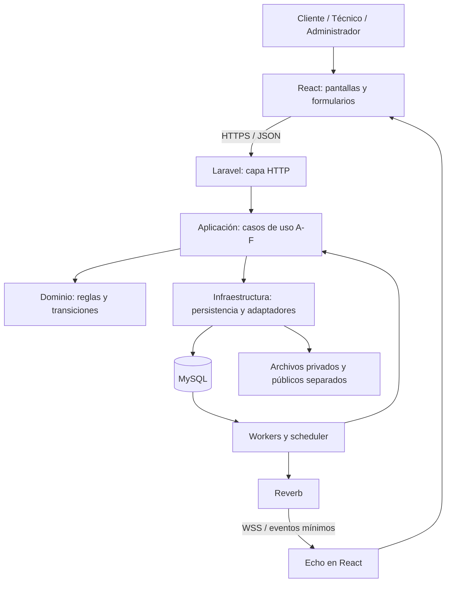

# CANVAS DE DISEÑO TÉCNICO
## TécnicoYa Huancayo · MVP

**Versión:** 1.0 · **Fecha:** 4 de octubre de 2026 · **Estado:** diseño propuesto para revisión.

**Equipo:** Delgado Janampa, Jesus Oscar; Mayhuasca Huanca, Karen Jandre; Pimentel Chumbes, James. **Asesor:** Dr. Maglioni Arana Caparachin. **Universidad Continental · 2026-2.**

Este documento define la arquitectura objetivo y contratos propuestos; no afirma que estén implementados o desplegados. No modifica el código, la base existente ni el canvas de análisis. Los ejemplos de datos son sintéticos.

## 1. Propósito, fuentes y decisiones

La aplicación conecta clientes MYPES y hogares con prestadores de cómputo, refrigeración comercial y electricidad. El diseño conserva los módulos A–F, las historias y reglas de la Fuente 0 y del [canvas de análisis](CANVAS-Analisis-MVP-TecnicoYa.md). Las aclaraciones posteriores del usuario tienen prioridad sobre formulaciones iniciales.

**Tecnologías confirmadas:** React; Laravel con API REST; MySQL; Laravel Reverb y Echo; Docker y Docker Compose; Pest, Cypress y SonarQube. BDD, DevSecOps, Scrum y SOLID orientan el trabajo. Las normas solicitadas son referencias, sin declaración de certificación.

Las fuentes del proyecto definen el negocio. La documentación oficial enlazada respalda mecanismos técnicos y no añade funciones al MVP. Las referencias Laravel 13.x consultadas no fijan por sí solas la versión de ejecución: antes de implementar se documentará una matriz compatible de versiones de PHP, Laravel, Reverb, Echo, React, MySQL, Node, Pest, Cypress y SonarQube y se fijarán dependencias e imágenes.

### 1.1 Decisiones de arquitectura propuestas

| ID | Decisión | Motivo y consecuencia |
|---|---|---|
| DT-01 | Monolito modular Laravel, API REST y una base MySQL para el negocio. | Permite transacciones y una sola implementación de las reglas; los módulos separan responsabilidades dentro de la aplicación. |
| DT-02 | React presenta y solicita acciones; Laravel autoriza, valida y decide estados, ranking y vencimientos. | El navegador no es una fuente confiable de permisos ni de tiempo. |
| DT-03 | Autenticación de la SPA con Sanctum y sesión en cookie; propuesta de mismo origen web para interfaz/API. | Reduce configuración cruzada y evita almacenar credenciales persistentes en JavaScript. |
| DT-04 | Colas y sesiones respaldadas inicialmente por MySQL; Reverb en una instancia para la demostración. | Reduce servicios del entorno inicial. La prueba de carga determinará si se necesita otra solución; no se promete capacidad por arquitectura. |
| DT-05 | Fechas UTC y reloj de servidor, presentación en America/Lima. | Permite comparar vencimientos de forma consistente. |
| DT-06 | Transacciones, bloqueos de filas, versión de recurso e idempotencia en acciones sensibles. | Evita asignaciones incompatibles, escrituras desactualizadas y duplicación por reintentos. |
| DT-07 | Eventos pendientes persistidos mediante outbox y publicación posterior al commit. | Un cambio confirmado no pierde su aviso de publicación por una caída del proceso. La entrega puede repetirse; se deduplica. |
| DT-08 | API y canales privados devuelven datos mínimos según usuario y relación con el servicio. | Los permisos se aplican también a archivos y mensajes en tiempo real. |
| DT-09 | Reglas versionadas y fotografía de la configuración usada en cada decisión. | Se puede explicar por qué un ranking o plazo tuvo un resultado. Efecto de cambios en solicitudes abiertas pendiente P19. |

> **Guía:** “monolito modular” significa una aplicación backend organizada en partes. No obliga a crear un servidor independiente por cada módulo.

### 1.2 Reglas pendientes que el diseño no resuelve por omisión

Se conservan los pendientes P01–P23 del análisis. Son especialmente bloqueantes: P11 (elección), P12 (relojes/rondas), P13 (dos técnicos), P14 (cancelación), P15 (normalización/empates), P16 (franjas/tarifas), P18 (suspensiones) y P19 (cambios de reglas).

Los apartados marcados **provisional** describen una solución técnica revisable. No autorizan asumir un valor de negocio sin confirmación. Pagos se limita a seleccionar/registrar método y a una constancia simulada condicionada a P02; no se diseñan cobros, tarjetas, suscripciones comerciales ni ganancias verificadas. Una empresa técnica sigue siendo un único prestador, sin cuentas empresariales subordinadas.

## 2. Arquitectura en capas



| Capa | Responsabilidad | Ejemplo / límite |
|---|---|---|
| Presentación React | Recorridos, formularios, filtros, mensajes y reloj visual. | Nunca decide que un técnico está autorizado a ver una dirección. |
| HTTP Laravel | Rutas, autenticación, validación de entrada, Policies, serialización y códigos HTTP. | Un controlador invoca `AcceptOffer`; no concentra el algoritmo de matching. |
| Aplicación | Coordina cada caso de uso, transacciones, bloqueos, auditoría y eventos. | `AssignTechnician`, `ExpireRound`, `CompleteParticipation`. |
| Dominio | Fórmulas, elegibilidad, invariantes y transiciones. | `MatchingScorer` y `RequestStateMachine`, sin depender de Echo o de un controlador. |
| Infraestructura | MySQL/Eloquent, almacenamiento, sesión, cola, reloj y publicación de eventos. | Implementa acceso a datos y adaptadores sin trasladarles decisiones del negocio. |

La dirección conceptual de dependencia apunta a las reglas del dominio. Se usarán interfaces donde exista una necesidad concreta de sustitución o prueba: `Clock`, `NotificationSender`, `AuditWriter` y acceso al conjunto de candidatos. No se creará una interfaz por cada clase solo para afirmar que se cumple SOLID.

**SOLID aplicado:** una responsabilidad por caso de uso; nuevas políticas mediante componentes delimitados; implementaciones intercambiables con contratos coherentes; interfaces pequeñas; dependencias inyectadas para sustituir reloj o notificador en pruebas.

Estructura orientativa: `app/Modules/{ARequests,BMatching,COffers,DService,ERatings,FAdministration}`; dentro, separar HTTP, Application, Domain e Infrastructure solo cuando existan clases que lo justifiquen. Elementos compartidos limitados a identidad, reloj, auditoría y contratos comunes. React agrupa funciones en `features/requests`, `matching`, `offers`, `service`, `ratings` y `administration`.

## 3. Arquitectura por módulos A–F

| Módulo | Requerimientos | Responsabilidades | Datos que gobierna | Colaboraciones |
|---|---|---|---|---|
| A · Gestión de solicitud | RF-01 a RF-05 | Registro en cinco pasos, revisión/envío, fotos, referencia de tarifa, disponibilidad declarada. | Solicitudes iniciales, adjuntos, horarios, cobertura y servicios ofrecidos. | Consulta catálogo F; activa B al enviar. |
| B · Matching y asignación | RF-06 a RF-14 | Elegibilidad, puntuación, orden, desempate, estimaciones y candidatos; pendiente de disponibilidad. | Evaluaciones, factores, configuración aplicada y candidatos. | Lee A/F; entrega candidatos a C; recibe cambios de disponibilidad. |
| C · Notificación y respuesta | RF-15 a RF-18 | Rondas, ofertas, SLA, respuestas, elección y coordinación de reasignación. | Rondas, ofertas, decisiones de elección y registro de reasignaciones. | Solicita ranking B y crea asignación en D mediante su caso de uso. |
| D · Ejecución y seguimiento | RF-19 a RF-22 | Estados de atención, agenda, cancelación, reprogramación, técnico adicional y reportes. | Participaciones, citas, reportes, incidencias y eventos de solicitud. | Informa finalización a E; consulta disponibilidad A. |
| E · Calificación e historial | RF-23 a RF-27 | Ventanas de calificación, versiones, Sin calificar, apelación, historial y explicación de criterios. | Calificaciones, versiones y apelaciones. | Consulta D; actualiza proyección de reputación para B. |
| F · Seguridad y administración | RF-28 a RF-33 y RF-C del análisis | Identidad, RBAC, supervisión, catálogo, reglas, comunicados, reportes, método de pago y auditoría. | Usuarios, permisos, catálogos, configuración y registro de auditoría. | Autoriza transversalmente; delega intervenciones al módulo dueño de la operación. |

**RF-29 es transversal:** F gobierna autorización y entrega de eventos; cada módulo origina sus propios cambios. C conserva la oferta y su respuesta aunque Reverb esté temporalmente fuera de servicio.

> **Guía:** “dueño de un dato” identifica quién puede modificarlo. El administrador no debe saltarse las reglas de D cambiando directamente una fila desde F.

## 4. Diseño de datos e integridad en MySQL

### 4.1 Convenciones

- Motor transaccional InnoDB; texto UTF-8 completo; fechas `DATETIME(6)` en UTC, enviadas como ISO 8601 con `Z`.
- Identificadores internos `BIGINT UNSIGNED`; exponerlos como cadenas en JSON para evitar pérdida de precisión en JavaScript. No sustituyen permisos.
- Tarifas `DECIMAL(12,2)` y puntuaciones de precisión fija; en JSON los importes son cadenas decimales. Moneda definitiva pendiente P01.
- Estados como códigos estables validados por dominio; etiquetas españolas solo en presentación. Restricciones de base compatibles con la versión elegida.
- `version` entero creciente en recursos editables; claves foráneas y unicidad donde corresponde. No guardar todo el negocio como un único documento JSON.
- JSON se reserva para fotografías inmutables de reglas/factores o metadatos controlados. No almacenar contraseñas, documentos completos ni direcciones en outbox/auditoría genérica.

### 4.2 Tablas propuestas

| Grupo | Tablas | Relaciones / restricciones principales |
|---|---|---|
| Identidad | `users`, `roles`, `permissions`, `role_permissions`, `sessions` | Correo único normalizado; rol asignado por servidor. Permiso específico `admins.manage` para responsable. Roles múltiples por persona pendiente P20. |
| Perfiles | `client_profiles`, `technician_profiles`, `technician_reviews` | Perfil técnico único por usuario; revisión con administrador, decisión y motivo. |
| Catálogo | `specialties`, `subcategories`, `districts`, `district_distances` | Subcategoría pertenece a especialidad; catálogo con `active`; referencias de distancia identificadas como aproximadas. |
| Oferta profesional | `technician_services`, `technician_districts`, `availability_slots`, `technician_pauses` | Unicidad técnico/subcategoría; tarifa declarada; franjas y pausas independientes del estado de verificación. |
| Solicitud | `service_requests`, `request_attachments`, `request_events` | Cliente, subcategoría, distrito, dirección privada, modalidad, horario, ruta, estado, versión y reglas aplicadas. |
| Matching | `matching_runs`, `matching_candidates` | Un resultado por candidato y ejecución; factores y puntuación preservados. |
| Ofertas | `offer_rounds`, `offers`, `reassignment_records` | Unicidad ronda/técnico; oferta con `available_at`, `expires_at`, respuesta y estado; referencia a versión de ronda. |
| Atención | `participations`, `appointments`, `reschedule_requests`, `service_reports`, `incidents` | Participación distingue principal/adicional; cada una tiene reporte y resultado de calificación. |
| Reputación | `ratings`, `rating_versions`, `rating_appeals`, `rating_replies` | Una calificación por participación; versión inmutable por modificación; resolución separada del contenido original. |
| Comunicación | `notifications`, `notification_attempts`, `notification_preferences`, `announcements` | Una notificación por evento/destinatario/canal; audiencia y vigencia de comunicados. |
| Archivos | `media_files`, `technician_documents`, `portfolio_items` | Propietario, tipo, tamaño, ubicación interna y visibilidad; documentos privados separados de galería pública. |
| Gobierno | `rule_versions`, `audit_entries`, `support_cases` | Versiones de configuración y decisiones privilegiadas con motivo. |
| Método de pago | `payment_methods`, `request_payment_methods` | Solo selección; tablas para montos/ganancias no incorporadas mientras P02 esté pendiente. |
| Fiabilidad | `jobs`, `failed_jobs`, `outbox_events`, `idempotency_records`, tablas de caché/bloqueo si se usa el driver de base | Deducción de duplicados y seguimiento de tareas; no son entidades de usuario. |

Las tablas auxiliares se crean cuando la historia correspondiente se implemente, no todas como trabajo previo obligatorio.

### 4.3 Índices e invariantes críticas

- Índices por `(status, expires_at)` en ofertas y solicitudes pendientes; `(rating_status, rating_due_at)` en participaciones; `(published_at, available_at)` en outbox.
- Índices por cliente/fecha, técnico/estado, distrito/subcategoría y participante/fechas de cita según consultas verificadas.
- Una participación activa por posición principal/adicional. Propuesta MySQL: columna generada `active_slot` que contiene el puesto cuando está activo y `NULL` al terminar/sustituir, con `UNIQUE(request_id, active_slot)`. Permite conservar anteriores; comprobar semántica en la versión fijada.
- Unicidad `ratings(participation_id)`; las ediciones crean `rating_versions`, no otra calificación independiente.
- Una sola ronda abierta por solicitud, mediante condición equivalente de unicidad y bloqueo de solicitud.
- El máximo de ofertas simultáneas, solapamientos de citas y transiciones se verifica dentro de transacciones; un índice por sí solo no detecta intervalos de tiempo que se cruzan.
- Desactivar catálogo preserva relaciones históricas. Borrado/anonimización según P08; no usar eliminaciones en cascada que destruyan trazabilidad por cerrar una cuenta.

> **Guía:** una transacción guarda un conjunto de cambios completo o no guarda ninguno. Sirve para evitar que exista una asignación sin la correspondiente reserva o evento histórico.

## 5. Estados, matching y consistencia

### 5.1 Estados propuestos para los contratos

| Objeto | Códigos | Regla |
|---|---|---|
| Solicitud | `registered`, `sent`, `pending_availability`, `assigned`, `in_progress`, `completed`, `closed`, `unrated`, `cancelled`, `expired` | Mapean a los estados del canvas; nunca se actualizan mediante un `PATCH status` público. |
| Oferta | `pending`, `accepted`, `rejected`, `expired`, `withdrawn` | `accepted` significa candidato que aceptó, no asignación. |
| Participación | `assigned`, `in_progress`, `completed`, `cancelled`, `replaced` | Principal/adicional y evaluación independientes; estado global con dos técnicos pendiente P13. |
| Técnico | `pending_verification`, `active`, `inactive`, `suspended` | Disponibilidad y pausa son datos separados; rechazo de verificación no añade un estado sin resolver P22. |

Para minimizar datos sensibles en borradores, se propone mantener los cinco pasos en memoria de React y crear `registered` al confirmar el resumen. Una llamada separada de envío activa el matching. Fijar esta frontera requiere cerrar P22. No persistir fotos o direcciones en `localStorage` por defecto.

### 5.2 Matching explicable

1. Filtrar especialidad/subcategoría activa, técnico verificado y activo, cobertura, disponibilidad y pausa; excluir candidatos ya descartados según política de ronda.
2. Obtener una fotografía consistente de candidatos, tarifa y reputación.
3. Calcular factores comparables entre 0 y 1. Fórmula: `score = 100 × (0.35 × cercanía + 0.20 × tarifa + 0.30 × historial + 0.15 × experiencia)` con pesos de la versión vigente.
4. Ordenar de mayor a menor; empate por calificación promedio. Empate persistente queda P15: no introducir prioridad arbitraria como regla aprobada.
5. Guardar factores, valores de entrada, versión de reglas y resultado antes de abrir ofertas.

**Normalización propuesta, pendiente P15:** cercanía según tabla de distritos y distancia máxima de referencia; tarifa inversa en el conjunto comparable (si todas coinciden, igual factor); reputación promedio/5; experiencia limitada por un máximo configurable. Definir referencias, valores ausentes y tratamiento de precios cero antes de publicar el algoritmo. Usar el 50 % del componente historial para nuevos técnicos según canvas; falta decidir el caso de tres servicios finalizados sin reseñas.

La tarifa debe corresponder a la subcategoría de la solicitud. Los administradores solo pueden publicar pesos no negativos cuya suma sea 100 %. Se propone que nuevas solicitudes usen nueva versión y las abiertas mantengan su versión, sujeto a P19. La explicación pública no expone datos privados de competidores.

### 5.3 Concurrencia e idempotencia

Acciones críticas: responder oferta, asignar, cancelar, reasignar, reprogramar, finalizar, calificar y resolver apelación.

Orden de trabajo: autenticar → autorizar → validar entrada → iniciar transacción → bloquear solicitud → bloquear técnicos implicados en orden de ID → releer oferta/cita y reloj → comprobar versión/estado/plazo → escribir cambio, evento histórico y auditoría necesaria → insertar outbox → commit → responder.

Toda operación que crea o cambia citas debe seguir el mismo bloqueo por técnico, incluso si no existen citas previas. Para intervalos `[inicio, fin)`, hay conflicto cuando `existente.inicio < nuevo.fin` y `existente.fin > nuevo.inicio`; la duración depende de P16. Se reintentan deadlocks de forma limitada y con la misma clave de idempotencia.

El cliente envía `Idempotency-Key` en comandos y creación de recursos del negocio. Un registro único por usuario/operación/clave conserva hash de cuerpo y resultado. Misma clave y mismo cuerpo devuelve el resultado previo autorizado; otro cuerpo produce `409 IDEMPOTENCY_CONFLICT`. El resultado y el cambio se confirman juntos. Retención de claves propuesta: siete días, a validar antes de implementar; las restricciones de dominio siguen evitando duplicados después de ese periodo.

`expected_version` protege ediciones desde una pantalla antigua: si ya cambió el recurso, devolver `409 STALE_VERSION` con una indicación de recarga. Verificar permisos actuales antes de devolver una respuesta almacenada; no recuperar direcciones desde un resultado de idempotencia cuando el acceso fue revocado.

### 5.4 Reasignación administrativa

Permiso `requests.reassign`, motivo obligatorio y estado compatible. Volver a comprobar elegibilidad y reserva del técnico destino bajo transacción; registrar origen/destino, ofertas anuladas, responsable y causa. Un job antiguo debe resultar inocuo por comprobar versión de ronda/asignación.

**Propuesta sujeta a P11/P14:** la intervención dirige la nueva oferta al técnico seleccionado por el administrador y conserva aceptación del técnico y elección del cliente; no fuerza su consentimiento. El contrato devuelve un registro `awaiting_response`. Si se autoriza una asignación administrativa directa, deberá definirse como excepción explícita con criterios y pruebas propios antes de implementarla.

## 6. Convenciones del contrato REST

**Base:** `/api/v1`. JSON UTF-8, fechas UTC, importes decimales como cadenas. Campos de entrada son lista permitida: no aceptar `role`, `verified`, `score`, `client_id`, `status` ni `expires_at` en comandos que no los administren expresamente.

**Roles en tablas:** C = cliente; T = técnico; A = administrador; AR = administrador responsable; P = público. Todo acceso requiere además pertenencia, estado y permiso concreto. A no obtiene capacidad de actuar como cliente o técnico por herencia implícita.

**Respuesta normal:** `{ "data": ..., "meta": { "server_time": "2026-10-04T18:00:00Z", "request_id": "..." } }`. Listas añaden `page`, `per_page`, `total` y enlaces. Propuesta: 20 elementos por página, máximo 100; filtros y ordenamiento en lista permitida.

**Error uniforme:** `{ "error": { "code": "OFFER_EXPIRED", "message": "La oferta ya venció.", "fields": {} }, "meta": { "request_id": "...", "server_time": "..." } }`.

| HTTP | Uso |
|---|---|
| 200 / 201 / 202 / 204 | Consulta o cambio / creación / trabajo duradero aceptado / eliminación o cierre de sesión sin cuerpo. |
| 401 | Sesión inexistente o vencida. |
| 403 | Rol/permiso insuficiente o cuenta inhabilitada. |
| 404 | Recurso inexistente o ajeno cuya existencia no debe revelarse. |
| 409 | Estado, plazo, reserva o versión incompatible; incluir código de negocio. |
| 413 / 415 / 422 | Archivo demasiado grande / tipo no admitido / validación de campos. |
| 419 | Token CSRF ausente/vencido en flujos de sesión; renovar sesión/CSRF, no repetir comandos ciegamente. |
| 429 | Límite de peticiones alcanzado, con `Retry-After`. |
| 503 | Dependencia indispensable no disponible; no afirmar que una escritura fallida se guardó. |

Todas las tablas siguientes heredan estos errores. Las rutas con P pendiente son contratos propuestos, no funciones habilitadas. `202` solo se devuelve después de guardar el trabajo; el cliente puede consultar el recurso/operación. `GET` nunca cambia estados. `/sanctum/csrf-cookie` y `/broadcasting/auth` son excepciones de infraestructura al prefijo.

> **Guía:** el contrato permite trabajar frontend y backend por separado: ambos conocen qué pedir, qué recibir y cómo tratar un error.

## 7. API por módulo

### A · Gestión de la solicitud — RF-01 a RF-05

| Método y ruta | Permiso | Entrada principal | Resultado / validación específica |
|---|---|---|---|
| GET `/catalog/specialties` | P | — | 200: especialidades activas. |
| GET `/catalog/subcategories` | P | `specialty_id` | 200: subcategorías activas y referencia de tarifa. |
| GET `/catalog/districts` | P | — | 200: cobertura habilitada. |
| POST `/requests` | C | `subcategory_id`, `description`, `district_id`, `address`, `mode`, `preferred_start_at`, `preferred_end_at`, `source`, `target_technician_id?` | 201: Request `registered`, `version`; horario requerido si programada; objetivo solo si `source=profile`; P16/P22. |
| POST `/requests/{id}/attachments` | C titular | Multipart `file`, `expected_version` | 201: Attachment privado; antes de enviar; política de archivo P17. |
| DELETE `/requests/{id}/attachments/{attachment}` | C titular | `expected_version` | 204: desasociar antes de enviar; comprobar pertenencia de ambos identificadores. |
| POST `/requests/{id}/submission` | C titular | `expected_version`, confirmación del resumen | 202: Request y búsqueda pendiente; completa datos, fija reglas y programa primera ronda una sola vez. |
| GET `/requests` | C | `status`, `page` | 200: solo solicitudes propias. |
| GET `/requests/{id}` | C titular / T notificado o asignado / A | — | 200: RequestView con proyección autorizada; no es una exportación directa del modelo. |
| PUT `/technicians/me/availability` | T | `slots[]`, `district_ids[]`, `pause`, `expected_version` | 200: Availability; detectar citas incompatibles y no alterarlas silenciosamente. |
| PUT `/technicians/me/services` | T | `services[{subcategory_id, reference_fee}]`, `expected_version` | 200: servicios declarados; no cambia especialidad verificada sin revisión definida. |

`RequestView`: `id`, `status`, `version`, resumen de especialidad/subcategoría, zona, modalidad, fechas, plazos y acciones permitidas. Dirección exacta/contactos se serializan únicamente cuando la Policy los autorice. `allowed_actions` ayuda a la interfaz pero no reemplaza una nueva validación del servidor.

### B · Matching y asignación — RF-06 a RF-14

| Método y ruta | Permiso | Entrada | Resultado / condición |
|---|---|---|---|
| GET `/technicians` | C | `specialty_id`, `subcategory_id`, `district_id`, `min_rating`, `page` | 200: perfiles públicos pertinentes, sin contacto privado. |
| GET `/technicians/{id}` | C | — | 200: bio, servicios, galería y reseñas públicas. |
| GET `/requests/{id}/candidates` | C titular / A | — | 200: candidatos visibles, respuesta y `selectable`; distingue aceptados de solo evaluados según P11. |
| GET `/requests/{id}/matching` | A con supervisión | — | 200: ejecución, factores, exclusiones justificadas y versión de reglas; minimizar datos privados. |
| GET `/technicians/me/matching-criteria` | T | — | 200: factores, pesos, requisitos de elegibilidad y tratamiento sin historial. |

`RunMatching(request_id, expected_generation)` es un caso de uso interno, no una ruta pública para que el cliente reintente indiscriminadamente o cambie pesos. B calcula y persiste candidatos; C gobierna rondas y elección. Pendiente de 24 h pertenece al proceso de B y se supervisa por jobs descritos en §10.

### C · Notificación y respuesta — RF-15 a RF-18

| Método y ruta | Permiso | Entrada | Resultado / condición |
|---|---|---|---|
| GET `/offers` | T | `status`, `page` | 200: ofertas propias con `expires_at`, `server_time` y detalle permitido. |
| POST `/offers/{id}/response` | T destinatario | `decision: accept\|reject`, `reason?`, `expected_version` | 200: Offer; 409 si venció, cambió o ya no corresponde; nunca crea asignación por sí sola. |
| POST `/requests/{id}/selection` | C titular | `offer_id`, `expected_version` | 201: Participation principal y cita si procede; oferta aceptada, disponibilidad revalidada y P11 resuelto. |
| POST `/requests/{id}/alternative-searches` | C titular | `expected_version` | 202: inicia alternativas después de fallo de ruta directa; no asigna sin elección. |
| POST `/admin/requests/{id}/reassignments` | A + `requests.reassign` | `replacement_technician_id`, `reason`, `expected_version` | 201: Reassignment `awaiting_response` según propuesta §5.4; 409 si incompatible. |

Ejemplo de respuesta a oferta: `{"decision":"accept","expected_version":2}`. Una aceptación rechazada por plazo devuelve `409 OFFER_EXPIRED`; la pantalla actualiza desde API. No extender el reloj por reintentar la misma petición.

### D · Ejecución y seguimiento — RF-19 a RF-22

| Método y ruta | Permiso | Entrada | Resultado / condición |
|---|---|---|---|
| GET `/requests/{id}/timeline` | C titular / T participante / A | `page` | 200: eventos filtrados, sin motivos privados de otros usuarios. |
| GET `/appointments` | C/T propios / A autorizado | `from`, `to`, `page` | 200: citas propias o supervisadas; acotar rango. |
| POST `/requests/{id}/cancellation` | C titular | `reason`, `expected_version` | 200: Request cancelada hasta Asignada y antes de atención; 409 después. |
| POST `/participations/{id}/withdrawal` | T participante | `reason`, `expected_version` | 200: incidencia y procedimiento de reasignación; etapas y excepciones pendientes P14. |
| POST `/participations/{id}/start` | T participante | `expected_version` | 200: Participation `in_progress`; solo quien está asignado. |
| POST `/participations/{id}/completion` | T participante | `report`, `expected_version` | 200: Participation `completed`, `completed_at`, `rating_due_at`; crea oportunidad individual de calificación. |
| POST `/requests/{id}/reschedules` | C titular / T participante | `proposed_start_at`, `proposed_end_at`, `reason`, `expected_version` | 201: Reschedule pendiente de otra parte; P06/P14. |
| POST `/reschedules/{id}/response` | Contraparte autorizada | `decision: accept\|reject`, `expected_version` | 200: resultado; aceptación revalida y mueve reserva en transacción. |
| POST `/requests/{id}/additional-technician-proposals` | T principal | `technician_id`, `reason`, `expected_version` | 201: propuesta; máximo un adicional activo. |
| POST `/additional-technician-proposals/{id}/response` | C titular | `decision: approve\|reject`, `expected_version` | 200: decisión del cliente; aceptación técnica e inicio del SLA del adicional dependen de P13. |
| POST `/requests/{id}/incidents` | C titular / T participante | `type`, `description` | 201: Incident y aviso administrativo, sin reasignar automáticamente por denuncia no revisada. |

Finalizar una participación no debe marcar como terminada la atención del otro técnico. La proyección global queda condicionada a P13. La ruta del adicional no se habilita parcialmente sin definir su aceptación y estados.

### E · Calificación e historial — RF-23 a RF-27

| Método y ruta | Permiso | Entrada | Resultado / condición |
|---|---|---|---|
| POST `/participations/{id}/rating` | C titular | `score: 1..5`, `comment` | 201: Rating, versión 1 y `editable_until`; 409 fuera del plazo o si ya existe. |
| PATCH `/ratings/{id}` | C autor | `score`, `comment`, `expected_version` | 200: nueva versión; plazo propio, P23; nunca sobrescribe el historial. |
| GET `/ratings` | C/T propios | `page` | 200: emitidas o recibidas según rol. |
| GET `/ratings/{id}/versions` | C autor / T evaluado / A resolutor | `page` | 200: versiones pertinentes; no expone datos administrativos privados. |
| POST `/ratings/{id}/replies` | T evaluado | `text` | 201: respuesta identificada como del técnico; moderación pendiente P17. |
| POST `/ratings/{id}/appeals` | T evaluado | `reason`, `evidence_ids[]?` | 201: Appeal abierta; plazo y multiplicidad P07. |
| GET `/admin/appeals` | A resolutor | `status`, `page` | 200: apelaciones con versión vigente. |
| POST `/admin/appeals/{id}/resolution` | A + `appeals.resolve` | `decision: maintain\|adjust\|annul`, `reason`, `adjusted_score?`, `expected_version`, `rating_version` | 200: Resolution auditada; ajustar exige nota válida; 409 si reseña cambió desde revisión. |
| GET `/history` | C/T propios | `status`, `from`, `to`, `page` | 200: historial por participación y solicitud. |

`CloseUnratedParticipation` es interno y no una acción que el cliente pueda adelantar. Una apelación debe revisar la versión vigente, pero si cambió durante la decisión del administrador se exige recargar y volver a evaluar. El efecto de anulación en promedios/ranking sigue P07.

### F · Seguridad y administración — RF-28 a RF-33

| Método y ruta | Permiso | Entrada | Resultado / condición |
|---|---|---|---|
| GET `/sanctum/csrf-cookie` (sin prefijo) | P | — | 204 y cookie CSRF para iniciar sesión protegida. |
| POST `/auth/register` | P | `name`, `email`, `password`, `password_confirmation`, `account_type: client\|technician` | 201: cuenta; T pendiente; no acepta rol admin ni permisos. |
| POST `/auth/login` | P con CSRF | `email`, `password` | 200: perfil mínimo y sesión rotada; error genérico por credenciales inválidas. |
| POST `/auth/logout` | Sesión propia | CSRF | 204: invalidar sesión y renovar protección CSRF. |
| POST `/auth/password-reset-requests` | P | `email` | 202 genérico; entrega solo en sandbox; refinamiento de seguridad propuesto. |
| POST `/auth/password-resets` | P | `token`, `email`, `password`, `password_confirmation` | 200: actualización y política de revocación de sesiones; token de un solo uso. |
| GET `/me` | C/T/A | — | 200: cuenta, permisos efectivos y estado. |
| PATCH `/me` | C/T/A propios | Campos de perfil permitidos, `expected_version` | 200: perfil; nunca permite otorgarse rol, verificación o acceso administrativo. |
| GET `/notifications` | Destinatario | `unread`, `page` | 200: notificaciones propias persistidas. |
| POST `/notifications/{id}/read` | Destinatario | — | 200: leída, repetible sin efectos extra. |
| PUT `/me/notification-preferences` | Propietario | `email`, `push` | 200: preferencias; avisos obligatorios y canales de prueba según P12. |
| GET `/announcements` | Usuario autenticado | `page` | 200: solo audiencia y vigencia permitidas. |
| GET `/admin/dashboard` | A | `from`, `to` | 200: métricas/alertas; fórmulas P21. |
| GET `/admin/requests` | A supervisor | `status`, `district_id`, `specialty_id`, `page` | 200: solicitudes filtradas; detalle usa A con Policy administrativa. |
| GET `/admin/technicians` | A | `status`, `page` | 200: prestadores y revisión. |
| POST `/admin/technicians/{id}/reviews` | A verificador | `decision`, `reason`, `expected_version` | 201: revisión; activar solo con información requerida; rechazo según P22. |
| POST `/admin/technicians/{id}/status-changes` | A | `target_status`, `reason`, `expected_version` | 201: cambio auditado; efectos en trabajos activos sujetos a P18. |
| GET `/admin/clients` | A | `status`, `page` | 200: datos mínimos e historial autorizado. |
| POST `/admin/clients/{id}/access-changes` | A | `blocked`, `reason`, `expected_version` | 201: intervención auditada; efectos P18. |
| GET/POST `/admin/specialties` | A catálogo | Listar / `name`, `active` | 200/201: catálogo; respetar alcance de tres rubros salvo cambio aprobado. |
| PATCH `/admin/specialties/{id}` | A catálogo | `name?`, `active?`, `expected_version` | 200: actualización; no borra relaciones. |
| GET/POST `/admin/subcategories` | A catálogo | Listar / `specialty_id`, `name`, `reference_fee?`, `image_id?` | 200/201: subcategorías. |
| PATCH `/admin/subcategories/{id}` | A catálogo | Campos permitidos, `active?`, `expected_version` | 200: catálogo, efectos sobre solicitudes abiertas P19. |
| GET/POST `/admin/districts` | A catálogo | Listar / `name`, `active` | 200/201: cobertura; distritos iniciales P03. |
| PATCH `/admin/districts/{id}` | A catálogo | Campos permitidos, `expected_version` | 200: cobertura. |
| GET `/admin/rule-versions` | A reglas | `page` | 200: versiones y vigencia. |
| POST `/admin/rule-versions` | A + `rules.manage` | `weights`, plazos editables, `reason`, `expected_version` | 201: nueva versión validada; suma 100 %, rangos positivos; activación según P19. |
| GET/POST `/admin/announcements` | A comunicaciones | Listar / título, imagen, texto, enlace, audiencia, inicio, vigencia | 200/201: comunicado, vista previa derivada de datos. |
| PATCH/DELETE `/admin/announcements/{id}` | A comunicaciones | Campos y versión / versión | 200/204: cambio o retiro auditado. |
| POST `/admin/announcements/{id}/duplicates` | A comunicaciones | — | 201: copia en borrador, no publicación automática. |
| GET `/admin/reports` | A reportes | `type`, `from`, `to`, filtros | 200: datos agregados con periodo y filtros. |
| POST `/admin/report-exports` | A reportes | `type`, filtros, `format: pdf\|xlsx` | 202: operación de exportación; descarga privada posterior. |
| GET `/operations/{id}` | Creador autorizado | — | 200: `pending\|running\|completed\|failed`, resultado disponible sin datos secretos. |
| GET `/exports/{id}/download` | A creador/con permiso | — | 200: archivo privado si operación terminada; 409 si pendiente. |
| GET/POST `/admin/accounts` | AR | Listar / identidad y permisos autorizados | 200/201: cuentas administrativas, nunca contraseña compartida en respuesta. |
| PATCH `/admin/accounts/{id}` | AR | `active?`, `permissions?`, `reason`, `expected_version` | 200: cambios auditados; proteger último responsable operativo. |
| GET `/admin/audit` | A + `audit.read` | Filtros acotados, `page` | 200: registros sin secretos; sin rutas para editarlos/borrarlos. |
| GET `/payment-methods` | C | — | 200: catálogo de métodos; valores definitivos P02/P16. |
| PUT `/requests/{id}/payment-method` | C titular | `payment_method_id`, `expected_version` | 200: selección; no se guarda número de tarjeta ni se procesa dinero. |
| POST `/support-cases` | C/T | `request_id?`, `subject`, `description` | 201: caso de soporte con relación validada. |
| GET `/support-cases` | Propietario / A soporte | `status`, `page` | 200: propios o bandeja administrativa. |
| POST `/admin/support-cases/{id}/resolutions` | A soporte | `resolution`, `expected_version` | 201: intervención registrada; no añade chat. |

**Archivos y perfil técnico, control transversal F:** `POST /media` (multipart; rol y finalidad permitidos → 201 Media), `GET /media/{id}` (200 binario autorizado o miniatura pública), `DELETE /media/{id}` (204 solo si propietario y no requerido por historial). `GET/PATCH /technicians/me/profile` (T → 200 perfil permitido), `POST /technicians/me/documents` (T, `media_id`, tipo → 201 vínculo privado), `GET/POST /technicians/me/portfolio` (T → 200/201), `PATCH/DELETE /technicians/me/portfolio/{id}` (T propietario → 200/204, sin elevar visibilidad de documentos privados). Política de contenido y retención P08/P17. No se acepta una ruta de disco suministrada por el cliente.

### 7.1 Ejemplo de contrato completo: elegir técnico

```http
POST /api/v1/requests/501/selection
Accept: application/json
Content-Type: application/json
X-XSRF-TOKEN: <valor de la cookie CSRF>
Idempotency-Key: 412d9829-55b6-4b4d-8bbc-b2d176a02340
Cookie: <sesión gestionada por el navegador>

{"offer_id":"701","expected_version":4}
```

```json
{
  "data": {
    "request_id": "501",
    "participation_id": "801",
    "technician_id": "203",
    "role": "primary",
    "status": "assigned",
    "request_version": 5
  },
  "meta": {"server_time": "2026-10-04T18:05:00Z", "request_id": "trace-example-01"}
}
```

201 solo tras confirmar asignación y reserva. Posibles errores específicos: `OFFER_NOT_ACCEPTED`, `TECHNICIAN_UNAVAILABLE`, `REQUEST_NOT_SELECTABLE`, `STALE_VERSION`. El contacto se obtiene mediante una lectura autorizada posterior, no se duplica en todas las respuestas.

## 8. Autenticación, RBAC y privacidad

### 8.1 Sesión de la SPA

Propuesta: React y API bajo el mismo origen mediante proxy. Sanctum autentica la SPA usando la sesión de Laravel; primero se solicita la cookie CSRF, luego login con credenciales y cabecera CSRF. El navegador envía cookies en peticiones posteriores. Usar cookie de sesión `HttpOnly`, `Secure` en HTTPS y `SameSite` coherente con el despliegue. La cookie CSRF es legible por el cliente para formar la cabecera y no es la cookie de autenticación. Referencia: [Sanctum, autenticación SPA](https://laravel.com/docs/13.x/sanctum#spa-authentication).

Propuesta de endurecimiento: rotar sesión al autenticar, invalidarla al salir y revocarla cuando se bloquee la cuenta; contraseñas con bcrypt según F0, sin registrarlas en logs. No almacenar tokens de sesión en `localStorage`. El registro admite solo cliente/técnico; el primer administrador responsable se crea con un procedimiento privado de instalación, sin contraseña predeterminada compartida. Recuperación de contraseña solo con token limitado y canal de prueba.

> **Guía:** autenticación responde “¿quién eres?”. Autorización responde “¿puedes realizar esta acción sobre esta solicitud?”. Son comprobaciones distintas.

### 8.2 Permisos por rol y relación

| Acción | Cliente | Técnico | Administrador | Responsable |
|---|---|---|---|---|
| Solicitar/seleccionar/calificar | Solo propias | No por ser técnico | No por ser administrador | Igual límite |
| Responder oferta | No | Solo destinatario y plazo válido | No suplanta al técnico | Igual límite |
| Iniciar/finalizar | No | Solo participación asignada | Supervisa; no registra como técnico | Igual límite |
| Proponer adicional | Autoriza | Solo principal | Supervisa | Igual límite |
| Ver dirección/contacto privado | Propios y técnico asignado | Solo solicitudes asignadas | Solo gestión autorizada | Igual límite |
| Ver documentos técnicos | No | Solo propios | Revisión autorizada | Igual límite |
| Reasignar manualmente | No | No | `requests.reassign` | Con permiso |
| Resolver apelación | No | Presenta la propia | `appeals.resolve` | Con permiso |
| Editar catálogo/reglas/comunicados | No | No | Permiso correspondiente | Con permiso |
| Administrar otros administradores | No | No | No | `admins.manage` |
| Consultar auditoría | No | No | `audit.read` | Con permiso |

Implementación propuesta: middleware de sesión y cuenta activa; Form Requests para forma/validación; Policies por recurso para acciones, relaciones y estado; API Resources con campos permitidos. Negación por defecto. Un botón oculto en React no constituye protección. Se verifica autorización también al descargar archivos, consultar operaciones y solicitar canales privados.

No se adopta un modelo multiempresa con tenants: cada empresa técnica funciona como una sola cuenta. La posibilidad de que una persona use varios roles permanece P20.

### 8.3 Datos y archivos

Fotos de falla, direcciones y documentos se almacenan privados. Acceso mediante endpoint autorizado, sin URLs públicas permanentes. Galería comercial e imágenes del carrusel usan una categoría pública separada. Límites de tamaño/tipo/cantidad P17; validar contenido real además de extensión, generar nombres internos y evitar archivos ejecutables. Propuesta: retirar metadatos de ubicación de imágenes antes de servirlas.

Textos se presentan escapados y enlaces se restringen a esquemas permitidos; no renderizar HTML arbitrario en comunicados. Consultas parametrizadas y campos de ordenación permitidos. Reportes exportados no deben interpretar textos de usuario como fórmulas de hoja de cálculo. Retención y anonimización P08: no ejecutar un borrado automático de 12 meses hasta validarlo.

## 9. Tiempo real con Reverb y Echo

### 9.1 Responsabilidades

Laravel confirma acciones y registra notificaciones; Reverb transporta eventos y Echo los recibe en React. La autorización de canales se resuelve en Laravel y la difusión se realiza después de confirmar cambios. Estas capacidades se apoyan en [Broadcasting: canales privados y transacciones](https://laravel.com/docs/13.x/broadcasting).

**Diseño propuesto:** transmitir avisos mínimos de cambio, no serializar modelos completos. La API sigue siendo la fuente para recuperar el estado y aplicar visibilidad. Los mensajes no contienen dirección, WhatsApp, documentos, fotos privadas o cuerpo de apelaciones.

### 9.2 Canales y eventos

Canal lógico propuesto: `users.{userId}.{authVersion}`; Echo se suscribe como canal privado. Laravel verifica identidad, cuenta activa y versión de autorización en `/broadcasting/auth`. `authVersion` cambia al revocar permisos/sesiones por motivos administrativos; las nuevas publicaciones se dirigen a la versión actual. No es un secreto ni sustituye la autenticación. Al salir se abandonan canales, se desconecta Echo y se limpian datos de la sesión en React.

No usar un canal público de “todas las solicitudes”. Las alertas administrativas se entregan a usuarios con el permiso correspondiente. Si cambia su permiso, no reciben nuevos eventos sensibles. Incluso un evento atrasado solo contiene identificadores mínimos y una lectura posterior vuelve a autorizar.

| Evento | Productor | Destinatarios | Información mínima |
|---|---|---|---|
| `offer.created` | C | Técnico destinatario | `offer_id`, `request_id`, `expires_at`, `version`. |
| `offer.updated` | C | Técnico; cliente si corresponde | Identificadores y versión; estado completo por API. |
| `request.updated` | A/C/D | Cliente, participantes autorizados, supervisores | Solicitud y versión. |
| `participation.updated` | D | Cliente y técnico correspondiente | Participación, solicitud y versión. |
| `rating.window-opened` | E | Cliente | Participación y `rating_due_at`. |
| `rating.updated` | E | Cliente/técnico involucrados | Calificación y versión. |
| `appeal.updated` | E/F | Técnico y administradores resolutores | Apelación y versión; motivo solo por API. |
| `notification.created` | F | Usuario destinatario | Identificador de notificación. |
| `announcement.changed` | F | Audiencia vigente | Identificador; volver a consultar lista filtrada. |

Sobre común: `event_id`, `type`, `schema_version: 1`, `occurred_at`, `aggregate_id`, `aggregate_version`, `data`. `aggregate` significa recurso del negocio al que pertenece el cambio. No incluir datos privados por comodidad de la interfaz.

### 9.3 Duplicados, reconexión y reloj

React deduplica por `event_id`, ignora versiones anteriores a la consultada y actualiza datos mediante API cuando recibe una versión nueva. Al reconectar: suscribirse, recuperar estado y conciliar eventos recibidos durante esa consulta. Un evento no se usa para sumar una asignación o una reseña sin comprobar el estado persistido.

El cronómetro muestra `max(0, expires_at - hora_estimada_servidor)`. Se sincroniza con `meta.server_time`, y se recalcula al recuperar foco o reconectar. No se transmite un evento por segundo. Alcanzar cero desactiva la acción en la interfaz y solicita actualización, pero solo Laravel decide si acepta o rechaza la respuesta.

Si falla Reverb, mostrar “actualización en vivo interrumpida” y consultar periódicamente las pantallas activas (propuesta: cada 15 s con espera progresiva ante errores). El polling no ejecuta vencimientos: esos continúan en backend. Registrar por separado notificación persistida, intento de publicación y lectura; publicar no prueba que el usuario haya leído.

## 10. Scheduler, colas y ventanas temporales

### 10.1 Diseño de ejecución

Usar workers independientes para tareas de dominio y entrega; el scheduler detecta vencimientos omitidos. Persistir cola en MySQL inicialmente. Jobs reciben identificadores, generación esperada y vencimiento observado; al ejecutar recargan el recurso y verifican su situación. Laravel ofrece ejecución de colas, reintentos y trabajos diferidos; la propuesta debe fijar timeout del worker menor que el tiempo de reserva/reintento para reducir ejecuciones superpuestas. Referencia: [colas de Laravel](https://laravel.com/docs/13.x/queues).

Un job puede ejecutarse más de una vez. Se diseña efecto único mediante transacción y condición de estado; no se promete “entrega exactamente una vez”. Jobs enviados después del commit y outbox persistido permiten recuperar trabajo tras fallos.

> **Guía:** una cola es una lista de trabajos pendientes. Un worker los procesa; el scheduler revisa periódicamente qué tareas corresponden. Reverb no sustituye a ninguno.

### 10.2 Tabla de jobs y plazos

| Job / revisión | Momento objetivo | Validación antes de actuar | Efecto |
|---|---|---|---|
| `PrepareMatching` | Tras envío o búsqueda de alternativas autorizada | Solicitud no terminal, versión/ruta correctas | Persistir ranking y preparar ronda. |
| `OpenOfferRound` | Primera ronda o ronda anterior sin aceptaciones válidas | Bloqueo solicitud; sin ronda abierta ni asignación incompatible | Máximo 3 ofertas simultáneas o parámetro vigente, cada una con deadline. |
| `ExpireOfferRound` | 10 min según regla de SLA aplicada | Ronda actual; reloj servidor; relectura de respuestas | Vencer ofertas pendientes; si ninguna aceptación válida, siguiente ronda o Pendiente. |
| `RetryPendingMatching` | Cambio de disponibilidad + revisión periódica | Sigue pendiente y no llegó su fecha límite | Buscar candidatos sin reiniciar el plazo original, propuesta P12. |
| `ExpirePendingRequest` | 24 h desde entrada a pendiente, propuesta P12 | Aún pendiente, misma generación y plazo vencido | Pasar a Expirada, conservar historial y avisar. |
| `CloseUnratedParticipation` | 48 h desde finalización individual | Sin calificación y misma participación finalizada | Marcar resultado Sin calificar; estado global según P13. |
| `ExpireRescheduleProposal` | 24 h desde propuesta | Sigue pendiente y no fue aceptada | Rechazar por vencimiento y mantener fecha original según canvas; casos de cita anterior P14. |
| `DeliverNotification` | Tras evento persistido | Destinatario/canal aún permitido; evento no retirado | Intento de entrega en sandbox, con límite de reintentos. |
| `PublishOutboxEvent` | Después del commit; recuperación periódica | Evento existente; receptor y versión de acceso actuales | Publicación y registro de intento; fallos recuperables. |
| `RefreshRatingSummary` | Calificación, edición o resolución | Versión de calificación vigente | Recalcular agregados desde datos válidos; no sumar diferencias duplicadas. |
| `GenerateReportExport` | Solicitud administrativa | Solicitante conserva permiso y filtros válidos | Archivo privado y operación terminada/fallida. |

No se necesita un job para impedir edición de calificación: cada edición compara el reloj del servidor con `editable_until`, aunque nunca haya corrido un job. En todas las acciones, un worker atrasado no autoriza aceptar una oferta vencida.

### 10.3 Semántica de tiempo propuesta

- Instantes UTC con precisión suficiente y hora del servidor sincronizada. Propuesta de frontera: válido mientras `now < deadline`; vencido cuando `now >= deadline`. Esta frontera requiere ratificar P12/P23.
- Propuesta SLA: comienza cuando la oferta queda disponible y persistida para el técnico, no cuando lee el mensaje. Fallo de transporte queda como incidencia de entrega, sin extender el plazo automáticamente; pendiente P12.
- Rechazo total antes de los diez minutos permite evaluar nueva ronda; con al menos una aceptación se respeta la política de elección pendiente P11 y no se reasigna automáticamente al primer técnico.
- Propuesta 24 h: conservar una fecha límite inicial por episodio de búsqueda, sin renovarla cada vez que se ejecuta el job. La regla exacta entre episodios sigue P12.
- Calificación: `rating_due_at = completed_at + 48 h`. Edición: propuesta `editable_until = first_rated_at + 48 h`; editar no extiende ese plazo, pendiente P23.
- Los plazos se guardan al crearse el evento usando la configuración aplicable; no recalcular silenciosamente por cambiar parámetros, pendiente P19.

### 10.4 Recuperación y tolerancia

Propuesta scheduler: revisión cada minuto de filas vencidas, en lotes paginados por índice. Proteger ejecuciones solapadas con bloqueo compartido; una sola instancia de scheduler en la demostración. Al iniciar después de una caída, procesar vencidos y estados actuales, no recrear rondas históricas ya invalidadas. El framework ofrece mecanismos para evitar solapamiento y ejecución duplicada entre servidores; referencia [Task Scheduling](https://laravel.com/docs/13.x/scheduling).

Un job diferido mejora puntualidad; el barrido cubre trabajo perdido. La transición automática puede retrasarse por carga o caída: medir `processed_at - due_at`. Propuesta de objetivo operativo: recuperación dentro de 60 s más la espera de cola en condiciones normales; deberá aprobarse una tolerancia medible en P21. El corte para aceptar acciones sigue siendo exacto contra deadline, no contra el momento en que se actualizó la etiqueta de estado.

Notificación: un intento inicial y **hasta tres reintentos** (máximo cuatro intentos) según interpretación propuesta de RNF-07; intervalos propuestos 10, 30 y 60 s, pendientes P12. Cancelar reintentos de ofertas retiradas o vencidas. “Job fallido” técnico no significa repetir una acción de negocio cuatro veces.

Outbox: guardar evento en la misma transacción del negocio; marcar publicación solo después del intento exitoso. Si el proceso cae antes de marcarlo, puede duplicarse: conservar `event_id` y deduplicar consumidores. No hay garantía de lectura; la API y notificación persistida permiten recuperar el estado. Los jobs de cambios de estado se recuperan por sus propios registros de vencimiento aunque el transporte no esté disponible.

### 10.5 Secuencia de oferta y vencimiento

```mermaid
sequenceDiagram
  participant C as React cliente
  participant API as Laravel API
  participant DB as MySQL
  participant W as Worker
  participant T as React técnico
  C->>API: Enviar solicitud
  API->>DB: Solicitud + trabajo pendiente + outbox (commit)
  API-->>C: 202 y recurso consultable
  W->>DB: Leer solicitud y crear ofertas con deadline
  W-->>T: Evento privado vía Reverb/Echo
  T->>API: Aceptar oferta + versión + clave
  API->>DB: Bloquear, verificar reloj, guardar aceptación
  API-->>T: Oferta aceptada (aún no asignada)
  C->>API: Elegir oferta aceptada
  API->>DB: Bloquear solicitud/técnico y reservar
  API-->>C: 201 asignación
  W->>DB: Job antiguo verifica ronda y estado
  DB-->>W: Asignada; no ejecutar reasignación
```

## 11. Auditoría de acciones sensibles

`audit_entries`: identificador, actor o actor sistema, permiso usado, acción, recurso, instante UTC, motivo, valores relevantes anteriores/posteriores y correlación. Datos de red se minimizan y quedan sujetos a la política de privacidad. Auditoría no copia contraseñas, cookies, tokens, fotos, documentos o descripciones privadas completas.

Auditar verificación/suspensión, bloqueo de clientes, permisos administrativos, reglas, desactivación de catálogo, reasignación manual, resolución de apelaciones, retiro de comunicados y exportación de datos. El historial de solicitud registra acciones ordinarias del servicio; no confundirlo con logs técnicos de errores.

Cambio sensible y auditoría se confirman juntos: si no puede registrarse la auditoría requerida, la operación falla sin cambio parcial. El actor sistema indica qué job y versión ejecutó una transición. Intentos denegados relevantes van a registro de seguridad con control de volumen y sin exponer datos privados.

Propuesta: cuenta de aplicación sin permiso de actualizar/borrar registros de auditoría, con privilegios específicos por tabla; la cuenta de migraciones es distinta. No exponer endpoints de modificación. Copias de seguridad y revisión de integridad protegen el historial, pero no se afirma inmutabilidad absoluta frente al administrador de la base. Retención definitiva P08.

## 12. React: organización y experiencia

Cada función tiene páginas, componentes, acceso API y suscripciones delimitados. Componentes compartidos: formulario, campo con error, confirmación, tabla paginada, cronómetro, línea de tiempo, estado vacío y aviso de conexión. Un cliente HTTP común gestiona cookies/CSRF, errores y correlación; no contiene lógica de ranking.

Separar estado de pantalla (paso abierto, filtros) de estado del servidor (ofertas, asignaciones, permisos). Antes de confirmar acciones irreversibles para el flujo, mostrar resumen y esperar respuesta. No representar una asignación como exitosa de forma optimista antes del commit. Un error de red tras un comando se resuelve consultando/reintentando con la misma clave, no creando otra acción.

Formularios con etiquetas, foco visible, errores asociados, navegación de teclado, adaptación móvil y movimiento reducido. Temporizadores no se anuncian cada segundo mediante lectores de pantalla. Notificar cambios relevantes y vencimientos. Mantener la paleta y el diseño existente como referencia visual sin alterar la landing en este trabajo documental.

Cada panel contempla carga, vacío, error, sin permiso, sesión vencida, desconexión y datos obsoletos. Páginas administrativas verifican permiso al entrar; Laravel vuelve a verificarlo en cada petición. Exportaciones muestran progreso desde `/operations/{id}`.

> **Guía:** recibir un evento significa “hay un cambio”. Consultar la API permite confirmar cuál es el estado actual que ese usuario tiene permiso de ver.

## 13. Estrategia DevSecOps

| Momento | Control propuesto | Evidencia |
|---|---|---|
| Análisis/diseño | Revisar abuso por rol, archivos, plazos, reintentos y datos sensibles; resolver pendientes bloqueantes. | Matriz de permisos, riesgos y decisiones. |
| Desarrollo | Revisión de cambios, validación de entrada, consultas parametrizadas, contraseñas protegidas, secretos fuera del repositorio. | Revisión y pruebas asociadas a historia. |
| Integración continua | Dependencias bloqueadas por versión, detección de secretos, revisión de vulnerabilidades, Pest/Cypress y análisis SonarQube. | Reportes vinculados a commit y ejecución. |
| Empaquetado | Imagen identificable por versión/digest; dependencias y permisos mínimos; comprobar imagen sin datos de prueba sensibles. | Manifiesto de versión y resultados. |
| Despliegue | Configuración revisada, TLS, migraciones controladas, backup y comprobación de servicio. | Registro de despliegue y prueba de humo. |
| Operación académica | Vigilar colas, vencimientos, errores, accesos y salud; probar restauración y respuesta a incidentes. | Métricas, bitácora y evidencias de recuperación. |

Amenazas prioritarias: acceso a solicitudes ajenas; autootorgamiento de verificación; modificación de pesos sin permiso; respuesta fuera del SLA; doble asignación; exposición de fotos; archivos maliciosos; XSS en comunicados; repetición de comandos; abuso del registro/login; manipulación de auditoría.

Protecciones propuestas: autorización del servidor por recurso; cookies seguras y CSRF; HTTPS/WSS; CORS con orígenes concretos si es necesario; límites por usuario/IP y acción; validación de archivos; privilegios mínimos de base y contenedor; secretos solo del servidor; mensajes de error sin trazas internas. Límites numéricos y bloqueo de cuentas deben respetar P18 y no impedir arbitrariamente solicitudes legítimas.

El frontend solo recibe configuración pública. Claves de MySQL, secreto de Reverb y credenciales de correo nunca forman parte del paquete React. Datos sintéticos y sandbox para pruebas; no habilitar proveedores externos productivos por defecto.

## 14. Estrategia BDD, pruebas y calidad

### 14.1 Flujo y responsabilidades

Para cada HU del canvas: seleccionar criterio AC → concretar Dado/Cuando/Entonces → preparar datos y reloj → ejecutar → comparar estado y efectos → conservar evidencia y defectos. BDD es el acuerdo sobre comportamiento; no exige introducir otra herramienta para leer archivos de escenarios.

Pest se empleará para reglas, integración y API; Cypress para recorridos de navegador. La documentación de [Pest](https://pestphp.com/docs/writing-tests) respalda pruebas legibles con expectativas. La integración de transacciones/bloqueos debe probarse contra MySQL de la versión objetivo, no sustituirse por una base distinta y asumir equivalencia.

| Nivel | Objetos de prueba | Casos clave |
|---|---|---|
| Unidad, Pest | Fórmulas, filtros, transiciones y cálculo de deadlines. | Empates, ausencia de datos, pesos inválidos, frontera temporal. |
| Integración/API, Pest + MySQL | Policies, endpoints, transacciones, outbox, trabajos y auditoría. | Acceso ajeno, CSRF, dos respuestas concurrentes, rollback, tarea repetida. |
| Navegador, Cypress | Registro, cinco pasos, elección, atención y calificación por rol. | Error visible, sesión vencida, teclado/móvil, reconexión, reloj visual. |
| Integración tiempo real | Canal real y servidor de pruebas. | Usuario ajeno rechazado, evento tras commit, reconexión sin perder estado, revocación. |
| Calidad no funcional | Carga, latencia, disponibilidad y usabilidad. | 200 usuarios, matching ≤3 s, SUS ≥70 y registro en cinco pasos/mediana ≤3 min bajo protocolo P21. |

`cy.clock()` controla el reloj del navegador; no cambia el reloj PHP, MySQL ni los workers. Para backend se inyecta `Clock` de prueba y se ejecutan jobs explícitamente. En E2E se preparan fixtures y plazos mediante herramientas del entorno de test, inaccesibles en demostración. Referencia: [Cypress clock](https://docs.cypress.io/api/commands/clock). Una prueba con eventos simulados no reemplaza una prueba con Reverb real.

### 14.2 Escenarios críticos propuestos

| ID | Dado | Cuando | Entonces | Traza |
|---|---|---|---|---|
| DT-BDD-01 | Pesos cuya suma es 95 %. | Un administrador publica una versión. | 422; configuración vigente intacta. | RF-06, HU-26 |
| DT-BDD-02 | Técnico suspendido con mejor puntuación potencial. | Se buscan candidatos. | No aparece entre elegibles. | RF-07, HU-07 |
| DT-BDD-03 | Ronda automática con tres ofertas sin aceptación y más candidatos. | Vence el SLA. | Se retiran pendientes y se abre solo una siguiente ronda de hasta tres. | RF-13/16/17, HU-09 |
| DT-BDD-04 | Oferta cuyo deadline ya pasó, aún visible por retraso del worker. | El técnico acepta. | 409; ninguna aceptación tardía. Frontera exacta P12. | RF-16, HU-09 |
| DT-BDD-05 | Solicitud pendiente sin candidatos. | Cumple fecha límite de 24 h y se ejecuta el job dos veces. | Una transición a Expirada y un evento lógico. | RF-14, HU-11 |
| DT-BDD-06 | Participación finalizada sin calificación. | Vence su ventana de 48 h. | Resultado Sin calificar; no cambia la calificación de otra participación. | RF-24, HU-15 |
| DT-BDD-07 | Calificación dentro de edición autorizada. | El cliente la edita. | Nueva versión, original conservada y deadline no renovado si P23 se aprueba. | RF-23, HU-16 |
| DT-BDD-08 | Una elección del cliente y otra operación concurrente para la misma solicitud. | Ambas intentan asignar. | Solo una transición compatible; la otra recibe conflicto, sin doble reserva. | RF-18, HU-10 |
| DT-BDD-09 | Ronda antigua y nueva intervención administrativa confirmada. | Se ejecuta el job de la ronda antigua. | No revierte la intervención ni abre ofertas obsoletas. | RF-17, HU-21 |
| DT-BDD-10 | Administrador sin permiso `requests.reassign`. | Llama al endpoint manual. | 403, sin cambios de atención. | RF-33, HU-28 |
| DT-BDD-11 | Reasignación válida con auditoría obligatoria. | Falla la escritura de auditoría. | Rollback de la operación completa. | RF-30/33, HU-28 |
| DT-BDD-12 | Solicitud desde perfil sin respuesta. | Vence el SLA inicial. | Se ofrecen alternativas; no asigna automáticamente otro técnico. | RF-17, HU-10 |
| DT-BDD-13 | Evento publicado dos veces tras recuperación. | Echo recibe ambas copias. | No duplica notificaciones ni estado; recupera versión vigente. | RF-29, HU-20 |
| DT-BDD-14 | Usuario ajeno a una solicitud. | Consulta API, archivo o canal privado. | Denegación consistente sin dirección/documentos. | RF-33, HU-24 |
| DT-BDD-15 | Transacción que acaba en rollback. | Se evalúan avisos pendientes. | No existe evento de éxito publicable para ese cambio. | RF-29, HU-20 |
| DT-BDD-16 | Reverb desconectado y oferta válida en servidor. | Usuario recarga consulta y responde vía API. | La respuesta usa plazo real y la UI informa estado de conexión. | RF-16/29, HU-09/HU-20 |
| DT-BDD-17 | Dos citas que compiten por la misma franja del técnico. | Se confirman concurrentemente. | Solo una reserva incompatible puede confirmarse. | RF-05, HU-06 |
| DT-BDD-18 | Apelación abierta con reseña editada después de cargarla. | Administrador intenta resolver la versión vieja. | 409 y revisión de versión actual antes de decidir. | RF-26, HU-17 |

Los 18 escenarios son una selección de alto riesgo, no sustituyen los 68 criterios del canvas ni la exigencia de más de 60 casos ejecutados. No se han ejecutado por producir este documento.

### 14.3 SonarQube y condiciones de aceptación

Propuesta de puerta de calidad: pruebas obligatorias aprobadas, sin secretos detectados, sin vulnerabilidades críticas/altas pendientes sin una decisión explícita, revisión de puntos de seguridad y cobertura mínima del 70 % en matching, notificación y calificación. Métrica exacta y clasificación de defectos deben cerrarse en P21. SonarQube recibirá informes de cobertura producidos por las pruebas; no los inventa ni reemplaza la ejecución. Su puerta de calidad evalúa condiciones configuradas: [documentación de Quality Gates](https://docs.sonarsource.com/sonarqube-server/quality-standards-administration/managing-quality-gates/introduction-to-quality-gates).

Las pruebas de concurrencia y carga necesitan un protocolo propio; no se deduce “200 usuarios soportados” de ejecutar Cypress. Para cada evidencia guardar commit, entorno/versiones, datos de prueba, hora, caso, resultado y defecto asociado. No generar evidencias de aprobado antes de ejecutar.

## 15. Entornos y despliegue

### 15.1 Entornos separados

| Entorno | Uso | Datos y controles |
|---|---|---|
| Desarrollo local | Aprendizaje y desarrollo en Docker Compose. | Fixtures sintéticos, configuración local, acceso solo necesario; herramientas de depuración locales. |
| Pruebas/CI | Ejecución reproducible de Pest, Cypress y análisis. | Base y volúmenes temporales aislados; reloj/fixtures de prueba; sin credenciales de otros entornos. |
| Demostración académica | Entrega controlada prevista hacia semana 12. | HTTPS/WSS, depuración desactivada, secretos propios, datos sintéticos, sandbox y supervisión. |

“Producción” en este proyecto significa la demostración definida en el análisis, no operación comercial 24x7. La versión de código debe ser identificable en cada entorno sin revelar secretos.

### 15.2 Servicios de Compose propuestos

| Servicio | Función | Persistencia / exposición |
|---|---|---|
| `gateway` | Servir React compilado y dirigir `/api`, autenticación y WebSocket. | Única entrada pública HTTPS/WSS en demostración. |
| `api` | Laravel, validación y casos de uso. | Red interna; imagen común con workers. |
| `mysql` | Datos de negocio, sesiones y cola inicial. | Volumen persistente; sin puerto público en demostración. |
| `worker-domain` | Matching, vencimientos y cambios del negocio. | Misma imagen/configuración de API; cola de dominio. |
| `worker-delivery` | Outbox, avisos y exportaciones según prioridad. | Cola separada para no retrasar SLA por un informe pesado. |
| `scheduler` | Revisiones periódicas y recuperación. | Una instancia; bloqueo compartido contra solapamiento. |
| `reverb` | Transporte de eventos. | Red interna detrás del proxy; orígenes permitidos explícitos. |
| `frontend-dev` | Servidor de React durante desarrollo. | Solo perfil local; no se usa como servidor público de demostración. |
| `test-runner` | Pest/Cypress en perfiles de prueba. | Base aislada; no montajes de datos de demostración. |
| `sonarqube` o servicio de calidad dedicado | Análisis de código en perfil separado. | Acceso restringido y almacenamiento propio compatible con su edición; no asumir que usa la base MySQL del negocio. |

Volumen de archivos privados compartido por API/worker que lo requiera, sin exponerlo como directorio web. Copias separadas del volumen activo. MySQL, Reverb y colas no se publican directamente en internet.

Configurar `healthcheck` y dependencia `service_healthy` cuando corresponda: un contenedor iniciado no implica una base lista para conexiones. La aplicación también debe tolerar desconexiones posteriores. Referencia: [orden y salud de servicios en Compose](https://docs.docker.com/compose/how-tos/startup-order/).

### 15.3 Configuración y secretos

`.env.example` contiene nombres y valores ficticios. Variables de servidor: conexión DB, clave de aplicación, sesión, cola, host/puerto/secreto de Reverb, almacenamiento y sandbox. Variables públicas React: URL base y parámetros públicos de conexión autorizados. Prohibido empaquetar secretos en variables que se incorporan al frontend.

Fijar versiones en lockfiles e imágenes identificables; no usar `latest` para una entrega reproducible. Cuenta de ejecución sin privilegios de migración; usuario independiente para cambios de esquema. Desactivar depuración, minimizar puertos y mantener logs sin datos sensibles. Montar secretos mediante el mecanismo de entorno acordado, sin incluirlos en Git o imágenes.

### 15.4 Procedimiento de despliegue propuesto

1. Identificar commit y versión; ejecutar pruebas y revisión de calidad; producir imagen/artefactos reproducibles.
2. Validar configuración, compatibilidad de versiones y backup recuperable de base/archivos.
3. Revisar migraciones. Para cambios compatibles, ampliar esquema primero; cambios destructivos requieren plan específico, nunca borrado de datos por defecto.
4. Aplicar migraciones una sola vez con cuenta autorizada; iniciar API, workers, scheduler y Reverb con la misma versión compatible.
5. Comprobar salud, sesión/CSRF, acceso por rol, solicitud, oferta, evento y vencimiento controlado con datos sintéticos.
6. Reiniciar de forma controlada procesos persistentes cuando cambie el código; verificar backlog, jobs fallidos y compatibilidad de eventos pendientes.
7. Registrar resultado del despliegue y activar la ventana de observación académica aprobada.

Para reversión, preferir volver a la imagen anterior si el esquema sigue compatible; no ejecutar automáticamente migraciones inversas que eliminen datos. Si se necesita restaurar, detener escrituras, evaluar pérdida desde backup y validar la restauración antes de reabrir. Frecuencia de copia, objetivo de recuperación y pérdida máxima admisible deben acordarse como decisiones operativas.

Si existe una implementación previa con otro almacenamiento o matching, no convertirla silenciosamente. Registrar diferencias, mapear datos, realizar copia y validar en entorno aislado antes de cualquier migración. Este canvas define MySQL y Laravel como objetivo, no ejecuta esa transición.

### 15.5 Observabilidad

Registrar correlación HTTP–job–evento–auditoría. Medir duración del matching, tiempo de espera de cola, retraso respecto del vencimiento, fallos de entrega, estado Reverb, operaciones con error y respaldos/restauraciones. Una respuesta HTTP saludable no demuestra que scheduler o workers funcionen: usar indicadores de última ejecución y antigüedad del trabajo pendiente.

Exponer salud mínima sin secretos; diagnóstico detallado solo interno. Alertar por worker detenido, acumulación de vencimientos y fallos repetidos. La ventana de disponibilidad y objetivos numéricos están en P09/P21. Los RNF de tres segundos, 200 concurrentes y 99 % son metas por demostrar, no propiedades garantizadas por Docker.

## 16. Trazabilidad, normas e iteraciones

### 16.1 Matriz de diseño

| Módulo | RF | Historias del análisis | Componentes / evidencia futura |
|---|---|---|---|
| A | RF-01, RF-02, RF-03, RF-04, RF-05 | HU-03, HU-04, HU-05, HU-06 | Request API, archivos, catálogo y disponibilidad; validación y permisos. |
| B | RF-06, RF-07, RF-08, RF-09, RF-10, RF-11, RF-12, RF-13, RF-14 | HU-05, HU-06, HU-07, HU-08, HU-09, HU-11 | Scorer, elegibilidad, candidatos y pendientes; ejemplos, carga y expiración. |
| C | RF-15, RF-16, RF-17, RF-18 | HU-09, HU-10, HU-13, HU-20 | Ofertas, reloj, transacciones y reasignación; límites y concurrencia. |
| D | RF-19, RF-20, RF-21, RF-22 | HU-12, HU-13, HU-14, HU-15 | Máquina de estados, agenda y participaciones; permisos y secuencias. |
| E | RF-23, RF-24, RF-25, RF-26, RF-27 | HU-15, HU-16, HU-17, HU-18, HU-19 | Ventanas, versiones, apelaciones y explicación; pruebas temporales. |
| F | RF-28, RF-29, RF-30, RF-31, RF-32, RF-33 | HU-01, HU-02, HU-20, HU-21, HU-22, HU-23, HU-24, HU-25, HU-26, HU-27, HU-28, HU-29, HU-30, HU-31, HU-32 | Sesión, Policies, administración, reportes, seguridad y entrega de eventos. |

RNF-01/02: matching y carga; RNF-03/04/05: interfaz y evaluación de usuarios; RNF-06: observabilidad y ventana de demostración; RNF-07: reintentos; RNF-08/09/10: contraseñas, RBAC y TLS; RNF-11: capas; RNF-12: cobertura; RNF-13: contenedores; RNF-14: migraciones versionadas. La aceptación se conserva en el canvas de análisis y se enlaza a evidencias futuras.

### 16.2 Aplicación prevista de normas

| Referencia | Evidencia que se propone conservar |
|---|---|
| ISO 9001 | Versiones de documentos, responsables, revisión y decisiones de aceptación/corrección. |
| ISO/IEC 25010 | RNF medibles, condiciones de evaluación y resultados. |
| ISO/IEC 27001 | Riesgos, controles de acceso, tratamiento de secretos, auditoría e incidentes. |
| ISO/IEC 27701 | Inventario de datos, finalidad/visibilidad, decisiones de retención y privacidad. |
| ISO/IEC/IEEE 29119-2 | Proceso de pruebas y seguimiento planificado. |
| ISO/IEC/IEEE 29119-3 | Documentación de casos, resultados, incidencias y evidencias. |
| ISO/IEC/IEEE 29119-4 | Selección de técnicas: particiones, límites, tablas de decisión y transiciones. |

Estas son asociaciones de trabajo propuestas, no una evaluación por cláusulas ni prueba de conformidad. Ediciones y correspondencia formal se validarán al elaborar el expediente académico. El análisis conserva además BPMN, ISO 9241-210, PMBOK y COBIT como referencias complementarias; no se añaden requisitos normativos no documentados.

### 16.3 Scrum y condición de entrega

El backlog se descompone por comportamiento de usuario, incluyendo cambio de datos, API, interfaz, permisos y pruebas en cada incremento. No tratar un sprint como “solo hacer tablas” sin resultado demostrable cuando pueda entregarse un flujo vertical acotado. La duración, orden y contenido de sprints se acordarán en planificación; el asesor conserva aceptación de incrementos.

Definición de terminado propuesta: criterios BDD aprobados y ejecutados, revisión de permisos, pruebas relevantes pasadas, resultados de calidad revisados, migración/recuperación documentadas cuando aplique, documentación y trazabilidad actualizadas y aceptación registrada. No marcar terminada una historia con una regla bloqueante todavía P.

## 17. Guía breve para principiantes y revisión final

| Término | Significado práctico |
|---|---|
| API REST | Contrato de peticiones HTTP entre React y Laravel. |
| Policy | Regla que decide si un usuario puede realizar una acción sobre un recurso. |
| Transacción | Conjunto de escrituras que se confirman o se deshacen juntas. |
| Bloqueo de fila | Coordinación para que dos procesos no modifiquen simultáneamente el mismo estado crítico. |
| Idempotencia | Repetir una petición equivalente no duplica su efecto de negocio. |
| Job / worker | Trabajo pendiente / proceso que lo ejecuta. |
| Scheduler | Proceso que detecta tareas que deben ejecutarse por tiempo. |
| Outbox | Lista duradera de eventos a publicar, guardada junto con el cambio de negocio. |
| Evento | Aviso de que ocurrió un cambio; no reemplaza los datos autorizados de la API. |
| Migración | Cambio versionado de la estructura de base de datos. |
| BDD | Acuerdo verificable sobre comportamiento mediante ejemplos Dado/Cuando/Entonces. |
| Puerta de calidad | Condiciones que debe superar una versión antes de continuar la entrega. |

**Revisión del diseño:** confirmar versiones compatibles; resolver P que bloquean cada flujo; revisar contratos con ejemplos; comprobar que todo cambio sensible tenga autorización, consistencia, auditoría y prueba; acordar condiciones de operación/recuperación. Después se podrá derivar el backlog técnico según el siguiente paso que indique el usuario.

## 18. Referencias y control documental

- Fuente de negocio: [Fuente 0 — Contexto maestro](<C:/Users/James/.codex/attachments/71cb92b5-6418-4e7c-8181-6ea337469151/Texto pegado.txt>).
- Fuente de análisis: [CANVAS de análisis del MVP, versión 1.0](CANVAS-Analisis-MVP-TecnicoYa.md).
- Aclaraciones de tecnología y encargo de Diseño Técnico: mensajes del usuario de este chat.
- Referencias técnicas oficiales consultadas el 4 de octubre de 2026: enlaces ubicados junto al mecanismo correspondiente en §§8–10 y §§14–15. No se atribuye a esos enlaces la definición del negocio de TécnicoYa.

**Historial:** v1.0, diseño inicial propuesto. No se ejecutaron pruebas del software, despliegues, migraciones ni cambios de permisos como parte de elaborar este documento. Los contratos y escenarios son especificaciones para implementación y validación posteriores.
