# CANVAS | Flujo del proceso de negocio de TécnicoYa Huancayo

**Fecha:** 4 de octubre de 2026. **Estado:** representación del diseño propuesto; no modifica la aplicación ni sus reglas pendientes.

**Fuentes:** [CANVAS de análisis](CANVAS-Analisis-MVP-TecnicoYa.md), §§5–7, historias y pendientes; [Diseño Técnico](CANVAS-Diseno-Tecnico-MVP-TecnicoYa.md), §§5, 7 y 10; [Diccionario de datos](CANVAS-Diccionario-Datos-MySQL-TecnicoYa.md).

El diagrama utiliza `flowchart LR`, con tres carriles operativos —**Cliente, Sistema y Técnico**— y un cuarto grupo de **supervisión del Administrador**. Los carriles se representan mediante `subgraph`; el visor Mermaid decide su disposición exacta. Es un flujo de negocio, no un diagrama BPMN certificado ni un esquema de implementación.

Se representa la **solicitud automática** y su atención individual: registro del cliente, cinco pasos, matching, rondas, SLA, aceptación y elección, asignación, atención, calificación y apelación. El archivo [Mermaid independiente](Flujo-Negocio-TecnicoYa.mmd) contiene únicamente la sintaxis para copiar en un editor Mermaid.

## Diagrama

```mermaid
flowchart LR
    %% Tres carriles operativos y un carril de supervision.
    %% Flujo principal: solicitud automatica; no es la excepcion desde perfil.
    %% Flechas discontinuas: observacion, avisos o intervenciones opcionales.

    subgraph CLIENTE["CLIENTE"]
        direction TB
        C_INICIO(["Inicio"])
        C_REG["Registrarse como cliente<br/>o iniciar sesión si ya tiene cuenta"]
        C_ERROR["Corregir datos de acceso o registro"]
        C_P1["Paso 1 · Elegir especialidad"]
        C_P2["Paso 2 · Elegir subcategoría"]
        C_P3["Paso 3 · Describir falla<br/>y adjuntar fotos según política"]
        C_P4["Paso 4 · Ubicación y modalidad<br/>Fecha y horario si es programada"]
        C_P5["Paso 5 · Revisar resumen,<br/>tarifa referencial y confirmar envío"]
        C_CORR["Corregir los campos observados<br/>sin perder los demás pasos"]
        C_ELEGIR["Comparar aceptaciones válidas;<br/>elegir técnico y confirmar servicio"]
        C_PEND["Consultar estado<br/>Pendiente de disponibilidad"]
        C_CONTACTO["Consultar asignación,<br/>contacto y cita confirmada"]
        C_INC["Reportar inasistencia o incidencia"]
        C_NOTA["Enviar calificación de 1 a 5<br/>con comentario, dentro de 48 h"]
        C_NOTA_ERROR["Corregir la calificación<br/>si la ventana sigue abierta"]
    end

    subgraph SISTEMA["SISTEMA"]
        direction TB
        S_ACCESO{"¿Datos válidos y<br/>acceso permitido?"}
        S_CUENTA["Crear cuenta de cliente si es nueva<br/>y autenticar el acceso"]
        S_DATOS{"¿Solicitud completa,<br/>catálogo activo y cobertura válida?"}
        S_REG["Registrar solicitud y envío;<br/>conservar tarifa y reglas aplicadas"]
        S_MATCH["Matching: filtrar técnicos verificados,<br/>activos, con servicio, zona y horario;<br/>excluir pausas e incompatibilidades.<br/>Pesos vigentes; iniciales: 35% cercanía,<br/>20% tarifa, 30% historial, 15% experiencia"]
        S_CAND{"¿Hay candidatos elegibles<br/>para la siguiente ronda?"}
        S_RONDA["Seleccionar hasta 3 técnicos<br/>para la ronda automática"]
        S_NOTIF["Notificar destinatarios de la ronda;<br/>estado Enviada. Persistir SLA de 10 min.<br/>Manual: solo técnico propuesto"]
        S_SLA["Al vencer el SLA: expirar solo<br/>las ofertas que siguen sin respuesta"]
        S_ACEPTA{"¿Aceptación dentro del SLA,<br/>oferta vigente y técnico elegible?"}
        S_OK["Registrar aceptación válida;<br/>todavía no existe asignación"]
        S_NO["Registrar rechazo o respuesta inválida;<br/>conservar motivo y trazabilidad"]
        S_RONDA_VIG{"¿La ronda sigue vigente<br/>y la solicitud continúa en búsqueda?"}
        S_EVAL{"¿Hay aceptaciones<br/>válidas para elegir?"}
        S_POR_RESP{"¿Quedan ofertas pendientes<br/>dentro del SLA?"}
        S_ESPERA["Esperar otra respuesta o vencimiento;<br/>no reiniciar el plazo de las ofertas"]
        S_MOSTRAR["Presentar aceptaciones al cliente<br/>según política de elección P11"]
        S_ASIG_VAL{"¿Elección autorizada, oferta vigente<br/>y disponibilidad aún compatible?"}
        S_DESCARTAR["Retirar opción incompatible;<br/>reevaluar las demás ofertas"]
        S_ASIGNADA["Asignada: registrar participación,<br/>reservar franja y cerrar ofertas restantes.<br/>Habilitar contacto y dirección a las partes"]
        S_REASIG["Nueva ronda / reasignación automática:<br/>conservar historial; revalidar candidatos<br/>y evitar repetir ofertas según política"]
        S_PEND["Pendiente de disponibilidad<br/>Hasta 24 h; reloj y reintentos según P12"]
        S_EVENTO{"Evento durante la espera"}
        S_REINTENTO{"¿Reintento permitido<br/>y ventana de 24 h vigente?"}
        S_EXP_VAL{"¿Sigue pendiente y<br/>venció su ventana de 24 h?"}
        S_EXP(["Expirada<br/>Informar al cliente y conservar historial"])
        S_OBSOLETO["Ignorar evento obsoleto;<br/>conservar el estado vigente"]
        S_INC["Registrar incidencia o retiro técnico;<br/>conservar origen, motivo e historial"]
        S_INC_AUTO{"¿Retiro confirmado del técnico<br/>y estado que permite reasignar? · P14"}
        S_EN_ATENCION["En atención<br/>Registrar inicio autorizado"]
        S_FIN["Finalizada: validar reporte y registrar cierre<br/>de la ejecución individual.<br/>Abrir 48 h para calificar desde este instante"]
        S_NOTA_PLAZO{"¿Participación propia finalizada,<br/>sin nota y dentro de sus 48 h?"}
        S_NOTA_DATOS{"¿Puntaje 1–5<br/>y comentario válidos?"}
        S_NOTA_RECH["Rechazar envío no permitido;<br/>informar motivo sin cambiar el estado"]
        S_VENCE{"¿Vencieron 48 h y<br/>sigue sin calificación?"}
        S_CERRADA["Guardar calificación y su versión;<br/>resultado Cerrada y actualizar historial"]
        S_SIN(["Sin calificar<br/>Cierre operativo automático;<br/>no crear nota cero"])
        S_APEL_VAL{"¿Apelación admisible<br/>según política P07?"}
        S_APEL["Registrar apelación y versión de la reseña;<br/>no modificar automáticamente la nota"]
        S_APEL_NO["Informar inadmisibilidad y motivo;<br/>conservar reseña y cierre del servicio"]
        S_RES["Aplicar resolución sobre versión vigente;<br/>guardar historial y auditoría.<br/>Notificar a cliente y técnico"]
        S_FIN_NOTA(["Servicio cerrado con reseña;<br/>apelación resuelta si correspondió"])
        S_MAN_VAL{"¿Permiso, motivo y estado compatibles,<br/>y técnico propuesto elegible?"}
        S_MAN["Auditar reasignación manual;<br/>conservar origen y destino;<br/>retirar ofertas incompatibles"]
        S_MAN_NO["Rechazar intervención incompatible<br/>sin forzar una asignación"]
    end

    subgraph TECNICO["TÉCNICO"]
        direction TB
        T_OFERTA["Recibir oferta y consultar<br/>servicio, zona y vencimiento"]
        T_RESP{"Responder oferta"}
        T_ASIGNADO["Recibir asignación confirmada<br/>y coordinar la atención"]
        T_INICIAR["Iniciar atención"]
        T_RETIRO["Comunicar retiro o impedimento<br/>después de aceptar"]
        T_TRABAJO["Realizar servicio y registrar<br/>finalización con reporte"]
        T_APELAR{"¿Presentar apelación<br/>de la calificación?"}
        T_APEL["Presentar motivo y evidencias<br/>según política de apelaciones"]
    end

    subgraph ADMIN["ADMINISTRADOR · SUPERVISIÓN"]
        direction TB
        A_MON["Supervisar estados, SLA, rondas,<br/>disponibilidad e incidencias;<br/>consultar trazabilidad y alertas"]
        A_MAN["Cuando proceda: proponer técnico<br/>para reasignación manual con motivo"]
        A_APEL["Revisar versión vigente y evidencias;<br/>resolver con motivo:<br/>mantener, ajustar o anular calificación"]
    end

    C_INICIO --> C_REG --> S_ACCESO
    S_ACCESO -->|No| C_ERROR --> C_REG
    S_ACCESO -->|Sí| S_CUENTA --> C_P1 --> C_P2 --> C_P3 --> C_P4 --> C_P5 --> S_DATOS
    S_DATOS -->|No| C_CORR --> C_P5
    S_DATOS -->|Sí| S_REG --> S_MATCH --> S_CAND
    S_CAND -->|Sí| S_RONDA --> S_NOTIF
    S_CAND -->|No| S_PEND

    S_NOTIF --> T_OFERTA --> T_RESP
    S_NOTIF -->|Temporizador independiente de 10 min| S_SLA
    T_RESP -->|Aceptar| S_ACEPTA
    T_RESP -->|Rechazar| S_NO
    T_RESP -->|Sin respuesta todavía| S_ESPERA
    S_ACEPTA -->|Sí| S_OK --> S_RONDA_VIG
    S_ACEPTA -->|No| S_NO --> S_RONDA_VIG
    S_SLA --> S_RONDA_VIG
    S_RONDA_VIG -->|Sí| S_EVAL
    S_RONDA_VIG -->|No| S_OBSOLETO
    S_EVAL -->|Sí| S_MOSTRAR --> C_ELEGIR --> S_ASIG_VAL
    S_EVAL -->|No| S_POR_RESP
    S_POR_RESP -->|Sí| S_ESPERA
    S_ESPERA -->|Llega otra respuesta pendiente| T_RESP
    S_ESPERA -->|Vence plazo de la oferta| S_SLA
    S_POR_RESP -->|No: ronda agotada| S_REASIG --> S_MATCH
    S_ASIG_VAL -->|No| S_DESCARTAR --> S_EVAL
    S_ASIG_VAL -->|Sí| S_ASIGNADA

    S_PEND -.->|Aviso de estado| C_PEND
    S_PEND --> S_EVENTO
    S_EVENTO -->|Nueva disponibilidad o reintento acordado| S_REINTENTO
    S_REINTENTO -->|Sí| S_MATCH
    S_REINTENTO -->|No| S_EXP_VAL
    S_EVENTO -->|Vence plazo de 24 h| S_EXP_VAL
    S_EXP_VAL -->|Sí| S_EXP
    S_EXP_VAL -->|No: continúa pendiente y vigente| S_EVENTO
    S_EXP_VAL -->|No: ya cambió de estado| S_OBSOLETO

    S_ASIGNADA --> C_CONTACTO
    S_ASIGNADA --> T_ASIGNADO --> T_INICIAR --> S_EN_ATENCION --> T_TRABAJO --> S_FIN
    T_ASIGNADO -.->|Retiro antes de atender| T_RETIRO --> S_INC --> S_INC_AUTO
    S_INC_AUTO -->|Sí| S_REASIG
    S_INC_AUTO -->|No: requiere revisión| A_MON
    C_CONTACTO -.->|Si ocurre una incidencia| C_INC --> S_INC

    S_FIN -->|Invitar a calificar| C_NOTA --> S_NOTA_PLAZO
    S_FIN -->|Temporizador de 48 h desde finalización| S_VENCE
    S_NOTA_PLAZO -->|Sí| S_NOTA_DATOS
    S_NOTA_PLAZO -->|No| S_NOTA_RECH
    S_NOTA_DATOS -->|No| C_NOTA_ERROR --> C_NOTA
    S_NOTA_DATOS -->|Sí| S_CERRADA
    S_VENCE -->|Sí| S_SIN
    S_VENCE -->|No: ya calificada o evento inválido| S_OBSOLETO
    S_CERRADA --> T_APELAR
    T_APELAR -->|No| S_FIN_NOTA
    T_APELAR -->|Sí| T_APEL --> S_APEL_VAL
    S_APEL_VAL -->|No| S_APEL_NO --> S_FIN_NOTA
    S_APEL_VAL -->|Sí| S_APEL --> A_APEL --> S_RES --> S_FIN_NOTA

    S_REG -.-> A_MON
    S_NOTIF -.-> A_MON
    S_PEND -.-> A_MON
    S_INC -.-> A_MON
    S_ASIGNADA -.-> A_MON
    S_CERRADA -.-> A_MON
    A_MON -.->|Intervención opcional| A_MAN --> S_MAN_VAL
    S_MAN_VAL -->|Sí| S_MAN --> S_NOTIF
    S_MAN_VAL -->|No| S_MAN_NO -.-> A_MON

    classDef estado fill:#e0f2fe,stroke:#0369a1,color:#0c4a6e,stroke-width:2px
    classDef plazo fill:#fff7ed,stroke:#c2410c,color:#7c2d12,stroke-width:2px
    classDef terminal fill:#dcfce7,stroke:#15803d,color:#14532d,stroke-width:2px
    classDef supervision fill:#f3e8ff,stroke:#7e22ce,color:#581c87
    class S_REG,S_NOTIF,S_ASIGNADA,S_EN_ATENCION,S_FIN,S_CERRADA estado
    class S_SLA,S_PEND,S_VENCE plazo
    class S_EXP,S_SIN,S_FIN_NOTA terminal
    class A_MON,A_MAN,A_APEL supervision
    style CLIENTE fill:#f8fafc,stroke:#64748b,color:#0f172a
    style SISTEMA fill:#f0f9ff,stroke:#0284c7,color:#0f172a
    style TECNICO fill:#f0fdf4,stroke:#16a34a,color:#0f172a
    style ADMIN fill:#faf5ff,stroke:#9333ea,color:#0f172a

```

## Lectura y condiciones del flujo

- Las flechas continuas muestran acciones, decisiones y eventos del proceso. Las discontinuas identifican avisos, observación o intervenciones opcionales. No todas las flechas que salen de una actividad representan alternativas exclusivas: las indicadas como temporizador operan en paralelo y se ejecutan cuando llega su plazo.
- El cliente realiza exactamente cinco pasos: **especialidad → subcategoría → descripción y fotos → ubicación/modalidad/horario → resumen y envío**. La corrección permite modificar el campo observado y volver al resumen; no obliga a rehacer todos los pasos. La creación de la cuenta y el acceso preceden al formulario.
- El matching filtra elegibilidad antes de ordenar. Los pesos iniciales son 35/20/30/15 y se utilizan los de la versión vigente. El desempate por mayor calificación promedio y el tratamiento de técnicos nuevos permanecen según el diccionario; no se inventa una regla para empates persistentes.
- Cada ronda automática notifica simultáneamente a **hasta tres** técnicos. Un rechazo individual no inicia otra ronda si todavía existen ofertas que pueden responder dentro del SLA. Solo se pasa a nueva ronda cuando no hay aceptaciones válidas ni respuestas pendientes en plazo. Las reglas de no repetición y reintento conservan P12.
- El SLA de **10 minutos** pertenece a las ofertas. Su vencimiento invalida las que no respondieron, no elimina aceptaciones válidas previas. La vigencia de la ronda y el estado de la solicitud se vuelven a comprobar: un temporizador antiguo no puede reasignar un servicio ya confirmado.
- **Aceptar una oferta no equivale a ser asignado.** El cliente compara aceptaciones y confirma; el sistema vuelve a comprobar disponibilidad antes de reservar la franja. El contacto y la dirección exacta se habilitan a las partes después de asignar.
- Agotados los candidatos, la solicitud queda **Pendiente de disponibilidad**, con límite de **24 horas**. Una nueva disponibilidad solo provoca reintento si procede y la ventana sigue vigente; al vencer se marca **Expirada** si todavía corresponde. No se reinicia el reloj por una simple consulta de pantalla.
- La retirada confirmada del técnico antes de atender puede activar reasignación conforme al estado y P14. Un reporte del cliente se registra y pasa a revisión administrativa; no se da por probado ni provoca por sí solo un cambio de técnico.
- La intervención administrativa exige permiso, motivo, compatibilidad de estado y técnico elegible. La propuesta del Diseño Técnico mantiene la aceptación del técnico y la elección del cliente: se envía una oferta al técnico propuesto, sin asignarlo por la fuerza. Se registran origen, destino y ofertas invalidadas.
- El técnico inicia la atención y la finaliza con su reporte. **Finalizada abre 48 horas para calificar**, sin exigir una segunda confirmación de cierre del cliente. Una nota válida guarda versión y produce **Cerrada**. Si vence sin nota, el sistema produce **Sin calificar**, que es cierre operativo y no una calificación de cero.
- Validar y guardar la nota y ejecutar su vencimiento deben ser operaciones coordinadas: prevalece el estado vigente, no el orden en que aparezcan las flechas. Un envío inválido no cierra la atención ni extiende el plazo. El temporizador comprueba de nuevo que no exista calificación.
- La apelación es posterior a una calificación y **no reabre la atención**. El administrador mantiene, ajusta o anula la reseña con motivo, historial y auditoría, comprobando su versión vigente. Si esa versión cambió durante la revisión, debe volver a evaluarla antes de aplicar la decisión.

## Decisiones pendientes conservadas

| Referencia | Tratamiento en el diagrama |
|---|---|
| P11 · Elección del cliente | Se indica expresamente la política pendiente: elección al recibir la primera aceptación o al cerrar ronda, plazo de elección y falta de respuesta del cliente. No se inventa un vencimiento ni una asignación por defecto. |
| P12 · Relojes y rondas | Inicio del SLA ante fallos de entrega, frontera exacta de vencimiento, reintentos y continuidad del reloj de 24 h entre rondas requieren definición. Los temporizadores son eventos de negocio, no una decisión de infraestructura. |
| P07 · Apelaciones | No se fija como definitiva la propuesta de cinco días hábiles. Admisibilidad y plazo se muestran sujetos a la política pendiente. |
| P13 · Dos técnicos | Se dibuja una participación individual. Si hay principal y adicional, cada uno finaliza y se califica por separado; el estado global mixto continúa pendiente. |
| P14 · Retiro e incidencias | Se conserva la necesidad de revisar estado y origen antes de reasignar; no se inventa cancelación automática durante una atención en curso. |
| P22 · Registro inicial | El diagrama agrupa registro/envío después de confirmar el resumen; la frontera exacta entre borrador y estado Registrada sigue en el Diseño Técnico. |

**Excepción de ruta desde perfil:** este diagrama desarrolla el recorrido automático solicitado. En una solicitud iniciada desde un perfil, primero se contacta únicamente a ese técnico; si rechaza o no responde, el cliente decide si buscar alternativas. No debe reutilizarse sin esa condición el salto de reasignación automática de este diagrama.

Reprogramación, cancelación voluntaria, edición posterior de reseñas y propuesta de técnico adicional conservan sus reglas en los canvas, pero no se expanden aquí porque no forman parte de la secuencia solicitada. No se añaden pagos ni trámites a la finalización.

## Trazabilidad resumida

| Tramo | Referencia de análisis |
|---|---|
| Registro y formulario de cinco pasos | HU-01, HU-03; RN-01, RN-03, RN-04 |
| Matching y elegibilidad | HU-05 a HU-08; RN-05 a RN-09 |
| Rondas, SLA, elección y falta de disponibilidad | HU-09 a HU-11; RN-10 y RN-11 |
| Asignación, incidencia y atención | HU-12 a HU-15; RN-13 a RN-18 |
| Calificación, apelación e historial | HU-15 a HU-18; RN-18 a RN-21 |
| Supervisión, permisos y auditoría | HU-21, HU-28; Diseño Técnico §5.4 |

**Verificación realizada:** sintaxis validada mediante `mermaid.parse` y lectura del grafo con Mermaid 11.13.0: **75 nodos, 98 conexiones y 4 grupos**. Se revisaron las ramas de expiración, rechazo, reasignación, calificación y apelación contra las fuentes. No se ejecutaron cambios de aplicación ni pruebas de negocio; es un artefacto documental.
