# CANVAS | Flujo técnico del aplicativo TécnicoYa Huancayo

**Fecha:** 5 de octubre de 2026. **Estado:** arquitectura objetivo propuesta; no acredita implementación ni despliegue.

**Fuentes:** [Diseño Técnico](CANVAS-Diseno-Tecnico-MVP-TecnicoYa.md), capas, módulos A–F, seguridad, tiempo real y tareas; [Diccionario de datos MySQL](CANVAS-Diccionario-Datos-MySQL-TecnicoYa.md); [CANVAS de análisis](CANVAS-Analisis-MVP-TecnicoYa.md). Se conserva el stack vigente React + Laravel + MySQL + Reverb/Echo. Los antecedentes PostgreSQL/FastAPI no se incorporan a esta arquitectura.

El recorrido central es **usuario → React → API Laravel → caso de uso → dominio → persistencia → MySQL**. La respuesta HTTP vuelve a React. En paralelo, colas y workers ejecutan tareas pendientes; Reverb transporta eventos que Echo recibe y contrasta mediante consultas autorizadas a la API.

El [archivo Mermaid independiente](Flujo-Tecnico-Aplicativo-TecnicoYa.mmd) contiene solo sintaxis `flowchart`. Las flechas continuas muestran peticiones, llamadas y acceso a datos; las discontinuas identifican disparadores y procesamiento asíncrono. Las llamadas de lectura/escritura no son pasos adicionales del usuario. Cada petición utiliza el módulo correspondiente: no atraviesa necesariamente los seis.

## Diagrama

```mermaid
flowchart LR
    %% Arquitectura objetivo: React + Laravel + MySQL + Reverb/Echo.
    %% Flechas continuas: peticiones, llamadas o acceso a datos.
    %% Discontinuas: entrega asincrona, recuperacion o disparadores.
    %% Las ramas A-F son alternativas segun el caso de uso, no seis pasos obligatorios.

    U["Usuario<br/>Cliente · Técnico · Administrador"]

    subgraph FRONT["PRESENTACIÓN · REACT"]
        direction TB
        UI["Pantallas y componentes por rol<br/>Formularios, catálogo y paneles"]
        HTTP["Cliente HTTP centralizado<br/>Cookies de sesión + cabecera CSRF<br/>Sin tokens de sesión en localStorage"]
        ECHO["Laravel Echo<br/>Canal privado del usuario;<br/>deduplicar eventos y conciliar versiones"]
        CLOCK["Cronómetro visual del SLA<br/>expires_at y server_time;<br/>no decide vencimientos"]
    end

    subgraph API["CAPA HTTP · API LARAVEL"]
        direction TB
        GATEWAY["Gateway HTTPS<br/>Rutas API, autenticación y WebSocket"]
        AUTH_ROUTES["Rutas de acceso<br/>CSRF, registro y login<br/>Validación y limitación de intentos"]
        AUTH_SERVICE["Servicio de identidad<br/>Verificar credenciales; crear o rotar sesión<br/>Registro público solo cliente o técnico"]
        SESSION["Middleware de sesión Sanctum<br/>CSRF cuando corresponda, rate limit<br/>Cuenta activa y sesión vigente"]
        AUTH_OK{"¿Autenticado y habilitado?"}
        INPUT["Form Requests<br/>Validar formato y campos permitidos"]
        POLICY["Policies / Gates / RBAC<br/>Rol + permiso + pertenencia al recurso<br/>+ estado permitido; denegar por defecto"]
        ALLOWED{"¿Operación autorizada?"}
        CONTROLLER["Controlador del endpoint<br/>Delegar en el caso de uso correspondiente"]
        CHANNEL["POST /broadcasting/auth<br/>Validar usuario y authVersion del canal;<br/>firmar autorización de suscripción privada"]
        RESOURCE["API Resources / respuesta JSON<br/>Campos permitidos, versión y server_time<br/>200/201 tras resultado;<br/>202 si trabajo aceptado de forma duradera"]
        ERROR["Respuesta de error controlada<br/>401 / 403 / 409 / 419 / 422 / 429<br/>5xx saneado; sin secretos ni trazas internas"]
    end

    subgraph MODULES["MÓDULOS FUNCIONALES · SELECCIÓN POR ENDPOINT"]
        direction TB
        A["A · Solicitudes<br/>Cinco pasos, adjuntos y disponibilidad"]
        B["B · Matching<br/>Elegibilidad, pesos y ranking"]
        C["C · Ofertas y notificaciones<br/>Rondas, SLA, respuesta y elección"]
        D["D · Atención<br/>Asignación, agenda, reprogramación y reporte"]
        E["E · Calificación e historial<br/>Ventana de 48 h, versiones y apelaciones"]
        F["F · Seguridad y administración<br/>Catálogo, reglas, comunicados, soporte,<br/>permisos, auditoría y pagos simulados"]
    end

    subgraph SERVICES["CAPAS DE APLICACIÓN Y DOMINIO · LARAVEL"]
        direction TB
        USECASE["Servicio de aplicación / caso de uso<br/>Coordinar operación e idempotencia<br/>Mismos casos de uso para HTTP y jobs"]
        DOMAIN["Servicios de dominio<br/>MatchingScorer, estados e invariantes<br/>Reloj servidor, reglas versionadas y elegibilidad"]
        KIND{"Tipo de operación"}
        READ["Consulta autorizada<br/>Filtros y proyección según rol y relación"]
        TX["Unidad de trabajo transaccional<br/>Bloqueos, revalidación de estado/plazo/versión<br/>Negocio + auditoría sensible + outbox<br/>en la MISMA transacción"]
        COMMIT{"¿Commit confirmado?"}
        ROLLBACK["Rollback<br/>Sin publicar eventos del cambio fallido"]
    end

    subgraph DATA["INFRAESTRUCTURA Y PERSISTENCIA"]
        direction TB
        REPO["Acceso a datos · Eloquent / Query Builder<br/>Consultas parametrizadas y conexión transaccional"]
        AUDIT["AuditWriter<br/>Actor, acción, motivo y cambios mínimos<br/>Sin contraseñas, tokens ni documentos completos"]
        OUTBOX["Escritura de eventos duraderos<br/>IDs, versión y plazo; payload mínimo<br/>Outbox y notificaciones persistidas"]
        MYSQL[("MySQL<br/>Datos de negocio y reglas<br/>sessions · jobs · failed_jobs<br/>audit_entries · outbox_events")]
    end

    subgraph BACKGROUND["EJECUCIÓN ASÍNCRONA · PROCESOS LARAVEL"]
        direction TB
        SCHED["Programador de tareas / Scheduler<br/>Revisiones periódicas, sin solapamiento<br/>No depende del navegador"]
        SCAN["Detectar trabajo pendiente<br/>SLA 10 min · disponibilidad 24 h<br/>calificación 48 h · reprogramación 24 h<br/>Recuperar outbox no publicado"]
        ENQUEUE["Despachar trabajos diferidos o inmediatos<br/>IDs, generación y deadline observados<br/>Solo después del commit cuando depende de él"]
        QUEUE["Colas persistidas en MySQL<br/>domain / delivery<br/>Lista de trabajos, no ejecutor"]
        WORKER_D["Worker de dominio<br/>Matching, rondas, vencimientos<br/>y cierre sin calificar"]
        JOB_CHECK["Releer estado, generación y reloj<br/>Validar permisos aplicables e idempotencia<br/>Actor sistema o usuario solicitante"]
        JOB_DONE["Finalizar trabajo y confirmar procesamiento<br/>Sin respuesta HTTP si lo inició un worker"]
        WORKER_N["Worker de entrega<br/>Leer outbox confirmado, resolver destinatarios<br/>y comprobar permiso / authVersion vigentes"]
        PUBLISH["Publicar evento mínimo<br/>Registrar intento y resultado de entrega<br/>Publicación no equivale a lectura"]
        RETRY["Reintentos acotados ante fallo<br/>failed_jobs al agotar; diagnóstico supervisado<br/>No duplicar efectos del negocio"]
    end

    subgraph REALTIME["TIEMPO REAL · TRANSPORTE"]
        direction TB
        REVERB["Laravel Reverb<br/>Recibir publicación autorizada del servidor<br/>Difundir a canales privados"]
    end

    U --> UI --> HTTP -->|HTTPS| GATEWAY
    GATEWAY -->|CSRF, registro o login| AUTH_ROUTES --> AUTH_SERVICE
    AUTH_SERVICE <-->|Identidad y sesión| REPO
    AUTH_SERVICE -->|Acceso concedido; Set-Cookie| RESOURCE
    AUTH_SERVICE -->|Credenciales o registro inválidos| ERROR
    GATEWAY -->|API protegida o autorización de canal| SESSION --> AUTH_OK
    SESSION <-->|Consultar sesión y cuenta| REPO
    SESSION -->|CSRF inválido o exceso de intentos| ERROR
    AUTH_OK -->|No| ERROR
    AUTH_OK -->|Sí| INPUT --> POLICY --> ALLOWED
    INPUT -->|Datos inválidos| ERROR
    POLICY <-->|Consultar rol, permisos y relación| REPO
    ALLOWED -->|No| ERROR
    ALLOWED -->|Sí: operación de negocio| CONTROLLER
    ALLOWED -->|Sí: canal privado| CHANNEL -->|Autorización firmada por HTTP| ECHO

    CONTROLLER -->|Según endpoint| A
    CONTROLLER -->|Según endpoint| B
    CONTROLLER -->|Según endpoint| C
    CONTROLLER -->|Según endpoint| D
    CONTROLLER -->|Según endpoint| E
    CONTROLLER -->|Según endpoint| F
    A --> USECASE
    B --> USECASE
    C --> USECASE
    D --> USECASE
    E --> USECASE
    F --> USECASE
    USECASE --> DOMAIN --> KIND
    DOMAIN -->|Regla incumplida o conflicto en petición HTTP| ERROR
    DOMAIN -.->|Job ya no aplicable: terminar sin cambios| JOB_DONE
    KIND -->|Lectura| READ
    READ <-->|Consulta| REPO
    READ -->|Datos consultados en petición HTTP| RESOURCE
    READ -.->|Lectura completada en un job| JOB_DONE
    KIND -->|Mutación| TX
    TX <-->|Leer y escribir en transacción| REPO
    TX -->|Acción sensible; misma transacción| AUDIT --> REPO
    TX -->|Cambio notificable; misma transacción| OUTBOX --> REPO
    TX -->|Tras persistir todos los cambios| COMMIT
    COMMIT -->|No| ROLLBACK
    ROLLBACK -->|Petición HTTP| ERROR
    ROLLBACK -.->|Job con fallo técnico| RETRY
    COMMIT -->|Sí: petición HTTP| RESOURCE
    COMMIT -.->|Sí: job ejecutado| JOB_DONE
    COMMIT -.->|Sí: trabajo posterior requerido| ENQUEUE
    REPO <-->|SQL privado| MYSQL
    RESOURCE -->|JSON y cookies cuando corresponda| HTTP
    ERROR -->|Código y mensaje seguro| HTTP
    HTTP -->|Actualizar datos o mostrar error| UI

    SCHED --> SCAN
    SCAN <-->|Consultar deadlines y outbox| REPO
    SCAN -->|Trabajo aún vigente| ENQUEUE --> QUEUE
    QUEUE <-->|Persistencia del driver de cola| MYSQL
    QUEUE -.->|Cola domain| WORKER_D --> JOB_CHECK
    JOB_CHECK -->|Vigente y permitido| USECASE
    JOB_CHECK -->|Obsoleto o ya procesado| JOB_DONE
    QUEUE -.->|Cola delivery| WORKER_N
    WORKER_N <-->|Outbox, destinatarios e intentos| REPO
    WORKER_N --> PUBLISH
    PUBLISH <-->|Guardar resultado de intento| REPO
    PUBLISH -.->|Después de commit; publicación del backend| REVERB
    PUBLISH -.->|Entrega procesada y resultado persistido| JOB_DONE
    WORKER_D -.->|Fallo recuperable o final| RETRY
    WORKER_N -.->|Fallo recuperable o final| RETRY
    RETRY -.->|Si quedan intentos, volver a programar| QUEUE
    RETRY -->|Agotados: registrar fallo, sin nuevo reintento| MYSQL

    ECHO -->|Solicitar autorización de canal por HTTP| HTTP
    ECHO -->|Suscribirse con autorización válida; WSS vía gateway| REVERB
    REVERB -.->|WSS vía gateway; evento mínimo| ECHO
    ECHO -->|Evento nuevo o reconexión: consultar API| HTTP
    ECHO -.->|Si falla WSS: aviso y polling de pantallas activas| HTTP
    HTTP -->|expires_at y meta.server_time| CLOCK --> UI
    CLOCK -->|Al llegar a cero: refrescar estado por API| HTTP

    classDef frontend fill:#ecfeff,stroke:#0891b2,color:#164e63
    classDef security fill:#fff7ed,stroke:#c2410c,color:#7c2d12,stroke-width:2px
    classDef service fill:#eff6ff,stroke:#2563eb,color:#1e3a8a
    classDef persistence fill:#f0fdf4,stroke:#16a34a,color:#14532d
    classDef async fill:#faf5ff,stroke:#9333ea,color:#581c87
    class UI,HTTP,ECHO,CLOCK frontend
    class SESSION,AUTH_OK,POLICY,ALLOWED,CHANNEL,AUTH_SERVICE security
    class A,B,C,D,E,F,USECASE,DOMAIN,TX service
    class MYSQL,REPO,AUDIT,OUTBOX persistence
    class SCHED,SCAN,ENQUEUE,QUEUE,WORKER_D,JOB_CHECK,WORKER_N,PUBLISH,REVERB,RETRY async

```

## Lectura del recorrido

| Etapa | Responsabilidad y resultado |
|---|---|
| Usuario y React | Presentar formulario y panel según rol, enviar intención y mostrar resultados. Ocultar botones no concede ni restringe permisos del servidor. |
| Entrada HTTP | Gateway recibe HTTPS. Se distinguen rutas de acceso de las operaciones protegidas y de `/broadcasting/auth`. Los endpoints públicos de catálogo no se expanden en este diagrama de operaciones autenticadas. |
| Autenticación | La SPA obtiene CSRF y realiza login con credenciales. Laravel valida y crea/rota la sesión. Sanctum utiliza la sesión de la SPA, sin un token de autenticación en localStorage. |
| Autorización | Comprobar cuenta activa, rol, permiso, relación con el recurso y estado permitido. Negar por defecto. El administrador no suplanta automáticamente a clientes o técnicos. |
| Controlador | Validar entrada mediante Form Requests, invocar el caso de uso y serializar la respuesta. No alojar aquí todo el matching ni reglas de estados. |
| Aplicación y dominio | Coordinar transacciones, idempotencia y colaboración entre módulos; aplicar reglas, pesos, transiciones y reloj del servidor. |
| Persistencia | Acceder a MySQL mediante Eloquent/Query Builder. Las escrituras sensibles incluyen auditoría en la misma transacción; los cambios notificables incorporan eventos duraderos. |
| Respuesta HTTP | Devolver solo campos permitidos y códigos coherentes: resultado confirmado, operación asíncrona aceptada de forma duradera o error saneado. |
| Procesamiento asíncrono | Ejecutar trabajo fuera de la petición, usando las mismas reglas del dominio y revalidando estado, generación, plazos y permisos aplicables. |
| Tiempo real | Publicar solo hechos confirmados y autorizados. Echo recibe identificadores/versiones y solicita el estado vigente a Laravel; MySQL conserva la fuente de verdad. |

### Módulos A–F

| Módulo | Casos representativos |
|---|---|
| A · Solicitudes | Registrar/enviar solicitud, adjuntos, disponibilidad y datos para buscar servicio. |
| B · Matching | Elegibilidad, factores y ranking con pesos versionados. |
| C · Ofertas y notificaciones | Rondas de hasta tres, SLA de diez minutos, aceptar/rechazar, elección y coordinación de reasignación. |
| D · Atención | Crear participación, reservar franja, iniciar/finalizar, reprogramación, reporte e incidencias. |
| E · Calificación e historial | Apertura/cierre de ventana, versiones de reseña, apelación e historial por participación. |
| F · Seguridad y administración | Identidad/RBAC, catálogo, reglas, comunicados, soporte, supervisión, auditoría y registros de pago simulados. |

El módulo F delega las intervenciones al caso de uso dueño de la operación. Por ejemplo, la reasignación administrativa aplica las reglas de C/D y registra motivo; no cambia directamente una fila para saltarse las invariantes.

## Autenticación y seguridad por rol

La propuesta utiliza sesión de SPA con Sanctum. La cookie de sesión es HttpOnly y Secure bajo HTTPS; la cookie CSRF sirve para construir la cabecera y no sustituye a la sesión. SameSite y orígenes se configuran según el despliegue. Al cerrar sesión se invalida el acceso, se desconecta Echo y se limpian los datos de React.

Cliente y técnico operan sobre sus solicitudes/ofertas/participaciones autorizadas; administración necesita el permiso específico. `admins.manage` distingue al administrador responsable sin crear un cuarto rol de negocio. MySQL, las credenciales del servidor y los secretos de publicación nunca se exponen en el bundle React.

Un job no utiliza cookies de navegador para autenticarse. Los trabajos internos identifican al sistema; los originados por un usuario conservan el solicitante y revisan los permisos aplicables antes de ejecutar o entregar información.

## Colas, programador y eventos

- **Scheduler:** revisa vencimientos y recupera trabajo omitido o outbox no publicado. Una única ejecución coordinada evita solapamiento. Detectar un plazo no equivale a modificar indiscriminadamente el estado.
- **Cola en MySQL:** conserva trabajos pendientes con identificadores, generación y vencimiento observado. El driver de cola no ejecuta las reglas.
- **Worker de dominio:** matching, apertura/vencimiento de rondas, reintentos de pendientes, expiración a 24 h y cierre sin calificar a 48 h. Reprogramación conserva su ventana independiente de 24 h.
- **Worker de entrega:** lee eventos ya confirmados, resuelve destinatarios con permisos vigentes y publica/registra intentos. Entregar una notificación no prueba que fue leída. Exportaciones y avisos de otros canales siguen sus casos de uso sin convertirse en mensajes de chat.
- **Recuperación:** jobs diferidos y barridos del scheduler pueden coincidir. Una transacción con comprobación de estado y versión evita duplicar efectos. Un trabajo obsoleto termina sin cambios. Un fallo técnico puede reintentarse de forma acotada y llegar a `failed_jobs`; no se reintenta eternamente.

La escritura de negocio, la auditoría sensible y el outbox comparten transacción. Si falla, se revierte el cambio y no se publica su evento. El despacho dependiente ocurre después del commit. Si el proceso cae en ese intervalo, la recuperación del outbox permite reanudarlo. No se promete entrega exactamente una vez: se toleran reintentos mediante idempotencia y deduplicación.

## Reverb, Echo y cronómetro

Echo solicita la autorización del canal por HTTP a Laravel, usando la sesión vigente. Laravel comprueba el usuario, permisos pertinentes y `authVersion`; devuelve la autorización para el canal privado. Reverb recibe la suscripción autorizada y transporta eventos por WSS a través del gateway. Autorizar el canal no sustituye las Policies de cada consulta posterior.

Los eventos llevan IDs, versiones y plazos mínimos; no direcciones, WhatsApp, documentos ni cuerpos de apelaciones. React deduplica por evento, evita aplicar versiones antiguas y consulta la API al recibir cambios o reconectar. Si WSS falla, informa y consulta periódicamente las pantallas activas; los vencimientos continúan en backend.

El cronómetro utiliza `expires_at` y `meta.server_time`; no necesita un evento por segundo. Al llegar a cero actualiza la pantalla y consulta el servidor. Laravel valida el plazo en cada acción, incluso si un worker está atrasado.

## Auditoría y límites del diagrama

`AuditWriter` registra actor, acción, recurso, motivo y cambios mínimos saneados en `audit_entries`, dentro de la transacción de la acción sensible. Esa auditoría es distinta de los intentos de notificación, de la línea de tiempo del servicio y de los logs de errores. El backend restringe su consulta con `audit.read` y no expone edición genérica de sus registros.

Las ramas que devuelven JSON o errores HTTP aplican a peticiones del navegador. Los casos de uso llamados por workers finalizan el trabajo o propagan el fallo al mecanismo de reintentos; no envían respuestas HTTP a un usuario inexistente.

Las cajas representan responsabilidades y procesos, no microservicios independientes por cada módulo. API, workers y scheduler comparten las reglas de la aplicación; Reverb es el transporte. Docker Compose organiza los procesos según el Diseño Técnico, pero no cambia su separación lógica. Pruebas y SonarQube pertenecen al ciclo de entrega y no se agregan al recorrido de cada petición.

Se conservan los pendientes del proyecto, especialmente P11/P12 para elección y relojes, P13 para cierre global con dos técnicos, P19 para cambios de reglas y P23 para edición de reseñas. El diagrama no los resuelve silenciosamente ni introduce pagos reales.

## Verificación

Se verifica la sintaxis con Mermaid 11.13.0 y la separación de contexto HTTP/worker. Este artefacto documenta el diseño; no cambia código, configura infraestructura ni ejecuta migraciones.
