# CANVAS | Secuencia 01 — Autenticación y perfil

**Proyecto:** TécnicoYa Huancayo. **Fecha:** 5 de octubre de 2026. **Notación:** diagrama de secuencia UML en PlantUML. **Estado:** diseño técnico propuesto, no evidencia de implementación.

**Fuentes:** [Diseño Técnico](CANVAS-Diseno-Tecnico-MVP-TecnicoYa.md), contratos del módulo F y §8; [Diccionario MySQL](CANVAS-Diccionario-Datos-MySQL-TecnicoYa.md), identidad, permisos, perfiles y sesiones; [Análisis](CANVAS-Analisis-MVP-TecnicoYa.md), CU-01/CU-04/CU-13 y privacidad por rol; [Casos de uso generales](CANVAS-Casos-Uso-General-TecnicoYa.md).

Este documento desarrolla exclusivamente el caso **Autenticación y perfil** de la serie solicitada. Los casos 2–6 se reservan para sus respectivos mensajes.

- [Código PlantUML independiente](Secuencia-01-Autenticacion-Perfil-TecnicoYa.puml).
- [Diagrama SVG ampliable](Secuencia_01_Autenticacion_Perfil_TecnicoYa.svg).

## Alcance y precondiciones

Cuenta previamente creada. Se cubren inicio de sesión, recuperación de identidad/permisos en cada petición protegida, consulta y actualización del perfil propio, y cierre de la sesión actual. El alta de cuentas, recuperación de contraseña, verificación administrativa de técnicos, edición de permisos y carga de documentos/portafolio no se desarrollan en esta secuencia.

El usuario puede tener rol Cliente, Técnico o Administrador. La denominación AuthService/ProfileService agrupa responsabilidades propuestas; no afirma que esas clases concretas existan ya en el código. La API representa rutas, middleware, Form Requests, controladores y API Resources, para mantener legible el recorrido **React → API Laravel → servicios → MySQL**.

## Diagrama

```plantuml
@startuml Secuencia_01_Autenticacion_Perfil_TecnicoYa
title TécnicoYa Huancayo · Secuencia 01: Autenticación y perfil
autonumber
hide footbox
skinparam shadowing false
skinparam backgroundColor #FFFFFF
skinparam defaultFontName Arial
skinparam defaultFontSize 12
skinparam sequenceMessageAlign left
skinparam maxMessageSize 240
skinparam sequence {
  ArrowColor #334155
  LifeLineBorderColor #64748B
  ParticipantBackgroundColor #E0F2FE
  ParticipantBorderColor #0284C7
  GroupBorderColor #64748B
  GroupBackgroundColor #F8FAFC
}

actor "Usuario\nCliente / Técnico / Administrador" as Usuario
boundary "React\nInterfaz y cliente HTTP" as React
boundary "API Laravel\nRutas, middleware y controladores" as API
box "Servicios Laravel" #EFF6FF
  control "AuthService\nIdentidad y sesión Sanctum" as Auth
  control "ProfileService\nPerfil propio" as Perfil
  control "Policies / Gates\nRol, relación y permiso" as Policy
end box
entity "Persistencia\nEloquent y driver de sesión" as Repo
database "MySQL" as DB

note over Usuario, DB
  Precondición: cuenta previamente creada. Este diagrama cubre acceso, consulta,
  edición del perfil y logout; no desarrolla el registro ni la recuperación de contraseña.
  API representa la capa HTTP; las reglas residen en servicios y Policies.
end note

== 1. Inicio de sesión ==

opt El usuario solicita iniciar sesión
  Usuario -> React : Abrir formulario de acceso
  React -> API : GET /sanctum/csrf-cookie
  API -> Repo : Preparar sesión anónima y protección CSRF
  Repo -> DB : Persistir sesión mediante el driver de Laravel
  DB --> Repo : Sesión preparada
  Repo --> API : Contexto de sesión y CSRF
  API --> React : 204 + Set-Cookie de sesión y XSRF-TOKEN

  note over React, API
    La cookie de sesión es HttpOnly; React no la lee.
    El navegador la envía. La cookie CSRF permite formar X-XSRF-TOKEN.
    HTTPS, Secure y SameSite según entorno. No almacenar la sesión en localStorage.
  end note

  Usuario -> React : Introducir correo y contraseña
  React -> API : POST /api/v1/auth/login\n{email, password}; Cookie + X-XSRF-TOKEN
  API -> API : Middleware: cargar sesión, comprobar CSRF y limitar intentos\nForm Request: validar formato de entrada

  alt CSRF ausente o inválido
    API --> React : 419 · Renovar protección CSRF antes de un nuevo intento
    React --> Usuario : Informar que debe reintentar el acceso
  else Límite de intentos alcanzado
    API --> React : 429 · Demasiados intentos
    React --> Usuario : Mostrar espera antes del siguiente intento
  else Entrada inválida
    API --> React : 422 · Errores de validación
    React --> Usuario : Corregir campos
  else Petición de acceso válida
    API -> Auth : Autenticar(email, password)
    Auth -> Repo : Buscar identidad por correo normalizado
    Repo -> DB : SELECT users y condiciones de acceso del cliente, si aplica
    DB --> Repo : Identidad con hash / sin coincidencia; estado de acceso
    Repo --> Auth : Datos internos de autenticación
    Auth -> Auth : Verificar hash bcrypt sin registrar secretos\nMantener respuesta genérica para credenciales inválidas

    alt Credenciales inválidas
      Auth --> API : Acceso rechazado, sin crear sesión autenticada
      API --> React : 401 · Credenciales no válidas
      React --> Usuario : Mostrar mensaje genérico
    else Credenciales válidas, cuenta inactiva o acceso bloqueado
      Auth --> API : Acceso no permitido
      API --> React : 403 · Acceso no disponible
      React --> Usuario : Informar restricción sin revelar datos internos
    else Acceso permitido
      Auth -> Repo : Rotar sesión e invalidar su identificador anterior\nAsociar usuario mediante el driver de Laravel
      Repo -> DB : Invalidar sesión anterior y persistir nueva sesión autenticada
      DB --> Repo : Persistencia confirmada
      Repo --> Auth : Sesión autenticada preparada
      Auth --> API : Identidad mínima segura
      API --> React : 200 · Datos mínimos + cookies actualizadas\nSin password, hash ni identificador de sesión en JSON
      React --> Usuario : Mostrar acceso al panel correspondiente
    end
  end
end

note over Auth, Perfil
  Cuenta habilitada no equivale a técnico verificado para atender.
  Un técnico pendiente puede acceder a completar su perfil;
  no puede autohabilitarse ni modificar su verificación.
end note

== 2. Acceso protegido y operación sobre el perfil ==

note over React, API
  Lectura: GET /api/v1/me o GET /api/v1/technicians/me/profile.
  Edición: PATCH sobre la misma ruta, con expected_version.
  Salida: POST /api/v1/auth/logout.
  El endpoint técnico exige ese rol; /me corresponde siempre al usuario de la sesión.
end note

loop Por cada acción solicitada; finalizar al salir o abandonar
  Usuario -> React : Consultar perfil, guardar cambios o cerrar sesión
  React -> API : Petición protegida correspondiente\nCookie; X-XSRF-TOKEN para PATCH / POST
  API -> API : Middleware: protección CSRF cuando corresponde\ny límite de peticiones

  alt CSRF inválido o límite excedido
    API --> React : 419 o 429 según la causa; no ejecutar la operación
    React --> Usuario : Mostrar error y condición para reintentar
  else Controles HTTP satisfechos
    API -> Auth : Resolver sesión actual; exigir cuenta habilitada
    Auth -> Repo : Obtener identidad, rol, permisos efectivos y estado de acceso
    Repo -> DB : Leer sessions, users, roles, permissions,\nrole_permissions, user_permissions y bloqueo si corresponde
    DB --> Repo : Contexto vigente / sesión inexistente o vencida
    Repo --> Auth : Resultado del guard de sesión

    alt No existe sesión autenticada vigente
      Auth --> API : No autenticado
      API --> React : 401 · Sesión requerida
      React -> React : Limpiar estado privado y suscripciones locales
      React --> Usuario : Solicitar inicio de sesión
    else Cuenta inactiva o acceso bloqueado
      Auth --> API : Acceso denegado
      API --> React : 403 · Operación no permitida
      React -> React : Retirar datos privados del panel\ny desconectar suscripciones locales
      React --> Usuario : Informar acceso restringido
    else Identidad autenticada y habilitada
      Auth --> API : Actor obtenido del servidor y permisos actuales

      alt GET /me o GET /technicians/me/profile
        API -> Perfil : Consultar perfil propio(actor, tipo de endpoint)
        Perfil -> Policy : Autorizar consulta propia y rol del endpoint

        alt Sin autorización para ese recurso o endpoint
          Policy --> Perfil : Denegar
          Perfil --> API : Operación prohibida
          API --> React : 403 · Sin acceso
        else Consulta autorizada
          Policy --> Perfil : Permitir
          Perfil -> Repo : Cargar solo perfil del actor y campos permitidos
          Repo -> DB : SELECT users; client_profiles o technician_profiles según ruta/rol\nSin perfil administrativo separado
          DB --> Repo : Perfil, estado y versión del recurso
          Repo --> Perfil : Datos del perfil propio
          Perfil --> API : Resultado autorizado
          API -> API : Serializar API Resource; excluir secretos
          API --> React : 200 · Perfil + permisos/estado cuando corresponda + version
          React --> Usuario : Mostrar perfil y acciones permitidas
        end

      else PATCH /me o PATCH /technicians/me/profile
        API -> API : Form Request: lista de campos permitidos\nValidar tipos y expected_version

        alt Campos inválidos o intento de editar privilegios
          API --> React : 422 · Errores de validación\nNo aceptar role, permissions, is_active ni verificación
          React --> Usuario : Corregir el formulario
        else Payload permitido
          API -> Perfil : Actualizar perfil propio(actor, datos validados, expected_version)
          Perfil -> Repo : Iniciar transacción y bloquear cuenta/perfil destino
          Repo -> DB : BEGIN; SELECT cuenta y recurso propio FOR UPDATE
          DB --> Repo : Filas y versión actuales
          Repo --> Perfil : Estado fresco dentro de la transacción
          Perfil -> Policy : Revalidar propietario, rol, acceso y campos editables

          alt Permiso revocado o recurso no permitido
            Policy --> Perfil : Denegar
            Perfil -> Repo : Revertir transacción
            Repo -> DB : ROLLBACK
            Repo --> Perfil : Sin cambios
            Perfil --> API : Operación prohibida
            API --> React : 403 · Sin acceso
          else Permiso vigente
            Policy --> Perfil : Permitir
            Perfil -> Perfil : Comparar expected_version con versión del recurso

            alt Versión desactualizada
              Perfil -> Repo : Revertir transacción
              Repo -> DB : ROLLBACK
              Repo --> Perfil : Sin cambios
              Perfil --> API : Conflicto de concurrencia
              API --> React : 409 · STALE_VERSION
              React --> Usuario : Recargar perfil y revisar cambios antes de reenviar
            else Versión coincidente
              Perfil -> Repo : Actualizar campos autorizados; version + 1 y updated_at
              Repo -> DB : UPDATE del recurso propio con condición de versión

              alt Error de persistencia antes de confirmar
                DB --> Repo : Error
                Repo -> DB : ROLLBACK
                Repo --> Perfil : Cambio no confirmado
                Perfil --> API : Fallo controlado
                API --> React : 5xx · No se confirmó la actualización; sin detalles internos
              else Escritura válida
                DB --> Repo : Recurso actualizado
                Repo -> DB : COMMIT
                DB --> Repo : Commit confirmado
                Repo --> Perfil : Perfil persistido con nueva versión
                Perfil --> API : Resultado de actualización
                API -> API : Serializar campos permitidos
                API --> React : 200 · Perfil actualizado y nueva version
                React --> Usuario : Confirmar cambios guardados
              end
            end
          end
        end

      else POST /auth/logout
        API -> Auth : Cerrar la sesión propia validada
        Auth -> Repo : Invalidar sesión y regenerar protección CSRF\nDelegar en los mecanismos de Laravel
        Repo -> DB : Invalidar sesión autenticada; persistir sesión anónima si corresponde
        DB --> Repo : Sesión autenticada invalidada
        Repo --> Auth : Cierre confirmado
        Auth --> API : Sesión cerrada
        API --> React : 204 · Cookies actualizadas / protección CSRF renovada
        React -> React : Vaciar datos privados; abandonar canales\ny desconectar Echo si estaba activo
        React --> Usuario : Volver a la pantalla de acceso
      end
    end
  end
end

note over React, DB
  Las respuestas se serializan con campos permitidos. No se devuelven hashes, tokens ni payloads de sesión.
  Toda edición se valida en el servidor; ocultar controles de React no sustituye Policies.
  Las tablas de perfil tienen su propia versión: expected_version corresponde al recurso editado.
  El driver de sesión abstrae su persistencia; el diagrama no prescribe implementar cookies o sesiones a mano.
end note

legend bottom
  -> solicitud o llamada; --> retorno o respuesta.
  opt: acción opcional; alt/else: resultados alternativos; loop: nuevas acciones del usuario, no reintento automático.
  Alcance: secuencia 01. Los casos de solicitud, matching, SLA, atención, calificación y reglas se documentan por separado.
endlegend
@enduml
```

## Participantes

| Participante | Responsabilidad |
|---|---|
| Usuario | Solicita acceso, consulta o edita su perfil, o cierra su sesión. |
| React | Presenta formularios, envía peticiones y muestra resultados; conserva datos de interfaz y nunca el secreto de sesión en localStorage. |
| API Laravel | Controles HTTP, validación de entrada, llamada al caso de uso y respuesta con campos permitidos. |
| AuthService | Credenciales, contexto autenticado, rotación/invalidez de sesión y acceso habilitado. |
| ProfileService | Consulta o actualiza el perfil propio, coordinando permisos, transacción y versión. |
| Policies/Gates | Comprueban rol, pertenencia y acciones permitidas. El cliente no decide su identidad mediante el payload. |
| Persistencia | Eloquent y el driver de sesión de Laravel. Los accesos SQL son conceptuales, no un contrato de consultas exactas. |
| MySQL | Datos persistentes de identidad, permisos, perfiles y sesiones. |

## Contratos utilizados

| Petición | Condición | Respuesta satisfactoria |
|---|---|---|
| GET `/sanctum/csrf-cookie` | Antes de un login protegido contra CSRF | 204 y cookies necesarias para sesión/CSRF. Esta ruta no lleva `/api/v1`. |
| POST `/api/v1/auth/login` | Credenciales válidas, CSRF y controles de acceso satisfechos | 200, identidad mínima y sesión rotada. |
| GET `/api/v1/me` | Sesión propia vigente | 200, cuenta propia, permisos efectivos, estado y versión correspondiente. |
| GET `/api/v1/technicians/me/profile` | Sesión de técnico y autorización sobre perfil propio | 200, perfil técnico permitido y su versión. |
| PATCH `/api/v1/me` | Datos personales permitidos y `expected_version` | 200 tras commit, con datos y versión actualizados. |
| PATCH `/api/v1/technicians/me/profile` | Técnico propietario, campos permitidos y `expected_version` | 200 tras commit; no modifica verificación ni permisos. |
| POST `/api/v1/auth/logout` | Sesión propia y CSRF | 204; invalidación de sesión autenticada y renovación de protección CSRF. |

El contenido final de cada DTO se debe cerrar en la implementación del contrato. Ejemplos de campos ordinarios son nombre/teléfono de cuenta y nombre profesional/bio del técnico. Este diagrama no autoriza por omisión el cambio de correo, contraseña, rol, permisos o estado operativo mediante una edición genérica.

## Decisiones técnicas representadas

**Sesión de SPA.** Sanctum autentica con la sesión de Laravel. El navegador conserva/envía la cookie de sesión HttpOnly; React no lee su valor. La cookie CSRF se usa para la cabecera `X-XSRF-TOKEN`. Su manejo se delega en el cliente HTTP y middleware configurados, no en un mecanismo casero de tokens. HTTPS/Secure y SameSite siguen el diseño del entorno.

**Precondición renovada en cada petición.** Que el login haya funcionado no concede acceso permanente. Una consulta, una edición y el logout vuelven a pasar por el guard y los controles correspondientes. No se confía en los permisos que React recibió minutos antes. El actor autenticado procede del servidor; no se acepta `user_id` o rol del navegador para elegir qué perfil editar.

**Estado del técnico.** La cuenta puede estar habilitada mientras el perfil profesional está Pendiente de verificación. En ese caso, el técnico puede completar los campos permitidos de su perfil. La elegibilidad para recibir/atender servicios es otro control. Los efectos sobre trabajos activos de una suspensión o bloqueo siguen sujetos a P18; no se resuelven aquí.

**RBAC y propiedad.** `/me` accede al usuario de la sesión. El endpoint de perfil técnico exige rol técnico y propiedad; ser administrador no permite suplantarlo por esa ruta. Las intervenciones administrativas se realizan mediante sus casos de uso autorizados. No hay una tabla `admin_profiles`: el perfil básico del administrador utiliza `users` y sus permisos.

**Concurrencia de edición.** React envía `expected_version` del recurso que leyó. El servicio bloquea cuenta/perfil, vuelve a verificar autorización y compara versión antes de escribir. Si otro proceso lo modificó, responde 409 y no sobrescribe cambios. Con versión coincidente se actualizan solo campos permitidos, se incrementa `version` y se confirma la transacción antes del 200. La versión de `users` y la de `technician_profiles` no son intercambiables.

**Fallo de persistencia.** La rama de rollback representa un error conocido antes de confirmar. Si una desconexión deja incierto el resultado del commit, la implementación debe reconciliar mediante lectura/versionado antes de repetir la operación; no deducir que nada se guardó solo porque React no recibió respuesta. No se programa reintento automático de una edición obsoleta.

**Cierre de sesión.** Se invalida la sesión actual con los mecanismos de Laravel y se renueva la protección CSRF. React limpia datos privados y desconecta Echo si estaba activo. No se desarrolla aquí la autorización ni publicación de canales: corresponde a la secuencia 3 solicitada. Logout no se representa como cierre de todas las sesiones de la cuenta.

**Datos seguros.** Password/hash y contenido de sesión se mantienen internos. La respuesta se serializa con una lista permitida, sin devolver secretos. Los logs tampoco deben capturar credenciales. No se agrega un caso de cambio de privilegios al perfil; su gestión y auditoría siguen el diseño administrativo.

## Ramas alternativas

| Código | Situación representada | Resultado |
|---|---|---|
| 401 | Credenciales inválidas o sesión requerida/vencida | Mensaje genérico en login; solicitar autenticación para acciones protegidas. |
| 403 | Cuenta sin acceso o Policy deniega la operación | No ejecutar consulta/edición prohibida. |
| 409 | `expected_version` no coincide | Rollback y recarga/revisión antes de reenviar. |
| 419 | Protección CSRF inválida | Renovarla y realizar un nuevo intento consciente; no tratar la operación fallida como guardada. |
| 422 | Formato inválido o campos no admitidos | Indicar errores sin aplicar los cambios. |
| 429 | Límite de peticiones o intentos | Informar espera; el diagrama no fija un umbral nuevo. |
| 5xx | Fallo conocido de escritura antes del commit | Error saneado; sin confirmar una actualización inexistente. |

Los fragmentos `alt/else` son alternativas exclusivas. `opt` permite que una sesión ya existente omita el login y sea validada por el guard al pedir su perfil. `loop` representa nuevas acciones del usuario, no un bucle automático de reintentos o polling.

## Trazabilidad y validación

La secuencia detalla autenticación y perfil de CU-01/CU-04/CU-13 y los contratos del módulo F. Conserva las restricciones de roles y la diferenciación entre acceso de cuenta y verificación profesional. Los escenarios BDD que deberían implementarse son: login válido/inválido; CSRF incorrecto; sesión revocada; acceso al endpoint técnico con otro rol; técnico pendiente que completa su perfil; edición de privilegios rechazada; conflicto de versión; actualización confirmada; logout que impide volver a usar la sesión anterior. Son escenarios propuestos, no resultados de pruebas ejecutadas.

Se validó sintaxis con **PlantUML 1.2026.8** y se generó SVG localmente. El diagrama contiene **8 participantes y 115 mensajes numerados**. Se comprobaron alias/rutas y se revisaron muestras de la representación gráfica. La [referencia oficial de secuencias de PlantUML](https://plantuml.com/sequence-diagram) documenta las declaraciones y fragmentos utilizados.

No se modificó la implementación del aplicativo ni la base de datos.
