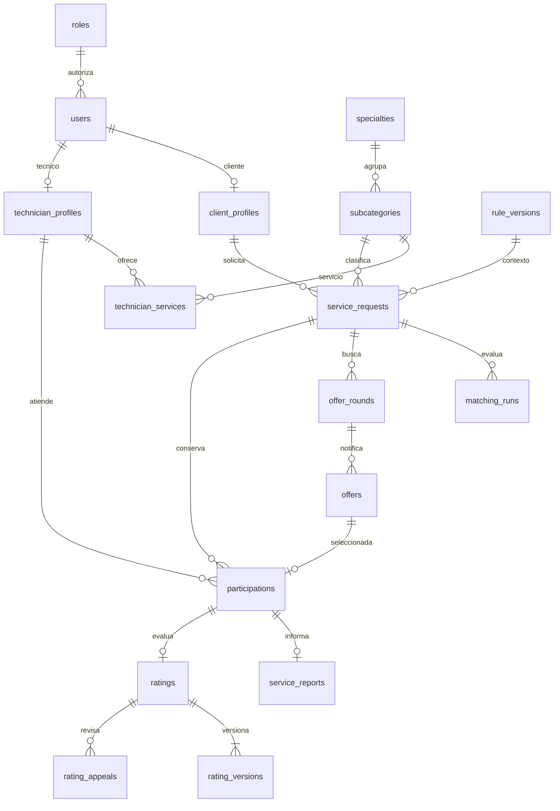

## 5. Cobertura funcional y trazabilidad

Los módulos mantienen los significados del Diseño Técnico: A solicitud; B matching; C notificación y respuesta; D ejecución y seguimiento; E calificación e historial; F seguridad y administración. La letra indica responsabilidad de dominio, no una base de datos distinta.

| Necesidad | Tablas principales | Historias del análisis |
|---|---|---|
| Usuarios, roles, permisos y clientes | users, roles, permissions, role_permissions, user_permissions, client_profiles | HU-01, HU-24, HU-28 |
| Técnicos, verificación, documentos, portafolio y galería | technician_profiles, technician_reviews, technician_status_events, technician_documents, review_documents, portfolio_items, portfolio_images, media_files | HU-02, HU-29 |
| Especialidades, 30 subcategorías y fotos de carrusel | specialties, subcategories, media_files | HU-25, HU-31 |
| Servicios ofrecidos y tarifas por técnico/subcategoría | technician_specialties, technician_services, service_rate_versions | HU-02, HU-04, HU-29 |
| Distritos, zona, disponibilidad y pausa | districts, district_distances, technician_districts, availability_slots, technician_pauses | HU-05, HU-06, HU-25 |
| Solicitud, estados, evidencias y tarifa de referencia | service_requests, request_attachments, request_events | HU-03, HU-04, HU-05 |
| Pesos, evaluación y explicación de matching | matching_weights, matching_runs, matching_candidates | HU-07, HU-08, HU-19, HU-26 |
| Rondas, SLA, ofertas, elección y reasignación | offer_rounds, offers, participations, reassignment_records | HU-09, HU-10, HU-11, HU-13 |
| Reprogramación, atención, técnico adicional e incidencias | appointments, reschedule_requests, reschedule_responses, additional_technician_proposals, service_reports, service_report_evidence, incidents, incident_evidence | HU-12, HU-13, HU-14, HU-15 |
| Calificación, reseña, respuesta y apelación | ratings, rating_versions, rating_replies, rating_appeals, appeal_evidence, rating_resolutions | HU-16, HU-17 |
| Historial de servicios y reputación | service_requests, participations, request_events, service_reports, ratings; vista v_service_history | HU-18, HU-19 |
| Notificaciones y preferencias | notifications, notification_attempts, notification_preferences, outbox_events, outbox_deliveries | HU-20 |
| Comunicados por audiencia y vigencia | announcements, announcement_audiences | HU-27 |
| Parámetros, versiones y cambios de reglas | rule_parameters, rule_versions, rule_values, matching_weights, audit_entries | HU-26, HU-28 |
| Método elegido, favoritos y pagos simulados | payment_methods, user_payment_methods, request_payment_methods, simulated_payments, simulated_payment_events, simulated_receipts | HU-23 y ampliación explícita de la petición actual |
| Tickets de soporte | support_tickets, support_ticket_updates, support_attachments | HU-30 |
| Bloqueos, administración y auditoría | client_blocks, audit_entries, operations, export_files, idempotency_records | HU-21, HU-22, HU-24, HU-28 |

Las historias conservan sus criterios Dado/Cuando/Entonces en el CANVAS de análisis. Esta matriz vincula su persistencia; no declara historias implementadas ni pruebas aprobadas.

## 6. Catálogo inicial de servicios

Se propone la siguiente semilla de **30 subcategorías: 11 de cómputo, 9 de refrigeración y 10 de electricidad**, basada en la lista del usuario. Los códigos son identificadores propuestos para este modelo; antes de migrar hay que mapear los códigos ya existentes, sin renombrarlos automáticamente. La refrigeración doméstica se conserva dentro del segundo rubro porque fue incluida expresamente en la lista.

| Especialidad | Código propuesto | Subcategoría |
|---|---|---|
| Cómputo | computo-hardware | Reparación de hardware |
| Cómputo | computo-mantenimiento | Mantenimiento preventivo |
| Cómputo | computo-software | Instalación y configuración de software |
| Cómputo | computo-redes | Redes e infraestructura |
| Cómputo | computo-datos | Recuperación de datos |
| Cómputo | computo-seguridad | Eliminación de virus y seguridad informática |
| Cómputo | computo-remoto | Soporte técnico remoto |
| Cómputo | computo-impresoras | Reparación de impresoras y equipos de oficina |
| Cómputo | computo-pos | Sistemas de punto de venta (POS) |
| Cómputo | computo-cctv | Cámaras de seguridad / CCTV |
| Cómputo | computo-facturacion | Software de facturación electrónica |
| Refrigeración comercial | frio-domestico | Refrigeración doméstica |
| Refrigeración comercial | frio-vitrinas | Refrigeración comercial (vitrinas) |
| Refrigeración comercial | frio-camaras | Cámaras de frío |
| Refrigeración comercial | frio-congeladores | Congeladores industriales |
| Refrigeración comercial | frio-climatizacion | Aire acondicionado / climatización |
| Refrigeración comercial | frio-refrigerante | Carga y recarga de gas refrigerante |
| Refrigeración comercial | frio-compresores | Reparación de compresores |
| Refrigeración comercial | frio-hielo | Máquinas de hielo y dispensadores |
| Refrigeración comercial | frio-mantenimiento | Mantenimiento preventivo |
| Electricidad | electricidad-residencial | Instalaciones residenciales |
| Electricidad | electricidad-comercial | Instalaciones comerciales/industriales |
| Electricidad | electricidad-tableros | Tableros eléctricos |
| Electricidad | electricidad-iluminacion | Iluminación |
| Electricidad | electricidad-tierra | Puesta a tierra |
| Electricidad | electricidad-medidores | Certificación y medidores |
| Electricidad | electricidad-solar | Energía solar / paneles fotovoltaicos |
| Electricidad | electricidad-generadores | Grupos electrógenos / generadores |
| Electricidad | electricidad-alarmas | Cercos eléctricos y alarmas |
| Electricidad | electricidad-domotica | Automatización básica / domótica |

La foto se vincula mediante `subcategories.carousel_media_id → media_files.id`; no se guarda la imagen en Base64 ni dentro de un JSON. `display_order` controla el orden del carrusel y `description` su descripción accesible/contextual. La imagen principal del rubro usa `specialties.hero_media_id`. Las fotografías no se han generado ni sustituido como parte de este diccionario.

## 7. Relaciones e historial sin duplicación

El diagrama muestra cardinalidades de dominio, no todas las FK ni todas las tablas. Las exclusiones entre perfiles y las transiciones son reglas de aplicación.

### 7.1 Vista `v_service_history`

**Clasificación:** dependiente, derivada; es una vista de consulta, no otra tabla que haya que sincronizar. **Módulo:** E. Una fila por participación histórica; cuando todavía no existe participación, una fila de solicitud con los campos de participación en NULL. Una sustitución genera otra participación y conserva la anterior. No se une directamente con evidencias, notificaciones o versiones porque multiplicaría las filas.

| Atributo | Tipo | NULL | Procedencia / significado |
|---|---|---|---|
| request_id | BIGINT UNSIGNED | No | service_requests.id; referencia lógica |
| client_id | BIGINT UNSIGNED | No | service_requests.client_id |
| subcategory_id | BIGINT UNSIGNED | No | service_requests.subcategory_id |
| district_id | BIGINT UNSIGNED | No | service_requests.district_id |
| request_status | VARCHAR(32) | No | Estado global, distinto del individual |
| submitted_at | DATETIME(6) | Sí | Fecha de envío |
| participation_id | BIGINT UNSIGNED | Sí | participations.id |
| technician_id | BIGINT UNSIGNED | Sí | participations.technician_id |
| slot | VARCHAR(32) | Sí | principal o adicional según código almacenado |
| participation_status | VARCHAR(32) | Sí | Estado individual de atención |
| assigned_at | DATETIME(6) | Sí | Fecha de asignación |
| completed_at | DATETIME(6) | Sí | Finalización de esa atención |
| reference_fee | DECIMAL(12,2) | Sí | Copia de tarifa de participación; si aún no existe, referencia de solicitud |
| currency | CHAR(3) | No | Moneda de la participación o solicitud |
| rating_id | BIGINT UNSIGNED | Sí | ratings.id |
| rating_score | TINYINT UNSIGNED | Sí | Nota vigente, solo cuando la reseña está activa |
| rating_status | VARCHAR(32) | Sí | active o annulled; NULL si no existe reseña |

La vista no tiene PK/FK ni índices físicos propios. Identidad de lectura: `request_id` junto con `participation_id` si existe; no usar el número de filas para contar solicitudes. Los índices se aplican en tablas base. `COUNT(DISTINCT request_id)` cuenta solicitudes; contar participaciones mide intervenciones y no equivale a contar servicios únicos.

El DDL de referencia incluye la vista con `SQL SECURITY INVOKER`. Esto controla privilegios de la conexión SQL, **no** filtra automáticamente por cliente o técnico: la API debe aplicar pertenencia y rol. No se incluyen dirección, WhatsApp, documentos ni motivos administrativos en esta vista.

### 7.2 Promedios y trazabilidad histórica

El promedio de reputación se obtiene de `ratings.score` con `ratings.status='active'`, unido por participación al técnico y, cuando corresponda, a la subcategoría de la solicitud. No se almacenan reseñas de cero para servicios sin calificación. Una reseña anulada no se cuenta bajo esta propuesta, pendiente de cerrar P07. El factor neutral de un técnico nuevo pertenece al cálculo de matching, no a su calificación pública.

La línea de tiempo integra eventos de solicitud, rondas, ofertas, participaciones, reprogramaciones, reportes y versiones de reseñas. La auditoría conserva acciones sensibles y motivos; no sustituye esos hechos de negocio. Los snapshots monetarios y del ranking preservan las condiciones evaluadas aunque cambien catálogos o perfiles. Los nombres de catálogo se muestran vigentes; si se exige reconstruir exactamente una etiqueta histórica, deberá versionarse también esa etiqueta mediante cambio documentado.

## 8. Parámetros iniciales y decisiones abiertas

| Código propuesto / ubicación | Valor inicial | Unidad y criterio |
|---|---|---|
| technician_response_minutes | 10 | Minutos de SLA; materializar expires_at en cada oferta |
| maximum_simultaneous_offers | 3 | Técnicos por ronda automática; ruta directa comienza con uno |
| pending_availability_hours | 24 | Horas; persistir inicio y fin, no reiniciar por recarga de pantalla |
| rating_submission_hours | 48 | Horas desde finalización de cada participación |
| rating_edit_hours | 48 | Horas desde primera calificación como propuesta P23 |
| new_technician_completed_threshold | 3 | Servicios completados para dejar de aplicar neutralidad inicial |
| new_technician_neutral_factor | 0.5 | Factor de historial del matching; no equivale a estrellas |
| matching_weights.proximity_pct | 35.00 | Porcentaje |
| matching_weights.price_pct | 20.00 | Porcentaje |
| matching_weights.rating_pct | 30.00 | Porcentaje |
| matching_weights.experience_pct | 15.00 | Porcentaje; suma exacta de los cuatro = 100.00 |

Son datos de semilla **propuestos en el documento**, no INSERT ejecutados. Cada parámetro tiene tipo/unidad; una versión publicada debe contener todos los obligatorios, pesos válidos, autor, motivo y vigencia. La versión que corresponda se conserva en solicitud/cálculo. No se almacenan los pesos además en `rule_values`.

Los límites 1–5 del puntaje y las dos posiciones de participación pertenecen al contrato del MVP. Cambiarlos exige revisar restricciones e historias, no solo modificar un campo genérico de configuración. Un parámetro editable no significa que cualquier valor sea admisible.

Se mantienen pendientes P01–P23 del análisis. Los puntos de mayor impacto físico son: moneda/distritos (P01/P03), flujo económico simulado (P02), roles múltiples (P20), calendario/duración de citas (P05/P06/P16), asignación y relojes exactos (P11/P12), cierre con dos técnicos (P13), apelación y retención (P07/P08), política de contenido (P17), bloqueo y servicios abiertos (P18), aplicación temporal de cambios (P19) y anclaje de edición (P23). No se convierten en reglas definitivas los dos cambios de cita, cinco días hábiles de apelación, doce meses de retención ni el margen de dos horas.

**Actualización frente a P02:** esta petición confirma que el modelo debe incluir registros de pago simulados. Permanece por acordar quién declara/confirma, cómo se obtiene el importe y si hay vencimiento de confirmación. `is_simulated=1` es obligatorio y la constancia debe mostrar esa condición. Ninguna tabla guarda tarjetas, cuentas, saldos o credenciales de pasarela.

## 9. Integridad, estados y concurrencia

| Invariante | Garantía en MySQL | Validación adicional en Laravel |
|---|---|---|
| Correo único y rol existente | UQ y FK | Normalizar correo; impedir alta pública de admin |
| Perfil coherente con rol | UQ user_id y FK | Rol correcto; exclusión cliente/técnico bajo propuesta de una cuenta/un rol |
| Técnico habilitado para ofrecer | FK de servicio/especialidad | Cuenta, verificación, estado, rubro, subcategoría, cobertura y pausa |
| Tarifa vigente y versión histórica | UQ servicio/versión, importe no negativo | Insertar versión y actualizar tarifa actual en la misma transacción |
| Candidato, ronda, oferta y solicitud coincidentes | Existencia de sus FK | Comprobar mismo request_id/generación; FK simples no prueban ese vínculo cruzado |
| Máximo tres ofertas simultáneas | Una ronda activa mediante columna generada/UQ | Bloquear solicitud y contar ofertas elegibles antes de emitir; ruta directa usa una |
| No aceptar tras vencimiento | Índice por estado/plazo | Reloj servidor, estado, generación y plazo dentro de transacción; frontera exacta P12 |
| Una oferta no asignada dos veces | UQ offer_id en participations | Elección autorizada, oferta aceptada y disponibilidad revalidada |
| Solo principal y un adicional vigentes | CHECK de slot; UQ condicional request_id/occupied_slot | Transiciones, aceptación del adicional y regla global P13 |
| No dos citas solapadas | Índice técnico/franja; CHECK fin > inicio | Bloquear perfil técnico en todos los flujos de reserva y consultar intervalos |
| Reporte, reseña y apelación de las partes correctas | FK y UQ por participación/reseña | Titular, técnico asignado, plazos y versión coincidente |
| Pesos válidos | CHECK rango y suma exacta = 100 | Publicar versión completa, inmutable y autorizada |
| Un archivo no cruza clientes ni finalidades | FK al archivo | Propietario, recurso relacionado, visibilidad, validación y permiso de lectura |
| Referencia polimórfica válida | Índice tipo/id; no FK a múltiples tablas | Mapa cerrado y comprobación de existencia/pertenencia; nunca recibir clases libres |
| No duplicar efecto por reintento | Claves únicas de idempotencia/evento | Mismo payload, actor y operación; transacción y gestión de intentos |

**Protocolo de escritura:** abrir transacción; bloquear las entidades de coordinación en orden consistente (solicitud, técnicos ordenados por ID, entidades hijas); revalidar estado/permiso/plazo; modificar dominio y su versión; insertar eventos/auditoría y outbox; confirmar; entregar notificaciones fuera de la transacción. Reintentar un deadlock solo de forma acotada e idempotente. El lock de caché/scheduler no reemplaza este protocolo.

Los CHECK listan valores posibles; no implementan la máquina de estados. Una edición directa de `status` está prohibida en las rutas de perfil. Ejemplos: `offers.accepted` no equivale a `participations.assigned`; `participations.completed` abre su plazo propio de reseña; expiración de pendiente no crea una atención; resolución de apelación debe verificar que la reseña no cambió durante la revisión. Las transiciones definitivas se conservan en el Diseño Técnico y sus pendientes, sin deducirlas únicamente del ENUM lógico del diccionario.

## 10. Seguridad, privacidad y operación

Los perfiles públicos contienen solo información permitida. Dirección exacta y WhatsApp se entregan a participantes autorizados después de asignación; los candidatos reciben distrito e información mínima. Documentos de verificación, evidencias de clientes, tickets y auditoría permanecen privados. Reverb/Echo distribuyen identificadores, versiones y plazos; al reconectar se consulta la API para obtener el estado autorizado, sin guardar un cronómetro por segundo.

`media_files` conserva metadatos; el almacenamiento sirve archivos después de evaluar permisos. No exponer `storage_key` como autorización. Aplicar validación de tipo real, tamaño, nombre y contenido; no reutilizar un archivo privado como foto pública sin una copia autorizada. Los límites finales siguen en P17.

Separar credenciales de migración, operación y lectura de auditoría. Las tablas append-only no se vuelven inmutables solo por decirlo: restringir UPDATE/DELETE para el usuario operativo donde corresponda y ofrecer únicamente servicios de inserción, con excepciones controladas de retención. No registrar contraseñas, tokens de sesión, documentos completos ni datos financieros en auditoría o payloads de jobs.

Sesiones, jobs y caché son persistencia técnica, no estados comerciales. El vencimiento debe comprobarse en cada comando además del barrido programado: un worker atrasado no permite aceptar una oferta ya vencida. Una caída de Reverb no pierde la oferta porque el hecho queda en MySQL y outbox. Purgas/anonimización, copias y restauración deben probarse sobre datos sintéticos según políticas aún por concretar; no borrar en cascada el historial.

La trazabilidad de cambios apoya el enfoque por procesos de ISO 9001; las restricciones y pruebas apoyan calidad ISO/IEC 25010; acceso, minimización y auditoría apoyan los controles seleccionados de ISO/IEC 27001/27701; los escenarios y evidencias se vinculan con el plan basado en ISO/IEC/IEEE 29119. Este modelo no acredita certificación ni cumplimiento integral de esas normas.

## 11. Verificación y aplicación por iteraciones

El generador verifica nombres únicos, PK no nulas, columnas de índices existentes, existencia/tipo de FK, unicidad de claves referenciadas y nombres de restricciones. Añade índices para FK sin prefijo cubierto. Markdown, JSON y DDL salen del mismo modelo para evitar divergencias. Esta validación estructural no sustituye ejecutar migraciones en MySQL ni pruebas BDD.

Antes de implementar, probar sobre una base aislada: creación completa del esquema; rechazo de FK inexistentes; duplicación de correo/oferta/puesto; pesos que no suman 100; puntaje fuera de 1–5; falta de vínculos privados; dos elecciones simultáneas; aceptación en el límite del SLA; doble reserva; edición al terminar las 48 h; repetición de jobs; cambio de reglas con solicitudes abiertas. Registrar resultados reales en el Plan de Pruebas; este documento no inventa ejecuciones.

| Grupo de entrega propuesto | Resultado verificable |
|---|---|
| Identidad y catálogo | Roles/Policies, perfiles, verificación, 30 subcategorías, archivos privados/públicos |
| Solicitud y matching | Tarifas/versiones, cobertura, horarios, solicitud y ranking reproducible |
| Oferta y asignación | Rondas, plazos, idempotencia, outbox y elección sin doble reserva |
| Atención y reputación | Reprogramación, reportes, adicional, reseñas/versiones y apelaciones |
| Administración y cierre | Comunicados, soporte, bloqueos, reportes, simulación económica y auditoría |

La agrupación orienta dependencias; no reemplaza ni renumera el backlog Scrum aprobado. Las tablas técnicas se incorporan cuando se necesiten sus drivers. No se exige desarrollar todas las tablas en una primera iteración.

## 12. Fuentes y archivos entregables

**Prioridad documental:** última aclaración del usuario → Fuente 0 y respuestas/confirmaciones → CANVAS de análisis → Diseño Técnico y Resumen Ejecutivo → antecedentes históricos cuando no contradicen lo anterior. Los identificadores Pxx remiten al registro de pendientes del CANVAS de análisis.

- Fuente 0: `C:/Users/James/.codex/attachments/71cb92b5-6418-4e7c-8181-6ea337469151/Texto pegado.txt`.
- Respuestas: `C:/Users/James/.codex/attachments/52d2e6da-ae01-4763-921e-a2e76a9dd01a/Texto pegado.txt`.
- [CANVAS de análisis](CANVAS-Analisis-MVP-TecnicoYa.md), [Diseño Técnico](CANVAS-Diseno-Tecnico-MVP-TecnicoYa.md) y [Resumen Ejecutivo](CANVAS-Resumen-Ejecutivo-MVP-TecnicoYa.md).
- Colección anterior: `v2/contenido.json`, `v2/diccionario-fisico.json`, `contenido-expediente.json` y `../informe-final/contenido-editable.md`. Se contrastaron sus contenidos de alcance/datos/arquitectura y la colección documental; los PDF derivados no se trataron como fuentes independientes ni como cambios posteriores a los canvas.

| Archivo | Uso |
|---|---|
| CANVAS-Diccionario-Datos-MySQL-TecnicoYa.md | Documento completo para revisión humana |
| Diccionario-MySQL-TecnicoYa.json | Definiciones estructuradas de las tablas |
| Esquema-MySQL-TecnicoYa-REFERENCIA.sql | DDL de referencia: tablas, FK y vista; no ejecutado |
| generar_diccionario_mysql.py | Generador reproducible; no se conecta a ninguna base |
| diccionario-mysql-anexos.md | Fuente editable de los anexos explicativos |

**Estado de entrega:** propuesta documentada, pendiente de revisión de decisiones de negocio y de validación con el motor antes de migrar. No se modificó la base de datos ni la implementación de la aplicación.
